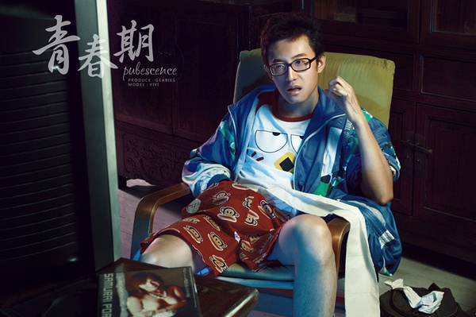

# ＜天枢＞来说说所谓毒草

**每个人都会手淫，每个人都有或多或少叛逆的经历，但是片子中所呈现的又是多少人的曾经？如果你把一个强奸犯的故事拍成片子命名为“下班之后的生活”，如果你把一个淫乱者的故事拍成片子命名为“普通人睡觉之前”，那你也不过是跳梁小丑让大家一笑。可是你居然把这样一个虚伪做作，充满了捏造的片子命名为“青春期”并加以宣传，实在是令人难以忍受！** ****

# 来说说所谓毒草

## 文/孙一凡（中国传媒大学）

前些日子看了一个叫做《青春期》的电影组照，并没有觉得有什么特别之处，这样的风格形式国内外商业摄影都很常见。无论是艺术或者技术的角度都无任何新奇之处，大抵是借了青少年的一点点叛逆心理，在这个充满成年人附加于人性压抑的时期，好不容易能看见点荤腥了，因此稍微流传了一下，也算是可以理解。

过了些日子，这个叫《青春期》的所谓“网络电影”的预告片开始在网上传播。而传播的主体是一个叫做“电影工厂”和“精彩电影”的私人管理性质的公共微博，后来想起，不免有于制片商串通软宣传的情况。片子中将原本组图里的场景加以细化演绎，并加入了更为火爆的画面情节，不免令人作呕。加之制片单位的宣传口实为“真实”、“青春”等等，实在难以接受。宣传片尾，更有女主角大胆的对着镜头说出“我们这一代的责任就是放弃责任”这种道德沦丧之语，实在是让我觉得触目惊心令人发指。 今天，我在微博上终于看到此片的所谓正式版本。看了片头，快进各10分钟浏览，着实难以忍受这个片子。 片子本身无论在艺术或者技术上，毫无可取之处，甚至可以说是荒唐，根本不值一提，随便说一点，我就没见过一个班级都是三十岁脸的涂着干裂的粉底的高中生（请三十岁的大哥大姐们原谅我这个举例）。 

 烂片很多，大多关上不看而后删除便是，我为什么如此根这个片子较真不能关上之后无视，是你们这种突破道德底线的宣传口径，实在是让我愤怒。 请制片单位和所谓导演管晓杰注意，你们可以扎钱，你们可以道德沦丧，你们也可以拍一部烂片宣传成任何你们想要的样子。但是你们不能这样误导未成年人，如果那样做你们是彻彻底底的混蛋！ 如果你们只是为了发泄兽欲，请直接拍A片就可以了，为什么要把所谓的点击率和炒作噱头加给人生世界观尚不成熟的孩子们？每个人都会手淫，每个人都有或多或少叛逆的经历，但是片子中所呈现的又是多少人的曾经？如果你把一个强奸犯的故事拍成片子命名为“下班之后的生活”，如果你把一个淫乱者的故事拍成片子命名为“普通人睡觉之前”，那你也不过是跳梁小丑让大家一笑。可是你居然把这样一个虚伪做作，充满了捏造的片子命名为“青春期”并加以宣传，实在是令人难以忍受！ 电影说高了是所谓的艺术，纵然他的基础属性是娱乐，但是它亦是人类共有的精神财富。电影中纵然有各种对于人性的描写，但是它总是反映创作者本身对于世界的看法和态度。如果《青春期》这样的片子也被某些人视作网络“电影”加以宣传，我会对于这样的作品抵制到底，并希望降低我的身份“当面辱骂”此片的制作单位和所谓导演，作为一个热爱电影并希望将电影和教育作为终身理想的我，将对此事抗争到底。 

(采编:黄理罡 责编：黄理罡)
