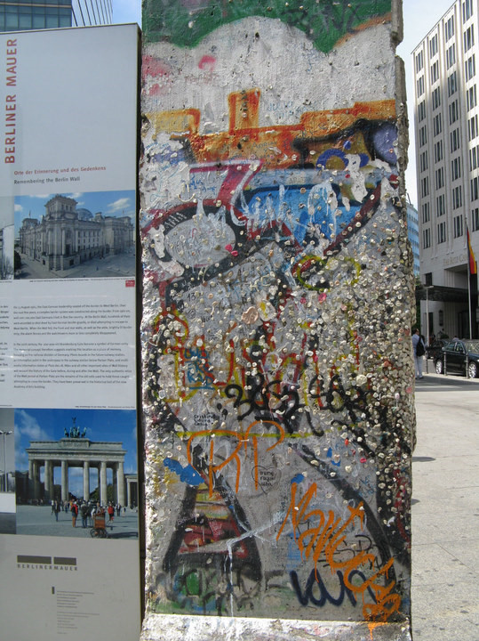

# ＜天枢＞柏林墙与功夫网

**正是由于封锁，所以才提高了人们的胃口。在禁忌的领域寻找犯禁的快感是人类艺术领域永恒的主题。正如一个有趣的现象，越是性开放的地方，性犯罪的比例反而越低。政治亦如是。好奇和倦怠都是人的天性，所谓的反动宣传看多了会觉得也不过如此，甚至比你们正面的宣传技法还拙劣。看他们的东西看厌了，观众反而会留意你们的说法，对比双方的说辞进行自己的判断。而不像如今这样你说什么我都不信，政府毫无公信力可言。人被一方骗，自然只知道你的不好；而他一旦被双方都骗了，他自然会多长个心眼懂得事实的可贵了。**  

# 柏林墙与功夫网

## 文/逍庭（东南大学）

柏林也无非是这样，勃兰登堡门虽然盛名在外，但绝对属于那种内涵大大超过风景的“精神景点”，连门口的巴黎广场也是小里小气，张不开眉眼的样子；几个教堂尚算仪态万方，但依然不及科隆大教堂的威仪雄浑；Kadewe商场里人潮攒动，也不乏同胞们阔绰的身影，但终究不过是个昭示着资本主义糜烂生活的橱窗而已，对于我这种无产青年构不成任何的吸引力。在我眼中，它和恒隆广场几乎没什么差别。

窃以为，单就可游览性而言，柏林并不是德国的一个好选择。然而，它依然是一座伟大的城市。因为它是一座属于墙的城市。屹立几十载的柏林墙是她曾经的伤痕，也是她如今最好的谈资。

如今的柏林墙已难觅踪影，只在若干地方还保存着一些残垣断壁，供人凭吊反思，警醒自由的可贵。

比起任何人为的评说，历史的裁断往往更为直观。柏林墙就是最好的例子，不需要多余的口舌之争，它的建立和倒塌，谁赢谁输，一目了然。

我不太愿意搅入左右之争，但是我觉得有些东西有些价值是应该得到公认的，是超越立场的。很简单的一条，能够自由地使用网络就是其中之一。互联网就是一个工具，凭什么别人想怎么用都行，我们就不能。

我是热情的互联网自由支持者。在我看来，绝大多数封锁网络的理由都是很不堪一击的。比如所谓防范反动宣传，既然你都说是反动宣传了，自然是反你的动，而你自己又是正确的，你就应该有勇气让它呈现出来，进行辩论也好，甚至相互攻击也罢，至少还能让我们看清楚反动分子不堪的伎俩不是？屏蔽很容易，也同样也屏蔽掉了你的信心，你的大度，你对于民众智商的尊重。

在德国十天，看了八天的大技院报纸。倒对他们的印象好了一些。除了前几页不着边际的anti共，九瓶等内容，后面的大多数版面其实是很亲民的，和政治没多大关系。上面不但有科技新知，娱乐八卦，也有各种招聘信息，酒店广告，还教你怎么煲汤。而根据不同州还分版刊登适合当地的内容，也很贴心，让很多不通德语的人能了解周遭进展。

一个组织，或者一个国家。它的力量往往不是来自政治的强硬，而是在于它和你的生活共通之处，在于细微末节你和它的彼此熟悉，彼此欣赏，久而久之，积蓄成一种力量。换个词就是软实力或者价值输出，这很重要，对比一下苏美冷战。苏联的溃败很大程度在于它对于生活本身的不尊重，它是硬邦邦冷酷的，人们即使被他的肌肉所震慑，也只是一种恐惧的表象而已，这不是力量，这只是威胁。我想，如果大技院的报纸整个就像一张anti共小传单，我对它的嫌恶只会更进一步。但它聪明地照顾到了在政治之外的地方，甚至赢得了我的一丝好感。

同样，对于网络，是不是也太高估了人们对于政治的热情呢？是不是觉得一旦放开人们就只会专注于这些而无暇他顾了呢？恰恰相反，正是由于封锁，所以才提高了人们的胃口。在禁忌的领域寻找犯禁的快感是人类艺术领域永恒的主题。正如一个有趣的现象，越是性开放的地方，性犯罪的比例反而越低。政治亦如是。好奇和倦怠都是人的天性，所谓的反动宣传看多了会觉得也不过如此，甚至比你们正面的宣传技法还拙劣。看他们的东西看厌了，观众反而会留意你们的说法，对比双方的说辞进行自己的判断。而不像如今这样你说什么我都不信，政府毫无公信力可言。人被一方骗，自然只知道你的不好；而他一旦被双方都骗了，他自然会多长个心眼懂得事实的可贵了。

今天看到谷歌的敏感词提示系统，不禁哑然失笑，老外真是一根筋傻得可爱，自以为想出了不得罪政府又能保证搜索顺畅的两全之策，却哪能理解我们面子国家的真谛？这下子，理论上讲，任何人只要有功夫，都可以总结出一份敏感词列表出来了。功夫网的家底都抖出来了，尚在大言不惭“中国网络世界最开放”的官员面子往哪搁？

墙给人的感觉总是沉寂压迫，然而事实往往不是这样。波茨坦广场的一段墙其实是充满喜剧元素的。它周身被好事之人用口香糖按满，而且画满了色彩斑斓的涂鸦。联想到它建立时紧张肃穆的氛围，越发添了一份反差的喜感。就像一个不苟言笑的硬汉突然换了一身女装一般。越是自以为严肃的，其实也是越容易戏弄的。越是想装一本正经，其实往往看起来更可笑，也越容易被解构、被不屑一顾。它的严肃和愚蠢是等比例的。比如看到的这份别人整理的敏感词提示列表，连“蛤蟆”两字都赫然在列。它也知道这是在嘲弄谁，但它却是无能为力的，甚至不敢公开抨击否认，只能自认其辱，简单粗暴地一禁了之。然后给自己幻化出一付人民俯首听命绝无腹诽的胜景。梁文道曾说过一个升级版的国王的新衣的故事，国王不仅知道自己没穿衣服，同样也知道他的人民知道他没穿衣服，然而，他居然还是就这么光着屁股走出来了。

波茨坦广场的一段柏林墙

在这个词库中，每一个词条的加入，都标志着离它的死亡又近了一步。在一个全身是禁区的社会，最后的结局只能是没有禁区。一旦这中间有了哪怕一丝一毫松动的口子，它余下的寿命就只能和夏虫媲美了。表面上，它是固若金汤不可一世的，而在内部它早就被自身的繁冗团团困住。在虚张声势时或许还能有点耸人的威胁，但只要一旦出现细小的裂缝，它毁灭的速度也是惊人的。就像朝鲜足球队对阵巴西，在强撑几十分钟之后，被灌了一个就立刻全线溃败。虽然这并不是很确切的比喻，却是一个很有趣的象征。坚不可摧与摧枯拉朽，往往变化于一念之间。东欧的解体，苏联的崩溃，也都是迅雷不及掩耳之势就完成了的。

要避免这样的命运，首先要做的也是推倒这现实的和内心双重的墙。要明白，墙不但阻止了逃脱叛离，也阻止了自己观察世界的空间。只有开放了，万物透明，见得多了，自然也更懂得如何去应对，也会有足够的机会来学习面对各种变化。如果这一要求太高，不妨先从放下架子，自嘲一下开始。

肯尼迪1963年在柏林墙下的演讲依然激荡人心：自由有许多困难，民主亦非完美，然而我们从未建造一堵墙把我们的人民关在里面，不准他们离开我们。

而我坚信，墙一旦被立起，就必然有倒塌的那一天。

 

（采编：何凌昊；责编：黄理罡））

 
