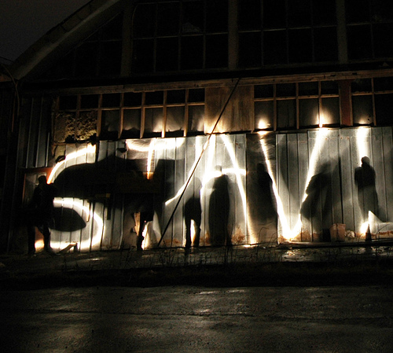

# ＜天枢＞此刻，时间以死亡终结——从史铁生到钱云会

**“两个一前一后的死亡，相互呼应，一个民满天下却身体伤残，用上半身去承担思考；一个沧海一粟却身体健全，用下半身完成行动。两个人的死亡是遥相呼应的。鲜血是最生动的终结形式，一次喷溅在作家的大脑，一次铺张在冰冷的大地。”**

### 

### 

  

# 此刻，时间以死亡终结

# ——从史铁生到钱云会

##  文/许淳（中央戏剧学院）

### 

今年的年末完全不平静，当人们还沉浸在影像的幻觉之中时，爆裂性的生活将他们拉回来，推上前去，生活不像那颗造作的子弹，带着诙谐与自恋，洒脱的停滞后例无虚发。真实的生活是，出生至死，就是一场凌迟，刀刀见痕，死亡既定。权势的刀刃无时无刻地飞扬在你周围，与你的表情相吻合：倘若选择扮演，刀刃温柔拂过；倘若卸下面具，刀刃开疆辟域。有个名叫钱云会的普通民众，以这样的方式被推上舞台的最前处，而灯光打向的，却是一群临时上场的蹩脚的报幕员。

最后一天，史铁生的逝去，似乎又有着终结性的意味——作家与他的身体拒绝跨入更为浮躁的年代，并且以拒绝的方式带走了自己所标记的时代。另外，又以自己精神性的气质消解了那个上访者的死亡，消解的意思不是说抹平，而是说，以宽恕他者的方式，无论死者“意外”与否。两个一前一后的死亡，相互呼应，一个民满天下却身体伤残，用上半身去承担思考；一个沧海一粟却身体健全，用下半身完成行动。两个人的死亡是遥相呼应的。鲜血是最生动的终结形式，一次喷溅在作家的大脑，一次铺张在冰冷的大地。

### 消失中呈现

早晨在教室看书，突然友人来短信，翻开手机盖，“史铁生死了。”一下子愣在那里，靠在椅子上，想回忆些什么，但头脑又是空的，起身出教室，发现手机还没合上，又看看那条短信，心里咯噔一下，一颗石头落下了。

我想写一些关于史铁生的文字，但又不知道记录的理由是什么。为什么平时不闻不问，到了这个时刻，当作家名字后标记着句号时，才目送式地投去最后一瞥。就像去年张枣的死亡，当死亡真切地来临时，诗句才真正与诗人捆结在一起，我们才意识到，诗人在我们心目中的位置也有着动人的时刻，以死亡的方式。现在的哀悼、唏嘘究竟为了谁？如果去除掉廉价的感动。应该怎么说，应该如何说起。倘若我在这里自私地抒情，无论如何，作家已经远去了。

很多人进入史铁生的世界，都是因为那篇《我与地坛》，我自己也不例外。那篇选在初中教材的文章，与其他爱国说教的课文迥异。无论谁，读到史铁生写起自己的母亲，都会有着相同的沉重。《我与地坛》，初中时曾经读了很多遍，时常高声朗读，在最为喧闹的晨读课上，恍然间置身于安静的角落。朗读着那样一些诗性而高贵的句子，句子渐渐渗入我的内心。无论我还是其他的很多人，在史铁生的世界，下意识地想起的都是：噢他是一个残疾人，多么不易。这些似乎多余也有些冒犯，这让无数人在对史铁生的阅读中掺杂着一丝附加的怜悯，不管这是自觉的还是不自觉的。我曾经很不愿意听到“残疾”这样一个称号，因为一但出口，无论如何就已构成了身份的差异及意义的局限，后来想想，倒也没有别的称号。阅读史铁生时，倘若你觉得残疾凸显了作者本人的价值，那么，结果是讽刺性的，或者，更为残疾的是你自己。史铁生的世界，带着沉重的道德原罪，叩响的永远是命运的终极大门。命运之门是每个人必将也正在面向的。作家的笔下永远是永恒性质的概念：母亲，生存，病痛，金钱，信仰，死亡。就比如《我与地坛》，其间残疾的经历，成长时间的符号，最终指向的，是内心的终极，是读者自己。倘若没有读到其间的设问，反用励志的自我欺骗或是滥情的小感受，那自己处在的反而是被怜悯的角色。

史铁生的语言清浚明朗，充满了禅机式的洞见和思想者的沉着。同样是以文字的激情和理想主义情怀打动读者的张承志，虽然有庞大的信仰在前，然而文字却完全没有节制，带着“全有或俱无”的模糊指向，到处铺洒，横冲直撞，最后盲目地依归在那个威严的“父亲”里。倘若说作家的文字是杠杆，史铁生的写作，以心灵的体悟去撬动与此对称的物质世界。轻巧与厚重并存，不关心变动波澜的政治，也很少过问人情冷暖的现实，仅仅凭借近乎隔绝于世的思考，轮椅，无疑承载着苦行僧的负重。记得一次演讲，台下有人问及史铁生，“您那些智性的文字是否是阅读很多哲学书籍而得到的？”史铁生的回答是，更多的依靠冥想，自己的写作是“哲思”而不是“哲学”。也就是说，史铁生所着意的，是若有所思的瞬间，捕捉到历时的意味深长之处。

相比于史铁生散文诗歌的简练安详，史铁生的小说则晦涩凝重，早期知青《遥远的清平湾》之类还非常散文化，古朴中见飘逸；到了中期《毒药》《命若琴弦》等已经有着谜语的性质，寓旨遥深，言辞肃穆。到了后来《务虚笔记》和《丁一之旅》，完全变得自言自语，艰涩异常，没有耐性很难读下去。像《务虚笔记》，我自己就始终没能读下去，里面的人名用字母所代替，小说分散成很多不成关联的章节，阅读难度实在太大。但每次随意乱翻，那些字句都是非常具有震慑力的，文字可以用俏悍来形容。史铁生的小说世界，有着如此这般刻意的“封闭”；但另一方面，这种封闭意味着对读者的考验、回答以及敞开。比起孙甘露行吟般的语词森林，史铁生后期的文字有着清醒的体悟在内，如贾岛孟郊的奇险，却又不失李杜的投入与悲愤。

史铁生的理想主义，是与他患病的生存体验联系到一起的，不仅仅是残疾，更严重的是肾脏萎缩，尿毒症，每星期两次透析的痛苦是常人无法想象的。痛苦加之的，是思想的反弹。史铁生从一开始就没有表现出通常理想主义者决绝的战斗姿态，而是平易温情。在呆板的病床上苦心孤诣，在文字的表述中则充满了向善的力量。并且，这种“向善”不是标榜式的、救世主式的向善，而是回到个体，回到每个人的生活经验；所面向的，不是空洞口号所托付的“终极关怀”，而是从渡口到彼岸的过程。史铁生曾提到，意义的确证应该从目的转向过程，因为只要人们眼光盯着目的，就无法走出绝境。

所有理想主义者都不得不面临“背负”的问题。是背负着道德传承的残山剩水，背负起拯救众生的君临天下，还是背负起神灵原罪的明确信仰？托尔斯泰是绝对的理想主义者，他后期的神学思考，虽然反叛夸张，且不无幼稚的成分，但其纯粹性是不容质疑的。但是，托尔斯泰与多数理想主义者一样，陷入了从理想出发又被理想限定的悖论：脱身于东正教，背负基督原罪的使命，飞向俄罗斯的高空与坠向俄罗斯的大地，宏大的理想主义不能没有具象的凭借，最终，托尔斯泰把目光投向人群。活生生的人群向他流泪，他自己也流泪，站在人民面前，理想主义安放到人群当中，背负着的痛苦信仰让他以跪倒的姿态迎接民众。而当万众欢呼之际，当看到苦难民众以祈求的眼神迎接他时，理想主义下意识地由“背负”转为“拯救”，卸下了“满身背负”，一呼百应，又重新充当了“拯救者”的角色。这个喧腾的“狂欢”场景是否与20年前中国的某个场面相类似？民众与“拯救者”构成了世俗与超脱的对峙，一旦卸下了原先的“背负”，立刻由“世俗”跨越到“圣贤”的状态。托尔斯泰式理想主义的结果，便是虚幻的自我圣化，这又戕杀了曾经的理想主义。反观托尔斯泰的晚期，那种霸道的律令，禁欲般的苛责，非此不可又无以践行的挣扎，理想主义败在了理想主义手上，回溯原因，还是在于起点那一刻，具体“背负”的内容的空白。

史铁生的“背负”，源于最简单的一个概念——“爱”。爱和死是史铁生世界的两极，也可以说是道路的两端。由“爱”开始，又由死所终结。同时，史铁生的“爱”完全不是概念的游戏，里面杂糅着爱的诸多形式——情欲，人道，母性，神邸。这种爱可以非常简单，简单到一切皆爱，但这种爱的意义却完全不是空洞的，有鲜活微妙的生活细节做最有力的注脚。读过史铁生文字的读者都会发现，史铁生的世界是充满了宗教感的世界。有着幸福的归属，而这归属永远在活生生的现实里，在我们的周围。但史铁生又完全没有踏进任何宗教。史铁生所背负的“爱”，也不仅仅是单纯的喜悦，其间又有经由苦涩到完全淡然，苦难到视之为礼物的过程。史铁生的残疾、病痛是命运最为极端也最为沉重的“赋予”。他背负了这种“赋予”，在或癫狂或冥想之际，将答案参透：对于一般人而言，极端的病痛似乎在死亡切近的时刻出现，而命运之所以把磨难给他，是让他早点想透生死的意味。这是一个命运的谜语，而史铁生回应的答案是“爱”。于是将自身背负的病痛肉身转化为轻盈的爱，史铁生是真正具有圣徒气质的思想者。阅读史铁生，你时常觉得这是个深不可测的老僧，有时在平易的文字间，又觉得他只是一个普通的农夫，这就是史铁生理想主义的意义。从残疾孤独的自卑到体悟生命的谦卑，自卑与谦卑始终同在，没有任何的舞台感。作者完全是与我们同在的，我们仿佛听到了史铁生宁静的声音：我是这样的，你呢？

### 密谋中哭喊

有关钱云会的死，让网络上出现了这么多“怒汉”的声音。而“怒汉”如你我，又能否知道真相如何？无论是否是意外，钱云会被碾死的画面怎么看都给人以难言的震撼，还有那个“我钱云会负责”的耿直侠气。钱云会因为“上访户”这个身份，得到无数人的目光聚焦，无论热闹猎奇还是恻隐之心。

“上访户”这个原本讨公平、维护权利的含义在今天变成了一种煽动社会、与官方敌对的力量，其间的道理再明白不过。与钱云会一样的普通百姓太多了。而在这样一个时代，在仅有的“民”的身份被抢劫之后，他们又不得不沾有一丝匪气，尽管这种匪气也许弱不禁风，带着一丝颤颤巍巍的祈求。在国家机器面前，这个与“和谐”格格不入的群类，随时可以被消抹，并扔进群体“人民”牢笼之中。失去了最基本的生存权益，他们不得不维护自己的生存法则，变异为“半民半匪”的“上访户”。他们的悲哀又在于，他们不知道，这种身份的转换又是自身生存的命门，在官方的聚光灯下，在上访户露出“匪”的豪侠之气时，官方可以指着他们对人民说：这是匪。当上访户露出作为农民无奈的怯懦时，官方立马变以颜色：他们是可怜的民众。

尊重生命，本是众人皆知与遵循的常识。在大地震中，“尊重生命”可以口号式地无限放大。然而转换了一个语境，网络与官方就立马变得草木皆兵。难道一个普通上访户的死就不值得尊重，还要在标题中定性称作“这**只是**场**普通**的交通肇事”，甚至闹得那么多村民接连入狱，而不许家人亲邻说话？在如此多事件的翻转之下，我很难认同所谓的真相。真相或许的确是意外死亡，但那个村落的关系场却绝非那么简单。

我一直将那幅画面看成一个有寓意的政治隐喻：车轮滚滚，国家的发展快马加鞭，压在底下的生命，真的来不及顾及了。“个人利益服从国家利益”，里面又藏着将真实的个人捆绑安置在空洞语词“人民”中的后果。任何利益，无论国家或是个人，都必须是具体的，在场的。而在大国崛起的盛世心态面前，具体“人民”何在？而在细微的利益诉求面前，国家显得完全不耐烦：我没时间跟你玩——所面对的，不过是最底层的农民而已，虽然他是具体的，却完全可以把他看作是虚幻的。于此同时，拒绝的理由却又用所谓的“人民”肢解了具体的人民。

在这几日“众声喧哗”的网络上，除了严肃的承担义务的声音，还有两种很值得思考的话语。一种是与众人相悖：就是一个车祸，不必在意。另一种是玩笑式的戏谑。

对第一种，我个人是无论如何都不能赞同的。事实证明，这类人完全是不闻不问的旁观者，在事件面前保持冷漠，似乎具有了某种超然。这是典型的“反义思维”，在一个群体事件面前，本来就觉得这不关乎自身的利益，又不能理解网络民众真实的怜悯，于是摇身一变，站在声音的另一侧：“第一，他是上访者，谁让他做法过激？第二，这件事没什么特别，就是一个交通事故。”这样一来，似乎占据了网络议论的制高点，用这样的哗众取宠标榜出独立的自我，自私地将自己置于审判者的席位。但问题是，什么是常识？重要的不是论争，不是身份，而是活生生的人，重要的是置身于事件之中。在天平已然轻重分明的情况下，在如此惨烈死亡的惊叹号下，话语再如何另辟蹊径，如何“理性，冷静”，也成了对钱云会本人再次的侵略。

另外一种，戏谑，是我们这代人所共有的。在八十年代那个理想主义的抒情时代过去之后，九十年代是精英主义的务实年代，而这个时代的我们，没有任何系统的知识谱系。大众在畅销书里真诚地寻找意义，小资在陌生的哲理中东抓一句西拉一笔。面对现象，碎片式的思考显然难以应对，空洞无比，只能藏拙。愤怒用调侃、玩笑达到讽刺的戏谑效果，本来充满了巨大的戏剧张力，但问题是，当网络上的戏谑千篇一律，你的声音岂不又被你的戏谑所解构？韩寒的独立不迁固然可贵，然而那些巧妙擦边的玩笑，纵是再如何犀利，却没有什么建设性的意见。不要忘了当年钱钟书的心态是“国家兴亡，匹夫无责”。是不是又陷入了自我的悖论？王朔的转变是个饶有意思的现象，虽然没有了原先的智性与幽默，却多了几份修行的老道。戏谑非常容易成为惯性，新一代“愤青”迅速“崛起”，代替了从前理想主义、普罗米修斯式的叛逆的“愤青”的定义。事实证明，越是情绪激昂，越是口号漫天的“捍卫”，则越可能被国家话语轻易网罗。新一代的愤青是无比可悲的，空有一腔堂吉诃德的激情，无处宣泄，最后把情感托付在“傻逼”、“操蛋”等骂架姿态与流行文化的语词里。可以说，戏谑者“真诚地”掀起了话语的风暴，最终又迷失在自己话语的风暴里。

回到钱云会之死，在事实面前，很多网民提出对官方的质疑，对公民探寻真相的建议，和对地方做法的批判，这些或许才是真正有实际意义的。在这件事上，探究太深，毫无疑问会或多或少威胁到我们自己，而在这时，最重要的是担当。尽管难以避免地陷入二元对立，非此即彼，我想说的是，最重要的时刻也在于此。诸多现象也好，诸多律令也好，诸多文字也好，无可避免被主流所吞没，但重要的是人物的鲜活，即“在场”。我们在这个时刻站在了弱者的一边，也站在了我们自己的一边。对生活的独立思考，可能充满了惊心动魄。精神的追求，时常演变成一场生命的历险。有时想想，在书斋里，在精神世界里，纵是再跋山涉水，纵是如何孤筏重洋，而人物的生动性又在何处？比起汉末的太学生，我们的存在，似乎又少了几分充沛的底气。

我们有免于恐惧的自由。我们有免于恐惧的自由？通向古拉格群岛的道路，是我们每个人亲手铺成的。

### 回声中开放

史铁生的远去，使我想到的诗句是“天地一逆旅，同悲万古尘”。而想到钱云会，我想到的是“迎着墓地，肉体美丽”。当人们还沉浸在年末“闹哄哄，你方唱霸我登场”的贺岁大片的迷狂时，“百无一用”的书生，“一意孤行”的访民，用他们的死亡为2010结尾。二人重合，追溯李商隐那句诗句的通假，史铁生是“春蚕到死思方尽”，钱云会则是“春蚕到死**丝**方尽”。并且，一个用的是省略号，一个留下的是惊叹号，不，更准确地说是破折号——真相还没揭开。两个人，两种死亡，一种意味着精神的召唤，一种意味着言语的控诉，然而我们是否听懂了？我们是否对得起他们的死亡？

丧钟为谁而鸣？为你，也为我。

年末，尘埃落定，新的一年，老生常谈的开始。一年一年，在这个关口，一切永远静止，仿佛什么都没有改变过。
