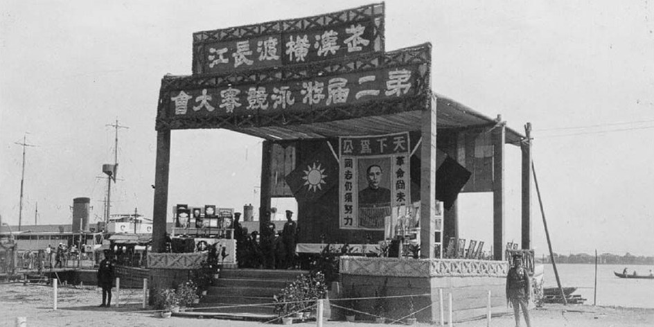
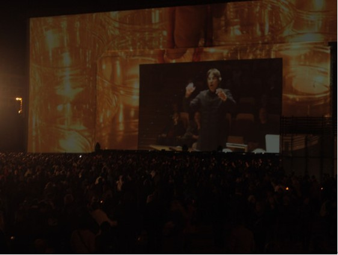

# ＜天枢＞武汉，你凭什么这样做着大武汉的民国旧梦？

**只是，不出意外的，民国的东西，终于还是日复一日在这意淫的梦里腐朽烂掉，然后替之以光鲜亮丽的比真货还高级的赝品。衣冠冢连碑一起都推掉再重建的空水晶棺，你上何处去凭吊。**  

# 武汉，你凭什么这样做着大武汉的民国旧梦？

## 文/ moonick（武汉大学）

 

很少有一座城市如此频繁而又恣意的表达着对那段叫做民国的岁月的怀念，而且从文化体面人到市井小民无不怀念那往日的荣光。这是一个叫做武汉的城市，哦不，确切来说，应该叫大武汉。

大武汉是个什么概念？北京大，可从没人说大北京。放眼华夏九州，百年之内，只有上海也曾有这么一个大字。大上海，大武汉，豪迈得劳资天下一双。

我不知道在上海的大街上拦一个老上海问他“你怀念民国的大上海吗？”会得到什么回答，我想，多半会问候你脑子有病之类。毕竟，不管好坏，连世博会都办了，跟这被万国子民轮番围观数月的记录比起来，民国除了旗袍复古文艺范都烂成渣。 

如果跟北京的哥侃大山的话，我想，比起定都南京的民国，他们大约更怀念大清大明皇城根下那些精细讲究的腕儿角儿活儿。

至于井冈山，南昌，瑞金，还有延安，哦，咱还是别问了。

过得比以前好的话，何必想当年呢？

然则，在大武汉，即使市民小报也时常隔三岔五的吹着遥想当年的风。有一年夏天吹着空调看报纸，就看到有怀念当年汉口制冰厂的一篇专题。大意就是大汉口当年引进了外国的机器，能够让那些外国贵宾，以及中国那些非富即贵的上流人士们，跟着大上海一样在夏天买得到冰块这种高端稀罕玩意儿享受尊贵的生活，除此以外民国再无第三家。然后据当年工作的老人回忆当年的统一制服倍儿有气势，那种需要预订供不应求的红火，那付钱换了精致的代币叮当作响的雅致感觉，是多么的威武霸气有身份。可是，当年的制冰工人啊，那冰块是你买得起的吗？那冰块消暑的典雅华贵，是你想受得了的吗？

还是，民国那个时候，连送个冰块都这么连带着讲究得倍儿有味道？

想当年大汉口那些除了上海全国找不出第三家的吃喝玩乐地儿，伺候着达官贵人的小工们，一定也沾染了那些尊贵，当年我也曾当面见过某老爷和某大人，他们就喜欢当年那店的XX和XXX。佣人们不能拼爹拼钱拼祖宗，拼拼伺候过的人，大约也是很有满足感的。

然则他们必然避讳那些见不得人的东西，跟某大人处得再好再近，若是东窗事发便是闭口不谈讳莫如深，万分怕人抓到陈年旧账来说事，环顾左右又说起某官人当年的英姿来。

所以即使民众乐园边上也曾有过国家政府，大约也算短暂的有几个月首都的荣耀，然则不幸的跟着姓汪的走错了路，在那宁汉合流之后，名号和荣光全部眼泪汪汪，地位如江河日下，过往的风流自是休要再提。待到好了伤疤，未及忘了疼便要还念当年良家首义时的波折艰辛，生怕有人不知道当年那伟大光荣一时无两的风头。

于是一切又回到辛亥那年，这个城市引以为傲的成本的开端。然则，引以为傲的东西，还剩下什么？

首义门，没了；江汉路，拆了；精益眼镜，搬了；铁路，没了；江汉关的钟，换了；民众乐园，改了；先进机器，没了；老花园洋房，毁了拆了；国立武汉大学，不国立了……除了剩下一些载着当年荣光如今破败不堪的破旧房子，就只剩下不断修缮的红楼，江汉关还有各大银行的，房子。

一百多年过去，还是只有官商老外的房子被悉心呵护着。先进机器，文艺腕儿，教堂寺庙，却是无人照顾，没余钱搭理。至于那些揣着荷包，看着老饕们在几层楼的面馆里，对着小二颇为讲究的嘱咐着面条软硬，汤头多少，细细吩咐着，却踟蹰不敢进的不识字小民，我真不知道，他是否怀念那不同汤头面码的精细滋味。

看着老通城摊位前那张与毛同志的合照，你一定能感受到一个老通城老员工对那个时候的怀念。至于倒闭了的“又食武昌鱼”由来的餐馆。还有武汉大学去掉国立二字却把老人家九一二讲话站过的地方特别的用石头砌起来并因此把蒋公阅兵的广场改成九一二这个名字。你能看到，在这个城市里，得着这些恩惠的人们，大约还是不那么惦念着民国的。

武汉，如今，真的大了，可再也不是那个大武汉。而曾经无限追赶却始终不能超越的上海却日复一日变得比大上海更好。连当年不知何物的深圳，短短十数年就比武汉要好，颇有当年大武汉之于民国的意味。

赶不上东部先富起来，又身段高过西部大开发，面对着中部塌陷的事实，做着中部崛起的梦。这梦做得太久，一晃到了百年之际。百年之际，多么千载难逢的时刻，一百亿砸下去总填的平满城挖的坑吧。仗着首义的旗号，从首亿开始，以亿计的，做梦。

只是，不出意外的，民国的东西，终于还是日复一日在这意淫的梦里腐朽烂掉，然后替之以光鲜亮丽的比真货还高级的赝品。衣冠冢连碑一起都推掉再重建的空水晶棺，你上何处去凭吊。

大武汉那些光鲜得让人无比怀念的东西，武汉你告诉我，还剩下什么？

除了几座翻新的旧房子和等着烂掉的旧房子，还剩下什么？

武汉你凭什么，喊着辛亥的口号，打着民国的旗帜，写着简体的字，用普通话唱着歌，花着人民的钱，去做大武汉民国精英的梦？

我跟台湾同胞说起这百亿的辛亥百年纪念和大武汉的繁华往昔，他却只引用他父亲的论调“民国真的每个人都活得那么好，干嘛饿狼一样的跑到岛上天天想着反攻回去？”

要说好话，总可以说得天花乱坠。要诋毁，总是何患无辞。辛亥、首义、三民，将一直在历史里证明他们的价值和意义，如同这些地名成为这座城市的印记一样，长久的存在下去。然而一座城市的意义，却日复一日在改变。

我不知道，当武汉会战百年，武汉沦陷百年，长江大桥百年等等的时候，这座城市会怎样的，做着什么样的梦。

莱比锡的两德统一起源地纪念，89不是你以为的那个89，周年不是你以为的那个周年。可这是每一个人，无论贫富贵贱，无论年龄国籍，都可以参与，都可以免费的领到蜡烛，相聚在这广场上，在大风的夜里，一起呵护这些脆弱的烛光。

可是武汉呢，你现在凭什么这样做着大武汉的民国旧梦？

  转载自[流年的平面设计 ](http://moonick.net/) 本文链接地址: [武汉，你凭什么做那大武汉的民国旧梦？](武汉,民国,辛亥,百年)  

（采编：陈锴；责编：陈锴）

 
