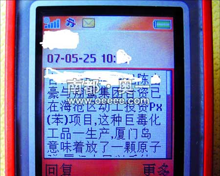
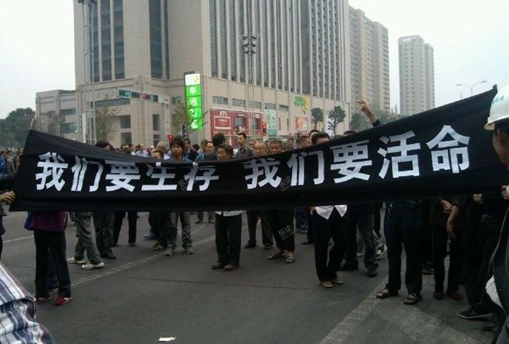
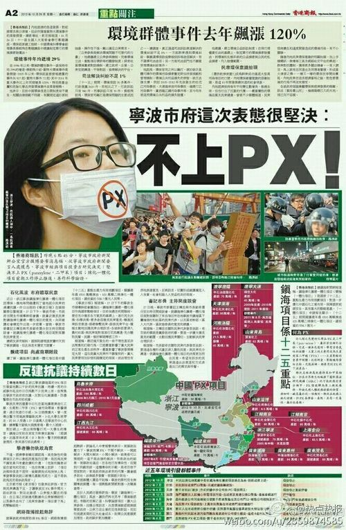

# ＜天枢＞民粹主义与精英主义：就宁波PX项目浅谈民主的难题

**要实现真正的民主，不但教育要有长足的进步，经济要有飞跃，更重要的是，社会要更加的公平。你不可能指望一个只受过中国乡村中学基础教育的人，做着每天12小时的工作，拿着一个月两三千块的工资，还有心情和时间上网去查PX到底毒性有多高。事实上，这种人能上街去示威，就已经是我们这个社会了不起的进步了。**  

# 民粹主义与精英主义：

# 就宁波PX项目浅谈民主的难题

## 文/冷哲（犹他大学）

  说起来最近很忙，已经很久没写什么东西了。但是关于民粹主义与精英主义，很早就想写篇文章讨论一下。本次宁波PX事件恰好是个契机，应和着当下中国的一个难题，所以就简单写两句。我的政治水平实在一般，下文中很可能有不少的疏漏，希望有识者不吝指出。 

—— 作者

#### 一、宁波PX事件中的奇妙现象

本次宁波PX事件闹得沸沸扬扬，里面着实有些有趣的现象。

首先呢，抗议民众中间有着无数不靠谱的谣传。比方说“PX高度致癌”、“PX有剧毒”、“PX会渗入土壤毒害几代人”、“PX能造成男性不育”、“一旦PX泄露，方圆一百公里都无人幸免”……

这不知道PX是什么东西的人听到这些传言，还以为PX是生化毒剂呢，一旦泄露江浙地区就要成无人区了，简直堪比切尔诺贝利。

而后就有无数的“理科生”指出，这都是极其愚蠢的谣言。首先PX（一种二甲基苯）是国际公认的第三类致癌物质。这是什么意思呢？就是说，这个物质到现在没办法证明和癌症有任何关系。实际上咖啡也是属于第三类致癌物质的。第二，PX毒性非常非常非常低，它的半致死量（导致一半摄入者死亡的摄入量）高于食盐。换句话说就是，两个一模一样的人，一个人吃食盐，一个人吃PX，按同样的速度吃。等吃食盐的人吃死了，而吃PX还没死呢（当然PX还是具有刺激性，可以导致短期器官障碍，所以毒性还是高于食盐的）。第三，PX不溶于水，所以在土壤里不会广泛存在，相对来说不具有强挥发性，也很难扩散，在空气中可以见光分解。第四，医学上证明PX可能导致月经不调，所以PX生产线一线操作人员都是男性。PX的厂子世界各地都有，日本的厂子和居民区就隔一条高速公路，从来就没有PX会导致男性不育的事情。第五，在实验中，长期摄入PX达到103周，也没有发现摄入的动物有病变或异常，仅有少量体重下降。另外，孕妇高剂量摄入PX（比如每日摄入60克）可能导致婴儿发育异常。不过由于PX的物理特性，除非很极端的意外，否则即使是化工厂出现泄露事故也不太可能发生这样大剂量的摄入——那么有刺激性的东西还想让一个孕妇一天喝下去一小杯的分量，这确实是有难度的。（对PX毒性有异议的，请查看美国橡树岭国家实验室的二甲苯毒性报告http://cira.ornl.gov/documents/XYLENE.pdf，其中p-xylene即为PX）（百度上面的内容已经被篡改了，不知道现在改回来了没有）

的确有一部分人的确提出了很真实的理由来反对这个项目，比方说不信任当前中国化工企业的安全管理、担心泄露，比方说就是不希望家旁边有个化工厂。无论我是否同意其观点，这都是给予真实信息的观点。但是，这改变不了这样一个事实，那就是网上和私下传播的关于PX的消息，绝大多数都是基于“PX是剧毒致癌物”的谣言而不是真实的观点，有无数的人就是因为这样的谣言而走上街头。

于是，很自然地，“理科生”们开始嘲讽示威民众（及其支持者）的愚昧。

而作为反击，一位“文科生”反唇相讥，写了一篇文章。这篇文章前半部分逻辑比较混乱，完全是一幅反智主义和极端理想主义的调子。但是在最后的部分，作者提出了一个非常有价值的论点，那就是“不管民众的诉求是否合理，既然这是大多数民众的民意，那么我们就应该遵从”。

然后宁波政府就宣布不建这个项目了。于是“理科生”们比较郁闷，觉得这是对“群氓”的妥协，而“文科生”很兴奋，觉得这是民意的胜利。

看到这里，读者大概已经注意到，“理科生”和“文科生”都是加引号的。其实这根本就不是“理科生”和“文科生”。持“理科生”观点的人之中有很多正牌文科生。而“文科生”之中也有很多正牌理科生。这所谓的“理科生”和“文科生”，其实说白了，就是精英主义者和民粹主义者的分野。（当然，实际差异并没有这么清晰，一些反对PX谣言的人，也支持民意。此处只是为了论述方便）

#### 二、精英主义与民粹主义

很多人一听精英主义（Elitism）就觉得是个好词，而一听民粹主义(Populism)，就觉得是个坏词（或者完全相反）。其实这两个词都是中性的，而且都是很自然的思路。

首先，我们知道一个很简单的道理，当你要做某个工作的时候，如果你对工作的内容了解得更多，你的工作应该会更好。所以，如果去除其他条件，一个具备专业知识和经验的人，一定会比一个不具备知识和经验的人，做出更好的成果。根据这个逻辑，我们应该让最具有专业知识和经验的人来作一个工作。那么我们回到PX项目的问题上，按照这种逻辑，这个项目到底该不该建，应该由环境专家、经济专家、化工专家来讨论并决定。民众因为缺乏必要的知识，所以做出的决策有很大的几率是错误的。因此不应该让民众参与到决策过程中。这，就是精英主义的政治观点。

但是，以上的逻辑推理中有一句话“如果去除其他条件”。现在我们再把这些条件加上，情况就不一样了。首先，我们知道，我们中绝大多数人都不是大公无私的。如果仅仅让少数人来进行决策，那么谁能保证他们不做出自肥而损害民众利益的决策呢？从根本上说，只有民众自己有权决定自己的利益。所以为了保证自己的利益，理应由民众来作出决策。如果民众决策错误，那不良结果也是由民众自己来承担的。所以无论怎么说都是一个合理的方案。这，就是民粹主义的政治观点。

这两种观点毫无疑问都有其合理性，也有其弱点。比方说精英主义能做出更好的决策，但不能避免精英自肥、损害民众。而民粹主义，虽然符合民众的呼声，但是民众在很多方面是缺乏必要知识的，也无从分辨谁对谁错，其结果就是民意被少数人影响，而容易做出错误的决策。就比方说本次PX事件，有多少人是因为相信PX毒性的谣言而上街反对PX项目的呢？为什么那么多当事人都在疯传关于PX的谣言呢？你会发现很多当地民众的想法其实就是“不管你信不信，我就是信了”。他们宁可信谣言告诉他们的“有”，不肯信科学实验告诉他们的“无”。

大多数人都能明白极端精英主义带来的危害。但是很多人会这样为民粹主义辩护：“无论民众做出什么样的决策，最后承担结果的都是民众自己，别人不应该说什么。”其实这是一个很可笑的言论。因为这些人从来都没有考虑过一个问题：既然在一些问题上，民众缺乏进行决策的必要知识，那么民众又是以什么为依据进行决策的呢？

我相信没有几个人是投骰子决策。一个人做出决策的时候，无论如何都需要一些依据。如果民众缺乏必要的知识，那么依据从何而来？有时候，是偏见，有时候是少数人无意中制造的谣言，而更多的时候，是一部分精英的言论引导。是的，我可以这么说，就算是造谣这档子事，精英也会比非精英造得更好。

二战的时候，德国的纳粹就是诉诸民粹主义的。是谁让民众大都相信犹太人和德国共产党是德国人生活艰辛的原因呢？是希特勒，以及他周边的一帮精英（注意，在这里精英是个中性词，它仅代表专业水平，不代表道德思想）。这就是一部分精英绑架民意。

而有的时候，民意则会被少数民众绑架。如果说民众中间，有20%的人很想做一件事，40%的人觉得作了最好但不做也无所谓，10%的人不想做，而30%的人完全无所谓。如果完全按照民主原则，这件事是6：1，是应该做的。那么当10%的人为了搞黄这个事情而传播了不利的谣言之后，20%的倾向于做的人和30%的中间派可能改变了看法，于是这件事被4：6否决了。这其实就是10%的人绑架了民意。不要觉得不可能。你可以去问问有多少宁波游行的人相信PX是剧毒致癌物质。

所以民粹主义的核心问题就是：民众的意见，也许根本就不是民众自己的，而是少数人操纵的。最后有可能为了少数人不合理的利益让大家一起付出代价。民众的所谓决策，有可能是被骗的结果。

所以说到底，无论是精英还是民众，都不是伟大光荣正确的。

好了，那现在就有一个问题了，到底怎么做决策、谁来做决策。

#### 三、民还怎么主？

我们今天遇到的很多政治问题，其实都归结到一个问题：到底是应该精英主义多一点，还是应该民粹主义多一点？

这并不是一个新问题。美国开国的时候，那些建国者就深入地思考过这样一个问题。那时候才是民主的开端，作为几千年精英主义的反动，民粹主义一开始可是以“伟大光荣正确”的面目出现的（实际上在49年之后的一段时期，我国也是如此）。但是很快，大家就发现绑架民意的现象。

所以美国的建国者中有很多都反对“民主”而倡议“共和”。用大白话讲就是民众就不要参和到政治决策中来了，让精英来办就行了。但是民众呢，可以有制约精英的能力，就是决定“是这个精英去做决策还是那个精英去做决策”。这可以说是精英主义和民粹主义的无奈妥协。

成熟民主国家，在民意问题上是相当谨慎的。精英甚至会做出民众大规模反对的决策，比方说提高退休年龄。但是，在大多数问题上，民众的意见仍然是极端重要的。

如果我们抛开资本通过媒体操纵民意等等问题，而只在比较理想的情况下讨论决策的问题。那么现代民主要运行的比较好，必须要实现这样一个目标，就是让民众能够充分了解决策内容以及相关的知识。比方说，在为一个化工项目投票之前，政府要进行详细的公示和宣传，让民众充分了解相关信息，具备做出正确决策的能力。

即便不说一些复杂到不可能短期让外行有个大概了解的问题，多数民众真的能在公开的内容与谣言之间分辨真假么？如果政府说PX几乎无毒而谣言说是剧毒，民众信哪个？有人说不信政府的原因是政府公信力差。这种言论是愚蠢的。当两个相互矛盾的信息出现的时候，不管你更信任哪一个，都需要自己去查证。然而，大多数民众恰恰没有这种兴趣。所谓“谁更有公信力就信谁”，这根本是一种盲目的行为。无论你更信任谁，它都有可能出错甚至故意出错。最保险的莫过于自己查证。现在网络这么发达，各类专业人士比比皆是，很多问题一查就能知道是什么情况。但是民众仍然没有这么做的意愿。

单纯地抨击民众愚昧，这本身也是错误的。民众的行为方式总有其根源所在。首先，网络上信息的丰裕，仅仅是这几年才有的事情。民众没有经济上的余裕和时间上的余裕去为其关心的每一个问题查证资料。而且我们的基础教育体系虽然提供了大量的各个学科的常识，但是却没有很好的教会一个学生如何针对一个问题搜索比较可靠的答案。

如今很多所谓的“启蒙派”都试图把“民主好啊、民主好啊、民主就是好”灌输给民众。仿佛民众知道了“民主就是好”之后民主就能成功了。民众，如果缺乏好的搜索信息的能力，民主的负面效果就会急剧扩大，甚至于崩盘。“民”要想做好“主”，就必须具备搜索信息、读取信息和判断决策的能力。未来公民教育的核心，不是简单地教会年轻公民什么是他们的权利，而是让他们获得上面所说的能力。没有这种能力，民主要么就会沦为群氓暴政、要么就会变成民粹政客的游乐场。

#### 四、民主的终极命题：精英主义与民粹主义的统一

搜索信息、读取信息和判断决策，这不是开玩笑。这种工作，从教育上讲需要投入巨量的教师资源逐一施教，从物质支撑上讲需要庞大的极其便利的信息服务体系，从实施上讲需要个人有足够的空余时间从而在个人的工作和娱乐之余还有时间和兴趣进行这种工作。

如果把这些条件全部综合起来，你就会发现一个问题：这要求每一个公民都成为“精英”。这里的精英不是一个相对概念。无论社会有多发达，总会有一部分人比另一部分人更加“精英”。这里的精英，是一个绝对概念，是说一个人要具有独立的学习、思考、决断能力，能够针对所需的目标有效地获取信息、学习信息并快速应用，更重要地，有时间和经济上的余裕进行这类工作。

是的，正确决策的核心在于决策者要具备必要的信息。只有大多数民众都具备了专业知识和经验，民主的决策才能够保证最大程度的正确。在各个政治方向完全具备知识和经验是完全不可能的事情。但是如果能够在短时间内自我科普，了解基本信息，然后分辨不同意见的真假好坏。其效果也是一样的。用大白话讲，就是谁也不是全才，归根结底都要听专家忽悠。但是只要学会怎么用Google，怎么从搜索结果里甄选比较靠谱的基础知识，再去听他们忽悠，这时候民众做出的决策就更有可能是正确的。

达不到这一点，精英和民众就一定会有极其深刻的矛盾。今天的欧美，也存在这样的问题。欧美的民主，其实也不过就是民主的初级阶段罢了。仅仅套用他们的模式，是不可能为中国带来真正的改变的。

要实现真正的民主，不但教育要有长足的进步，经济要有飞跃，更重要的是，社会要更加的公平。你不可能指望一个只受过中国乡村中学基础教育的人，做着每天12小时的工作，拿着一个月两三千块的工资，还有心情和时间上网去查PX到底毒性有多高。事实上，这种人能上街去示威，就已经是我们这个社会了不起的进步了。

我们的社会，只有把每一个人都当成精英去培养，让大多数人都拥有一份精英的工作，才有真正民主的可能。这一天还非常的远，但并不妨碍我们今天就做一些基本的事情：先把政府的公示制度做好。而同时，我们也要把社会往那个理想的方向推进，途径就是教育和就业的公平化。当然，这又是另一个话题了。

 

### 增补：

另外，见到有人说，“中国还不是民主社会呢谈这些做什么?”

关于中国的民主化之路，我在另一篇日志里进行了讨论，而且也不在本文的讨论范围内。所以没有涉及。

看到有人说我这是无政府主义，这是错误的。我其实是比较遵从中国传统的大政府主义者。我希望的政府要比现在的欧美政府都要大，管理的事情都要多。但是恰恰是如此庞大的政府才更需要民众具有强有力的分析、判断、决策和制约能力。

另一方面，看到有人说现阶段最重要的让政府改良，而让民众提高这太遥远了。其实这是一个一体两面的问题。我们都是民众，我们之中谁也没有能力去单独改变政府，政府自己也缺乏改变的意愿。我们改变政府的途径，是通过无数次的博弈，本次宁波的事情，就是一次博弈。只有通过民众的博弈，才能逼迫政府逐渐向民众所希望的方向改良。但是如果，民众本身容易被忽悠，而在博弈之中向错误的方向施加了力量，那改良的结果真的会是我们民众所希望的么？因此，政府该往哪里改，不是我的论述重点，我也没有这种能力去提出一整套关于政治体制改革的方案。我希望的是，如何让民众能根据自己的利益搞明白政府应该往哪里改。所以我关于政治的言论都是在苛求民众的力量。是的，我知道这是苛求。但是我也是民众的一员，我也是自私的，我也使希望我们能够尽快走向一个更好的社会形态。希望说这些废话能让读者明白这篇文章的用意。

 

（采编：楼杭丹，责编：楼杭丹）

 
