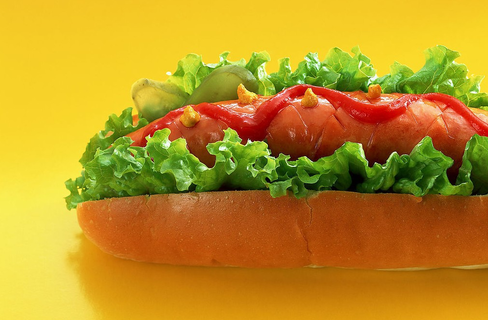
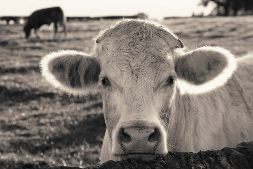
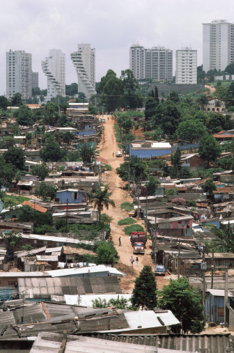

# ＜天枢＞汉堡，独立日与资本主义

**贫富间巨大的差异早已背离了《独立宣言》中宣扬的“凡人生而平等，秉造物者之赐，拥诸无可转让之权利”的理念。膳食的平等正如人权的平等一样宝贵。一个只有富人才能吃好喝好的社会是不能永续发展的。美国食品工业以“更快，更肥，更大，更便宜”为口号，他们虽说绝不可能给牛奶加三聚氰胺后再兑水销售。但在巨额利润和监管缺失的驱使下，食品企业很难将消费者长期和根本的利益放在最重要的位置。如果政府不作为，如果消费者不觉醒，美国为廉价食物付出高昂代价的状况仍将继续下去。**  

# 汉堡，独立日与资本主义

## 文/蒋宇博（加州大学圣地亚哥分校）

 

汉堡这种junk food对于味蕾挑剔的中国人来说的确是不入法眼的劳什子。但美国大街小巷林立的汉堡店却又让人不得不承认，这正是美国人心目中的“国菜”。每年7月4日的独立日纪念的是美利坚的开国元勋们在《独立宣言》里创造的言论自由，政治民主，社会公平和法律正义。如果要让美国人在独立日挑选一件最代表美国精神的食物，那肯定是汉堡和薯条。两片圆面包夹一块牛肉肉饼，第二层中涂以黄油、芥末、番茄酱、沙拉酱等，再夹入番茄片、洋葱、生菜等食物，简简单单，但正是这每一片食物的生产，包装和制作，隐喻着美国经济的变化，传递了美国人对于自由，平等和幸福的理解。

 **牛肉和自由市场**

美式资本主义总离不开自由且开放的市场。但美国的牛肉业却是一个被严格控制的产业。这样的控制并非来源于政府，而是自波士顿倾茶时期就形成的财阀巨头。汉堡中的牛肉产自全国742,000家牧场，但85%的肉牛由四家大型肉类加工巨头宰杀处理。高度垄断的市场不仅使工人们被迫承担更大负荷的工作量，集中的加工处理还增加了肉类污染的风险。对于小牧场（少于100头牲畜的牧场）来说，他们的生存依赖于及时宰杀正当年的牲畜。但宰杀和销售的渠道却牢牢地掌握在肉类加工巨头的手中，他们可以随意控制产量和价格。到上世纪八十年代，42%的小牧场退出了市场，他们的市场份额也骤降了十个百分点。高度垄断的市场也损害了消费者的权益，从上世纪九十年代开始，牛肉的零售价格一直在稳步上升，但经过通货膨胀调整后的价格计算，农民的收入反而下降了。在一个完全竞争市场，这个现象本应该引发牛肉零售价格的下调，但垄断让这一切变为不可能。

美国牛肉业的现状让我不禁联想到了波士顿倾茶事件的起因。1773年，英国国会颁布《茶叶法案》，允许东印度公司直接到北美市场销售，这样可以把价格降到比北美商人走私的茶叶还低，并由英属东印度公司垄断茶叶贸易，以帮助英国本土商人。现在，尽管美国人享用着廉价的汉堡，但真正的大赢家却是那些行业垄断巨头。

 **面包与价格公平**

汉堡中的圆面包至少有四分之一来自沃尔玛超市。这家以低价实惠吸引顾客的零售业巨头控制着全美至少四分之一的食物销售。在29个城市群中，它的市场份额甚至超过50%。沃尔玛依靠自己的完整的食物生产销售链把众多微不足道的面包生产商挤出市场。沃尔玛自己并不烤制圆面包，它通过像ConAgra这样的大型食品公司购买。为了应付巨大的面包订单，食品公司需要从生产力足够强的大型磨坊购买面粉。这样，大型磨坊可以选择从个体农户那里收购，也可以选择量大低价的大农场主。沃尔玛的市场份额越大，大型食品公司的市场份额也越大。不只是面包市场，番茄酱、芥末酱和酒等等食品都将面临着相似的市场形态。今天，大规模地投入大面积（平均2,000亩）的农业生产主导着美国的食品生产与供应。这和两百多年前托马斯杰弗逊宣扬的理念大相径庭：小农、中农是这个国家最宝贵的财富。

 **番茄洋葱与机会均等**

番茄洋葱是制作汉堡必不可少的配料。但这种不可或缺的商品属性并没有使采摘他们的工人们享受到公平待遇。这些采摘工人大都是墨西哥（非法）移民。他们以手工采摘果实，却薪水微薄，一年的工资大概在10,000美元到13,000美元之间。每年，全美各地都会收到各种各样关于工伤、底薪和恶劣工作环境的法律诉讼。例如，在加州的Calandri SonRise农场，工人们一班工作15小时，工资为80美元，平均每小时为5.33美元，低于8美元/小时的加州最低工资标准。《The American Way of Eating》一书的作者Tracie McMillan曾亲身工作在加州的一个大蒜农场，她的工资仅有2美元/小时，即便是熟练的采摘工人，他们的工资仍远远低于最低工资标准。番茄工人的境遇更糟糕。在北卡罗来纳州，采摘工人时刻受到杀虫剂病毒的侵害，以至于女性工人的基因发生变异，生出的婴儿没有手脚。上述种种问题都与美国人崇尚的公平正义相悖。汽车大王亨利福特曾骄傲地称他在流水线上的创新让工人们能买得起他们自己亲手生产的汽车。但如今，农场工人们在超市甚至买不起他们亲手摘下的蔬菜。提高工人的工资或许可行，但这需要全国的家庭买单，他们会答应吗？

 **生菜与贫富差距**

早在两百多年前，美利坚的建立者们就意识到了食物对于国家的重要性。1782年，托马斯杰弗逊发现在他的家乡弗吉尼亚州，贫富差距引起了膳食的变化，富人吃得起蔬菜，穷人却吃不起。他认为这个问题“不可原谅”。两百三十多年过去了，这个问题依然存在，而且膳食对于阶级的分化愈发地明显。有钱人总是能吃上新鲜、自然、健康的蔬菜，而且越吃越“高富帅”。老百姓只能吃经过高热量的廉价食物，最后都吃成了“屌丝”。如今，仍有1,360万美国人生活在远离新鲜食物的社区，买不到像生菜这样最基本的蔬果。纪录片《食品公司》中采访过一个拉丁裔移民家庭，父母养家糊口非常忙，既没钱也没时间准备一日三餐，他们基本靠快餐为生。美国快餐既便宜又能吃饱，但观众只要看看一家人的腰围就知道廉价食物的真实危害。那位父亲的糖尿病已经很严重，正面临着视力下降乃至失明的危险。受超重困扰的美国家庭并不在少数。事实上，肥胖症已经成为美国的健康公害。按照目前的趋势，2000年以后出生的美国人中，有三分之一将遭受糖尿病的袭击。

贫富间巨大的差异早已背离了《独立宣言》中宣扬的“凡人生而平等，秉造物者之赐，拥诸无可转让之权利”的理念。膳食的平等正如人权的平等一样宝贵。一个只有富人才能吃好喝好的社会是不能永续发展的。美国食品工业以“更快、更肥、更大、更便宜”为口号，他们虽说绝不可能给牛奶加三聚氰胺后再兑水销售。但在巨额利润和监管缺失的驱使下，食品企业很难将消费者长期和根本的利益放在最重要的位置。如果政府不作为，如果消费者不觉醒，美国为廉价食物付出高昂代价的状况仍将继续下去。

又到一年的独立日，美国人大张旗鼓地纪念《独立宣言》和美利坚合众国成立。我很好奇这是两百多年前，“五月花”上的清教徒们设想的那个美丽新世界吗？华盛顿杰弗逊林肯罗斯福是否能预料到美国寡头垄断，毒食难肥和贫富分化的现状？或许我们不应该让他们来回答，真正需要扪心自问的是每一个活在当代的美国人。

7月4日于美国华盛顿特区

 

（荐稿：张苏樊；采编：何凌昊；责编：何凌昊）

 
