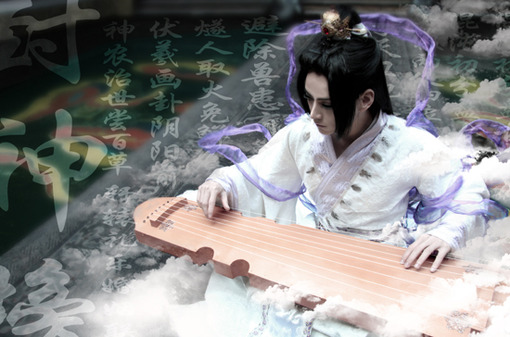
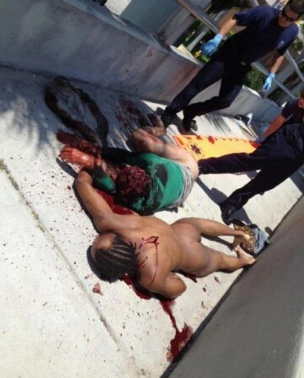
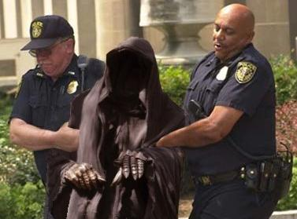
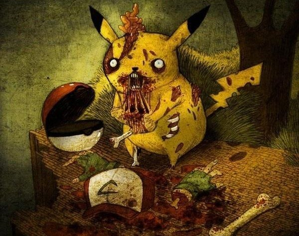

# ＜天枢＞沉默的羔羊：正常人离吃人有多远？

**不论是仇恨也好，丧失心智也罢，都是扭曲。前文已述，每个人心里都有一个萨德，只是程度和方面不同而已。当人的非常态思想、诉求得不到正常的排解与关怀，就可能郁结，郁结到一定程度，完全可能爆发。所有个案，都不是个案，都是长期以来的失落与压抑，导致最后的总爆发。如果处置得当，并不是无法避免的，如果处置不当，任何所谓的正常人，都有吃人碎尸的可能。** 

# 沉默的羔羊：正常人离吃人有多远？

## 文/杨修(吉林大学）

 

最近的新闻一个比一个重口味，先是东莞女生在卫生间惨遭伏击，然后美国啃脸，加拿大分尸，湖南更进一步，还用盐腌了腌。这都是怎么了？古往今来，很多伟人都逃不过被做成腊肉的命运。人吃人这一行为伴随着人类历史，从未间断。但就此行为，不能简单用“心理变态”来概括，如果细想一番，一个正常人离吃人未必很远。

首先看看心理变态，一般而言，变态是针对常态的，常态也便是大多数，所以每个个体都有与大多数不一样的地方。可以说，每个人都是变态的，只是变态的程度和方面各种各样而已，变态其实也是一种常态。

吃人这件事，很多人干过，周文王吃过，乐羊吃过，还都吃的是自己儿子，只不过文王是被迫，乐羊是表忠心。就连孔夫子，都差点吃了人肉，幸好孔夫子知徒莫若师，见卫国送来肉酱，就知道子路尽忠了，卫国这是向老夫子示威呢，你的徒弟就在这了，挺美味的。要换了别人，估计就吃了。

在氏族社会时期，吃战俘的现象比比皆是，进入文明时代，人的道德是不允许同类相食的。但吃人事件依然比比皆是，大体说来，人吃人，可以简单划分为群体性吃人和个体性吃人。

先看群体。群体人吃人的主要原因是饥荒，天灾也好，人祸也罢，饥荒的起因不重要，五千年历史，“人相食”、“易子而食”的记载史不绝书，中国有，外国也有。最近的一次，所谓的三年人祸灾害时期，安徽山东两省，人吃人的事件到处发生，现今问逃过一死的老人，很多都会肯定地告诉你，当然发生过人吃人。笔者身为皖人，小时候就听说过换儿子吃的事。那是一个连老鼠的数量都下降了的年代，老鼠的繁衍速度根本跟不上被吃的速度，到最后瘟猪瘟鸡老鼠都吃得差不多了，就开始吃尸体，最后发展到吃活人。在那种情况下，什么社会文化都是浮云，生存下去才是唯一目的，所以人早已剥去了伦理道德的外衣，将赤裸裸的兽性暴露出来。

当然除去饥荒导致群体吃人事件外，还有一种群体吃人的起因——泄愤。在这种动机下被吃的往往都是名人，来俊臣、袁崇焕都经受了如此对待。穆巴拉克如果不是在笼中受审，会不会落得如此下场难说。而听老人说，当年身兼山东安徽两省省委书记，一手制造出大饥荒的曾希圣，文革中从安徽押走的时候，也是被装在铁笼里，如果不装在笼子里，会不会被吃不好说，碎尸是肯定的了。但凡因为泄愤被吃的，谁都会说死有余辜，袁崇焕当年也被认为死有余辜，问题是就算这些人罪大恶极，罪该万死，吃他们肉这种行为就有道理了么？无辜者不该被碎尸，不该被吃，曾阎王就该被吃了么？袁崇焕被吃后来被批评的也只是中了反间计，枉杀忠良，没有人批评吃人肉事件，来俊臣被吃更是大快人心，历史记录这些事，主要是体现民愤极大。但民愤可以凌驾于人权之上么？吃人不论如何，都是野蛮行为。这种事情可以折射出几点，首先，当人被仇恨蒙蔽了双眼，就没有理智可谈，会进入兽的状态，其次，在群体性行为当中，人往往会用“别人也这么做”来说服自己，给自己心理暗示，我这么做也可以，最后，所谓道德评判，更是靠不住的东西，很多时候，只要能自圆其说，哪怕自欺欺人也好，只要能说服别人说服自己，就能过得去道德关。当那些大嚼来俊臣袁崇焕肉的士人平民以忠孝自居的时候，是多么喜庆祥和的图景，失落的，只有人性。

再看个体性吃人，最近的啃脸分尸腌肉等等，都是个体性事件。但个体性事件的背后，绝不仅仅是变态一个词所能概括，更准确地说，应该属于扭曲。不论是仇恨也好，丧失心智也罢，都是扭曲。前文已述，每个人心里都有一个萨德，只是程度和方面不同而已。当人的非常态思想、诉求得不到正常的排解与关怀，就可能郁结，郁结到一定程度，完全可能爆发。所有个案，都不是个案，都是长期以来的失落与压抑，导致最后的总爆发。如果处置得当，并不是无法避免的，如果处置不当，任何所谓的正常人，都有吃人碎尸的可能。从这个角度而言，希特勒、斯大林、朱元璋的所作所为，也是长期压抑的一种心理扭曲，姚广孝的唯恐天下不乱，更是诉求得不到安抚的产物，甚至宋江坐楼杀惜、石秀捉奸、宋高宗厌恶英武豪迈的武将，都是心理扭曲的体现。

阻碍人吃人的最大因素，就是道德观念，心理在日常的失落中扭曲，最后一道防线，就是道德观念。但到总爆发的时候，不论是陷入混沌如啃脸男，还是进入疯狂如加拿大碎尸男，在他们心中，已经没有道德可言，道德已经无法约束他们，于是什么事都干得出来。所以道德的困境在这里体现，为什么要依照道德？很多时候给不出有说服力的答案，只是告诉个体违背道德会遭到谴责（还有别于法律的规训与惩罚），当个体不在乎违背某条道德所遭受的谴责时，他自然就无视道德。此外，道德是可以被解构而后重构的，纳粹德国时期，集中营屠杀犹太人甚至扒皮做灯罩，很少有德国人觉得不道德，因为有戈培尔效应，如果以希特勒的国家机器，宣传吃犹太人并没有不道德，当时已经进入群体盲从的德国人估计也会去吃。

最为吊诡的吃人现象，恰恰是要讲的最后一种。人如果不在乎违背道德的后果，就会肆无忌惮地违背道德，那么存不存在一类人，根本就游离在大多数人制定的道德体系之外，也就是说，他们并不认为“道德”是道德的，或者他们以俯视的眼光，认为属于普通人的道德观念不能约束他们。这类人是存在的。

尼采所谓的超人，就是这一类的存在，他们未必吃人，但一定不在乎道德约束，萨德、福柯都是这一派的传人。而有时候，在极权主义体系中，统治者也是超道德的存在，比如齐桓公，就可以公然说出想尝尝人肉这样的话，管仲谴责的，也只是任用易牙，而不是吃人本身。

好莱坞经典电影《沉默的羔羊》中，汉尼拔莱克特博士如果不吃人，会让你觉得和他做朋友挺好，从容优雅，知识渊博，谈吐不凡，但是他吃人，而且毫无负罪感。这便是所谓的超人意识，他认为他是要高于普通人的，就如普通人认为自己是万物灵长，猪是低等生物，所以大多数人吃猪肉毫无负罪感，而汉尼拔博士看普通人的视角，就如同普通人看猪的视角，普通人的额前叶对他而言，不过是美味的食物。

为了防止周围人畸变，走向扭曲，没准哪天吃了你，最好的方法是沟通，让人说出自己的压抑，此外监督远离致幻药。既然马加爵事件可以避免，那吃人事件也不是必然发生。而对于那些有超人潜质的个体，如果你不想走上吃人之路，有两个好方法，第一是找人倾诉，问题是不是谁都有那种好运气，和别人倾诉自己看来“变态”的想法还不被反感的，很多人扭曲与其说是因为自己的畸变，更多的是众人的白眼，第二，那便是创作，别憋着，写出来，《发条橙》的作者、《沉默的羔羊》的作者，甚至导演演员，都是有畸变倾向的，但通过创作的方式倾诉，会得到有效的排解，如果再能畅销受到好评，更是医治心理疾病的一种良药。

吃人也好，碎尸也好，离正常人并不遥远，在诱因的激发之下，每个人都有吃人的可能。

 

（采编：何凌昊；责编：黄理罡）

 
