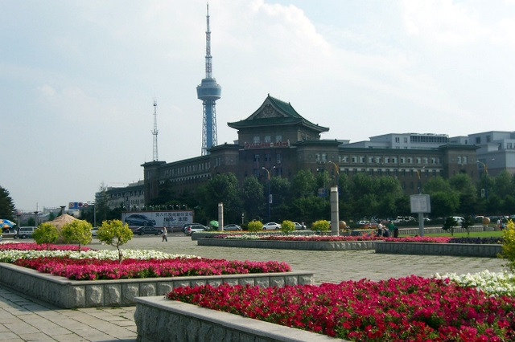
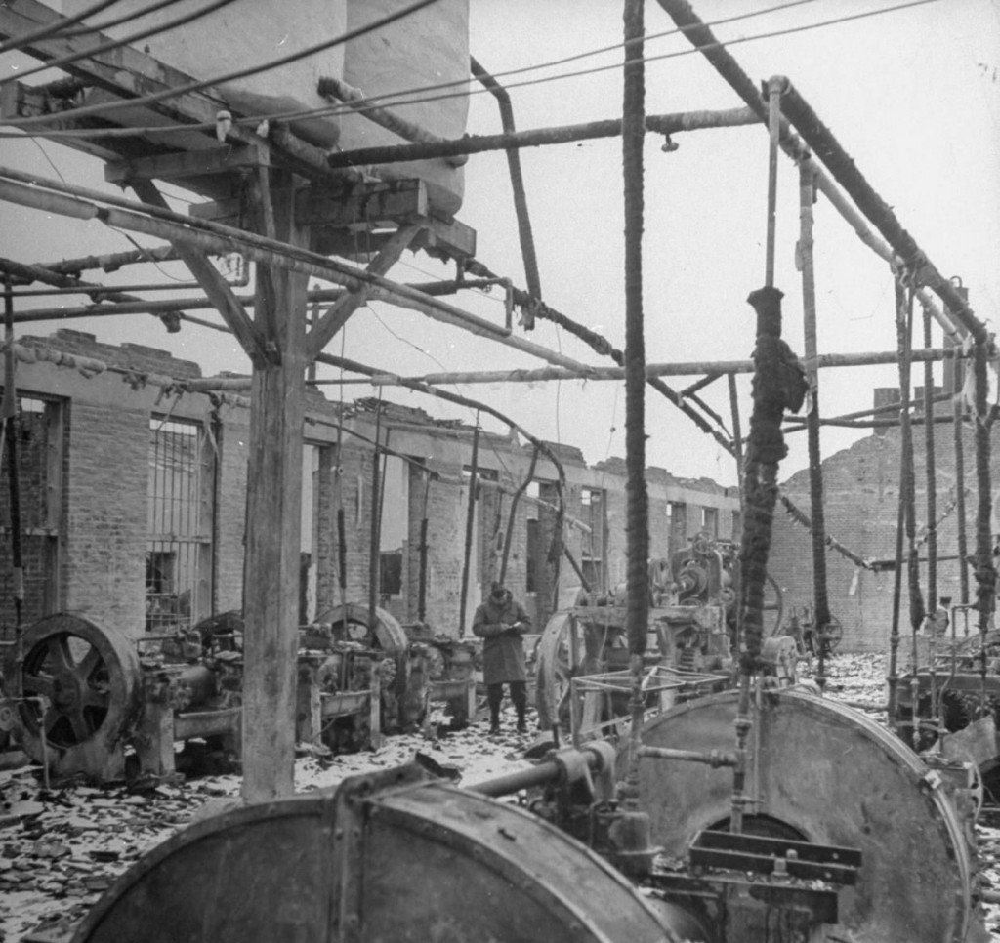
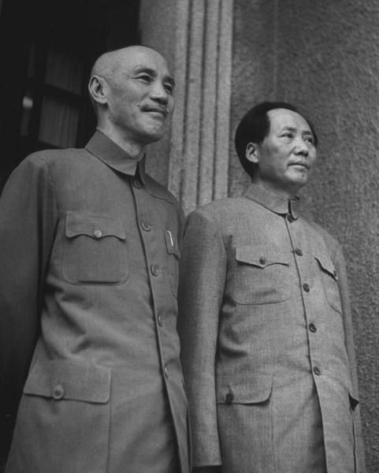
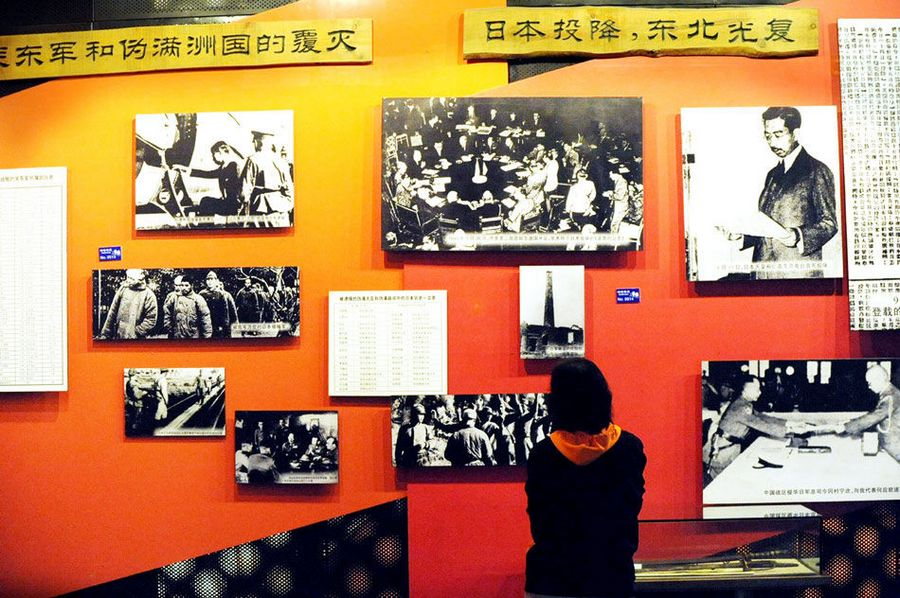

# ＜天枢＞没有救世主的世界

**同样为强力，为何会有两种影响差距甚远的后果？——日本人或许还算是在建设，可苏联人却是真刀真枪的在破坏了。也许人们并未认清的是，能够决定事件性质的，并不在于行为的结果，而是在于其中的过程；并不在于强力下的成就是否丰厚，而是在于这种强力本身的非正义性。强力和权力在逻辑上是相似的，前者是一种连续行为，后者则是一套既定状态。从这个角度出发，满洲那种“强力下的施舍”也绝不比强力下的掠夺来的更加高尚。相反，正是这种给予和施舍，才让强力本身充满了自我合理性的陶醉感。**  

# 没有救世主的世界

## 文 / 松壑（西南财经大学）

 

从小到大，在我们这代人所接受的教育印象里，“九•一八”这一天都要被环境格外的放大和强调，长辈们说，那一年日本人闯入了东北做了许多坏事。其实，历史单方面灌输的可怕性，往往不在于虚构，而是在于它的选择性失明。于是，随着这个近似于开放时代的到来，信息的充裕，为人们重新认识那段被忽视了的满洲国历史提供了条件。

即便没有史料，我猜想一些东北人也能够有所感受，以我个人为例，作为东北人，小时我所就读的小学和高中，都是日本人早在20世纪30年代修建的。我的家乡在满洲国时是作为一个独立行省而存在的，是那时候的商贸中心，而在今天的新中国，却只是一个微不足道的地级市。那时的满洲在日本的辅佐下，就像一颗亚洲冉冉升起的新星，那里拥有了四通八达的铁路交通，现代化教育的普及，以及工业化的迅速成长。据相关资料显示，二战结束前中国人均GDP为40美元 而满洲凭借着门类齐全的工业和农业 其人均GDP已经达到了315美元。即便是30年后，1975年的中国大陆还没有达到这个水平。1943年秋季，满洲国依靠占中国12%的土地和10%的人口，生产了占中国93%的钢材、66%的水泥、69%的化工品、95%的机械、78%的电力。

显然，曾经的旧东北远不如日本人辅佐下的新满洲发展的成功，我也接受这个事实。然而，许多人在了解这些事后，开始对日本入侵东北的行为进行重新评估，进而从功利和结果出发，为日本人在东北的行径寻求合理性，一种时下流行的看法是：日本人入主后，生产力、人均GDP和人民的生活水平都得到了很大的提高，至于主权在谁手中，则并不重要，因为在他们看来，毕竟“人权高于主权”。

或许，持这种观点的人需要回答的一个问题是：当你的邻居用暴力手段把你从家中赶走，之后不经你同意就把你家装修一番，你是否会不在意？

有人觉得这事无可厚非——有邻免费帮装修，不亦乐乎？可问题的核心在于：谁能保证，你的邻居赶走你的目的仅仅是为了和你共处一室以强制帮你修缮，而不是为了从你家抢走点东西？换句话讲，当他人用暴力来驱赶你之时，其行为和所造成的后果影响，是你能左右了的么？

我宁愿相信，如果不是以结果论英雄，以成败论王寇，就不会让简单的善恶评判成为许多历史的符号标签，各中滋味也不会轻易沦为人们茶余饭后的谈资。但是，你能看到，当盟军即将胜利，日本这枚小强盗即将溃败之际，一枚级别更高、无人能左右的大强盗赫然出现了——苏联红军进入满洲后，从烧杀抢奸到屠戮大地，无恶不作。据老人们口述中的记忆，除了那些无法搬运的铁轨网，满洲国内的一切资源，苏联人几乎连一颗螺丝钉也没有放过。

同样为强力，为何会有两种影响差距甚远的后果？——日本人或许还算是在建设，可苏联人却是真刀真枪的在破坏了。也许人们并未认清的是，能够决定事件性质的，并不在于行为的结果，而是在于其中的过程；并不在于强力下的成就是否丰厚，而是在于这种强力本身的非正义性。强力和权力在逻辑上是相似的，前者是一种连续行为，后者则是一套既定状态。从这个角度出发，满洲那种“强力下的施舍”也绝不比强力下的掠夺来的更加高尚。相反，正是这种给予和施舍，才让强力本身充满了自我合理性的陶醉感。

然人性如此，更多的的人偏好被施舍，却也都痛恨被掠夺，即便他们不承认这种偏好的存在。于是，当同样面对来自外界的福利和迫害时，他们赫然选择使用了双重标准来化解这种矛盾——掠夺我不行，但施舍我可以。然而，在强力作用的逻辑体系里，施舍恰恰是作为掠夺的来源而登台的。在许多时候，人们能够英勇且自觉的抵御掠夺的残暴，但更多时候，人们却无法抵挡住施舍的诱惑，不仅如此，更多的人甚至还主动参与其中，在强力者面前跪地乞讨，并且自以为是的把这种乞讨美化当成某种英雄式的叛逆或抗争。

如果强力本身就是罪恶的，那么比强力更有罪的，恰恰是那些懦弱着、纵容且滋养了强力的人们。

近代以来，施舍和掠夺的对称影响达到了前所未有的程度，强力的逻辑曾席卷了整个世界。当红色使徒们宣称他们与资本家为敌时，工人们错误的以为自己的利益保障有了希望；当红色使徒们开始组织斗地主分田地时，农民们想当然的以为红太阳终于拨天见日了。如果站在历史的长河里去理解那些饱经战乱的无产者之所思，也许并非难事：他们只执着于眼前而不愿意瞭望未来，在心安理得的接受了统治者的施舍后，他们仍然不愿去把天上为什么会掉馅饼想清楚，即便在几十年后，失去自由，可能要在工厂里默默劳作一生的是他们；失去土地，最终可能要饿死在农田上的也是他们。

和强力一样，这世上也本无权力，但是以自由做祭品，为权力来招魂的人多了，于是便有了权力。最终，是人性的懦弱打开了潘多拉魔盒。

因此我们也不难理解，为何在人类的诸多文化里，都不约而同的充斥着各式各样的救世主情结，从犹太们心中期待的弥赛亚，到东方人嘴里念叨的观世音，从“当官要为民做主”到“箪食壶浆，以迎王师”。为了实现心中的“理想国”，总有人能把那些不付出任何理性代价而坐享其成的美好愿望寄托在抽象意念所刻画的某个模板上，无论是意淫着一位拥有上帝般仁慈的完美独裁者，亦或是幻想着一张从天而降，包裹了美好社会愿望的制度馅饼。人性的天然孱弱，总是让他们不由自主的向着一种又一种的乌托邦看齐，最终，他们也只能在等待着救世主的焦急情绪里迷失了方向。

可惜，这世上本就没有什么救世主。国际歌早有唱到："要创造人类的幸福，全靠我们自己。"

回到文章开头的历史教育的选择性失明，我想，这也正是我们被人所诟病的历史教育中的问题：它不敢直面历史，唯唯诺诺的回避着满洲国的成就，不敢从“成王败寇”、“成败决定是非”的功利史观当中挣脱出来，而去正视历史行为本身的合理性。它不应当一味宣传灾难或日本统治下的满洲是多么的水深火热，相反，它应该还原给人们一个真实的满洲，同时勇敢的告诉人们，“满洲虽然很美，但它不对。”

（采编：管思聪；责编：管思聪）

 
