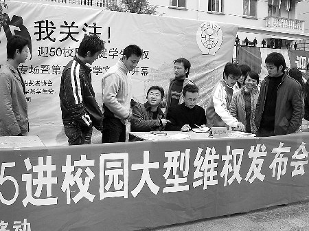

# ＜天枢＞理性从未缺席

**我号召所有还尚存激情的学生同胞，觉醒吧，让我们睁开眼睛看看我们眼前的世界，勇敢地捍卫自己的合法权益，从这强权主义手中夺过我们原本的枪。**

**如果你问我，主义和宗教，哪个会最先从人群中消失。宗教有杀戮，有惩罚，主义有博爱，有一统，可是我告诉你，主义是终要最先灭亡的，主义许诺给你生之权益，却否定自身，注定灭亡。**

 

# 理性从未缺席

# ——从辽师大查寝一事看学生基本权利

## 文/刘梦醒（辽宁师大）

 

昨晚，也就是2011年9月14日晚上，教育学院2008级一名辅导员在查寝过程中，在本人未在场的情况下，未提前知会，将本人挂在床头的毛巾扔掉。当晚我回到寝室发现这一情况，立即给辅导员打电话，此时是晚上8:45左右，而他的手机处于关机状态，未果。第二天早上，即今天，15日早上7:30左右，辅导员先生再次来到我的寝室查寝。于是我问他“是不是把我挂在床头的毛巾扔掉了”，他回答说“是我扔的，你的毛巾太旧了”。我说：“毛巾是我的私人财产，你在我不在场，没有经过我允许的情况下，将我的毛巾扔掉，这是不对的。”他的回应是“你不要和我讲对与错，并不是所有的事情都有对错之分，我已经把你的毛巾扔掉了，给你个教训，怎么办吧。”我随后指着我昨晚启用的新毛巾（作者注：同一款型同一颜色）问他“那我现在挂的这条新毛巾你扔不扔掉？”他回答说，那看我心情了。经过几番论争，也无结果，然后他上去检查其他寝室去了。

据我了解，在教育学院个人物品被扔不止我一人。在我看来，学校与学生在学生宿舍方面的关系属于出租方和承租方的关系。而承租方对于房屋的防火安全，环境卫生等相关问题应该遵循当地有关部门的规定。从这个案例来看，我们已经尽到相应的责任和义务，而学校在租赁前与租赁后都没有明确提出怎样的物品摆设是允许的而怎样的是不允许的，而据此单方面进行查寝并且依据所谓的美观的原则对学生物品（包括被褥，书籍，鞋子，衣服）等随意更改摆放，此是其不合法一，其二是在假定承租方违反条约，违规摆放物品，又无明确条款规定出租方的执行权的情况下，作为出租方的代表辅导员先生擅自将我的私人物品扔掉，这属于侵犯我的财产安全，此为其不合法二。

该先生作为学生辅导员，以及教育学院党支部副书记，应该以身作则，本应为学生利益着想，然而却一再侵犯学生基本权利，对此我表示遗憾。而我相信，辅导员先生只是辽师大这个大系统中的小小的一员，在这个校园的众多角落，无数侵犯学生基本权利的事情一直在发生着。 比如昨晚教育学院强制性收取2008级本科生就业信息短息服务费20元，比如对鄙人所谓怪异的发型勒令剪掉，这样的例子举不胜举，而我相信看到这篇文章的你或者你身边的人也曾经遭受过同样或类似的侵犯。

在此我呼吁广大的辽师大学生同胞们，睁开我们的眼睛，冷静看待我们现在遭受的一切，如果我们一味地选择沉默，我们将成为这个体制内的牺牲品。我们讲体制内体制外的问题，如果你对我讲，在这九百六十万平方公里的土地上，哪里是体制外呢？那么我告诉你，即使我们现在生活的每一寸土地都限制在体制内，我希望我们的心还是在体制外的，我们仍然有能力分辨是非，仍然有激情振臂高呼。

我知道，现在的我们更多的时候都是在沉默，我们看惯了太多的不平等和不和谐，结果我们无能为力，于是我们渐渐地似乎失去了愤慨的能力，失去了激情。然而我相信，在我们沉默的大多数中，理性从未缺席。

我们已经二十多岁了，90年前的我们已经在为捍卫国家领土完整而奋斗了，160年前我们已经在思考世界起草共产党宣言了，而现在的我们，竟未能有勇气有意识去捍卫自己那薄弱微小又是仅有的一份基本权利，这该是多么的可悲啊。

我号召所有还尚存激情的学生同胞，觉醒吧，让我们睁开眼睛看看我们眼前的世界，勇敢地捍卫自己的合法权益，从这强权主义手中夺过我们原本的枪。

如果你问我，主义和宗教，哪个会最先从人群中消失。宗教有杀戮，有惩罚，主义有博爱，有一统，可是我告诉你，主义是终要最先灭亡的，主义许诺给你生之权益，却否定自身，注定灭亡。

我希望读到这篇文章的我的同胞们如果同意上述的观点的话，请告诉我，请帮助我，我十分希望能得到专业人士的指导（尤其是法律方面），而对我上述观点有任何异议，也请告诉我，我们共同讨论。

刘梦醒

2011年9月15日

后记：操蛋的是，毛巾旁边挂的红领巾，也给我扔了。这条红领巾是我一个初中的小盆友在举行完退队仪式后送给我的。

编者注：本文主标题“理性从未缺席”为编者所拟。

(采编责编：黄理罡)

 
