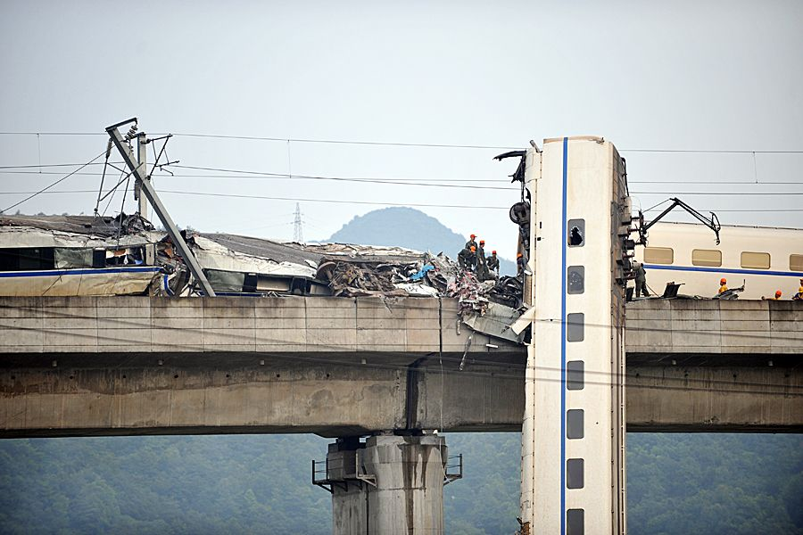
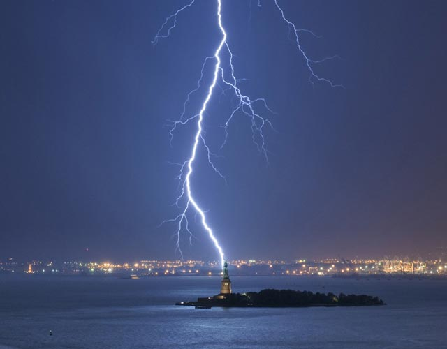

# ＜天枢＞社会进步就是好——写在7·23事故之后

**我们现在就面临的是这么一种状况，一方面我们的制度已经无法再有效约束社会上的丑恶行为，另一方面还在将革新的力量不断扼杀。这样一来，只会将整个社会的道德底线不断拉低，最终使之变成一个禽兽社会，即生存就是最大的道德，手段再无正邪之分。** ** **

****

# **社会进步就是好**

# **——写在7·23事故之后**

****

## **文/ [罗桀](http://blog.renren.com/GetEntry.do?id=742698556&owner=254917406)（重庆大学）**

昨天晚上，吃着火锅唱着歌，就听说高铁出事故了。当时还不以为然，以为又会是和上次停电类似的事故，谁知却死了这么多人，这里先愿逝者安息。

以上是前言，下面进入正题。

据最新消息，此次事故是由于D3115动车遭雷击后失去动力，才导致后车追尾。那为什么雷电总是击中高铁？难道高铁设计中就没有考虑雷电的问题吗？这个问题问得很没水平，因为就连普通人都知道电网必须要防雷击，要安装各种防雷措施才行，更别说是高铁工程师和设计师了。那我换个问法：为什么我们的高铁防雷措施无法有效防雷？ 

谁都知道，南方在入夏以后，雷雨天气会频繁出现，任何大型建筑和工程，都必须考虑到在频繁的雷雨天气下的安全问题。如果在设计阶段没有进行有效的实地测量和风险评估就贸然开工的话，那么出事就是迟早的事。所以，我们是不是可以怀疑以下几方面： 1、在设计建设之初，就没有考虑到这方面的问题，或者是考虑得还不够； 2、高铁在设计的时候是已经考虑完全雷电因素了，但在建设时，出现了偷工减料的现象，以致埋下了安全隐患； 3、建设监理方作为高铁安全的一大保证，并没有尽到他的责任，而是和建设方一起来欺骗投资方； 4、投资方验收时马虎进行，没有仔细检验每一个环节。 最后，在综合了以上4点后，我们完全可以得到这样一个场景：投资方抱着大家可以一起贪但绝不能出人命的心态来进行投资，建设方抱着就算偷工减料也不一定会出人命的心态来建设，监理方则抱着反正大家都是一根绳上的蚂蚱，为什么只准你们贪而我不能贪的心态收了建设方给的红包后对整个工程睁一只眼闭一只眼。

于是，在这三方人的努力下，事故就发生了。

当然，这只是一种猜测，可能理智帝会说：你这纯粹是造谣，你有证据吗？你没证据就不要在这瞎说。是的，我没有证据，但我有智商和常识，我知道目前我国建设领域贪污腐败横行，在这个领域产生的经济效应中没有几毛钱是干净的，我还知道在土地和交通方面，每年因经济问题下马的官员最多。所以，我请理智帝告诉我，我以上猜测错误的概率有多大？

我的第二个问题：我国关于建设行业的法律法规这么多，为什么没有制止这起悲剧的发生。问得再深一点：为什么我国的法律法规无法约束这无处不在的贪污腐败和公权作恶？也许有人会说，难道这些问题别的国家就没有吗？别的国家就能做到尽善尽美吗？说这种话，就好比一个人已经病入膏肓，却还指着旁边一个得感冒的人说：“难道他就没有病吗？凭什么就得我吃药？”

制度这种东西，本来就是人类制造出来用以约束人类自身的恶，当某种制度无法再有效约束这种恶，反而还促使这种恶越发地嚣张，那就证明这种制度本身就不合理，它已经失去了存在的意义，需要换另一种新的能够有效约束人类自身恶的制度。 

我们现在就面临的是这么一种状况，一方面我们的制度已经无法再有效约束社会上的丑恶行为，另一方面还在将革新的力量不断扼杀。这样一来，只会将整个社会的道德底线不断拉低，最终使之变成一个禽兽社会，即生存就是最大的道德，手段再无正邪之分。 

有朋友很反感这一套，认为我们把任何事情都与政治体制挂上钩，认为我们藐视生命。其实不然。要知道，追究真相，才是对已经逝去的人的真正的尊重，同时更是为还活着的人提供一份有力的保障。而真相，正是我们的体制出了问题。

就拿这次高铁事故来说吧，若财政透明，就不会出现投资方、建设方和监理方大家一起贪的情况；若言论自由，这三方间的猥琐交易就会很容易被曝光，从而把高铁隐患扼杀在摇篮里；若司法独立，那该受到惩罚的人就会得到应有的惩罚，从而警醒他人，使他们在做违法行为前能够三思。

从你吃的饭，到你上学、工作，最终到你死去，政治渗透于每个人的方方面面，没有人可以独善其身。还是那句话，你不关心政治，政治却在关心你。所以，只要我们的体制不改，那么类似于高铁这种事故只会越来越多，不会有利益方会因为你那卑微的对死者的善心而放弃唾手可得的巨大利益。 

还有很多人借此次高铁事故来黑高铁，这是一种很没有远见的行为。你怎么不借千年虫来黑电脑？怎么不借哥伦比亚号失事来黑航天飞机？每天发生这么多起交通事故，怎么没见你黑汽车呢？普通火车也有脱轨的时候，你怎么不去黑普通火车呢？

有人认为高铁在我国事故频发就证明了我国不适合高铁，这纯粹是扯淡。日本还地震频发呢，你怎么不去证明高铁不适合日本呢？再者，在目前这个世界上，你把很多东西前加上中国两个字，其意义都会变得与众不同，比如说高铁和中国高铁，政府和中国政府，人权和中国人权，教育和中国教育…… 

追问下去，我们还会感叹：“社会进步就是好……”是吗？

(采编：宋晓慧 责编：黄理罡)
