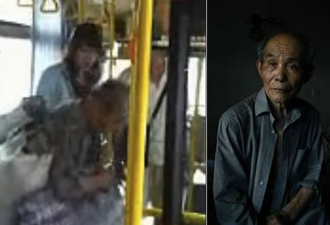
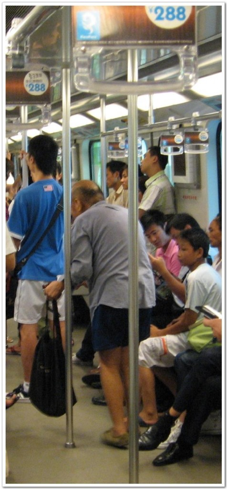
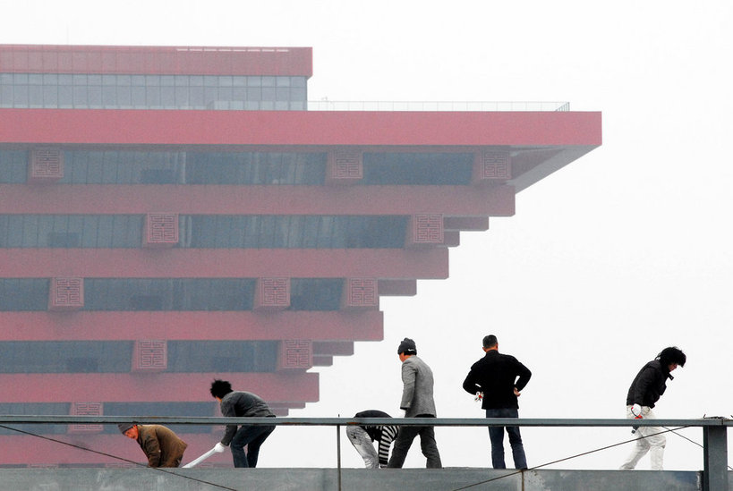

# ＜天枢＞祖国，我的名字叫苦难

**他们只是一群蝼蚁，为生命四处遭人白眼，而生活又苦不堪言。城市不是他们的，他们也从来不妄想会被城市接纳，可是任何活动，他们总是最早接受劫难的一群。他们是大运会被迫消失的一群人，他们是被医院送到荒郊野外等死的一群人，他们是被汽车碾压数次而不会令车停下的一群人，他们是在收留所里面非正常死亡的一群人。他们就是这样的一群人，他们的死“无足轻重”，因为他们只是蝼蚁，人类是不会去在乎一只蝼蚁的死去。**  

# 祖国，我的名字叫苦难

## 文 / joachimbene（上海海事大学）

 

全律法都包含在“爱人如己”这句话之内了。

——《加拉太书》5:14

一位城市的拾荒者，昨天比平时多捡了几个瓶子，他想奖励自己一下，坐一次到城市几年从未坐过的公共汽车去另外一个地方碰碰运气。他也买了票，可是他异样的着装，肥大的蛇皮袋，有点难闻的气味，说明了他拾荒者的身份。司机不肯为他开车，乘客也略显肮脏地把他的物品扔下，这可是他赖以存活的资本。他没有反抗，默默地走下去，和以往一样，步行去没有目的的地方，而车辆继续在他身边一辆一辆飞驰而过。

也许这样的场景你曾经听说过，或许还曾经见过。对于上车的那位拾荒者，你或许也皱起眉头，屏住呼吸，也许你还曾下意识地看紧自己的手机钱包，朝里面的位置再挪动一下。也许你还为那位男乘客的行为暗暗叫好，也许你对这一切早已经见怪不怪，也许……可我们又有多少人会站起身来，对那位司机说“你这样做不对”。又有多少人想起他们也是这座城市的一员，他们也是我们这座城市的兄弟姐妹。

我记得有人是这样为这种行为辩驳：“不要拿‘我也会老’作为指责我的借口，不要对我的这种行为指指点点，作为乘客，他把那异味的蛇皮袋带上公共汽车，谁知道里面藏着多少恶心的东西，我也有权利捍卫我免受传染病威胁的自由。”

我们在乎的真的只是那有点异味的蛇皮袋，承认吧，我们所在乎的完全没有我们所说的那样冠冕堂皇。如果拿这个蛇皮袋的是如“丧家之犬”的孔子，如果拿着这蛇皮袋的是我们的上海市委俞书记，司机还会不发动机车？乘客还会把这个蛇皮袋扔下去而不觉心中有愧？恐怕就算让他们把热脸贴到这个蛇皮袋上也不会觉得有什么脏，这时候谁还会去在乎这个蛇皮袋有什么异味。在我们的内心其实完全可以忍受那略显难闻的气味，正如忍受那公交车上粗俗的香水味道一样，但是我们却无法忍受我们和拾荒者共处一车的事实，因为“我们”比“他们”高贵。

他们只是这个社会被抛弃被遗忘的一群贱民，他们的身份早已经随印度的种姓制度一样烙上永久的印记，他们永世不得翻身，他们的生，他们的死早与这座城市划清关系。他们的身份与这座城市彻底无关，你无法在户口上去探寻他们存在的痕迹。

他们没有名字，你可以呼作张三，也可以呼作李四，更多的时候只是被我们社会标为“拾荒者”这个统称。这座城市从来没有会想起为他们留下遮风挡雨的地方，他们只能在别人抛弃的瓶瓶罐罐残羹剩饭里求得生存。大城市只会去记得那些大人物的挥斥方遒，对于他们的存在，我们一无所知，也从来无心去知。

他们从哪里来我们无从知晓，他们今天吃不吃上饭我们也不会去关心。对于他们的处境，这座城市从来都也不会去记起，我们像躲避瘟神一样漠视着这群人的存在。像我们的祖祖辈辈一样，这群人只能把自己的命运交托给了上天，上天让他们生就生，上天让他们死就死，对于生活，他们也许可以简单到最原始的两个字——活着。

他们没有亲人，没有身份，除了那早已经埋没在尘埃里的生命，他们真正的一无所有。对于那不开车的司机，我们还会说她是某公司的职员，我们还能去探寻她的痕迹。而对于这个拾荒者来说，除了留在视频里的短暂时光，他的下车注定是汇入大海，下一站在哪里，他还会在上海么，这一切都是未知。

如果可以穿得像个人样，谁会整天穿着同一件捡来的衣服生活。如果社会保障做到位，他们又有多少人会靠这种方式屈辱生活。谁不愿意过着有明天的日子，谁不知道整洁比肮脏要好很多。可是他们能够获得这些么？如果不是遇到什么灾难，又有多少人会离开生他们养他们的土地，如果不是生而不平等，又有多少人会选择乞人口食，而这些我们问过他们没有？

我们早已经习惯了从自己的角度去看待我们损失了多少利益，可是又有多少人为他们思考，在他们那卑微的一生中，社会到底亏欠了他们多少责任。他们现在还都在自食其力，但是比起那些社会的蛀虫来说，难道他们就一点都不高尚，人形的整洁外衣真的就比干干净净纯粹的心灵更值得我们向往么？欧西米斯也许会帮这个社会做出抉择。我们所要做的也许仅仅是一个必要的尊重，让他们可以和我们一起平等地乘坐公交车，可是这一点，我们都没有能做得到。

他们无处去诉说，上文中的老人只能够默默地走下去。在他们的脊梁上早就已经被压下了“忍受”，对生活忍受，对命运忍受，对不尊重忍受。他们只是一群蝼蚁，为生命四处遭人白眼，而生活又苦不堪言。城市不是他们的，他们也从来不妄想会被城市接纳，可是任何活动，他们总是最早接受劫难的一群。他们是大运会被迫消失的一群人，他们是被医院送到荒郊野外等死的一群人，他们是被汽车碾压数次而不会令车停下的一群人，他们是在收留所里面非正常死亡的一群人。他们就是这样的一群人，他们的死“无足轻重”，因为他们只是蝼蚁，人类是不会去在乎一只蝼蚁的死去。

以前有同学问我为什么会去学社会学，我以前总是含糊其辞地做出一些似是而非的回答。如果大家知道发生在我身边怎样的一个故事，大家也许会知道我为什么今天会做出这样一种抉择。

那天，我买了一些早点。感觉豆浆不是很合胃口，稍微喝了一口，就随手扔在了路边的草丛里。当我过了一段时间，又回到那个地点的时候，眼前的一切深深地刺痛了我。一个头发花白的拾荒者，捡起我喝过的豆浆杯，一点一点地把它喝掉。我永远记得那一幕带给我的刺痛。本是应该在安享晚年的年纪，是什么把他们逼向城市去谋得生活。中国社会有这么多的不公平，难道就没有一个人愿意去改变一下么？在社会学这里，我找到我赖以生存的动力。

在苦难深重的中国，这种背叛显得尤为可耻。中国的苦难，永远把他们的肉体，把他们的精神伤害得最深。今天的拾荒者也许是昨天失地的农民，也许是昨天上访的农民，也许是昨天刚逃出的被精神病者。他们是革命中牺牲掉最多的一群人，他们是饥荒中饿死最多的一群人，他们是遭受不公平待遇最深的一群人。

我从来没有忘记提醒我自己的身份，我也是一个农民的孩子，我与这片土地血脉相通，我们之间有着剪不断的联系，他们的命运是我们这个国家最苦难一群人的命运，革命成果没让他们过上好日子，改革开放的成果也拒绝着他们的分享，千百年来，从来就没有谁对他们说一句对不起。他们只是一遍又一遍地被抛弃，一遍又一遍地又被遗忘。他们是我们看来理所应当被牺牲的一代。

中国的这片土地上，他们有什么理由被我们所抛弃。老子说过的“老吾老以及人之老，幼吾幼以及人之幼”当时与林觉民先生的“以助天下人爱其所爱”曾经一起把我深深感动，可是祖先留下来的优秀传统，我们通通把他们一股脑抛之脑后，反倒是那些阴谋之道，假仁假义，政治手腕，厚黑学说在这个社会却屡见不鲜，乃至发扬光大。我们这个民族早已经丢掉了信仰，丢掉了曾经的那份纯真与去爱的能力。

这件事情我从来不想把它看作结束，我宁愿想把它当作一个开始。

在我的心里，想把这件事情和美国黑人平权运动相对比。一个不让座的美国妇女催生了民权运动的一个沸腾的开端。一个被赶下车的拾荒者难道在中国激不起任何太大的波澜。这真的是这个民族的可怜之处，事情发生到现在，除了那位被暂时停职的司机别无他声。也没有学者去呼喊，也没有媒体去关注，他们也许没有新闻价值，他们也许与我们无关。

确实，平权运动是有组织争取权利的一个活动。而拾荒者只是生活在社会最底层，没有受过教育，松散的、没有任何权利的人的统称。就是因为这样，他们才更加需要我们社会中有能力的人去争取，去保障。他们没有能力诉说，就是让他们自生自灭的借口么？正义，就是保障社会处于最不利地位之人的最大利益。正义，就是不会为了一群人，而去粗暴地剥夺另外一个人的权益，这就是我心中的正义。

我也有一个梦想，什么时候我们不在是我们，他们也不在是他们，我们再也不骄傲地去区分彼此，我们他们都是兄弟姐妹。

爱人如己，彼此不分。

 

（采编：安镜轩；责编：黄理罡）

   
