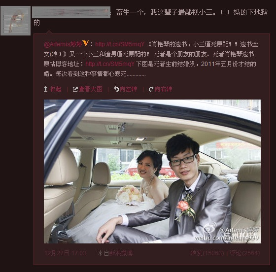
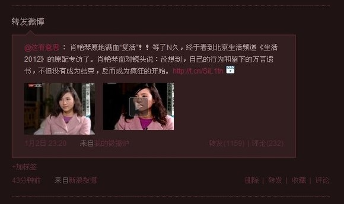

# ＜天枢＞舆论绞肉机

**在自媒体时代，每一个人都是自己媒体的发布者，请慎重使用自己的舆论权力。我们尽可以去批评一个政府，一个政党，因为政府没有人格属性，骂政府王八蛋也没事。但是对于具体的个人，还请三思而后行，毕竟杀人诛心太残忍。我们不要沦为“乌合之众”，不要成为道德的暴君。**  

# 舆论绞肉机

## 文/张晨翼（首都经济贸易大学）

 

看了最近人人和微薄上比较火的帖子——《小三和渣男逼死原配》。该男和小三的各种出轨关系使得原配夫人最后选择了自杀。这件事情被爆到了网上，部分聊天记录，死者遗书，该男与小三的部分聊天记录以及姓名，人人与微薄地址全被曝光。

可想而知，事实也是他们被彻底人肉，被大部分人口诛笔伐。于是我们在该日志里看到小三的日志，在她的日子里我们看到她由于各种压力，也想选择自杀。

不得不发几句对本事件的感想。首先，关于原配的自杀，我作为一个局外人觉得这根本不值得。当然有站着说话不腰疼的嫌疑。但是我们清楚的是，当她得知自己丈夫和另外女人有各种婚外关系时，爱情丧失了，生活的动力没了，于是选择自杀。我只是想说，这位原配做法虽然惨烈，但是一点也不具备任何意义。在当代中国这个环境下，特别是经过五四砸破传统以及文革破四旧的现代社会，竟然还存在这样的思维——女孩子把自己物化了，把自己看成了男人与男权的附属品，甚至把自己与丈夫看成了全部的爱情，看成了生活的全部。这虽然说是一个人的看法，但是在我看来，已经是不正常了。生活没有意义，活着是我们最大的任务。当得知自己男人有婚外恋时，应当明白这不是你的菜，这就够了，爱得死去活来到底是爱什么？

当然中国有句古话：“宁要妓女从良，也不要红杏出墙。”大家痛恨红杏出墙，于是该日志下有大量人在咒骂男人和小三，以至于第三者那个女孩不堪重负甚至也有了自杀的念头。这些网民，自以为执道德之标尺，衡量一切蝇营狗苟之事，道德审判对我们来说是最容易的，反正事不关己，我骂他，我就是崇高的，我就是没有的，我就是在未来对我的伴侣忠贞不二的，我就是到了80岁之后我还有资格立个贞洁牌坊的。骂得越狠，说明自己越清白、越有正义感。就算到了最后，小三选择了死亡，我们也可以说：“你看这个人，死了也活该”。因为群体不用负责任，特别是部分网民群体，骂了就骂了，谁也不知道谁的话是压倒骆驼的最后一根稻草。反正人家是自杀，就算追求责任也是追究大家，所谓人人有责即人人无责。

不能说我们骂人就是不对的。我们骂了才能纠正一些不好的现象，这是肯定的。但是所谓清官难断家务事，我们对于感情的事，请慎之又慎，毕竟这关乎人的感情，简单的道德一刀切会带来极大的坏作用。人的感情是复杂的，我们不能身临其境，我们可能也不能很好的理解，我们批评出轨，但是就别再就纠缠着这两位男女了。想用加缪的《局外人》里的律师说的一段话来表达下这种感觉：“我们知道的都是事实，但是那根本就不是真相”。出轨的事实、自杀的事实不一定就是真相。

此外，日志作者是无耻的，这是真的无耻。公布主人公的姓名与网络地址，人肉他们，这是很不对的。这直接导致了我们可以设想到的另外两个生命的现在与未来的悲惨状况。说到底，身非执法机构，对于家庭事务，实在不应该去干涉，去公开他们的信息。我们前不久在反对实名制，为什么？不就是因为实名制会带来我们自由的丧失吗？这些可好，为了一时的道德快感，野蛮地公布了这种事件的主人公的信息，可悲可叹。

另外，文中提到，女主人公获得了丈夫开房的记录。这不禁令人毛骨悚然，其实这种现象早就有人传过，说是任何一家底层派出所和警察都能查到我们的确切的开房记录。这是多么恐怖的一件事情。在这个事件中，这个记录使得女主人公不受蒙蔽，发挥了正面作用。但是我们想想，这种现象也就这么点好处了吧。万一某一天，咱们家被拆迁而进京上访，咱们住在哪里都立马可查，谁都可查，人家就可以轻而易举地把我们遣送回来，这是多么可怕的事情！谁都可以查我们的信息，我们就是赤裸生活在这个世界，谁也别认为自己能不受到其他人“查记录”。我们是时候警惕和反对这种行为了。

一个坏社会基本上有两大特征：公域无民主，私域无自由。在这个事件中的各个方面来看，我们可以看到我们每个人的私人领域其实是缺乏自由的保证的，老大哥一直在看着我们，而这老大哥是谁？是政府，也是每一个警察，每一个网民。谴责男主人公是他们这个家庭的亲朋好友的事情；谴责出轨才是我们其他人要做的，但是现在，我们却无不留情地去谴责那个具体的人，具体的事。

说到底，我想表达的是请各位给私人领域留出一点自由，把我们的视野与关注多投向蒙牛坑爹这种事情；也请姑娘们更加独立，把爱看成自己的权利，如果对方不值得我们爱，那就收回这个权利。爱不是义务，爱也不是殉情。我们之所以需要爱情，那是因为爱情带来无比的欢乐，如果欢乐没了，那就放弃爱情，但是说什么也别放弃生命。在这个到处争女权的社会与时代，为什么在爱情这一领域，一些姑娘还依旧把自己当成男人的附属物，把自己看成男权的支持者呢？作为男性，咱们也该多多反思，在婚前你乱来这没问题，你有选择最佳配偶的权利；但是结婚了，就安心，如果真觉得不爱自己合法妻子了，那就先离婚，放对方一条生路。毕竟我们现在还未达到共产共妻的共产主义社会，我们只是社会主义初级阶段。

在自媒体时代，每一个人都是自己媒体的发布者，请慎重使用自己的舆论权力。我们尽可以去批评一个政府，一个政党，因为政府没有人格属性，骂政府王八蛋也没事。但是对于具体的个人，还请三思而后行，毕竟杀人诛心太残忍。我们不要沦为“乌合之众”，不要成为道德的暴君。

 PS：该日志地址为：http://blog.renren.com/share/297652015/10853080603?from=0101010202&ref=hotnewsfeed&sfet=102&fin=0&ff_id=297652015  

（采编：佛冉 责编：黄理罡）

 
