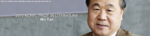
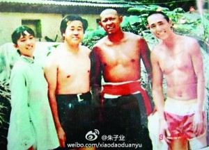
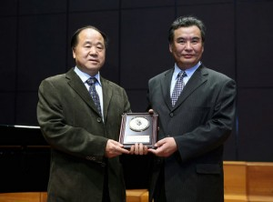
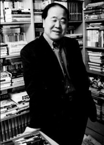
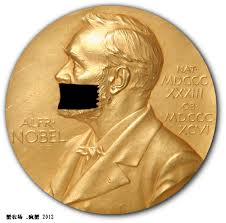

# ＜天枢＞莫言：沉默者的胜利

**这是中国人首次摘得诺贝尔文学奖，百年来的遗憾终于圆满。然而，一些人会有新的遗憾，因为莫言除了小说写作外，在公共领域几乎是位沉默者，这被认为是背离了诺贝尔文学奖的“理想主义倾向”。他说：“优秀的文学作品应该超越党派、超越政治。”对深受政治侵扰因而极度期待文字英雄的中国人来说，这活像是一个作家交出投降书。**  

# 莫言：沉默者的胜利

## 文/宋石男（西南民族大学教师）

 

中国有两位诺奖得主，他们都是沉默者。 

10月11日19点，莫言获得2012年诺贝尔文学奖，成为中国第二位诺奖得主。据说他当时的第一反应是“overjoyed and scared（狂喜并惶恐）”。 

这是中国人首次摘得诺贝尔文学奖，百年来的遗憾终于圆满。然而，一些人会有新的遗憾，因为莫言除了小说写作外，在公共领域几乎是位沉默者，这被认为是背离了诺贝尔文学奖的“理想主义倾向”。此外，作为中国作协副主席的莫言，今年还与另外99位作家一起手抄毛泽东《延安文艺座谈会上的讲话》，迹近自污。记忆力不错的人，还会翻出2009年莫言在德国法兰克福书展上的演讲，当时他说，“优秀的文学作品应该超越党派、超越政治”，对深受政治侵扰因而极度期待文字英雄的中国人来说，这活像是一个作家交出投降书。 

不过，莫言虽缺乏推墙的勇气或兴趣，但还没有站在墙的那边（至少作品没有）。他退缩到自己的文学王国中去，不做勇士，但也并非隐士，在他的小说中，仍然充溢着对历史、对现实苦难的揭示。 

莫言的作品很少有鲜明的政治立场，尽管他对政治并非全无看法。他的政治观点，常以特别迂回的方式藏起来，这是一个体制内作家的本能。他恪守了自己笔名所规定的法则：莫言。 

原名管谟业的他曾谈及笔名来由：文革开始时，因为家庭出身上中农以及叔叔被划为右派，年仅十岁的他被视为“坏分子”而被迫缀学，回乡务农。他祖父只不过有几亩地和几头牛，在当时就被划为阶级敌人。童年的悲剧性遭遇，让他取名字谐音来作笔名，以告诫自己。 

成年后，莫言饱看了太多农民的忧伤和苦难，因此更加小心翼翼，将悲伤与愤怒打扮成无动于衷。我见过对莫言小说最好的一句话评论是：“他笔下的所有人物都不具备同情自己的能力”。这决非指责莫言没有悲悯，相反，喜欢佛学的他，无论言谈还是写作，都具备人道主义情怀，只是不肯露骨而已。 

莫言是一个作家，不是社会活动家，也不是公共知识分子。人们常常认为，只要名气足够大，又能写字，就是公共知识分子。这是一种误会。持批判立场，就公共问题面向社会公众写作的知识分子，才是公共知识分子。作家可能是公共知识分子，也可能不是。莫言恰好就不是。他很少就公共问题发言，他只是一个喜欢写小说也会写小说的手艺人。 

人们对莫言的敢言期待，可以理解，却未必站得住脚。人们对他的失望，则是一种变相的期待，仍然没有必要。莫言有巨大的名声，但他没有义务以此来对抗体制。我们可以因此不喜欢他，但没有太多理由去要求他。 

三年前，莫言在德国法兰克福书展上讲过这么一个故事：“歌德和贝多芬在路上并肩行走。突然，对面来了国王的仪仗队。贝多芬昂首挺胸，从仪仗队面前挺身而过。歌德退到路边，摘下帽子，在仪仗队面前恭敬肃立。年轻的时候，我也认为贝多芬了不起，歌德太不象话了。随着年龄增长，我慢慢意识到，在某种意义上，像贝多芬那样做也许并不困难，但像歌德那样，退到路边，摘下帽子，尊重世俗，对着国王的仪仗恭恭敬敬地行礼反而需要巨大的勇气”。 

莫言为什么会有这种看法？为什么对着国王的仪仗行礼反而需要勇气？也许因为在艰难时代长大的他，深知驯服中藏着牺牲与妥协的意味，而这同样需要勇气——战胜自己的骄傲从来不是一件容易的事。莫言像一颗种子从岩石缝里长出来，渐渐长成树，他不会让自己轻易跌下悬崖。 

据莫言自述，他1955年出生在山东一个荒凉农村，家里人口很多。在五六十年代，物质生活极度贫困，他像小狗、小猫一样长大。上小学时，碰上文化大革命，在学校跟人家造反，上房拆瓦。文化大革命没结束，就辍学回家劳动，因此他的正式学历是小学五年级。1976年，他参军，离开农村。1984年进入解放军艺术学院，学习了两年，期间写出成名作《红高粱》。1988年他到北京师范大学，走上专业创作道路。 

莫言曾经做过一个关于自己创作源泉的报告，他说：“饥饿和孤独跟我的故乡联系在一起。在我少年时期，吃不饱、穿不暖，牵着一头牛或者羊，在四面看不到人的荒凉土地上孤独地生存。饥饿和孤独是我创作的源泉。” 

饥饿和孤独是莫言创作的源泉，农村和农民则是他创作的对象。莫言的长篇小说《生死轮回》，主题不限于土改，但对土改的残酷有深刻准确的描写。就在今年9月，莫言还转播了一条关于农村问题的微博，并且加上评语：“关键是要像1951年土地证上写的那样：土地是农民的私有财产，有耕种、变卖、赠予等自由，任何人不得侵犯。” 

他另一部长篇小说《蛙》，主题则是计划生育与悔罪。就这部小说接受许戈辉专访时，莫言说：“我本人也有很深的忏悔心理。我当时就是以非常冠冕堂皇的借口就把孩子做掉了，很多人有这样的经历。这是我们内心深处很痛的一个地方。” 

可是，当被问及对计划生育政策的看法时，他却笨拙地为政府辩护：“中国制定计划生育政策也是迫不得已。党和国家领导人，他们也是丈夫，也是儿子，也是父亲。他们难道不愿意子孙满堂吗？当时之所以制定这么一个政策，确实是我们国家的人口增长幅度太快了。如果不进行计划生育的话，到现在没准儿已经21亿人口了。从国家利益上来讲，推行独生子女政策是有一定道理的”。莫言这段话如果是真诚的，那他缺乏足够的智识，反之则不真诚。 

一个人不真诚，或没有勇气说出心里话，不一定是因为坏，还可能是因为软弱。莫言说过，“是内心深处的软弱，使我千方百计地避开一切争论”。他说自己甚至坐出租车都怕司机给他“甩脸子”，因此加倍小心。记者问他，你对出租车司机都恐惧，怎会有勇气写出最残酷的社会现实并呈现给读者最本真的东西？莫言回答说，在现实生活中越是懦弱、无用的人，越可以在文学作品里表现得特有本事。文学就是把生活中不敢做、做不到的事情在作品里面做到了。 

莫言的确做到了不少事情。他创造了一个属于他的高密东北乡，一个未必漂亮但足够厚重的世界，这个世界的上帝、总督和平民都是他，当然还居住着存在或不存在的父老乡亲、远朋近友、生人亡灵。常有人将莫言比作福克纳，我觉得莫言最好的作品与福克纳最差的作品相比，并不逊色。莫言不能算大师，但有独特风格，能成一家之言，即使不得诺奖，也够资格被写入任何一部中国当代小说史。 

莫言的文学风格，我并不喜欢，觉得腐味过重，流汤滴水，其移植拉美的魔幻现实主义，混搭上中国民间信仰及民间故事，有时也显得糙拙。但我承认并尊重他的文学才能，认为不在村上春树之下，而在另一位诺奖得主、法籍华裔作家高行健之上。他的获奖，是政治之外的文学理想主义的胜利。 

关于文学的理想主义，莫言曾说：“优秀的文学作品是属于人的文学，是描写人的感情，描写人的命运的。它应该站在全人类的立场上，应该具有普世的价值。”接下来他话锋一转，从普世价值上匆匆溜走：“作家对社会上存在的黑暗现象，对人性的丑和恶当然要有强烈的义愤和批评，但是不能让所有的作家用统一的方式表现正义感。对文学来讲，有个巨大禁忌就是过于直露地表达自己的政治观点。”在我看来，莫言深爱也深恨的是农村，不是城市，而政治主要是在城市里展开的，因此，他的普世价值，指向的不是政治，而是土地。 

莫言获奖，是他个人作品的胜利，也是一个沉默者的胜利。对部分中国人来说，这胜利似乎略有点疲软。不过没关系，文学与政治，本来就不是注定要捆绑在一起。作家的成就与他的政治勇气，也没有必然联系。只是在当下中国，人们太渴望有限制权力的权力，以致将文学当作匕首，将作家视为斗士。 

2012年的诺贝尔文学奖颁发给莫言，瑞典皇家科学院有诸多考量，而对其文学成就的尊重和认同，必定是最重要原因之一。不管怎样，莫言是中国第一个获诺贝尔文学奖的作家，让我们暂时放下遗憾，向他表达真挚的祝贺。

 

（采编：彭程，责编：佛冉）

 
