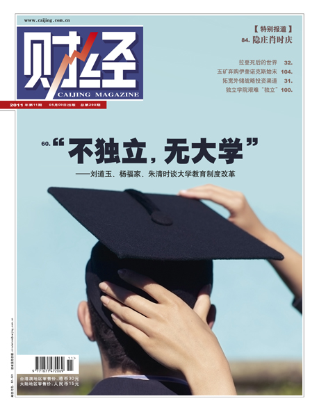
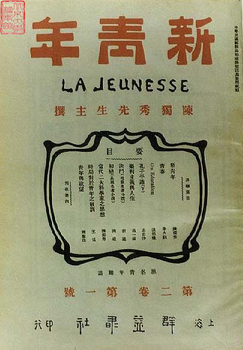
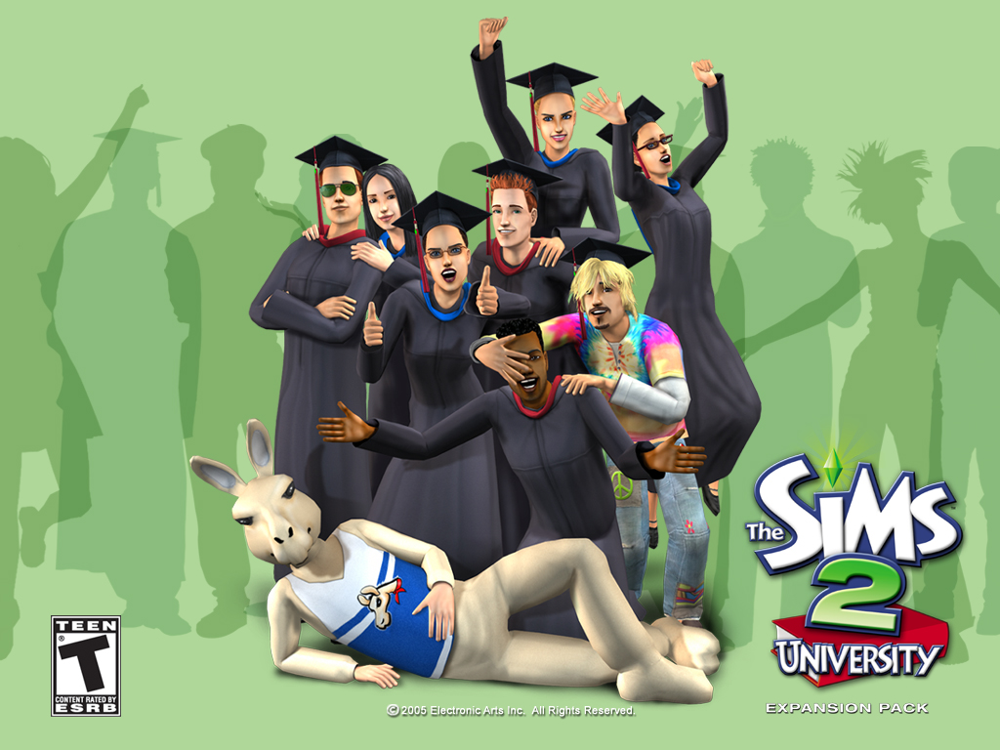

# ＜天枢＞让一切形式的虚伪滚出校园！

**从现在起，抱定正大之宗旨，不为“管理者”之意愿而学习生活，不为组织者之目的而学习生活，不为各色蝇营狗苟之功利而学习生活，只遵从内心之意愿，做自己愿终身追随且有益于社会大众之事。读书也好，社工也罢，欲从事之前，先反躬自省，是否真正内心之选择，是否能尽己之力做到极致。如此，方能不盲不私，方能抱定宗旨，方能于迷惘中求得生活之方向，方能在混乱中寻得生活之真义，方能在日益浮躁的校园当中求得内心之安定充实。**  

# 让一切形式的虚伪滚出校园！

## 文/ 丁灵平（清华大学）

 

“这是最好的时代，也是最糟糕的时代”，狄更斯的这句话，放之今日中国，好得恰如其分；放诸今日中国之大学，亦复如是。姑且不谈国事，只论大学。

昨夜撰文《清华之大，已经放不下一张平静的书桌了！》谈到各种无意义的活动无谓的精力投入占据了太多的生活时间，甚至连安静读书也不能够。

才一发出去，接到远方同学的来电。他才刚进大学，向我抱怨大学里种种社团组织各色党政活动让他的生活混乱无序，茫茫然不知方向。随后又有一位同学表达了同样的感受：“一天到晚忙个不停，但是不知道自己在忙些什么！”

接完电话回来，刚发的日志已经被不少人分享评论，果然不出所料，几句话讲出了不少同学共同的感受，不独清华，中国之大学普遍如此，且由清华北大这样的名校以降，愈发恶劣。这也是在意料之中的事情，“清华尚且如此，其他学校自不待言！”

如此，为什么中国没有世界一流大学，为什么中国的拥有知识储备一流的生源却鲜有一流的产出，乃至在中国本不起眼的大学生一出国就风生水起的问题也就能从一定程度上得到回答了。正如中国结不出苹果，乃是因为没有结出苹果的土壤！

中国的大学生，自入校伊始，便被各种不知其然亦不知其将然的活动充斥了生活，还要被教导曰：“又红又专，全面发展”，仿佛不去参加这些活动，便不是一个全面发展的学生了。殊不知这种全面发展的教育本该是从小抓起，在基础教育阶段便要完成的工作，却被糊里糊涂地放到大学来了。蔡元培先生说，“大学者，研究高深学问者也”，而现今之大学，那些本是要研究高深学问的人，却不得不在形形色色的“不要脑子只要脸”的活动中疲于应付，落到最后，连自己为什么上大学都搞不清楚了！试问这样的学生，将来又如何能够开宗立派勉为大师？试问这样的大学，又如何能够培养出真正的学术大师、兴业之士、治国之才（我甚至觉得，后两者不应该是一个研究型大学的培养目标中的应有之义）？

以上说法，必然有人持反对意见。横向地比较，美国的名校，诸如哈佛斯坦福之类，也有学生会，也有各种社团组织，人家的校园文化同样五彩缤纷，为什么没有影响到它们成为世界一流大学？而纵向地来看，在中国教育史上光耀后世的民国名校，国立北京大学、国立清华大学等，同样不缺少各种学生组织，不缺各异的校园活动，彼时之大学生也不是皓首穷经读书之外不知有物的迂腐书呆子，不还是造就了一大批至今想起来依然神往不已的大师？

这样说来，问题又出在哪儿了呢？我个人觉得，能结出苹果的土壤，首先应该是能够允许奇葩绽放的土壤；能培养出真正意义上的优秀人才的一流大学，必然是一个能让各种不同旨趣的人都能找到自己的存在感的校园。让爱读书的人去专注地读书，让爱做事的人去专注地做事，在最大程度上满足不同志趣的学生的发展需求，大学，至少办好了一半。

但中国大学之事实如何呢？一位同学以福柯笔下的“全景式监狱”作比，“会有各色头目，以关怀的名义监督你，提醒你，告诉你这个要打卡，那个要算活动次数”，学生像是被豢养的牲畜，在围墙之内，丝毫不敢逾矩。从这个角度来看，中国的大学更像是一个管委会，目的在于管好学生而绝非教育好学生，或者，在一些人看来，“教育=管”，中国的教育是管理式的教育、约束式的教育、而绝非独立自由式的教育、解放式的教育。在这种教育制度之下的学生，稍有特立独行者，必然受到来自体系内外的重重阻力，所谓创造力就这样被联合绞杀在摇篮当中。正如苹果的种子入了土，却在刚要发芽的时候，被冰霜风雪无情扼杀。如上所言，名校以降，愈演愈烈！

在这样的校园当中，想要活得自在，活得滋润，便不得不按着“管理者”的意愿，不得不顺从组织的安排，该上的课好好上（这个无可厚非），让你参加的活动“积极参与”，该入党就入党，该加学生会就加学生会。不要说“道不同不相为谋”，你的前途是最重要的；少提独立人格，集体主义才是中华美德。于是我们为了未来着想，为了集体利益着想，便不得不心甘情愿地接受种种“强奸”还要自欺欺人地说我在这样的活动与教育中如何如何得到能力的锻炼思想的升华，不仅被“强奸”，还要“被意淫”一番方才尽兴。

于是狂躁与功利、虚浮与伪善、空虚与迷惘便在大学里泛滥成灾，求真求善求美的大学精神，却渐渐被遗忘被衰朽了，黄钟毁弃，瓦釜雷鸣。而但有敢鸣之黄钟大吕，一想起诸多攸关身家之利益，也惶惶然噤了声。

正如一为同学给我的留言：“很喜欢你的日志，但是作为入党积极份子，学生会成员，以及考虑到素质测评等坑爹的东西，敢怒不敢言”。

初闻此语，难免迁怒于当前的评价体系，如前所言，仿佛不加学生会不入团委不去参加各种巧立名目的形式主义的学生便不是好学生一样。以清华学生最高奖为例，今年清华本科生特等奖学金获得者无一例外均有学生会或团委身份，或曰“体制内”的人。而据说自开特将评比以来，有且仅有一名“体制外”获奖者，呜呼哀哉！

但后来细细思量，如此体系的存在，本为规范多数学生之行为，求利之最大而弊之最小而已，若骤然去之，矫枉过正，不免如用猛药去恶疾，轻则伤身，重则毙命。中国大学之病，当以中医哲学之道而治，缓除渐进，温和改良。中医治病，以正导邪，以阳冲阴，以纯净之血气，渐次替换毒浊之血气。当前大学，亦当依此理而图治。

那么，这样的纯阳正净之气，又当从何而来？希望就在那些早已厌倦了僵化的制度刻板的体系的人身上，在那些早已厌倦了虚伪的应付“酱油”的生活的人身上，在那些对种种限制诸般管教“敢怒不敢言”的人身上。

痼疾已深，但幸而未入膏肓。狗不嫌家贫，子不嫌母丑，当前之中国，纵有千丑万恶，当前中国之教育纵然千般不好万般不是，我们也不应以绝望之态度任其生灭，不应以逃离之态度事不关己，毕竟生斯长斯，毕竟养我育我，每一个生长在这一块土地上的人，皆当以陈寅恪在冯友兰著《中国哲学史》审查报告中所言“理解之同情”的态度，对其未来有所责任感有所思有所行才是。

如此，忍不住想要诚邀上述诸君，从现在起，有所改变、有所秉持、有所坚守，有所求有所不求，有所为有所不为。

从现在起，以彻底的拒不合作之态度，横眉冷对一切形式主义之组织，冷对一切违心参与之活动，冷对一切曲意逢迎之作为。民国报人《大公报》主编张季鸾言办报当“不党”、“不卖”、“不私”、“不盲”，清华亦有“不唯上不唯书只唯实”之传统。我们这些当世青年，自当书生意气挥斥方遒，禀独立之精神、自由之思想，不为虚，只为实；不为伪，只为真；率真为人，全心读书，专注做事。

从现在起，抱定正大之宗旨，不为“管理者”之意愿而学习生活，不为组织者之目的而学习生活，不为各色蝇营狗苟之功利而学习生活，只遵从内心之意愿，做自己愿终身追随且有益于社会大众之事。读书也好，社工也罢，欲从事之前，先反躬自省，是否真正内心之选择，是否能尽己之力做到极致。如此，方能不盲不私，方能抱定宗旨，方能于迷惘中求得生活之方向，方能在混乱中寻得生活之真义，方能在日益浮躁的校园当中求得内心之安定充实。而一人之志明，千万人之志明，则大学之志明；一人之心定，千万人之心定，则大学之心定，则社会之心定。此则大学精神之回归，此则前言所谓“以正导邪”、“以善导恶”、“以美祛丑”之道。

而我们这些倡导此道之青年，必然会受到内外合围之种种压力。可能与当前“又红又专，全面发展”之主流价值观相违逆，可能因此得不到素质测评的高分，可能因此与各种奖学金无缘，甚至可能以未来求职简历之空空而搭上更多损失。但是，一想到我们的坚持是一种淡泊明志宁静致远之追求，一想到我们目今之特立独行的抗争可能为当前虚浮伪善之大学校园注入一丝清风，我们便也有了奋然前行的力量！

戊戌六君子谭嗣同生前有言：“各国变法无不从流血而成，今日中国未闻有因变法而流血者，此国之所以不昌也。有之，请自嗣同始”。前贤之言，后世之效。余心所善，九死不悔！

且以我之前为清华百年校庆所撰长联为此文作结吧：

独立精神，自由思想，持之勿忘，可海涵地负堪称名校；

高远宗旨，淡泊情怀，守而不移，乃博学笃行勉为大师。

我不孤，必有邻！

 

（采编：应宁康；责编：陈锴）

 
