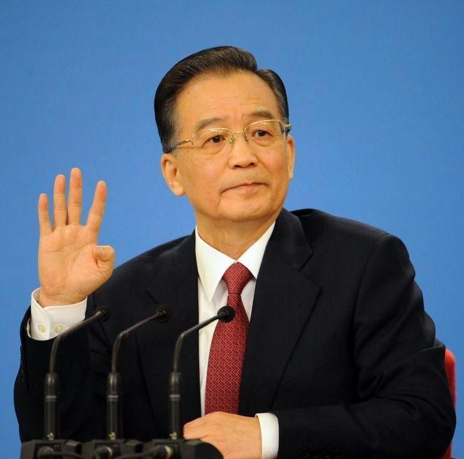
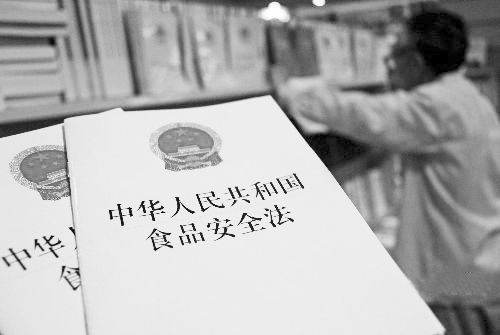
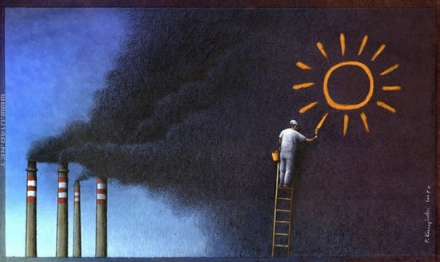

# ＜天枢＞道德的血液浇灌不出食品安全

**美国和日本是东西方社会的典型代表，除了高度发达的经济，人们普遍的道德水准也非常高，如果这样的国家都曾出现过非常严重的食品安全问题，这就说明道德不能保证食品安全，通过让食品生产商提高道德水准来解决食品安全问题，跟让所有人提高道德水准然后直接实现共产主义没有区别，都是痴人说梦！**  

# 道德的血液浇灌不出食品安全

## 文 / 李硕（塔夫斯大学）

 

#### 一、食品安全是什么？

对于现代社会的大部分人来说，食品是一种商品，你可以从不同的商人那里购买食品，而且必须付钱，食品也是一种必需品，没有人可以长期不吃饭还能活下去。与其他商品相比，食品的特殊之处在于它直接关系到大众的身体健康甚至人身安全。此外普通大众对食品的质量、原料、加工环境等等鉴别能力又十分有限。如果很多人买了某一品牌的电视机，大都质量不好很快就坏掉了，这家电视机生产企业很快就会在市场竞争中被淘汰。而食品的质量则难于鉴别，有毒食品如果不是毒性特别强，对人的危害也不是短期内可以观察出来的。比如地沟油，吃很多次也不会死，甚至不会马上生病。鉴于市场在这方面会失灵，所以维护食品安全的责任就落在了政府身上。就好像一个国家的国防、自然环境一样，食品安全是每个人都需要的，并且具有非排他性，换句话说，一个国家的食品安全如果达到了一个较高的水平，那么这个国家的每一个人，上至总统下至乞丐，都能享受的到这种福利，同时食品安全也具有非竞争性，一个人享受到了高水平的食品安全保障，并不会降低别人的食品安全保障。所以说，食品是一种商品，而食品安全是一种公共物品！一个国家的政府有义务为公民提供食品安全保障。 

#### 二、为什么道德不能保证食品安全

 在工业时代到来以前，人类在食物上几乎没有什么选择，而且由于运输条件和保鲜技术的限制，人们吃的大部分食物都产自本地，生产地就是销售地，种类也少得可怜，加工食品则更少了，所以很容易判断出食物质量的好坏，商人欺骗顾客也比较困难。再加上每家生产商的产量很小，销售范围也不可能很广泛，所以难以出现大规模的食品安全问题。当时世界各国对于食品安全都没有一套健全的法律法规。就好像在汽车出现之前不可能有什么复杂的交通法规一样。 随着工业时代的到来，交通运输条件的改善和食品保鲜技术的发展，人们在食物上的选择越来越多，在发达国家的大超市里，你几乎可以买得到来自全世界各国的珍馐美味，在美国，你吃的黄瓜可能是墨西哥产的，蓝莓来自智利，三文鱼则是挪威进口，在某些高级商店，甚至有当天出炉的从巴黎空运过来的法国棍子面包，100刀一根。各种加工食品更是琳琅满目，买回家里放进微波炉就能轻松搞定一顿晚饭。总之，食品的产地离消费者越来越远，食品的原料和加工过程也在鲜脆欲滴的外表下逐渐隐去了真容。尽管如此，美国人对于食品安全还是比较放心的，起码不像中国人那样人心惶惶的。当然，美国的食品安全也并不是从来就这么值得信赖，也有血的教训。 在美国的大规模工业化时期的19世纪末20世纪初，美国的食品安全水平也是极差的，原因嘛，就是因为工业化导致的大规模生产和运输能力为食品行业所利用，化学工业的进展导致的食品添加剂和加工技术的迅猛发展，以及相关法律的空白和滞后。商人嘛，又不是道德家和慈善家，商人的工作就是牟利，而且只要法律不禁止又有利可图的营生，商人就会去做，食品生产商也是商人，自然不能脱俗。消费者的健康显然不是商人商业行为的目的。而且俗话说，不干不净吃了没病，就算吃出病来，消费者也难以顺藤摸瓜追究责任。比如一个黑心肉商，生产劣质香肠谋取利润，单个的消费者不可能因为买到了不干净的香肠就去法院告状，在商人与消费者的关系中，每个消费者的损失都不是很大，但是黑心商人因此积累起来的暴利却很多。再者由于食品的质量难于鉴别，所以有良心的商人为了保证卫生和健康，需要付出更多的成本却得不到更多的回报，这样就会导致有良心的商人被驱逐出市场。当时是，美国食品市场乱象丛生，让人作呕，美国作家厄普顿·辛克莱在他的小说《屠场》中描写道：“工厂把发霉的火腿切碎填入香肠；工人们在肉腚上走来走去并随地吐痰；毒死的老鼠被掺进绞肉机；洗过手的水被配制成调料……” 同样的事情也曾发生在二战之后经济高速增长的日本。如今的日本也跟美国一样，食品安全水平世界一流，但是原来日本可没有什么“食品安全”的神话，“痛痛病”，“水俣病”这种因为饮用食用了被污染了的水源或者其他食物而造成死亡或其它后遗症的公害病是举世闻名的，有关水俣病的诉讼在五十多年后的今天还在进行。 除了这些公害病之外，日本还有人为的食品事故，这些事故不管是在规模还是范围上都能和任何国家所发生的食品安全事故相比，像1955年日本发生的森永砒霜牛奶事件就是因为奶粉中混入砒霜而造成12159人中毒，其中131名死亡；1968年的米糠油事件，中毒人数多达1283名，28名死亡。 美国和日本是东西方社会的典型代表，除了高度发达的经济，人们普遍的道德水准也非常高，如果这样的国家都曾出现过非常严重的食品安全问题，这就说明道德不能保证食品安全，通过让食品生产商提高道德水准来解决食品安全问题，跟让所有人提高道德水准然后直接实现共产主义没有区别，都是痴人说梦！ 前文也已经提到，食品安全是一个国家的公共物品，就好像维护公平和正义需要立法机关和司法机关一样，维护食品安全也需要政府和法律的参与。一个国家不可能靠道德来惩治犯罪维护正义。 

#### 三、如何保证食品安全

新的技术给我们带来便利的同时，也会给我们带来新的问题，但是我们不能因为技术进步产生了食品安全的漏洞就退回到刀耕火种只吃本地食物的时代。自由开放的社会总能找到解决问题的办法，100年前美国爆发的食品安全问题首先就让言论自由派上了用场，当时大批美国的媒体人都投入到揭露社会黑幕的工作中去，史称“扒粪运动”。美国的很多报纸杂志纷纷揭露食品安全的恶劣现状。1906年2月，辛克莱的小说《屠场》甫一问世，美国国内肉类食品的销售量急剧下降，欧洲削减一半从美国进口的肉制品，美国整个畜牧业陷入一片恐慌。而书中暴露的美国肉品加工行业的种种内幕，在新生的城市中产阶级中，引发了对食品安全和卫生的强烈反应。 丑闻因为言论自由和新闻自由而被爆出，紧接着就该民主制度登场了。 首先，民主国家没有特供制度，总统吃的食物跟平民没有什么区别，都是市场上买来的，据说当时的美国总统老罗斯福在白宫边吃早点边读这本小说。读到令人作呕的场景时，罗斯福大叫一声，跳起来，把口中尚未嚼完的食物吐出来，又把盘中剩下的一截香肠用力抛出窗外。罗斯福看过此书后，专门约见了作者辛克莱，并责令美国农业部调查肉联厂的情况。调查的结论是“食品加工的状况令人作呕”。 在舆论的强大压力下，当年6月美国国会即通过了两部联邦法律：食品和药品法案以及肉类检查法案，并建立了以化学家威利博士（Dr. Wiley）为首，共11名专家学者组成的班子，形成了美国食品药品监督管理局（Federal Drug and Food Administration，FDA）的雏形。 作为国家元首和政府首脑，老罗斯福对于美国食品安全问题的关心理所当然，首先，老罗斯福是美国人，他得吃美国的食物，由于没有特供制度，所以美国的食品安全问题直接关系到他本人的身体健康，就是为了他自己他也得努力的去解决问题。再者，就算老罗斯福是铜肠铁胃的金刚不坏之身，作为一个民选总统，就是为了选票和连任他也得在乎民意，为民众解决问题。 100多年后的今天，美国已经建立了世界上最完善的食品安全监管体系，美国负责食品安全的主要联邦管理机构是卫生与人类服务部（DHHS）管辖的食品药物管理局（FDA）、美国农业部（USDA)管辖的食品安全检验署（FSIS）和动植物卫生检验署（APHIS）以及美国环境保护署（EPA）。财政部的海关署根据所提供的指南对进口货物进行检验或偶尔进行扣押，以协助食品安全管理部门的工作。很多部门在其研究、教育、监督、标准制订机构以及在处理突发事件的反应行动中都有其派出机构，包括DHHS疾病控制中心（CDC）和国家卫生研究所（NIH）、USDA 的农业研究署（ARS）、州际研究、教育和推广合作署（CSREES）、农业市场署（AMS）、经济研究署（ERS）、谷物检验、包装和堆料场管理局（GIPSA）、美国法典办公室，以及商业部的国家海洋渔业署（NMFS）。美国在全世界最先实现了HACCP监管，它的的全称是Hazard Analysis Critical Control Point，即危害分析关键控制点。它是一个以预防食品安全为基础的食品安全生产、质量控制的保证体系，由食品的危害分析（Hazard Analysis，HA）和关键控制点（Critical Control Points，CCPs）两部分组成,被国际权威机构认可为控制由食品引起的疾病最有效的方法，被世界上越来越多的国家认为是确保食品安全的有效措施。它是一套对整个食品链（包括原辅材料的生产、食品加工、流通、乃至消费）的每一环节中的物理性、化学性和生物性危害进行分析、控制以及控制效果验证的完整系统。食品法典委员会（CAC)认为HACCP是迄今为止控制食源性危、害的最经济、最有效的手段。 此外，美国的法治也为食品安全提供了保障，比如集团诉讼制度。由于单个消费者遭受的损失很小，但是黑心商人因此获得的利润却很大，所以消费者维护自己权益的动机不如商人谋取不正当利益的动机大，这不要紧，美国的集团诉讼制度允许单个消费者代表所有受到损失的消费者提起诉讼，一旦出现商人不法牟利的情况，消费者都不用捉急，美国那些贪婪的律师就会皇上不急太监急，因为他们一旦帮消费者告赢不法商人就会赚一大笔律师费。这等于说把跟商人打官司的动机放大了并且转嫁到律师的身上，这同时也维护了消费者的权益。不提集团诉讼制度，如果单个消费者的损失很大，比如谁家孩子喝了毒奶粉喝死了，厂家也得赔得倾家荡产。 再看日本，日本的《消费者保护基本法》中明确规定了：“消费者有向国家和地方政府要求国家和地方政府完备有助于保护消费者权利的司法和行政系统的权利”。这句话的意思就是如果发生了消费者权益受到侵害的事件，责任首先是在政府而不是在肇事者。这样政府就必须担负起责任起来整备有关法律和保护食品安全的行政体制，因为不少情况下消费者自己是无法保护食品安全的，比如产地的作假问题，消费者自己几乎无法判断，这时候消费者就有权要求政府保护他们。如果发生了产地作假事件，在弄虚作假的商人受到惩罚之前，消费者首先追究的是政府的责任，因为政府没有保护他们。 

 这个权利是很重要的，这个权利的根本就在于建立了“食品问题上出了问题首先是政府的过失”这个理念。这样既能防止政府在出事之前玩忽职守，也能防止政府在出事之后借惩罚不良商人而转移消费者视线从而推卸责任的做法。最后消费者要求食品安全的权利就转化成了保证食品安全性的系统的实际形成。 可见，要想保证食品安全，一个国家就必须是一个言论自由的国家，一个民主的国家，一个法治的国家，言论自由，民主和法治是食品安全的最根本保障。 

#### 四、为什么中国的食品安全没有保障

中国在环境污染的问题上时常表态：“我们不能走西方国家那样先污染、后治理的道路。”结果中国果断的走上了一条光污染不治理的道路。同样，在食品安全问题上，西方国家走了一条先出现问题、再解决问题的道路。明显地，中国走上了光出现问题、不解决问题的道路。 

 这是为什么呢？因为中国既没有言论自由又没有民主也没有法治。三鹿毒奶粉案爆发之后，政府一直在封锁消息，这是没有言论自由。领导们吃特供食品，全都是无公害绿色的，所以自然没有解决食品安全的动力，然后老百姓也不能因为他们吃特供给他们用选票选下去，这是没有民主。法律不是挡箭牌，所以法治也没有。 解决中国食品安全问题之道，若无以上的保障，而光以道德作为维护正义的权柄，怕是问题不曾解决，又会雪上加霜。  

（采编：管思聪 责编：管思聪）

 
