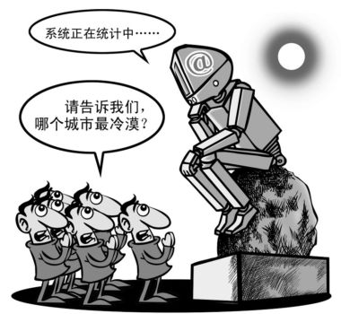
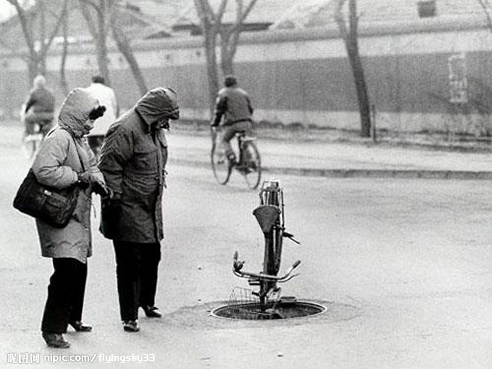

# ＜天枢＞道德领域，权力请退场

**作为个体，我们固然不能从彭宇案中寻找冷漠的共鸣，更不能以制度的丑恶来为自己的冷漠辩护，但无论个体有怎样的缺失，都不是权力介入的理由。政府在道德上的不作为就是对道德最大的贡献；如果能够在民主宪政上更进一步，遏制特权，制约官权，保障公民宪法权利，那就更是善莫大焉。但，道德领域，权力请退场。** 

# 道德领域，权力请退场

## 文/张凯阳（华中科技）

 

两岁女童被车辆二度碾压，十八路人的冷漠不施救让所有人胆寒的同时，也看到潜伏在自己身上的路人影子。因此，民间对此次事件反思更多的是思及自身，每一个富有道德感的人都会扪心自问：倘若自己在场，又会怎么办？能否真的如拾荒阿姨那般伸出自己的援手？

可以说，这一次的反思不同于寻常。之前充斥于媒体的救人反被讹诈的案例使人一再想起那将道德打入死牢的彭宇案，并纷纷援引彭宇案来为自己的道德冷漠加以辩护。而这一次，人们不再从彭宇案中来寻找冷漠的共鸣，而是反躬自身，对自己进行道德的叩问。

然而，当公众一反常规地将责任归为自己的时候，一向被视为问题症结的政府所欣欣然地抓住了机会。广东十部门组织“谴责见死不救行为，倡导见义勇为精神”大讨论，并提出对见死不救进行立法处罚，一时间得到众声响应。同时，温家宝主持召开国务院常务会议，会议指出，当前社会诚信缺失问题相当突出，要求重视社会诚信和信用体系建设。

一时间，批判逻辑转了一个方向。政府似乎在一瞬间突然充满了强烈的道德正义感，它痛感社会道德诚信的缺失，痛感民间路人的冷漠，既要对见死不救的行为进行谴责，还要力图规划和规范社会的道德建设。在这种逻辑的引导之下，政府撇清了自身对社会道德败坏不可推卸的责任——问题是社会的，是路人的，而自己仿佛成了一个超然的存在，再次拥有了对道德的生杀予夺大权，再次高傲上阵对群氓进行道德的审判和劝诱。自己做了坏事，却将责任全部推给受害者，还有什么比这更荒诞滑稽？

民间道德再糟糕，也轮不到权力来指手画脚。过往几十年的历史早已证明，权力规范道德的时代只会带来道德伦理的衰败，因为道德感有赖于内心的体悟而非权力的强制，道德习俗的形成有赖于民间社会的发展与互动而非依靠权力强制的推广，它需要的是自由、宽容的社会空间。而权力试图将自认为好的东西强加到民众的头上，且不说什么是好的一个缺乏人格政府根本就无从判断，即使这个政府能够判断清楚，它又有何理由代替普通个人进行选择？更为重要的是，伴随着权力规划的道德通常都是具有强制性的，个人丝毫没有选择的权利，这样的道德只可能是基于恐惧畏于暴力的道德，恐惧一旦解除，道德也将全盘崩溃。文革及之后的经历难道还不足以说明一切？

况且，一个社会的道德败坏，权力是难辞其咎的。没有什么比权力自身的不受约束对道德的危害更为严重了，也没有什么比官德的堕落更能给民间社会带来坏的示范效应了。当权力不受限制，以致特权横行，寻租泛滥，商人以勾结官府为谋利的主要手段，一般民众也自然视傍官为成功的终南捷径，以腐败的手段获取成功成为糜烂于社会的潜规则。这意味通过侵犯他人的权利而获益已成为这个社会秘而不宣却又人尽皆知的潜规则。没有规则，没有原则，没有底线，哪还有什么公共生活可言？人人要么追逐于权力，投合社会运转的现实法则，要么视犬儒为高明的生存策略，能贪则贪，而他人之事则高高挂起。这种种道德的缺失哪一个与权力无关？

这种本身就充满污点的权力有什么资格充当社会道德的教化者？被贪腐丑闻缠身的官员又有何德何能来代替民众决定道德的好坏？谁都有权批判路人冷漠，谁都有权痛斥道德败坏，谁都有权将自己摆在审判台上，但唯独这个政府不能，不仅是因为没有权力，更是因为不配资格。

有什么样的制度就有什么样的道德固然过于绝对，然而，好的制度虽然不足以完全带来有尊严的公共生活，但在坏制度下根本就没有公共生活可言，有的话，也是文革那种被剥夺了沉默权的使父子亲朋成为仇雠的每个人都难以逃脱的“公共生活”，这样的生活毫无道德可言，更别奢谈尊严。

如果制度的重建在当下不可能，那么首先必须认清坏的制度才是道德败坏的根源。持续不断的运动破坏了这个社会的信任基础，文革之后非但没有来得及加以修复，反而通过市场经济——不，不是市场经济，而是权力与资本苟合的伪市场经济——加速了其堕落。在这一过程中，彭宇案则不过是最后一根稻草。

如果有尊严的公共生活在当下难以形成，那么我们也必须先开拓我们的公共生活空间。只有民间社会强大起来，权力才不能肆无忌惮地侵入到我们生活的任何一个角落；只要民间社会有充盈的活力，这个社会的信任基础总有复建的可能。有句话说，你怎样，这个国家就怎样，这绝非煽情的道德空言，而是一个不正常的社会向正常迈进残留的希望。

如果冷漠、犬儒仍然是生活的常态，那么我们也应该严词拒绝权力的介入。不论是设立见义勇为奖，还是对见死不救者进行惩处，无论国外有怎样的案例，你要明白，对于一个滥权的政府来说，法律都只是他们随意指使的工具，每一条具有争议的法律的设立都会让你在未来的某个时候付出代价。尤其要区分清楚，道德是道德，法律是法律，法律可以降低救人的风险，但不能利用法律的强制力使人因恐惧而开始救人，这即便是道德，也是最坏的道德，更不能以法律代替道德。

在文章的最后，仍需要再次提醒：作为个体，我们固然不能从彭宇案中寻找冷漠的共鸣，更不能以制度的丑恶来为自己的冷漠辩护，但无论个体有怎样的缺失，都不是权力介入的理由。政府在道德上的不作为就是对道德最大的贡献；如果能够在民主宪政上更进一步，遏制特权，制约官权，保障公民宪法权利，那就更是善莫大焉。但，道德领域，权力请退场！

 

（采编：佛冉；责编：黄理罡）

 
