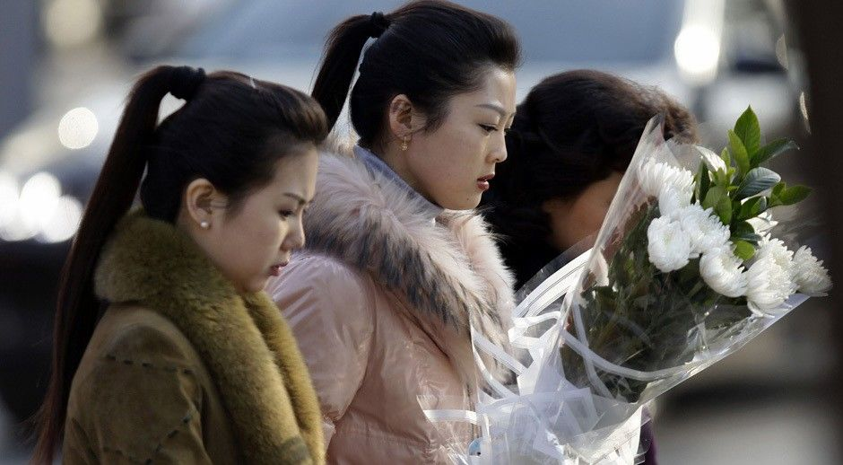
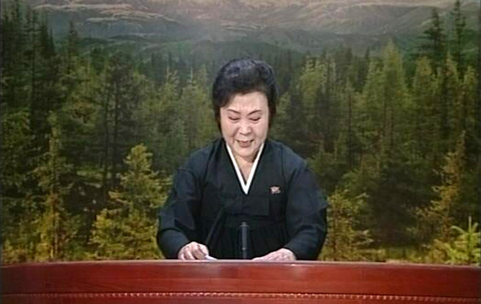
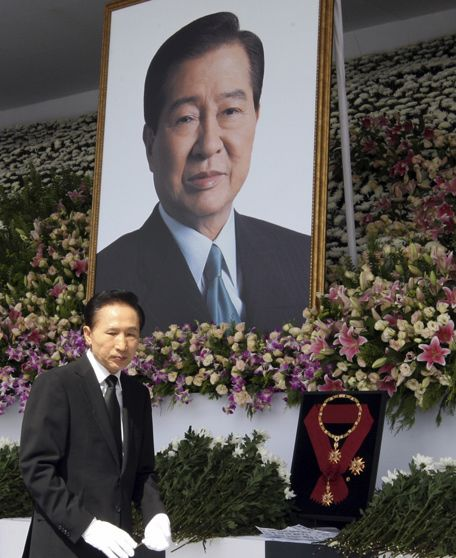
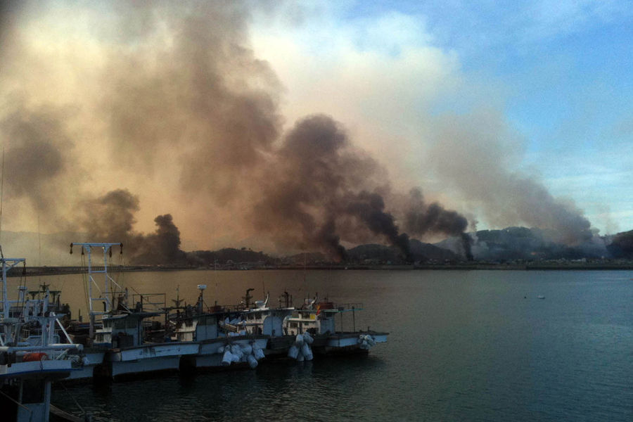
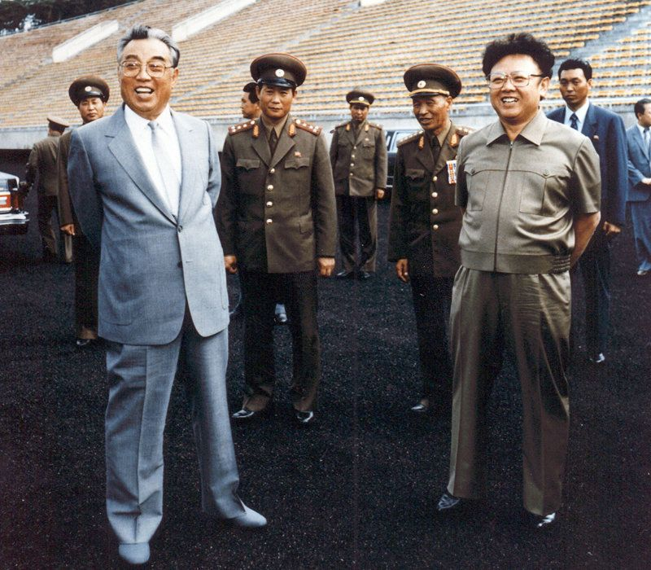

# ＜天枢＞金正日死去是沉寂的东亚格局的重要新变量——不是“段子”的分析文一枚

**所以金正日的死去，对中国而言就是困难的危机管理，是大麻烦一件。本来中国因为其咄咄逼人的扩张主义行为，在外交上陷入空前的孤立。而美国重返亚洲的大棋局剑指何方不言自明。在这种条件下，朝鲜从好歹凑合能用的战略缓冲变成时刻可能爆发的麻烦炸弹，对中国的打击不可谓不小。** 

# 金正日死去是沉寂的东亚格局的重要新变量

# ——不是“段子”的分析文一枚

## 文/ 陆遥遥（北斗撰稿人）

 

“我们如果仅仅生活在嘲讽伪真理、假崇高的嬉笑之中，就不可能真正有效地改善精神状态。”

赞同并且感谢姜戬所引述的言说。的确，我们不缺乏，甚至太多各种段子了。无论是对现在领导人的调侃，还是乌坎事件，还是统独问题，等等。我无意在解构当局的同时解构解构当局的人，但我认为我们还是需要思考者。我选择做孤独的思考者。

国民的悔罪是必要的，国民的觉醒也是必要的，国民的思考更是必要的。但考察二战后联邦德国的公民悔罪和反思，使我认识到：国民的整体觉悟其实是民主化（在德国则是宪政重建）的结果，而非其原因。即不是人变了体制才变，而是体制变了人才能变——这不是政治哲学的结论，而是历史方法论观察的结果。

民主化的原因有很多，其中必要而不充分的就是知识分子履行自己思考和启蒙的道义责任。我还是有一种母国忠诚感觉的，选择效忠历史和文化的the whole China，所以我会履行这个知识分子的道义责任。

是为借题发挥的序言。

#### 一、关于金正日死去的迷思

按照朝鲜官方的说法，金正日长期患有严重的心脑疾病，因心脏病突然去世，符合一般所周知的朝鲜领导人的健康状况。

不过韩国媒体长期做对北观察却发现并报道，两个月来朝鲜最资深的播音员李春姬从荧幕消失了。当时韩国媒体研判，朝鲜可能发生了什么？当然，韩国媒体的研判正确率一直偏低。敏感度和正确率总是对立的，可以理解。所以读到那则报道时，我也没有在意。

直到今天李春姬出面播发了金正日的讣告，我感到很费解。她为什么消失了两月余？若是个人原因未免太巧了。大概可以做出两个解读：①李春姬因个人原因休假，但遭遇重大变故，所以被征召回工作岗位；②一段时间来她都在准备播报讣告，也就是说金正日突然死在一段时间之前，但政界为了新体制讨价还价，所以推迟了讣告发出的时间。我想第二种解读更合理一些。

熟悉国际情报战史的人士可能知道，比如尾崎秀实获得日军奇袭珍珠港那样的重大情报，往往不是靠从最直接的情报源获得，而是靠长期的观察积累加研判加低保密级别的辅助性情报获得的。

这也就带出了第二个问题，金正日死后的朝鲜是怎样的？

#### 二、金正日死后朝鲜的政局

诡异就在于金正日开启了三代世袭的准备工作，但很显然这种准备还不完备。

现在朝鲜存在少主金正恩、军部的实际领导者李英镐、党务部门的实际负责人张成泽夫妇、政务部门技术官僚的代表金永南之间的权力博弈。

金正恩虽然已经就任军委副主席，但军队负责人的脸都没有认全，不要说结下深厚关系了。朝鲜还是个前现代国家，即国家的政治主要不靠制度，而靠人。金日成完成政治大清洗，最后建立一人独裁体制，依靠的是他和游击队派战友的深厚情谊。金正日上台也因为掌握军权的游击队派元老的力保。现在游击队派已经凋零，金正日本人和军队直接领导人的关系属于“太子党”间的情谊，能否被金正恩继承，值得怀疑。且金正恩本人党内职务只有中央委员，尚未完全就位，离所谓太子监国的地位还是比较遥远的。

李英镐以政治局常委、军委副主席的身份兼任总参谋长，是朝鲜军部的最高领导人。

张成泽身为中央委员、部长，其妻子是金正日的同母妹妹金敬姬——也是政治局委员。张成泽自金日成时代开始就长期在中央政务、党务系统任职，一段时间被称为朝鲜仅次于金正日二号人物。2010年朝鲜构成新领导层时，他的地位下降，但其妻子从幕后走到台前，起夫妻档的实权并未削弱。

金永南资历较老，是金日成亲手提拔的干部，从外交部门逐步升迁到现在的名义的国家元首。但普遍认为他是个没有实权的礼仪性职位负责人，一如文革后期的朱德委员长。但朝鲜的政务系统和军部关系向来不睦，特别是外交系统与强硬的军部时常发生矛盾。所以代表技术性政务官僚的金永南以政治局常委之尊，政治影响力不容小觑。 以上四种力量如何维持平衡，准确地说就是能否维持平衡，值得关注。对此，笔者持他们将很快陷入混乱的观点。第一部分的分析部分地印证了笔者对朝鲜领导层比较混乱的猜测，当然第一部分也是猜测而已。

不过，朝鲜的政治斗争向来都是零和的，没有妥协的习惯。对张成泽、金永南、李英镐等老人来说，金正日把自己叔父金哲柱流放山区的殷鉴不远，所以效忠金正恩或者内斗而被金正恩利用各个击破的可能性较小。从朝鲜国内力量对比出发，合理的猜测是，金正恩长期被架空，军部实现独裁，更加推行军国体制，直至国家走向崩溃。党务官员可能选择引入中国（本文中的中国除特别说明外一律指中华人民共和国）势力，部分人可能会选择引入韩国势力。

如金大中所说，朝鲜半岛仿佛风筝一样，死角分别是中美俄日，讨论朝鲜问题离开东亚的国际战略和地缘政治，那是不行的。

#### 三、金正日死去对东亚的影响

中国对后金正日体制的态度最为明朗。中朝友好互助条约在2001年自动延续了20年，对这个冷战时期的军事同盟条约，中方之所以不提出任何修改或终止要求，而选择继续保持对朝鲜的盟国保护义务，就因为条约第二条的描述：“缔约双方保证共同采取一切措施，防止任何国家对缔约双方的任何一方的侵略。一旦缔约一方受到任何一个国家的或者几个国家联合的武装进攻，因而处于战争状态时，缔约另一方应立即尽其全力给予军事及其他援助。”隐含了中国在朝鲜陷入混乱时可以拼凑一个亲中政府，然后“应邀”介入朝鲜的可能性。

所以中国的朝鲜政策是相当明确的，那就是反对朝鲜挑起战争，也反对朝鲜国家的消亡。

所以金正日的死去，对中国而言就是困难的危机管理，是大麻烦一件。本来中国因为其咄咄逼人的扩张主义行为，在外交上陷入空前的孤立。而美国重返亚洲的大棋局剑指何方不言自明。在这种条件下，朝鲜从好歹凑合能用的战略缓冲变成时刻可能爆发的麻烦炸弹，对中国的打击不可谓不小。

有友人问朝鲜局势发生巨变，从长远看是否有利于中国的利益。对此一并回答：我只能说，有利于解构中华人民共和国。至于解构中华人民共和国是否有利于历史和文化的the whole China，是否有利于主权所在的中华人民共和国人民，这是见仁见智的问题。我持乐观的观点。

至于韩国，人民必须庆幸现在的韩国总统是李明博——笔者喜欢按照韩语发音称呼他伊明霸先生，而不是之前的卢武铉——在韩语中卢发音为no，所以人们戏称这位总统为Mr. No。

金大中发起并经卢武铉坚持的美其名曰阳光政策的绥靖政策，已被历史证明既没能帮助朝鲜人民，也没能帮助韩国的国家安全，更无助于使朝鲜放弃军国主义政策——虽然金大中称阳光政策的核心目的在使朝鲜去武装化，而在公众的眼中阳光政策已经变成无原则和平主义和慈善活动的代称，已经不是一个国家战略了。

在阳光政策期间，朝鲜成功发展了核武器。实际上韩国政府对朝鲜采取一闹就给钱，大闹大给钱的政策，沦为国际社会的笑柄。

伊明霸先生在天安号事件和延坪岛遭炮袭后，开始明确放弃阳光政策，转而采取底线明确的威慑态度。所谓底线明确就是，我们虽然反对朝鲜政权，但并不会军事北进；但如果朝鲜敢于挑衅，我们会果断惩罚——以前的防卫政策只是防卫，不包括惩罚；同时惩罚是有限的，成比例的；但如果朝鲜发动全面战争，我们也不怕！这就是笔者对伊明霸政权对北军事政策的总结，正确与否，可以批评。

延坪岛遭炮袭后，朝鲜口说什么韩国侵犯我们的领海哪怕只有0.01厘米，我们也要坚决还击。而韩国果断恢复向争议水域附近演习后，朝鲜就蔫了。其原因自然不是朝鲜领导人的慈悲，而是准航母世宗大王舰等海军力量就在附近海域游弋，空军已经在带弹巡航，韩国的国防力量枕戈待旦，在强大的敌人面前，朝鲜蔫了。

朝鲜很明白自己的军事实力，所以他恫吓韩国的言辞总是“首尔会变成火海等等你也会死得很惨哟亲”式的词句。其潜台词就是，朝鲜知道自己会死得很惨。对于朝鲜来说最大的利益就是保护体制，所以除非体制出现崩溃的可能，唯一的机会就是战争，他们下不了对南战争的政治决心。金日成是，金正日也是，后继的领导人更是。

可正因为如此，事实上韩国最介意的不是朝鲜体制如何坏，而是这个坏的体制会不会出现不确定性。所以阳关政策也好，表面上是说希望援助能使朝鲜脱下外套——即军备，和平统一，其实韩国的主流民意和统治集团都不想为和平统一后拉平经济差距而出钱。所以阳光政策的实质就是希望朝鲜改革开放成正常国家，然后让韩国人去投资、旅游一如他们在中国那样。

但是这种绥靖政策的最大问题在于，朝鲜几乎没有机会变成正常国家。而如果朝鲜陷入混乱，无论是几百万难民潮，还是军事政权的疯狂行为，都不会因为韩国说你们在国际法上是外国，所以你们自己闹去吧而放过韩国。所以对韩国来说，最符合国家利益的举动就是抓住金正日死朝鲜不稳定的机会，果断进行北进统一，当然北进统一主要不是靠军事，而是靠文宣、策反朝鲜高层领导等等。但一定要求军事北进的觉悟。否则，重要的也是唯一的统一机会白白流失不说，韩国本身也可能被葬送。

笔者认为，韩国北进统一是有利于解构中华人民共和国的，与中国的国家利益尖锐对立，因此也是符合美国战略利益的，会得到美国的支持；但却是有利于主权所在的中华人民共和国人民的，从长远看也是有利于the whole China的。

在延坪岛被炮袭后，李明博宣布进入统一元年，他是想要做出政策调整的，也是想北进统一的，但作为民主国家韩国调整既有战略形成新的国家意志实在太难了。

#### 四、金正日死去对中国——包括中华民国的the whole China的影响

令人感到讶异的，笔者的数名台湾朋友都对金正日的去世感到某种恐慌。有的是作为军人担心发生战争，有的是担心台湾被中华人民共和国统一的进程会加快……

笔者认为，固然现在发动统一台湾的战争最符合中华人民共和国的利益。因为：①韩国陷在北方的战略不稳定中不能自拔，美军在东亚的战略存在是日韩——东北亚高于东南亚的，所以此时——很短的时间内，不会抽身他顾，不会在中国对台湾动手时从韩国、日本调兵遣将去保护台湾。②如果对台湾动武，可以迅速把日益尖锐的中国国内矛盾向外转移，可以使得国家政权把握民族主义的大气，在日益民粹和军国主义思潮的中国民间凝聚起巨大拥戴，可以用军事体制大手整肃异己，把他们堂而皇之地打成汉奸，起到“人民江山的万万年”的奇效。

这也就是台湾朋友担心的原因吧。

但笔者却觉得中华人民共和国下不了这个政治决心。统治者现在正在玩着击鼓传花的游戏，等着看定时炸弹爆炸在谁的手中，总之我死之后哪怕洪水滔天。

但总之就是，民主就像洪水，你开门它要进来，关门它也要进来。而金正日的死去，在笔者看来，这是一个有利于加速这一进程的重要变量，因此感到高兴。当然对作为个体的金正日先生，他毕竟是出生在抗日军旅——哈巴罗夫斯克郊区的人，顺祝冥福。

（采编：应宁康；责编：陈锴）

 
