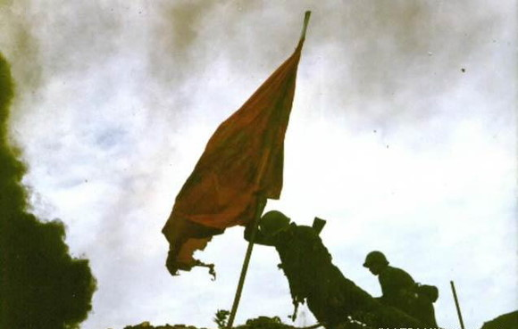
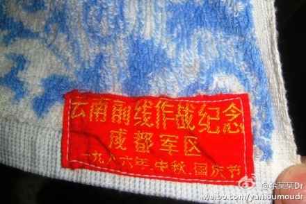

# ＜天枢＞钓鱼岛、老山、爱国

**在中国军队胜利收复老山领土后，作家韩静霆以此为背景写了本小说《凯旋在子夜》。结尾处双目失明的战斗英雄童川对恋人江曼说：“现在我是英雄，走在那里都是鲜花和掌声，是赞美和歌颂。可是若干年后，国际形势发生变化，还有多少人能记得我们……”果然，小说中的这句话在多年后一语成谶。**  

# 钓鱼岛、老山、爱国

## 文/余某某

 

#### 一

自2012年以来，日本在钓鱼岛问题上对中国的挑衅日益升温，从非法抓扣中国香港保钓人士到上演“购买”钓鱼岛闹剧，不断刺激着中国人的神经。“一寸国土一寸金，一寸山河一寸血”，钓鱼岛自然钓出了部分国人的爱国情绪，国内的很多城市均出现规模不一的群众聚集，抗议日本抢占钓鱼岛，高喊抵制日货的口号等。当然，也有少数被称为“爱国贼”的过激者，直接打砸日产车辆，打砸日资商铺。

少数“爱国贼”的过激行为固然不能赞同。可“公知”们从对“爱国贼”的批评所衍生出的对爱国行为的讽刺和否定，却很值得玩味。在“公知”眼中，中国人的爱国情绪，或是因为爱国主义“洗脑教育”把人“洗残”了所致；或是因为一百年前的“义和团”的思维依然荡涤着当代中国人“愚昧”的神经所致。还有更多的公知，则直接把矛头指向当局，认为是当局拿着爱国主义大旗“操弄”民众借以转移对现实的不满。所有表现出爱国情绪的民众，都是被“政治手淫”所操弄的对象，而民众的爱国情绪，则只是“政治手淫”状态下的“射精”而已。

事实上， “公知”们今天的这些说法一点也不新鲜。在我记忆中，1999年《华夏文摘》的主笔何碧就以一篇《关于爱国的“天问”》几乎囊括了今天“公知”们几乎所有否定的爱国主义的论调。他说到，“说穿了，我们的爱国主义，其实只是‘夜郎综合征’的一种表现。”当看到别国比自己好时，只好“惊怒妒羡之余，只有缩回心造的幻影中去，靠膜拜那个虚构出来的伟大祖国来寻求心理平衡。实在无法逃避现实之时，就把一切责任赖到别人头上，似乎整个世界都约齐了来欺负自己。”而“近年来，当局为转移民众对内政的注意，一直在进行密集的民族主义洗脑，将百年前受的屈辱幻化为现实，全国便又一次成了精神病院。”“不抛弃狭隘愚昧虚伪的‘爱国主义’，我们就只会象与风车作战的堂吉诃德，被旋翼一下又一下地打得头破血流，周而复始，七、八年又来一次。”不得不承认，从文字角度而言，这篇文章无疑是文笔优美，论点鲜明。加之正逢美国炸了中国驻南联盟大使馆，所以一时间产生了“洛阳纸贵”的轰动效果。

当然，何碧之流当年所产生的影响，还是远没有今天的“公知”炒其剩饭影响大。正如鲁迅所说，中国大多数人永远只是在需要爱国时扮演着“看客”的角色。“牺牲上场，如果显得慷慨，他们就看了悲壮剧；如果显得觳觫，他们就看了滑稽剧”。当年没有微博，网络也才刚刚兴起，“看客”们没法跟帖、转发和互动。今日的“看客”，则可以边刷着手机屏幕边抒发着他们对“义和团”、“文革”的不满；边刷屏边抒发着他们不愿意 “被洗脑”、“被操纵”的“雄心壮志”；边刷屏边转发着“钓鱼岛内幕”，以彰显着自己的“智慧”….

最近，“公知”们很喜欢引用克里希那穆提的话“在有智慧的地方没有民族主义和爱国主义”。因为把这句话vice versa则意味着有民族主义和爱国主义的地方没有智慧。我想，这正是“公知”们想要表达的意思。我相信多数人和我一样，听到克里希那穆提这名字时一定甚感陌生。说实话，最开始我还以为是某位古希腊某位圣贤先哲，最后查了下，才知道仅是上世纪印度的一位宗教领袖而已。虽说这位宗教领袖不如本拉登、麻原彰晃般的极端，但也是一位很“通灵”、认为自己“菩萨转世”般的人物。在“公知”看来，很有必要发扬下戈培尔“谎言重复一百次就会成为真理”的精神，把这位神人的话（还是推衍的意思）变成“真理”。因为这句话在他们看来很有杀伤力。

世界上许多国家都有领土争端，但纵观之，各国民众在领土问题上无不秉持着“未收皇土河湟地，不拟回头望故乡”的共识。而似乎只有中国历来最喜欢拿“被洗脑”、“被操弄”说事，因为中国历来都有“智慧”的“公知”。不知按照“公知”的标准，要这么说来，世界上公认的最智慧的犹太人是不是已经属于“被洗脑”至“脑瘫”级别了，而犹太人更是年复一年被人拿领土问题“操弄”，不仅以色列自己的政客在“操弄”，美国人还帮着“操弄”。

#### 二

有位著名的“公知”茅于轼先生，在钓鱼岛问题升级后，发出了“痛心疾首”的呼喊“钓鱼岛是个不毛之地，不产生税收，没有GDP，不值得折腾，更不值得发动战争去争夺。”“应派企业家去谈钓鱼岛问题，政治家不该去谈。”“俄、韩领导人的登争议岛屿行为，是惹事、缺乏远见。” 我想，茅老言外之意还是我们正受着政治家的“操弄”。谁都知道，钓鱼岛不产生税收、没有GDP（钓鱼岛周围是否有石油尚难以证实），但难道世上只能唯GDP是举吗？

现在，钓鱼岛这座著名的不产GDP的岛牵动着中国人的神经，二十年后，它会不会被人遗忘，我不知道。可我知道，二十多年前，还有座不产GDP的山同样牵动着中国人的神经，它叫老山，位于云南，但现在它已渐渐地被人淡忘了。或许，这是因为这座不产GDP的山在1980年代中期最终被中国军人用血肉之躯从强占者手中夺了回来，这批军人中包括了我的父亲。

时光倒退到1979年，中国终于摆脱了文革内乱的阴霾，拉开了如春潮般的改革开放和经济建设的序幕。就个人和家庭而言，序幕拉开后，这个改变命运的大时代舞台上后来演绎出了无数商场暴发、仕途跃迁、学业精进的传奇。

当然，从内心层面而言，那个时代的中国年轻人可能比现在还要迷茫。1980年《中国青年》刊登的一封署名为潘晓的信《人生的路呵，怎么越走越窄》表达出了改革开放初期对未来的惶惑和担忧，引起了全国范围的共鸣。的确，当毛泽东被人们从神坛上请下，当年狂热的共产主义浪漫理想变得那么得遥不可及和不切实际，上山下乡的知识青年突然有了种被欺骗的感觉，而改革开放后的新的政策和旧的观念相冲突，使许多人无所适从，引发了对前途命运的担忧。那个年代，也开启了中国大规模的出国潮。改革开放后第一批留学生是否是因为想逃离这个让他们迷茫的中国而选择留学，联系时代的背景，这觉得这是很有可能的。

在那个迷茫的年代，云南的老山进入了中国人的视线。和钓鱼岛被日本强占一样，当时的老山被越南人强占着。虽然当年的媒体远没有今天这般的发达，但由于拨乱反正的需要，当年的舆论反而比较自由。那时候就有一批人，不遗余力地说当局在“操弄”愤青，制造中越紧张对峙关系，以领土问题转移国人对改革开放初期出现的种种社会的不满。甚至，有些人在当时更直接推断，中越之间的领土冲突，是当局为获取政权合法性而采取的手段。这批人，大约可以视为中国最早的一批“公知”。

好在父亲那辈军人的爱国真的是发自内心的。当年一声令下，让他们奔赴老山前线时，他们是那样的义无反顾。谁没有感情，谁没有亲情。那时，我已出生。我知道父亲当年一定非常的不舍。谁都知道参战可能流血，参战可能骨肉分离、天各一方。当喝下壮行酒，座上南下的闷罐车，前方就是越军疯狂的炮火，布满地雷、竹尖陷阱和异族仇恨的征程。除此以外，还要面对缺水少食的困境，炎热潮湿的气候，以及蚊虫跳蚤蝎子的骚扰，以及易生难愈的皮肤病。

对于那段战争岁月，父亲也不愿过多提起，我过去也很难真正体会到父辈最真实的爱国的情怀。在我看来，书本里的爱国主义，或多或少有些宏观，缺乏打动人的细节。直到去年的某一天，一张旧浴巾才让我近距离地感受到了一种有血有肉的爱国。那时，我因为要找一条去健身房用的浴巾，偶然在柜子的最底层翻出了一条旧浴巾。浴巾右下角缝着“云南前线作战纪念”的红布条。我拿着它找到父亲，平时沉默寡言的他陷入了久久的沉思，最后他告诉我，当年首长发浴巾给他们时就说，“这个浴巾是很有用的，流汗可以拿它擦汗，死了可以拿它裹尸”。我很难想象，如果当时的场景换成首长给我发条浴巾，并告诉我这是给你裹尸用的，自己会是什么样的反应。但父亲告诉我，他当时的想法很简单，越南人占了中国的老山，这是中国的领土，作为军人就要把它夺回来，并且守好。这条浴巾是有用的，就拿着它。我曾觉得父亲不善言谈，但这句关于爱国的大白话不由地让我为之一震。

2012年8月15日下午，载有14名香港保钓人士的“启丰二号”保钓船进入钓鱼岛海域，7名保钓人士携带五星红旗、台湾、香港和澳门地区的旗帜登上钓鱼岛。随后，微博上“公知”的各种言论炸开了锅。有嘲讽当局的（批判报纸截去青天白日旗），有抛阴谋论的，有抛当局“操纵”论的…

这天，父亲给我讲了一个真实的故事。故事的主人公叫张大权，父亲的战友。1984年4月28日中国军队夺回老山的战役中，是他把象征中国主权的八一军旗插在的老山主峰之上。那个年代，中越双方空军力量都不强，主要是陆军的厮杀，因而更加血腥。父辈军人为夺回属于中国的老山，只能靠拼爱国精神，拼勇敢，拼牺牲。张大权是当年的敢死队队长，在几轮冲锋后，他最终把那面布满弹孔浸满了鲜血的军旗稳稳地插在了老山主峰之上。随军记者用相机记录下了这个永恒的瞬间。此时，他已经牺牲了，他的胸部已经被弹片打烂，腹部已经被子弹击穿。然而，他的身躯仍然牢牢地支撑着的这面旗帜，岿然不动。

我相信在当今，绝大多数人都没有听说过张大权的名字。甚至绝大多数80、90后也不知道中国近30年内还有过战争，并且成功地收回了被占的领土。张大权烈士长眠的麻栗坡烈士陵园，如今也已是杂草丛生。在“公知”眼中，“捐躯赴国难，视死忽如归”捍卫领土完整的勇士亦不重要，他们只是被暴政的政权所“操纵”的牺牲品。“公知”所关注的，永远只是谩骂当局，只要对他们谩骂、吸引眼球有利，所有的题材他们都能用。领土完整不重要，爱国也不重要，不当“炮灰”最重要。所以，有钱人最好移民、没钱的人就坐着等死，反正“爱国”就是被当局“操弄”。

#### 三

中国的对越自卫反击战，其政治意义，诸如通过战争打开了国门，开始与西方国家战略合作，为对外开放奠基等。我也不做论证。倒是有一点值得肯定，越南抢占的陆上领土全部夺回，之后的20年，周围各国明着抢中国领土的事情没有发生（直到菲律宾跳出来）。

当然，有关领土的战争是残酷的，这影响着战争中的人，也影响着战后的人。

在中国军队胜利收复老山领土后，作家韩静霆以此为背景写了本小说《凯旋在子夜》。结尾处双目失明的战斗英雄童川对恋人江曼说：“现在我是英雄，走在那里都是鲜花和掌声，是赞美和歌颂。可是若干年后，国际形势发生变化，还有多少人能记得我们……”果然，小说中的这句话在多年后一语成谶。

参加过这场收复领土作战的父辈军人，今天仍在部队的官阶普遍不算很高；回到地方，虽有不少人被照顾进国有企业和集体企业工作，但在步入中年后遭遇国企改革，多数凄然下岗。因伤残疾的，很多陷入绝对贫困，留下一个个不忍卒读的故事。

2001年6月13日的《人民日报》有篇通讯《交警与特困生》，写的是安徽六安独山镇长生桥村杨志伦考上省级重点中学，却付不起每学期五六百元的学杂费，被迫选择退学。他父亲在1979年对越战争中负伤致残，拖着残躯在一家建筑工地烧饭，母亲在黄土地里刨食，实在无钱弄钱供小杨读书。六安市交警一大队闻讯，受到“强烈的震撼”，决定与杨志伦签订助学协议，提供他在高中的学杂费，直到考取大学。小杨高考被安徽大学录取后，民警们兴高采烈地开着车，沿着崎岖山路驶到杨家，送来助孩子入学的捐款，整个山村沸腾了！ 这篇《交警与特困生》，与其说是一篇交警助人为乐的表扬稿，不如说是一篇越战老兵余生的凄凉写照。

2004年起，一段《妈妈，我等了你二十年》的视频帖[http://v.youku.com/v_show/id_XMzI0MDcyODY0.html](http://v.youku.com/v_show/id_XMzI0MDcyODY0.html)开始在网络论坛转帖流传。讲的是1984年，年仅19岁的赵占英的烈士在老山牺牲；烈士母亲由于家庭贫寒，一直没有机会从昆明附近的嵩明县终于来到麻栗坡祭奠。嵩明县和麻栗坡都在云南省内，相距不算太远，但这位母亲竟然等了整整20年！最后还是靠当地政府近年来专门拨付给烈士家属的祭奠费用，才得以到边境为儿子上香！发帖人最后不无酸楚地写道：“这是她第一次来，也许是最后一次了……”

跟众多在参加过守土战斗的老兵的家庭相比，我的家庭无疑是幸运的。虽不富裕，但也不至于陷入绝对贫困。我一直有幸不停地读书、考学，不至于因生活所迫而终止学业。我也曾抱怨过中国的现实，而父亲许多战友窘迫的生活，也让我曾经怀疑过父辈当年发自内心的爱国情怀。

有一次，我很直接地问父亲，你为什么会爱国？父亲反问到，人为什么会爱自己的父母？爱国其实是一种爱，一种感情。因为父母和祖国对子女都有生育养育爱之恩，所以既爱父母也爱国。父亲的爱国是真实的，他的解释也让我信服。

不过，按照“公知”的逻辑，因为中国贫富差距大、或许人口过多、经济秩序的混乱、社会道德下降、政府老失信、暴力频现…所以，我们可以名正言顺的不爱这个中国，应该赶紧搬离这个中国。钓鱼岛是不是中国的也无关紧要了，反正都不当中国人了。如果按照公知的逻辑，因为父母贫穷、身高矮、农村户口、长得不好看、穿得土…所以，我们也可以明名正言顺的不爱父母，不赡养父母。

也有“公知”说，我只爱国家，不爱政权。可问题是，钓鱼岛是中家的领土问题，不是政权问题。你换一个好政权，日本人就把钓鱼岛还给你？

总之，找出千百种理由，来证明不爱国的合理性，这是“公知”竭尽全力所要干的。

除此之外，“公知”还在一项事情也是竭尽全力：诟病自己的国家和人民，所谓的“黑”。有个别人有问题，他们就无限上纲上线到所有中国人都有问题（除他们自己之外）。言语上践踏自己的国家、自己的人民，“公知”们仿佛非常过瘾。以此显示自己从来就出淤泥而不染，无比高尚。我倒真想知道，一个以偏概全，以诋毁自己的国家和人民为乐趣的人，不知能有多高尚？

明天就是“九一八”了。我也不指望“公知”们能够有爱国的想法，更不指望他们能够在钓鱼岛问题上不“黑”民众的爱国情绪了。

在“公知”的眼中，中国是一片黑暗。不仅过去是，现在是，将来依然是。不过，我相信，爱国的精神是光明的灯，它能够驱散黑暗。

最末，还是引用卢新宁的一句话自勉：“无论中国怎样，请记得：你所站立的地方，就是你的中国；你怎么样，中国便怎么样；你是什么，中国便是什么；你有光明，中国便不会黑暗。”

原文链接：[http://blog.sina.com.cn/s/blog_7508f23301011y5y.html#bsh-24-134942862](http://blog.sina.com.cn/s/blog_7508f23301011y5y.html#bsh-24-134942862)

 

（责编：马特）

 
