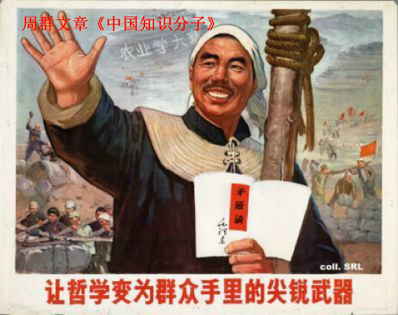

# ＜天枢＞韩寒的可贵之处就在于他不是“知识分子”

**因此，韩寒的存在十分可贵。他会有很多错误，他会有很多局限，但总不会太离谱，因为他一直站在距离我们大多数人只有一步之遥的位置上，用平易近人的语调说“我觉得这个方向不错”，我们总会有空间与时间去思考。而许多知识分子，已经站在了我们快要看不清的五十米外，略带鄙夷的眼神仿佛在说“真替你们捉急”……他们真应该审视一下自己站立的位置，确定到底是不是“领先”民众五十米。**  

# 韩寒的可贵之处就在于他不是“知识分子”

## 文 / 董泽宇（中国传媒大学）

#### 1.

韩寒前几天连续发布了两篇重量级的博文，说是重量级，不单是因为其影响力（韩寒随便写个文章说个事儿，怕是影响力都不小吧），而更多的是其内容。

如我们所知，以往，韩寒比较喜欢就事论事写杂文。而这次，韩寒将讨论的重点放在了理论性的叙述上，不再对某一具体时间发表见解，而是以问答的形式就自己的想法进行阐释。

因而，文章发表之后，引起了相当不小的讨论。本来，韩寒的目的就是引起讨论（详见《说民主》文末），可很多人似乎又走上了中国人讨论问题的老路，把讨论的主题从韩寒的观点转向了韩寒本身。

比如波士顿Suffolk University历史系助理教授薛涌，就非要在“革命”的定义权上和韩寒争个高下，在他看来，韩寒文中提到的“白莲教”和“太平天国”是“造反”，而不是“革命”，“明治维新”才叫“革命”。

若是事情到此为止，则还止于学理范畴，“革命”到底是什么意思，怕是学术界都要吵个不可开交，最后大概要落实到词汇考古和语义发展史探究上去。怪就怪在薛涌又在其后意犹未尽地开导韩寒“去哈佛读书”，并称“要纵论历史、革命，基本的书还是要读的。否则只会拿共产党教他那几个概念胡乱演绎”，而且韩寒去念哈佛，还有一大好处，就是“韩寒在中国是明星，到美国是孙子，哪怕进了哈佛。能否抛弃明星光环去当孙子，考验其人格”。

更好玩的是，凤姐也出来说话了，“看了韩寒‘谈革命’我看不起韩寒。这种拿着鸡毛当令箭。拿起无知当个性的小人”。

还有不加V的“不加V”：“要说敢说，罗玉凤更敢说。但她的言论没被当成社论，各阶层人士没有赞赏她的独立思维和个体精神，是因为他们觉的韩寒不是一坨屎。实际上……他也差不多是一坨屎，只是你们不敢这么说。”

……

而后，韩寒老爸韩仁均站出来为儿子辩解：“我电话问韩寒，你为什么这么取题目，谈革命和说民主，又大又危险。他说，两篇小文章哪里说的明白啊，只是这样取名字，让人可以开始敢于谈论这些以前不太敢触碰的词语，能争鸣总是一件好事。我一想也是，无奈有些学者不解风情，大谈什么读书少，学术差，不专业最好闭嘴，肤浅不配这些标题啊，真滑稽。”

……

争论还将继续下去，但会慢慢湮灭。因为要不了多久，用韩寒的话来说，就会“这事儿都过气了”。

不过，这过程已然包含了韩寒存在的非常大的价值：他可以引起大家对一些问题讨论。纵然他自己时常透露出一种似乎是源于无力感的疲惫感，但他仍然在不停地用自己的杂文在网络空间中对这个国家进行诘问与讨论，这是非常可贵的。

好了，若文章到此结束，一定会有人嫌我说了一堆没用的废话。因为在他们看来，韩寒的问题在于，他的理论水平和知识结构不足以十分深入地探讨某些重大问题，而只能将问题停留在一个肤浅的七嘴八舌的人人皆可说两句的层次。

但我想，这就是韩寒最为可贵之处。

我的意思是，韩寒的可贵之处就在于：他（表现出来）的理论水平与知识结构，恰好就比“人民群众”高那么，一点点，而不是太多。

话题由此引向另一个极易引起争论的方向：“知识分子”与“人民群众”的关系。

#### 2.

一般来说，只要不是特别民粹的人，大概都要承认，人的知识丰富度与思维丰富性无论是出于先天能力亦或是后天教育的差距，总会存在重要差别。

没错，没准儿知识界真的有一个大概的共识，那就是“白莲教”和“太平天国”算不得“革命”，只是“造反”罢了，但真的在不少中国人（知识界又要在这质疑我凭什么得出“不少”这个结论了）的眼中，“革命”和“造反”没什么区别。

或者更进一步，你可以指责这是这几十年来某种史观对人民群众（“人民群众”，这又是一个知识界讨厌的群体概念，但想想我们的周围，有多少人一开口就是“人民群众”？）的扭曲乃至“洗脑”，让诸如“农民起义”这一类的“造反”行为也具备了“革命”给人的观感。

没错，我承认你说得有道理，可那又怎样呢，“人民群众”的确是这么想的啊。

于是你又要指责我不辨是非不明黑白了。

可是没办法，“人民群众”就是“不辨是非”“不明黑白”啊，好多“知识分子”不都这么认为的么。

刚才，我用了“知识丰富度”与“思维丰富性”这两个杜撰出来的有点绕口的词汇，而不是更为常见的“知识水平”与“思维深度”，是考虑到虽然知识分子的思维的确一般要比“人民群众”深一些，但并不总是对的。

比较典型的例子就是纳粹和斯大林时期的苏联。我不相信当时所有的知识分子都是很单纯地被恐惧与威胁吓破了胆，其中一定有相当多心甘情愿对邪恶政权俯首称臣的，事实上，这样的例子并不少。

当然，纳粹与斯大林的罪恶，我们今天来看是常识般的明显了，但请注意，这是我们“今天”来看。面对历史，一切后知后觉的明察秋毫都是值得怀疑的。同学们，你们不会真觉得自己看了几本哈耶克与哈维尔，就构筑起了自己完善而牢固的知识体系了吧？现在把你送到四十年前，让张春桥和你聊上三五小时，你还能不能坚持自己现在的知识体系，反正我是有那么点儿怀疑。

#### 3.

知识分子虽然偶尔会在历史上栽跟头，但一般来说，其还是对的时候多一些的（要不科学体系这一人类发展的重要根基就崩塌了，虽然相比于自然科学，人文科学的确不那么“科学”）。所以其往往充满了自信，认为自己拥有相对于“人民群众”优势明显的知识体系与理论见解。比如说这次的讨论，薛涌就是直接从“革命”的定义权出发去攻讦韩寒的，他根本懒得和韩寒讨论思路，直接釜底抽薪。

在我看来，这举动相当有趣。因为知识分子和“人民群众”讨论问题，很容易出现这种情况：知识分子觉得“人民群众”说的每一句话都大有问题，不是逻辑混乱，就是事实错误，很多干脆连概念的定义都没搞清楚，会有种对牛弹琴的感觉，最后干脆无奈一笑拂袖走人。

做学术的严格要求，让知识分子养成了严谨的思维习惯；广博的阅读经验，让知识分子的语言空间十分开阔，对不同语汇的细微差别十分敏感；更为重要的是，持续不断的思考，让知识分子对常见问题常见思路的深入探究十分熟稔。因而，在与一般人的争辩讨论中，知识分子想要占到上风，十分容易，至不济也可以扔出一堆学术名词与生疏姓名，让对方无话可接。

然而，话语上的胜利并不能彰显知识分子存在的积极意义，相反，其可能在短暂的轻飘的话语胜利之中失去对知识分子社会责任的追求（如果存在“知识分子的社会责任”的话）。正如王小波所说的那样：知识分子最怕读书读到最后，连常识都没有了。

什么叫常识？在我看来，韩寒说的就大多是常识。

然而在许多知识分子们看来，“韩寒们”欠缺的正是常识。

这就牵扯到“常识”的定义问题了，若是以学术界的基本共识（说实话，其又能在多大程度上存在呢？）为“常识”，那无疑，当今中国人大多是没什么常识的，没常识还好说，更加危险的是有很多“错误的”常识；而若是以“常人的见识”为“常识”，则我认为，韩寒所说的正是常识。

当然，这话说出来要被知识分子们嘲笑的，盖在他们看来，“民众是愚昧的”也几乎是一条“常识”。

没错，从学术的角度来说，民众的确多是“愚昧”的，可话说回来，世界上现存的事务中，又有几件在学术的立场上不是“愚昧”的呢？民众说现在挺好，有肉吃，一部分知识分子说他们有奴性，有劣根性，被洗脑了，真愚昧；民众说美国好，民主好，一部分知识分子说难道你们没看到金融危机这样资本主义内在机制存在的问题吗？难道你们没看到现代性造成的人的失落这一历史难题吗？难道你们没有看到民主制度造成的政治娱乐化与低效化的问题吗？真是被洗脑了，真愚昧……

我相信，无论民众说出什么主张，都会有知识分子从一个有力的角度对他们予以批判与反击，因为某种意义上来说，这正是知识分子的特征，决定于其身份与工作之中。甚至我会觉得，学术做到了一定“深度”，已经俨然变成了一种“智力游戏”，参与者们在话语概念与逻辑推断的海洋中玩得不亦乐乎，空余我们这些旁观者在岸边不知所措。当你的知识多到一个境界，很可能觉得世界上大多数事情都是“不对”的，因为你的思维已经足够在脑海中构筑理念的王国。难怪许知远一天到晚那么忧伤……

但是，从现实层面上来看，这种游戏的确对我们的切实生活并没有太大的帮助（知识分子地位的衰落在西方也是个现实情况啊），纵然其多么有深度，其能影响的宽度都是有限的（这儿知识分子又要指出，我犯了“实用主义”的错误）。

我想，这正是当今中国面对的巨大困境的背景：我们已经活在了一个没有唯一领袖与统一信条的“小时代”（说实话，全中国来看，韩寒的影响力又能有多大呢？），现实层面的一般性发展过程中的历史任务（如工业化，如民主化）却都还没有实现。我们生存在一个犹如悖论般纷繁复杂难以抓住核心实质（其存在吗？）的时代中，潮水般的信息洪流将我们淹没，乃至失去方向。

因此，韩寒的存在十分可贵。他会有很多错误，他会有很多局限，但总不会太离谱，因为他一直站在距离我们大多数人只有一步之遥的位置上，用平易近人的语调说“我觉得这个方向不错”，我们总会有空间与时间去思考。而许多知识分子，已经站在了我们快要看不清的五十米外，略带鄙夷的眼神仿佛在说“真替你们捉急”……他们真应该审视一下自己站立的位置，确定到底是不是“领先”民众五十米。

#### PS：

这文章写完，已然完全不是我最初想象中的模样了。我想，若是你看懂了的话，会明白我想说的根本不是“我挺韩寒”，而是一些别的问题，一些一直以来都没解决好的问题，在我看来是问题的问题。

当然，我的意思不是只有“常识”就够了，也不是只看“前方”一步就够了。只是在知识分子与人民群众（从阶级论来看，这分法本身就是错的，人民群众愿意“接纳”你知识分子，不错了。笑。）的关系上，在“启蒙”与“觉醒”的关系上，在现实问题与理论见解的关系上，实在是由许多需要讨论的问题。这些问题的解决或缓解，在我看来，比“白莲教”到底是不是“革命”更加紧迫。

 

（采编：尹桑；责编：黄理罡）

 
