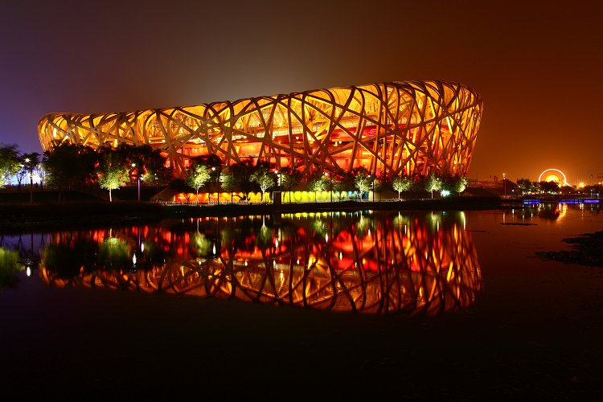

# ＜天枢＞鲜血换来的，只有记忆

**我想问的是，既然对降雨的强度、历时、总量的预报都是准确的，那就应该对此次降水的危害程度有所预估，却不知北京何来的底气让中超比赛如期举行？又是基于怎样的考虑任由收费站雨夜拦住水洼中拥挤的车辆，按部就班地行礼如仪？北京或常住、或流动的人口在雨夜守望相助，慷慨施救，你，首都，为什么没有开放任何一个公共服务场所进行安置？一次预报准确的天灾，对一国心脏，对一个现代化国际化的大城市，造成了如此惨重的伤害，你的预警系统，你的应急预案，你的公共救助，到底发挥了几分作用？**  

# 鲜血换来的，只有记忆

## 文/晴空少年（山东大学）

 

2007年，我经历了济南7.18百年一遇的暴雨，34人丧生，当时我就在想，排水系统如此脆弱的济南，为什么没有人道歉，没有人引咎。五年之后的北京，又是一场暴雨，吞噬了皇城脚下37条生命（编者注：26日晚，北京市防汛抗旱指挥部公布北京地区遇难者为77人），这次，市长副市长请辞了，较之五年前的济南，这可能是京城唯一的一点进步（这话说早了，此次请辞应该真和大雨没啥关系……）。

我想问，到底多少次的悲剧能换来你一次扎实的行动？灾难可以无数次的循环，但是悲剧不能习惯性地重演，我们有N次的前车之鉴，却总会有N+1次的覆辙重蹈。济南当年的悲剧你不知借鉴吗，08年奥运会斥巨资建设北京，你不考虑排水吗，去年6.23大雨袭城，北京汪洋一片，你又有几分警醒？

每一次，我们都热衷于反省天灾，却从不愿正视人祸。08年汶川地震，我们一遍遍地重复震级之高、能量之猛，却对灾区令人瞠目的豆腐渣工程遮遮掩掩，甚至不惜以维稳之名动用国家暴力；去年7.23动车出轨，第一时间也是在强调气象复杂，雷电袭击，拍着胸脯保证设施安全，结果在此之后，信号系统反复在动车和地铁运营中出现事故；此次北京暴雨，故伎重演，借用工程院院士的口说：暴雨的降雨量大，天气预报对降雨的强度、历时、总量预报准确，北京防汛、排水预案实施及时，救灾得力。

我想问的是，既然对降雨的强度、历时、总量的预报都是准确的，那就应该对此次降水的危害程度有所预估，却不知北京何来的底气让中超比赛如期举行？又是基于怎样的考虑任由收费站雨夜拦住水洼中拥挤的车辆，按部就班地行礼如仪？北京或常住、或流动的人口在雨夜守望相助，慷慨施救，你，首都，为什么没有开放任何一个公共服务场所进行安置？一次预报准确的天灾，对一国心脏，对一个现代化国际化的大城市，造成了如此惨重的伤害，你的预警系统，你的应急预案，你的公共救助，到底发挥了几分作用？

灾害发生后，本是痛定思痛、彻底反省的好时机，可此时的官方、官媒又一次不约而同，或者根本就是协调一致地把焦点引向了发掘人性、表彰先进的高潮，某报说雨夜的足球踢出了北京精神，某电视台公然定论满意政府表现，丧事再一次办成了喜事。当我们一次次极尽所能的从负面事件中发掘出正面光辉的时候，还有多少人，有多少动力去把精力投入看不见的地下？一次看不到真诚的应对，一种顾左右而言他的反省，留下的只能是一次平素如常的记忆，却换不来稳扎稳打的发展。

在这种悲剧往复循环的背后，是我们对权力与责任不对等的认知，是我们对生命，对没有权力撑腰的生命的漠视。截止22日晚上17时，北京因暴雨死亡37人，自此以后，该数字没有任何更新，从常识判断，这场大雨不可能没有人失踪，不可能在之后的三天没有任何伤亡新现，我不相信北京会瞒报伤亡，但是很明显，当地对这一信息的处理，是严重滞后的，这也直接导致各方民众对伤亡情况积怒于胸，心绪不宁，从而出现了对北京“求捐”的排斥。

昨天下午，房山区区长以区长之名向众人表达了歉意，这好像是自暴雨以来，第一个，也是唯一一个道歉的北京官员，道歉，似乎比摘掉顶戴更让官员难受。与此同时，区长介绍了辖区的损失：受损房屋6.6万间、倒塌8265间，道路损毁300处、约750公里，桥梁损毁50座，受灾农作物5000公顷、禽畜17万只、经济林2000公顷、设施农业2000公顷。说句难听的，禽畜的数量都统计出来了，人呢？死亡名单呢？

这是鲜活的生命，不是冰冷的数字，每一个逝去的生命都值得你认真的反思，隆重的对待。何况，他们还是国家的主人，他们把税收交给你去进行管理和建设，而如今却命丧你所建设的国都之内，你觉得此时此地为自己歌功颂德，合适吗？当然，北京有自己的努力，体制内的很多人为了这个雨夜贡献了自己的心力，但与这37位死难者比较起来，我实在找不到理由为这一任政府叫好。

北京，你该做的更好，在这个雨夜你该做的更缜密，在这个雨夜之前的若干年，你该早有防备。多希望死难者名单早日公布，多希望北京能为死难者设立哀悼日，多希望新任市长能在哀悼会上鞠躬致歉，多希望人大代表能想起来自己还有权问责，多希望其他城市引以为戒，做政绩换乌纱的闲暇，想想人命关天。

 

### 编者按：

截至7月26日，当局虽已更新了该地区的遇难者名单并向公众发布，以致本文内容与部分观点有所滞后，但即使如此，却更能体现本文的价值：若非广泛的催逼，不得实质之进步。

 

（采编：黄理罡；责编：黄理罡）

 
