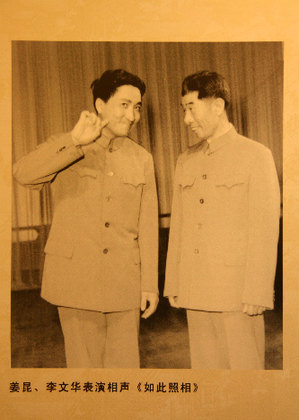
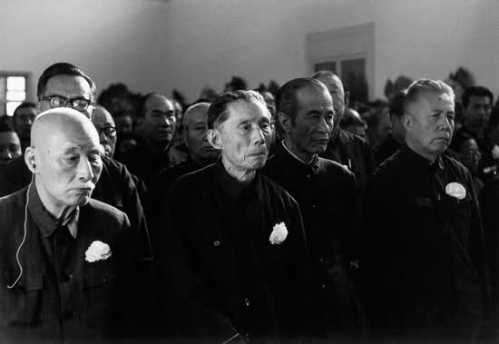

# ＜天玑＞从春晚相声说开去（一）：1983-1989

**收音機里傳出的王佩元的《挖寶》、姜昆的《如此照相》、以及常貴田的《帽子工廠》讓人久違了那種直逼最高層的政治批判型的相聲。雖然是批判政治，但是誰也無法否認這三個段子並不純粹，充其量只是對政治失事一方的安全的落井下石。但是對於當時的社會，只要是批判的，就已經够了，人們壓抑的久了，突然有了相聲這麼個管道，於是相聲就被捧得很高很高。相聲在八十年代，迎來了自己的黃金十年。**

# 從春晚相聲說開去（一）：1983-1989

## 文/馬軍（國立台北大學）

 

80年代來臨前的幾年，中國做好了正式起跑的最後準備。安徽鳳陽小崗村的十八個手印，後來改寫了中國整個的農村政策，當年十一屆三中全會的召開，為這個迷茫的國度指引出了一條道路。當然，藝術界也在改，藝術家趙丹臨終前和黨中央書記處書記胡喬木的遺言“管得太具體，文藝沒希望”，被人民日報發表。人民日報歷來是最高指示的源頭，此文一出，文藝界便開始摩拳擦掌，躍躍欲試。雖然社會上“左”的思潮依舊強大，但是向來沖在社會改革頭一線的文藝界，卻想第一個跳進河裡，看看傳說中能保著人們過河的石頭，到底好不好摸。

而相聲，則更是文藝界的先鋒。

這麼說其實並不為過，49年建國以後，文藝界要進行改造，上諷刺官員顯貴下諷刺農民小市民的相聲幾乎斷絕。除了極少數能夠與時俱進的將曲藝改造成政治宣傳工具之外，幾乎所有的曲藝演員和曲種都遭受到了不亞於滅頂的災難。北京的單口大王劉寶瑞的《君臣斗》的全本錄音至今也未湊齊，也許註定無法湊齊，劉先生本人的死因和遺體，至今也無從知曉。天津的大師馬三立被發配到農村改造，一度曾認為自己一生無法回到舞臺。傳統段子《八大改行》的場景再次回到現實。然而首當其衝的，往往是最早復蘇的，文革結束在文藝圈的最早跡象，也發生在相聲中。收音機里傳出的王佩元的《挖寶》、姜昆的《如此照相》、以及常貴田的《帽子工廠》讓人久違了那種直逼最高層的政治批判型的相聲。雖然是批判政治，但是誰也無法否認這三個段子並不純粹，充其量只是對政治失事一方的安全的落井下石。但是對於當時的社會，只要是批判的，就已經够了，人們壓抑的久了，突然有了相聲這麼個管道，於是相聲就被捧得很高很高。相聲在八十年代，迎來了自己的黃金十年。

於是1983年有了春晚開始，相聲的比重遠遠超過其他藝術類型。正是節目之前，晚會還安排了相聲大師侯寶林單獨的講話環節。主持人馬季和姜昆還代表相聲界像全國觀眾問了好，要知道，當時有著殊榮的，只有王景愚和劉曉慶。

相聲在當年的重要性還能在節目的數量上體現出來，那一年，馬季和薑昆各自說了三個段子，侯寶林侯耀文父子兩個也各說了一個。說當年相聲是春晚的半壁江山，應該沒有人會有任何的意見。只是當年的段子還都比較保守，馬季和姜昆還沒能從當年的歌頌型相聲走出。然而我們也不能太過苛責，畢竟是春晚的第一次（不算1960年那次），政治上保守一些，還是情有可原的。然而即便如此，那一年李谷一《鄉戀》中的氣聲唱法，還是被批成了靡靡之音。

然而相聲在民間顯然受到了鼓舞，一時之間，無數的前無古人可能也後無來者的段子被創作出來。在1984年，《並非諷刺裁判》和《糖醋活魚》的出現，給愛相聲的人們著實打了一針興奮劑。少馬爺也也一度以《糾紛》和《五味俱全》殺進了人們的視野，牛群馮鞏更是犀利，《我錯了》《小偷公司》也成為了難得的作品，春晚上牛群的那句“領導，冒號！”也成了當年的流行語。九十年代《曲苑雜壇》曾經拍了一系列的相聲TV，其中大部份的段子，都來自于八十年代的那段黃金歲月中。

春晚的相聲進步的速度雖不及民間，但是稍遜的進步速度乘上春晚極大的傳播力，給人的影響卻能大過民間的聲音。1984年馬季用唐山口音說了一段單口的《宇宙牌香煙》，誇大宣傳和虛假廣告成了被討伐的對象，人們也笑得前仰後合。87年的《五官爭功》則更是經典。姜昆似乎也收到了師父的啟迪，從80年代的前期不疼不癢的《看電視》《夸家鄉》《照相》之後，一下子貢獻出了《虎口遐想》《電梯奇遇》《捕風捉影》等佳作。然而最終還是出了事兒， 89年的相聲《特大新聞》竟猜中了當年的大事，成爲了中國歷史上非常罕見的“禁段”，具體為何，請各位看官自行Google，恕不詳寫了。

 

（采编：麦静；责编：麦静）

 
