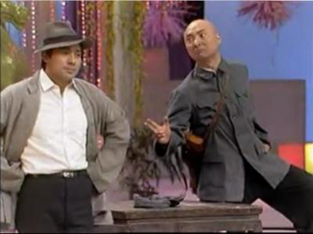
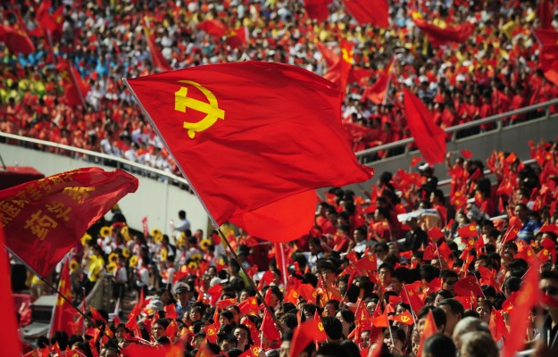

# ＜天玑＞从春晚相声说开去（二）：1990-1994

**這樣的精神也傳染到了相聲當中，當年那深刻的犀利的幽默，如今卻變成了廉價的油嘴滑舌。當然著正符合人們的胃口，人們不再需要深刻和犀利，油嘴滑舌正是人們需要的。**

 

# 從春晚相聲說開去（二）：1990-1994

## 文/馬軍（國立台北大學）

 

歷史從1988年直接跳到了1990年，那消失的一年，只存在于人們的心中，並不存在於歷史當中。他們以為，人民總是健忘的，若在健忘之上加上恐懼和希望，那過去痛苦的日曆，簡直太容易就被一翻而過了。那一年，北京舉辦了亞洲運動會，北京的路修到了四環；浦東新區的開發，也從計劃變成了實實在在的工程。然而這些並沒有解除人們的憂慮，國際的封鎖，外資的撤出，保守派的全力鞏固，讓剛見起色的中國經濟，似乎到了最危險的時候。於是1990年的春晚，竟像極了近日之局面，相聲小品雖多，卻一個個戰戰兢兢，內容上除了學唱歌，便是學廣告。唯一能勾起人們一些聯想的，竟是小品里陳佩斯的那句：“隊長，別開槍，是我”以及午夜時分江總書記和李總理的到場講話。

人們的擔憂並非沒有道理，當時北京的戒嚴還沒有取消，東長安街上國貿中心大廈的玻璃牆上，還能看到當時的痕跡。雖然時隔半年，空氣並沒有因此而變好。讓人們更加擔心的，除了北京，還有遠在萬里之外的歐洲，從德國到蘇聯，從保加利亞到羅馬尼亞，一夜之間，世界好像變了天，人們都在思量著接下來會不會輪到我們。然而中央還是HOLD住了局面，亞運的成功轉移了人們的注意力，一首《亞洲雄風》點燃了人們的愛國情。民族主義從此被頻繁的使用，不論是此後的南聯盟轟炸還是南海撞機事件，小泉參訪靖國神社還是汶川的地震，同樣的場面，我們見過太多太多了。

那幾年有不少讓人驕傲的事情，葛洲壩修好了，三峽也開始修了。秦山核電廠修好了，大亞灣也開始修了。歐洲的動盪和中國的發展讓那句“只有社會主義才能救中國”的口號悄悄地變成了“只有中國才能救社會主義”。隨著市場經濟的進一步深化，人們對物價的上漲也不再像當年那樣的衝動。前幾年人們經常討論的官倒變少了，但這並不意味著權錢勾結沒有了，只是一是因為官們更聰明了，二是因為雙軌制的漸漸消失，讓人們最常見的那部份官倒看不到了。上漲的物價被緊縮的經濟政策限制了一些，政府的工作中，也開始提到了“菜籃子”和“米袋子”這樣的工程。以前人們對物價上漲的敏感，此時卻成了相聲中諷刺的對象，姜昆在1991年說的《著急》，成為了少見的佳作。

然而消失的那一年始終不曾散去，只是換了一種形式存在于人們的腦海中。寫詩的年輕人不見了，人們對文字的熱愛轉移到了盛行的文化衫上。年輕人似乎個個都成了王朔前幾年筆下的頑主，不由得不讓人感慨這個天才作家的敏感。而王朔本人在這幾年則寫了《動物兇猛》，還沒老，就開始懷念過去了。

這樣的精神也傳染到了相聲當中，當年那深刻的犀利的幽默，如今卻變成了廉價的油嘴滑舌。當然著正符合人們的胃口，人們不再需要深刻和犀利，油嘴滑舌正是人們需要的，牛群馮鞏的《辦晚會》正是油嘴滑舌的代表之作。正是在這樣的局面之下，春晚相聲似乎又迎來了一個小的高潮，閆月明的《論捧》，李金斗的《跑題》雖然還有八十年代的樣子，卻始終沒達到《五官爭功》一半的功力。而《8字謎》《點子公司》則宣佈了金錢時代的到來。至於牛群馮鞏的《拍賣》簡直把那個時代刻畫到了極點，只要有錢，趙本山的帽子鞏俐的毛驢，甚至施大爺的白頭髮，都能賣。記得牛群還賣過馮鞏牌子的豬腦和口條。這話竟成了精彩的隱喻，那之後，豬腦編不出好的段子，能逗大家笑的，便只剩嘴裡的那根口條了。

 

（采编：麦静；责编：麦静）

 
