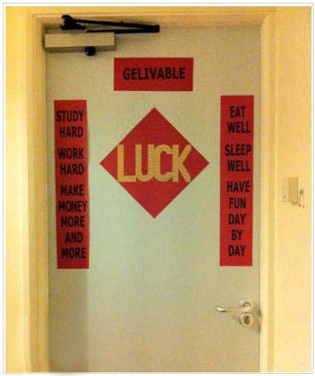
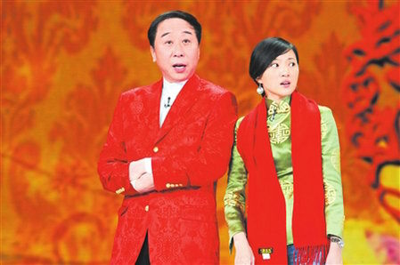

# ＜天玑＞从春晚相声说开去（四）：2002-2005

**由此也能看出，中國人的生活哲學：只要有樂，叫相聲叫小品無所謂；一旦內容不好玩了，就有人開始拿名頭做文章。我想，這種心態也大概能夠解釋一種現象吧：只要經濟還在漲，至於別的，也就可以先放一放了。當然，這也可以從另一方便去解讀：一旦經濟停了，拍桌子罵娘的，就該層出不窮了。**  

# 從春晚相聲說開去（四）：2002-2005

## 文/馬軍（國立台北大學）

 

應該是從02、03年起，中國人開始在春晚上找不到樂子了。00年以後，馮鞏的相聲和小品沒了區別，春晚也再沒了像當年“忽悠”“拐了”等在社會上流傳一整年的經典語錄。除了“我想死你們了”這種自以為是的陳詞濫調，便是開始撿網絡上過氣的詞彙來凸顯自己的“與時俱進”。前一年的春晚之前曾經不少網友押寶預測哪一個傻逼第一個說出“給力”一詞，結果不出所料，一向被調侃的朱主持人軍光榮中槍，這似乎是那一年的春晚，最好玩的笑話。

於是從那以後，春晚的相聲便進行了形式上的創新，除了台上一個捧哏一個逗哏之外，台下還多了一個捧好的觀眾。不知道是央視有意為之，還是現場遴選，每次大聲喊好的，總是一個坐在前排肥頭大耳的胖子。我對胖子並無成見，面對如此乏味的相聲，也理解春晚導演安排臥底鼓噪喊好的良苦用心，然而讓我厭煩的是這個胖子每次的好都喊到逗哏的人的腮幫子上，讓整個節目的節奏非常詭異，往往一個“好！”能讓捧哏找不到搭茬的節骨眼兒活活憋死。我曾經許願讓希望這個喊好的永遠從電視上消失，結果不幸愿力發的太偏，沒擊中這個喊好的胖子，反倒打重了另一個胖子。沒錯，就是你們知道的那個，穿背帶褲的大鬍子。

這也並不難理解，2001年的中國人似乎把最近五年的高興事兒全都HIGH完了，申奧成功入世成功足球衝出亞洲成功，再加上拉登成功的撞了美國的倆大樓，中國人一瞬間感覺中國成了世界強國。在中國，放縱的機會很少，安全且政治正確的放縱機會更是少得可憐，於是那一年中國人徹底地HIGH了，713和107，兩個夏天的日子，人們放了比冬天還多的炮竹。那年的春晚，郭冬臨用天津話大聲地唱著：“甭管是巴西土耳其，哥斯達黎加，場場踢他們三比零，大家說好嗎？”“好！”“那就這麼定啦！”結果第二年的夏天，中國隊未贏一場未得一分未進一球，三場比賽被灌了九個球，灰頭土臉地回了國。平均下來，真是場場三比零，只是語態，變成了被動式。之後的中國足球掉進了泥潭，春晚的相聲，比中國足球，掉得更深。

足球的失利給社會帶來的沮喪，遠不如非典時期的團結，給人們帶來的希望。02、03年起，人們對國家的期待越來越高，新的領導人新的姿態，中國好像要打著“新政”的旗號準備大幹一番。房價從那時候開始漲起，當然，強拆的新聞，也開始多了起來。然而，與前幾年還算讓人滿意的狀態相比，從那之後的春晚的相聲跌進了一個馬屁成風捏手捏腳的怪圈，這幾年，侯耀文三次上春晚，說的相聲幾乎沒有一個讓人記得內容。當年和黃宏《打撲克》的那個犀利的侯耀文不見了，取而代之的則是《馬年頌馬》《十二生肖大拜年》《雞年說雞》三個無聊的段子。光從題目就能看得出來，這三個段子的變化，可能比從“我想死你們了”到“你們讓我想死了”還要小，而且小得多。姜昆的相聲，也沒了九十年代的批判精神，轉而去掏網絡上剩下的笑話，拼湊出一個勉強叫做段子的作品。這些北京的演員，還是放不下京派相聲的架子，死要面子，活活挨駡。天津的馮鞏則聰明的多，從那之後開始耍詞彙上的流氓，頂著相聲的名義演小品，躲著小品那頭的趙本山，回回拿的都是曲藝類的一等獎。只是質量和前幾年的完全沒得比，老百姓們這個時候才開始痛斥馮鞏的滑頭。由此也能看出，中國人的生活哲學：只要有樂，叫相聲叫小品無所謂；一旦內容不好玩了，就有人開始拿名頭做文章。我想，這種心態也大概能夠解釋一種現象吧：只要經濟還在漲，至於別的，也就可以先放一放了。當然，這也可以從另一方便去解讀：一旦經濟停了，拍桌子罵娘的，就該層出不窮了。

 

（采编：麦静；责编：麦静）

 
