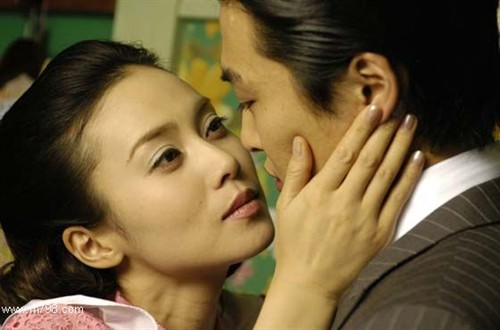

# ＜天玑＞右手，可以被遗忘（一）：那些光影年代

**一个是在寂寞中等待爱，一个是在虚浮中追求爱；一个是执着于牺牲似的付出，一个是放不下自我折磨般的追求。她们无法体会到人生的平衡美感，她们生命的依托，就在于这无尽无止，无休无边的黑暗，苍白，空洞，以及怪异。她们无法走出自己给自己设定的怪圈，幸福已经离她们越来越远。** ** **

### ** **

### ** **

# **那些光影年代**

### ——关于女人、女性和女权的心灵笔记

## 文/ 鲁雨洲（黑龙江大学）

没有一个女人是天生的。 这是我一个学中文的同学告诉我的。他说，当他的老师向他们说出这样一句话的时候，全班同学都哈哈大笑。 听到这句话的时候，我正在黑暗的“高四”生涯中连滚带爬。我感到内心受到了很大震撼。甚至只为了这样一句话，我就可以劝慰自己，暂时忍受这些无趣劳累的学习生活，背着公式背着年代背着地点，然后去争取在高考的独木桥上，不坠入河里。这句话是柔美而令人心疼的，也令人深思。 半年后，我已经在大学的宿舍里面，敲打着电脑键盘，看着黑色的四号字一点一点的透露出来。我知道，这句话可以在内心沉淀，然后升华。我很感激眼前的一切，虽不至于感动得流泪，但是，内心总感觉像充满了一团棉花一样，轻盈但是丰满。虽然我带着一个曾经长途跋涉的身躯来到这里，虽然我没有选择我曾经梦寐以求的中文专业，虽然此时的生活距离少年时代的那些过于文艺的理想已经很遥远了。 何为女人，女人为何？那个同学所讲的话，让我产生了这两个问题，我正在一边生活，一边寻找我能找到的答案。 《被嫌弃的松子的一生》伴随了我大学的第一个夜晚。我和室友一起看了这样一个可以言笑的人生悲剧，并且分别在不同时候落了泪。随后的几天，松子像某种藤类植物，驻扎进我的整个心房。她细密的触角让我的心灵一次又一次的起伏着。 松子让人心碎的故事也是一部冗长的女人苦泪史。纵观整个影片，她虽然经历不同的变故，但是究其本性，变故是相同的。 松子遇人不淑的背后，是她面对自己的态度。她由于童年的不受关爱，以及她的喜怒无常和不定性，成就了整个故事。她无法正确地选择男人，这与她父亲在她人生之初传递给她的感觉有关：男人是需要去讨好的，无论这个男人怎样对待自己，自己都要去努力讨好他，顺从于他，屈服于他。 在这里，父亲对于女儿的世界观的养成具有重大作用。松子的父亲无疑养成了她一种通过自虐以求得爱的性格。那些没有过童年的男人，那些没有过少年的女人，都不是完整的人。松子的少年，在一种自我否定和不停寻求的过程中结束了。她的少女时代是那样的充满诡异色彩，而且过于仓促了。 我一直认为，一个备受宠爱的女孩子，她的整个人生都会抱有一种天真，一种干净美好的气质，她的心地充满爱和宁静，但这并不意味着幼稚和无知。而一个总是处于猜疑和需求得不到满足境地的女孩子，她的年轻时代会很短暂。她会急于把自己交出去，或是交给一个男人，或是交给一种命运，而这个男人或是这个命运都是短暂选择、不经比较的。 

 因为生命是如此的无法改写，所以那些在早年就流落到真正人世的女孩子，命运对于她们未免有些不公平。她们在可以悠然旁观的时候，却被活生生推到了前台；她们在还可以吸取别人经验，和姑姑姨妈们在一起谈论女人的时候，却成为了女人故事的主角。 松子共经历了四个男人。从浪子到软饭男，这四个男人几乎汇集了男人可以拥有的全部劣习。这四个男人分别代表着不同类型的坏男人。那些自大狂妄，无视女人感受，欺骗与背叛，任意伤害的品质，在这四个人身上体现得淋漓尽致。 在松子经历的四个男人中，彻也是唯一一个拥有正常稳定职业的男人。然而他有家室，而且，一开始接近松子的目的也并不单纯。当彻也发了一通脾气、摔门而去的时候，松子弱弱的问出了一句“为什么”。无人给她答案。 “为什么？”这或许是生命的终极问题。如果一切事物都有原因和结果的话，并且可以那样清晰的体现出来，世界必定会少了很多悲伤。 女人的苦恼正在于此。一方面拼命问着为什么，一方面又不够积极的去寻找答案。于是，为什么，这样一个动态的词语，成了一种自我折磨，成了一种痛苦升华的途径。这并不符合逻辑，寻求原因本身是为了得到结果。然而女人却是只问为什么，接下来，便是消极的回避这个问题，开始另一段光秃秃的人生。她从以前的人生经验中，得到的只有痛苦，而没有反思。或者，她得到了完整的完美答案，类似于看破这个世界，知道了背叛和伤害，知道了生而为人的脆弱和动摇，她的爱的能力也随之丧失了，她的血液和大地一样的冰冷。 难道不该追问为什么吗？当我们的青春做着无畏的流失，当我们被误解，当我们被赋予委屈和挫败感，当我们没有资格再去辛苦经营生活，我们不应该追问吗？拿青春赌明天的故事依旧在上演，每时每刻。 可我更认为，当你选择了这条路之前，就已经做好了一切可能的准备。应该知道一切可能发生的结果，不管多么面目全非的结果。问为什么，代表着任性和脆弱，以及过于不负责任。没有人会给你真正让人满意的答案，而在一切开始之前，在你自己心中，就应该有一个答案了。 松子的每一次选择，都是做了当时最坏的选择。上帝足够仁慈，当松子一次次的觉得自己的人生完了的时候，她的人生并没有真正毁灭。最起码，她没有死亡。上帝又足够刻薄，当她怀揣着继续做美容师的梦想时，她却被滑稽可悲地弄死了。不管当时她的生活是否具有回转的余地，她的美丽是否可以还原，她的温柔和善良是否可以再次回归，她人生的第一次信仰，第一次不是来自于男人的信仰终于建立起来了。松子的无法重来的人生，也让我产生这样一种错觉：当我在某一时刻作出了某种选择，是不是意味着其他的我已经死了，而只留下眼前的我，当下的我。无数个我已经在无数个时刻死亡。人生的确无法重来，正如死去的无法复生一样。 松子无疑是柔顺而卑微的。她的选择都是基于当时的爱人，她的人生道路的重大改变，也都是因为不同的男人。人的本性，注定一个人不可能对同性产生如此的眷恋之情。当然，后天的同性恋除外，所以，我暂且把她过于依赖男人的做法，归结于依赖型人格。这并不是一种可以长久享用的人生态度。相反，它类似于饮鸩止渴。如果不能及早的发现自己人格的这个弱点，最后将无法摆脱。 她对爱情是执着的，但是她对于痛苦更是执着。人人都有追求幸福的权利，都应该让自己过得安稳一点、舒心一点。在不违反大原则的前提下，一些忍耐和牺牲是必须的。但是如此之大的人生牺牲，则不是一个正常的做法。她并非是因为爱他，才这样做。她这样做，是因为她心中无爱。 生活对于她来讲，并不意味着爱，而意味着依赖，意味着自虐式的追究。她的人生过于失重了。在我看来，她所拥有过的男人，和她同样具有自虐情结的八女川姑且不论，那个欺骗她的彻也很容易被看清，她却做着甜蜜情人的幻梦。男人可以带来幸福，也可以带来无尽的痛苦。如果内心执着于痛苦，那么幸福似乎也是为了将来的痛苦作铺垫一样。而如果内心执着于幸福，那么人生就会变淡，变轻，可以穿越任何苦痛。 

 我所欣赏的一位香港女心理师，名叫素黑。她说，应对痛苦的最好方法是穿越。穿越痛苦，让自己成为一团雾，一团空气，穿过它。这种说法不同于我之前见过的任何说法。之前我所了解的，是教会我们应该如何坚强面对，如何想办法挺过去，和它作斗争。而素黑的想法是，作斗争，面对，都是需要力气的，都是需要一种隐忍和牺牲的。都是一种有所作为。这必将耗费我们内心的能量。 穿越痛苦，是一种释然的态度，也是一种不费人生能量的方式。没有任何一种痛苦值得为之做出太大牺牲。在我看来，痛苦感的产生源于自己的内心。苦难不意味着痛苦，安稳富足仍然可以生出绝望。 松子没有学会这样一种能力，或者她根本没有想去学会。她想用自己柔软的充满血液的身体，去撞撞运气，也想改变些什么。但是她的改变是消极的，也不是本质上的，所以生活会继续朝着她不愿意看到的方向滑落。 在我心里，《一个陌生女人的来信》里面的那个陌生女人，与我面前的松子似孪生姐妹。一个是在寂寞中等待爱，一个是在虚浮中追求爱；一个是执着于牺牲似的付出，一个是放不下自我折磨般的追求。她们无法体会到人生的平衡美感，她们生命的依托，就在于这无尽无止，无休无边的黑暗，苍白，空洞，以及怪异。她们无法走出自己给自己设定的怪圈，幸福已经离她们越来越远。陌生女人没有做过任何选择，但是她在最开始，就已经给自己的心灵画上了一个牢固的圈子，不容许自己走出去半步。是因为惧怕，还是因为她沉浸于这种不需要作改变的生活。松子不停的做着选择，然而每一个选择都是当时情况下最坏的那个选择。她的终极目的只有一个，就是追求幸福，渴望被爱，然而她通往终极目的的道路，被她自己一个个封杀。她缺少了生而为人的某种尊严，某种回避痛苦的原则，某种胆量和精神。龙洋一的出现，则是最终验证了她致命弱点。龙洋一，两次改变了她的人生轨迹。然而龙洋一的出现并不是龙洋一本身的无法摆脱，而是松子的不会选择。但我们可以试图去理解松子的任何选择。她曾徘徊于几次爱情之外，她曾入狱八年，她出来后注定孤独而畏惧。生活对于她来讲未免过于失重了。她说，既然两头都是地狱，不如选择龙洋一。 这实在是让人伤感的一幕。人生的选择如果没有好坏之分，至少有可以回转的余地。可是，在松子的生活中，回转的余地永远是隔着一汪水的彼岸，她可以看到水的澄明，可以感受到水的温度，呼吸着水的光泽，她却没有逾越的能力。这是一种美丽而绝情的命运。 “你要当流氓的话，那我就当流氓的女人，只要能在你身边，我都无所谓。”这句松子在歇斯底里状态下喊出的一句话，是松子一生的最佳写照。她需要一个人在她身边，无论这个人给了她多少痛苦和折磨，无论她过着怎样凶险的生活。只要在一起就好，哪怕两个人共同走向毁灭。失去一个爱人，和失去一种生活，哪个损失更大？当今的独立女性肯定会选择后者。毕竟，生活是自己苦心经营才得到的，而爱人的得到有很多命里运气的成分。也就是说，我们无法左右爱情，却可以决定命运。而为了爱人而失去一种生活，我们的心里会失衡。在松子心里面，没有生活和爱人的概念。她的爱人既是生活，生活的意义也是为了守住爱人。哪怕她有一丁点生活少了谁都依旧是生活的想法，她都可以跳出一个圈子，去重新谱写人生。她也不会将越来越多的人牵扯进她所酿造的悲剧里面。 这与陌生女人有着不同。陌生女人完全是活在自我的世界里，她的自虐情结不会伤害任何人，不会产生实质性的影响。我们纵观她的一生，会为她感到无尽悲哀。那也是在我们了解全部故事以后才会有的感觉。而单独去感受她的每段人生，她是丰满的。她是一个母亲，一个交际花，她拥有自己的独立生活。她的心灵或许布满了蜘蛛网，但是她的生活还是光鲜的。她不会时刻用苦命的脸庞来提醒着我们，她是一个被男人抛弃的女人，她是一个未婚先孕尝尽辛酸的女人。她的生活如同我们的一样，至少看上去是一样的。 在我很逆反很阴暗的青春期，《阿甘正传》里面的珍妮是我的心里面的刺。我的生活和她的一样，那样平凡，那样波澜不惊，似乎什么都不会发生。自认为受到来自家庭的伤害，不管是真的发生，还是臆想出来的。她爱上各种人，几个人，我也有可能会爱上。她的大胆和苍白，也被我深深的注视着。可是她的结局却是那样不尽人意。我深怕在我安然平和的生活之下，也潜伏着某些巨大的变故。恰似我是珍妮，珍妮是我。在《阿甘正传》里，阿甘冲破一切荆棘而得到无痕的幸福，珍妮却顺着一切可能有的岔路，飞奔而去。在我当时的生活里面，并没有一个阿甘一样的人物，和我做着持续的对比。我铭记着珍妮，觉得女孩子的命运竟然可以是这样一种符号，一种模式。 

 可是我不理解她的太多了。她可以受到伤害，却仍有权利选择幸福。她也可以短暂地盲从过，却仍可以成为平凡而伟大的世俗女人。 后来我才能慢慢体会她的心情。体会她短暂人生的幸福和苦恼，体会她始终无法跳出来的心结。可是当我能够体会她的时候，她已经离我很远很远。 因为，我已经有了自己的人生。 我已经彻头彻尾的活在了一个故事里面，走进了不同人的生命中，也让不同的人走进了我的生命。故事是开放性的，成就故事的不再是什么编剧，导演，而是你自己的性格和所经历过的事情。她教会了我不可以走的道路，我在为她感伤为她思考的时候，却小心翼翼的绕过她。 这应该是对她的一种最好的缅怀，也是对自己最好的一种拯救。 活在真实的生活里，我也会想着那些虚假的影片。影片里面的人甚至可以比我身边的人还要真实。她们提醒着我人生的可能性。我曾经当导演的梦想原来只是想更好的了解她们，而如今那梦想只待破碎。 可我依旧可以感受故事的芳泽，我不会离开。在我有生之年，那些光影教会我的事情，是弥补了我个人生活的局限性，她们唤醒了我骨子里的恶和善，让我从黯淡又平面化的生活中，立体地，活生生地走出。 

（未完待续）

（采编：陈锴；责编：陈锴）

### 

### 
