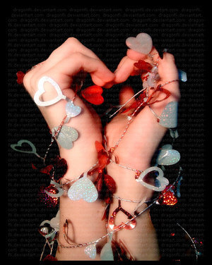

# ＜天玑＞右手，可以被遗忘（三）：寻找右手

**男女的和谐似人类的左右手。我们无法单独感受到那一只手的魅力，却可以感受到它们共同生活的魅力。右手拿起笔，左手抚弄头发；右手的纹理走向了左手，左手的纹理也走向了右手。当它们紧紧相握，感受到彼此的相同温度，也感受着彼此来自不同的方向。它们深深的不同着，它们生命的根基就不同，然而它们又紧紧相连。男女，过于强调分离和排斥，则会失去协调；不要因为不同就不能够完美的存在。不要单独看重一只手。**

# 寻找右手

### ——关于女人、女性和女权的心灵笔记

## 文/ 鲁雨洲（黑龙江大学）

  情爱是人类永恒的主题，我如年少时所期盼的那样，顺利的走到了人生最为丰富的时刻。在探究他人的同时，也要探究自我。 成长的泪痕没有完全干透，被误解的年月也没有呈现出它的全貌。我觉得生命的味道已经愈发浓重，而我身上的羽翼也更加轻盈。为此，我很感动。自始自终都在寻找，而寻找的广度和深度又在不停的变着。这道路一直向前，景致也不会重复。这世界赋予我过多的内容，我要一一打理，细腻地用。 可是，我也害怕伤害。我怕我今后的人生充满寒冷和委屈，也怕我被欺骗被辜负。我担忧着可能一生都不会发生的事情，对于眼前的实实在在的幸福，只能尽力感受。我明白，担忧会降低我的幸福感受，而又无人能让我摆脱忧虑。 波伏娃说，女人生下来就不如男人那样透明。在我看来，女人的最大弱点有三种：自虐情结，无法脱离惯性和不定性。 而这三种弱点，本身之间又存在着微妙而深刻的联系。自虐情结是一种以痛苦为人生目的，认为自己摆脱不了痛苦，任他人伤害，任他人背叛和冷落，任命运摆布而不做积极抗争。而这种自虐情结必然包含着持续。只有一直持续着某种状态，才能被定义为自虐情结。而这种持续，一方面由于人生活本身的局限性和难以改变性，另一方面也是因为女人的惰性。就是我所谓的无法脱离惯性。《肖申克的救赎》里面提到，监狱里面的人就被体制化了，他们出来将无以为生。我想，女人不是被某种机构体制化了，而是被一种经验和性格所体制化了。女人更容易随遇而安，换句话说，女人更容易妥协。无法脱离惯性是无力的生活状态，却实现了眼前的暂时平静。毕竟，改变要比维持更消耗能量。改变需要勇气和牺牲。女人似乎不相信自己日后可以补充这种能量。无法脱离惯性造成了悲剧总会沿着某种悲剧走下去。 

而换一种想法来看，我们所看到的旁人的种种悲剧，在她们眼中未必是一种悲剧。所以，无法脱离惯性也可以成为一种优秀的品质，毕竟这类人更加安稳，不容易让生活做很大颠覆，从而影响到已经建立起来的稳定，这种稳定也包含她的亲人和朋友的稳定。可是，女人又有着很强烈的不安定性。她的内心无时无刻不在衡量着，比较着，揣测着，跃跃欲试着。她的心态更加容易失衡，她的不切实际的幻想容易让她苦恼。女人的天马行空的想法，和从童年时代就建立起来的童话感让她们无法真正安定下来。所以，这个和无法脱离惯性的深深矛盾着的品质，注定这女人生来就是一个矛盾体。她们一方面不屑于去做真正的抗争和改变，另一方面又时刻维持着如果当时怎样怎样就好了的想法。她们觉得，自己的人生总会在某个拐角处出现另一片巨大的光明，而又不忍心让自己的心灵受到太多的罪和苦，比如她要离开父母，朋友，爱人，比如她要离开熟悉和习惯。 我之所以称女人的这三种品格为弱点，并不是因为它们每一个品格本身是多么万恶不赦，多么摧残人性。而是因为它们综合于一个个体之上，矛盾无法调和，共同作用。痛苦的产生源于矛盾，无论是自我矛盾还是和他人的矛盾。由此可见，我们可以容许这三种品格的共存。有时候，人似乎需要一种自虐。比如母亲无私的为着任性妄为的孩子，比如妻子伟大地爱着丈夫，这是一种人类付出心理的满足，而有些人和人之间的无条件的付出，也可以视为一种自虐。这种自虐让弗洛伊德所讲的超我得到了升华，让人的付出欲望得到满足。 至于无法摆脱惯性和不安定性，是人人都有的。只不过是是否意识到的问题。有些惯性无需摆脱，而再安稳和美的生活也会滋生出茫然和苦恼。人的思维是那样发达又脆弱，情感的体会也格外丰富。 我们可以容忍这三种品格的共存，重要的是，应该怎样去共存。太多的故事，太多的书籍和电影，传递给我们的女人的悲剧信息，都是这样一种模式。一个女人因为无法摆脱过去痛苦经验的折磨，她努力寻求反击。可是接下来她觉得自己是卑微低下且无力的，她缺乏自信，于是下一个选择仍然是重蹈覆辙。逐渐她习惯了这种痛苦不断滋生的感觉。于是造成无法避免的悲剧。于是，一个又一个感人的电影有了原型，一个又一个主人公在作家的心底成型了。 我所不理解和看不惯的，是那些过于强调女人不要依赖男人的话语。爱是平等的，依赖也是相互的。男人难道不爱女人吗？他们难道没有把所爱的女子当作自己的另一个灵魂吗？他们也为爱而受尽折磨，他们也在爱的过程中成长。然而没有人责备男人太爱女人。也没有人告诉男人，你要少爱女人一点。他们可以放开心怀去爱。可是，有人却非告诉女人，别把太多心思放在男人身上，要有自己的空间。 这世上的人，本来都是独立的个体。爱是一方面，空间是另一方面。二者并不冲突。如果非要划清一个界线，以求某种女性的尊严得到体现，那么未免小题大做。人生而平等，都有卑微和高尚的一面，难道只有女人一味拒绝才能免受伤害，只有女人冷若冰霜才能让人如获珍宝？ 

男女的和谐似人类的左右手。我们无法单独感受到那一只手的魅力，却可以感受到它们共同生活的魅力。右手拿起笔，左手抚弄头发；右手的纹理走向了左手，左手的纹理也走向了右手。当它们紧紧相握，感受到彼此的相同温度，也感受着彼此来自不同的方向。它们深深的不同着，它们生命的根基就不同，然而它们又紧紧相连。男女，过于强调分离和排斥，则会失去协调；不要因为不同就不能够完美的存在。不要单独看重一只手。 我有一个极端的想法。我觉得世界上本没有真正的女权。女权，是伴随着女性赋予自己的自卑而来的。世界有男女，虽然神话告诉我们，女人本是男人的一块肋骨。但是事实是，男人和女人分别肩负着不同的历史使命，他们用各自不同的灵性和血肉，让时空变得丰满了。不同时代，让女人以不同的形式生存下去，或为女王，或为女奴，或为妓女，或为主妇，但这只是时代而已。而女权主义认为那些不该被仰视的男人呢，他们也曾经历屈辱和磨难，他们经历着自我怀疑和自我拯救，自我理解和自我升华，他们的心路历程不比女人少，而他们的生命也不比女人平坦。这世界的公平性并不在于，女人终于做成了男人的事情，而是它给予男女不同的事情。智慧和学识对于人来讲，都是平等的，尊严和荣誉，都是人人追求的。但是，身体的弧度，心灵的细腻程度，感情的丰富程度，是可以不同的。女人的美，甚至就在于她的任性，她的火热，她的孤独，她的无所事事又心高气傲；男人的美，也可能就在于他的粗暴，他的自以为是，他的无助，他的多虑和嫉妒。人性的弱点和人类的伟大并存，难道女人克服了女人本身的弱点，就是一种成功吗？让我充分意识到这些，是因为我所接触的成功女性中，她们的女人本身的东西没有被过度的剥夺，反而更加深了她们女性的美德。而若说阻碍发展和幸福的弱点，则是人类共有的。比如那些负面的消极的不乐观的性格。这些东西没有性别烙印的。 女人，完全可以放开胸怀去爱，去忽略女权，去发自内心的尊重自己的女性角色。为我们能做的事情，也为我们不能做的事情；为我们所到达的高度，以及我们可以继续到达的高度。历史会把女人置于什么地位，是靠那些平凡而踏实的女性一步步走出来的，她们的信仰和行为完全符合，而信仰和行为完全符合是一种不多得的人格魅力。她们过着怎样的生活，拥有怎样的心态和信仰，决定着她们的女儿，她们的儿子，她们的子孙后代的成长。我也将继续追寻着两性的不同美感，我为我生为女人而感到幸福，也为此而心动。 在大学，我们第一次合唱练习的时候，当男生和女生迥然不同的声音分别飘扬起的时候，我感到这似乎来自于两个迥然不同的世界，都很坚强美丽，都很完整。我辛辛苦苦地长到了二十岁，我可以将自己曾经混乱不堪的思绪整理出来，写出来，让自己明白。看着面前纷纷走过的无数男人，那些被深深爱恋过或是被深深伤害过的男人，我感到踏实。当我终于明白女人的角色，用我二十岁的浅薄但是纯正的想法去看待这一切，我感到很满足。 我知道，道路必定有它长途跋涉的理由。 

**（已完）** 

（采编：陈锴；责编：陈锴）

