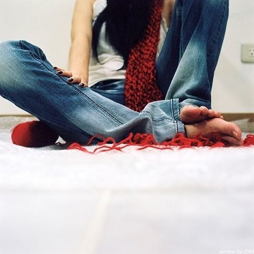
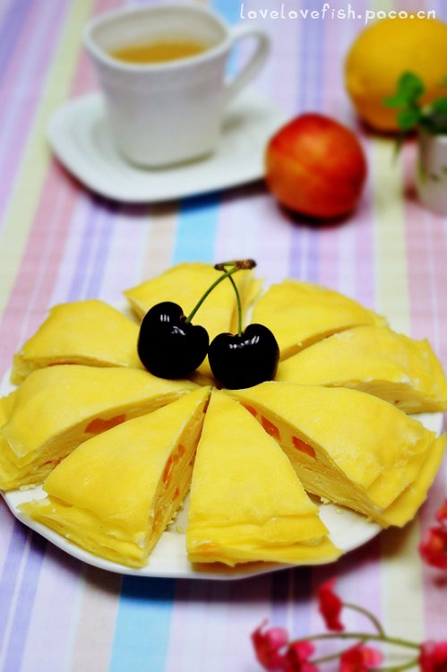

# ＜天玑＞右手，可以被遗忘（二）：成长，始于困惑

**我想，很多女孩子在成长的过程中都有这种困惑，只不过她们没有意识到。如我生性敏感的人，才会追求这些没有意义的问题吧。而性的苦恼，月经的疼痛，分娩的折磨，情人所给予的无奈，以及女性本身的过于丰富发达的痛苦神经，让女人或多或少开始质疑自己，开始羡慕男人。羡慕男人那样直来直往的人生，羡慕男人那样麻木的情感，羡慕男人没有潮汐般涌动的生命。疼痛让女人清醒，也让女人迷惑，而肉体却无法摆脱这种疼痛。**

# 成长，始于困惑

### ——关于女人、女性和女权的心灵笔记

## 文/ 鲁雨洲（黑龙江大学）

我想，上帝在赋予我们不同的身体的时候，也可能赋予我们并不配套的灵魂。所以，这世上产生了种种怪异的无法被理解的行为，也产生了独具韵感的人类错爱之美。 在我的幼儿园时期，我不明白为什么女孩子都要蹲着小便，一时间世界变得那样高大，自己又变得那样渺小，这让我觉得排泄是不仅是一件肮脏的事情，也是一件屈 辱的事情。而男孩子不仅可以和平时一样的站着，更可以摆弄着那个我所没有的器物，可以划出不同的弧度，可以朝向不同的方向，可以被模拟成不同的东西。排泄 对于他们来讲是一种炫耀，是一个极度享受的过程。在那个无法被描绘的童年，我尝试过几次站着排泄。而那几次经历让我记忆犹新。我至今仍然能感觉到当时的紧 张，崩溃，好奇，以及某些报复性的满足。我也可以站着排泄并且保证尿液不弄脏衣服，可我要在没人的时候偷偷地，生怕被人看到。我心里知道这不是一件光彩的 事情，从而给了我深深的失落感。这是一种偷偷猎奇的经历，完全去探究另一个世界，那世界不属于我，而一旦迷恋，后果则不堪设想。幸好，我只是因为年幼贪玩 好奇，而不是因为我骨子里有一种渴望成为男性的欲望。 男人在我心里面成为一种无法企及而又紧密相连的事物。我的心灵在朦胧中成长，成长的艰辛让这些朦胧时而清楚，时而更加朦胧。 初中的一位很要好的女友，在当时绝对是个异类。她和社会青年恋爱，在我这个乖乖女的眼里，她简直是十恶不赦、无可救药。而她的美丽和张扬也被我所深深的嫉 妒，所以，我理所当然也好奇着她的爱情，甚至有些想试图破坏。可我没有那个能力，我只能暗暗去感受她的一切变化，她的那些我所不懂的变化。我只见过她男朋 友一次，非常遗憾，他的面容我完全忘记了，他的声音也不尽模糊。可我记得他的欲望。他眼中流露出来的欲望。他对我女友的欲望。 他们在我面前拉手，他整理她头上的蝴蝶结，他抚摸她的肩膀。这些情人间自然的举动，在十五岁的我的眼里，简直比任何电影都要动人。我保证，当时我的心比她跳的还要快。 男人，不管是不是我的男人，竟然可以为我带来心动。我知道，从那一刻起我开始变化了。我开始觉得这样一种心动是多么美好，是多么不可多得。男人不再是意味着傲慢，意味着不平，意味着脏兮兮和闹哄哄。男人，长成了同样的高度，长进了我的世界。 在夜里，我回想起那个男孩子的温柔举动，以及我女友脸上的柔媚轻松，我几乎要哭出来。我的童年啊，我的刚刚开始的少年啊，究竟是一种何样的心态，何样的无奈和无知啊。 现在，我和那个女友仍在一个城市学习。很少见面，大家也不会太挂念对方了。她换了很多男朋友，我也见过，也可以坦然接受他们的一切举动，更可以和她的男孩子 对视。但我看不到他们眼中的欲望了。我知道，问题不在于她的那些男孩，而在于我。对于性的朦胧渴望和担忧已经渐渐远去，取而代之的是一种更为深刻的感受。 男孩不再令我心跳，因为我了解了我自己。 我了解到，人们所沉醉的往往是与异性相亲相爱的感觉，而不是单单指这个异性。没有完美的恋人，两个人却可以创造出完美的感觉。我知道，男孩不再是某种高不可 攀或者是遥不可及，他们鲜活地生活在我的周围。他们有我们所没有的优点，也有着我们无法想象的脆弱和多情。他们的汗渍和声音，他们的背部弧度，让这个世界 变得完整而可爱。他们也渴望爱，也惧怕伤害，他们也会同我一样的心动。男人女人注定相爱，这是无法摆脱的命运。 

可是曾经，我对异性也是有过恐惧的，同大多数女孩子一样，曾经有的对异性的恐惧是害怕来源于他们的伤害。虽然我们无人能在恐惧时真正经历这种伤害。因为一旦经历了伤害，就不会再有恐惧了，取而代之的是屈辱感和愤怒感，或者是透彻感。一种感觉总会被另一种感觉所取代。 初中时一位别的班级的女孩子，和她的同班同学恋爱后，很久没有来上学。传言说她怀了孕，学校给她放假让她回家调养身体。从那以后，我们看她的眼神不由自主的由高变低，而我们看那个男生的眼神，不由自主的由近变远。现在回想，由高变低，是因为我们把贞洁看得比任何东西都重要，我们害怕被破坏；而由近变远，则意味着某种惧怕。我们惧怕这个和别的男孩不再相同的男孩，我们惧怕他深知我们的所有秘密。当事人的感受我们无力探究，因为我们对于此事也很无力。在我们这群孩子中，可以接受某某考试落榜，可以接受某某被老师找了家长，可以接受某某同学间的不和睦和排挤。却无法接受这样一件事情。 那半年，我的心情很不好。正值中考，我用学习麻木自己。我所感受到的悲伤来自于外界，本身我并不感到这是一件多么悲伤的事情，因为对于此事我仍很困惑。在困 惑的时候就被强加给悲伤的感觉，于是我也悲伤起来。可是我悲什么呢？人和人是不同的，大家也没有必要按照同一个模式成长下去，她做错了，可是仍旧有改变的机会，她才十六岁。另外，大家对于男孩是责怪大于同情，对于女孩则是同情大于责怪。在我看来，责怪比同情要好的多。责怪，证明我做错了，我可以改；而同情，似乎是已经没有扭转的余地了。 我带着困惑，在我的十几岁的时候，走过很多地方，认识过很多人，独自沉思很多很多次。困惑始终无法被解决，而我的力气也似乎越来越弱了。我以为，这种困惑会一直困扰着我。这不仅关系到我对我女性角色的理解，更重要的是，关系到我怎样去面对我的角色。实际上，我乖乖的做着一切女孩子要做的事情，甚至做的要比一般人好。我可以把自己的小地方装饰的很美，我懂得美和温和，我在头发上别发卡，我在夏天穿花边裙子。我乖乖的进入到一个又一个圈子，和女朋友们煲电话粥， 和女同学们看男生们打球，试图做某人的乖巧女朋友。我知道，我也将继续沿着这条路，成为妻子，成为母亲，成为祖母或者外祖母，成为遗像。 我想，很多女孩子在成长的过程中都有这种困惑，只不过她们没有意识到。如我生性敏感的人，才会追求这些没有意义的问题吧。而性的苦恼，月经的疼痛，分娩的折磨，情人所给予的无奈，以及女性本身的过于丰富发达的痛苦神经，让女人或多或少开始质疑自己，开始羡慕男人。羡慕男人那样直来直往的人生，羡慕男人那样麻木的情感，羡慕男人没有潮汐般涌动的生命。疼痛让女人清醒，也让女人迷惑，而肉体却无法摆脱这种疼痛。 成长，是一个了解自我和他人的过程。随着成长，我逐渐意识到女人体作为一种生物存在，又是一种灵魂存在。女人不是天生的，女人是一种状态，是一种文化，是一 种不可带走不可磨灭的气息。女人的悲剧千百万种，然而女人的幸福也可以很丰富。作为潇洒女朋友的幸福，为甜蜜娇妻的幸福，为母亲的幸福，为妹妹的幸福，为 姐姐的幸福，为祖母的幸福，为一个主妇的幸福，为一个事业人的幸福，女人的生活可以富有层次的。比起电影和书籍里的那些片段式的人生，真正的人生则更具哲 理和意味。 

 我的室友们努力打理自己的面容和装束，她们读着美容方面的书籍，她们用新鲜的水果做面膜，她们喝牛奶喝蜂蜜来滋养身体。她们在二十岁之前被人喜欢，在二十岁之后被人深爱，她们在人生最好的时候遇到可以相伴一生的人。这是平凡而完美的生活。而我，也是努力建立起自己可以长久享用的习惯和信仰，我也适当运动健康 饮食，读书写作，交友沉思，我和所有的女孩子一样的充满对于未来的飘忽不定的感觉，也充满了对此刻生活的无限感激。 我的妈妈也是这样走过，她如今身上也有赘肉，脸上的纹理也越发清楚。然而，她的幸福却没有减少。我同曾经的她一样做着年轻的美梦，流着年轻的泪水。她的身体和灵魂都比我肥硕。我，还有我的室友们，也终将收获那种肥硕的幸福。  **（未完待续）** 

（采编：陈锴；责编：陈锴）

