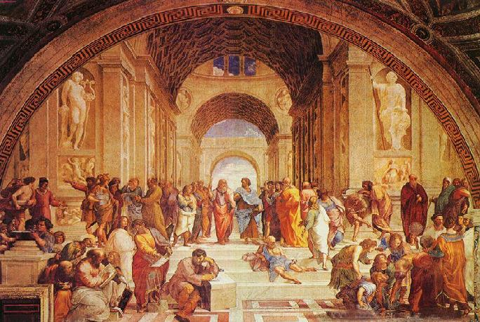

# ＜天玑＞启蒙神话破译（一）：雅典游记

****"赛先生是个分身有术的钟点工，谁要是肯花钱肯花力气肯认真找他，他都会上门来帮忙。德先生却像一个喜好隐居的逍遥侠客，时刻踩在天时地利人和的点上行路。不顺着他的节奏去找他请他办事情，哪怕花上再多钱也没用——要么吃上闭门羹，要么请回去的是****CIA或者KGB派出的江湖郎中，将小有可为的国势弄成无药可救。"****

ibeidou.org

**ibeidou.org **

### 

### 

# 雅典游记

ibeidou.org

## 文/李旸（北京交通大学）

ibeidou.org ibeidou.org 据听闻，一个健康的现代国家是有民主与法制相伴的。再往前追溯到曾于我们的前辈中掀起无尽浪潮与余波的五四运动时期，德先生和赛先生是那时的进步青年极度推崇的偶像。对格物与器物之术熟稔的赛先生，算是在20世纪已经被请过来了，他所传达的东西，已经在这片土地生根发芽，结出了不小的果实。于是各位很想再把德先生请过来，因为赛先生虽然做得挺好，但也未能解决所有的问题。参照已知的历史脉络，德先生是一位本国极重要的急需人才。要是能把他请到这片土地，布施一番，恐怕还可以长出又一棵庇荫子孙的参天大树。 说起来挺轻松，但是德先生的秉性与赛先生大不相同，不是说请就可以请来的。赛先生是个分身有术的钟点工，谁要是肯花钱肯花力气肯认真找他，他都会上门来帮忙。德先生却像一个喜好隐居的逍遥侠客，时刻踩在天时地利人和的点上行路。不顺着他的节奏去找他请他办事情，哪怕花上再多钱也没用——要么吃上闭门羹，要么请回去的是CIA或者KGB派出的江湖郎中，将小有可为的国势弄成无药可救。 由于德先生实在是吃软不吃硬，因此为了投其所好，我觉得还是先到他传说中的家乡探探他的底为好。几经周折，我终于通过时空管理局的批准，到古希腊出一趟差。 一从时空隧道落下，我就见到一位面相凶恶的老人虎视眈眈地守在前方，他袒胸露乳，身着长袍，手持青铜长矛，似乎准备狩猎匆匆的行路客。刚一露面，他就端起长矛向我扑来，还好，两人之间的时空裂缝尽数挡住了他的攻击，使他的矛尖刺不进我的身体。我狼狈地扭打了几下，终于将他从身上甩开，狠狠地让他啃了一嘴灰。 “壮汉，你从何处来？”老先生吐出口中摔碎的牙齿，面不改色地说道，“看你一身黄皮肤，你应该是波斯派来的杀手。很好，你们这些乌合之众的野蛮人终于有机会接近我的头颅了。” “我不是波斯人，事实上我根本不认识他们。” “这不重要。那你一定是看上我的庄园了，壮汉。我就知道你不简单，虽然看起来斯斯文文的，但是我的长矛无法伤你分毫。我想你一定是已经通过斯巴达镇守的温泉关了，我败在你手里也不冤枉。来吧。杀吧，剐吧，驱使我吧，这是征服者应得的福利。” “我不是什么壮汉，也不是什么杀手，我不想伤害任何人。事实上我来到这里只是想找你打听一个人，一个叫做‘民主’的家伙，他的外号是‘德先生’。” “‘民主’？‘民主’这是什么怪名字？我压根就没听说过。我只知道斯巴达、马其顿、波斯、迦太基……还听说过有个叫罗马的新人。但是别说我不认识‘民主’，我连哪对父母能够给孩子取这种怪名字都想不到。” 这么说来，德先生的家乡不在这附近。听完他这番话，我转身便欲离开。 “德先生……你刚刚说的是德先生？” 我愕然回头：“是啊，我要找德先生，至少我想找人了解一下他。” “老夫雅典，外号就叫做德先生。你要找的那个人不会是我吧？” “肯定不是！”我斩钉截铁地说，“那位‘民主’德先生德才兼备，不但行侠仗义劫富济贫，而且还不时拜访无道之国，将他的倚天剑插入该国土地，植作一株幼苗。待到幼苗长成参天大树，便会吞食不义之人，令乱臣贼子畏惧。你这么一位占道抢劫的强盗，也敢妄用德先生的名号？” “我怎用不得了？我没见过你说的那位德先生，但是我就是叫德先生。在我之前，没有人叫过德先生这名字。”老家伙信誓旦旦地说道。 “那么……”我斟酌着用词，“你有没有儿子？或者说你以后会不会生个孩子，他将来要继承这德先生的名号？” “笑话！你是不是不晓得这个世界是个什么形势，怎么会说出这种昏话？北方的斯巴达早就对我虎视眈眈了，打算等我哪天虚弱了，把我捉去当他的佣人使唤。再往北边，有个叫做马其顿的小伙子，等他强壮起来，这爱琴海边的所有人都将仰视他，给他纳贡称臣，否则会被他乘着神马踏成碎肉。往西了去，更是有着无数的壮汉对我们虎视眈眈。就这种局面，谁敢生个精致柔弱的孩子，有空闲将他慢慢养育大？在这个世界里，我们人人手里紧握着刀斧长矛，彼此之间时刻警惕，不敢互相过多信任。只要松开手中的武器，我们就会是这个下场……” 他让开身躯，露出他身后的庄园。看着田间无数低头劳作的奴隶，我不禁庆幸起自己是个现代人，否则这位老先生恐怕已经打伤我，然后将我捉住带回去，让我像这些卑微的历史尘埃一样无偿地种一辈子地。 “我不会活到自己有个儿子那天的。这个世界上有太多的比我更强壮的壮汉，他们一定会在我有子孙后代以前把我捉住，投到他们的庄园城镇里的。到那个时候，我做什么都得遵循主人的意志。”老人家长叹一口气，“你知道吗？我是一个哲学家，还是文学家、戏剧家，我写的剧本，是当今最好最卖座的。可倘若到了那个牢笼里，什么自由意志都将化作浮云。我将被迫放弃自己的思想，挣扎求存，每天用我的哲思为主人编写阿谀之词来换取好一点的待遇。这是我逃脱不了的宿命，我现在只期盼它晚一点到来。在它到来之前，我希望能够尽情享受每一天。” “于是你就将这些人捉来逼他们为你操劳，让你闲下来尽情享受生活？”我厌恶地回答他。 “这个世界就是这样的，不是我捉他们，就是他们捉我。相比之下，我的生活比较哲思比较精致，让我做他们的主人享受那些闲暇，显然可以让这个世界更多彩。” 我撇了撇嘴，不置一词。 “你知道为什么我叫做德先生吗？就是因为我闲下来后琢磨出来的一个东东。”他拧了拧胡子，然后他的脑壳自动张开，一个广场从里面露出来，里头坐着无数的小人。“别的壮汉脑壳里头一般就只有一两个小人长期指挥身体的一举一动，要是他们贪赃枉法玩弄权势，别的小人会很不好过。在我的脑壳里，小人们都定期赶过来开会，可以进行制度性的监督与基于公共利益的决策与选举。这样小人们就很少发生不愉快了。他们只要定期放下手中的工作，赶来开会议事，别的壮汉身体里时常发生的那些致命疾病我都不会有。也正是因为这一系列公平公正公开，我才有机会成为比别人更为伟大的哲学家和思想家。” “这倒是不错，确实有点像那位德先生。”我摇了摇食指，“但是呢，老是开会来开会去的，你的身体岂不是经常得休息？你有这么壮的身子，这么高速运转的脑子，误了农活可是喂不饱的啊。” “谁说我要做农活了？他们是干什么吃的？”说罢老先生便给田间一位小个子赏了一鞭子，“听什么听？老爷们说话什么时候轮到你听了？干活！” 这真是一场令人丧气的访问。这位雅典老爷子也唤作德先生不假，却是一位身体健康而有学问的地痞路霸，除了有兴趣谈论世界本质和理想国，手里的长矛和皮鞭也舞得嗡嗡响。待听闻他必须依靠吸食奴隶们的血液才能维持他智慧的大脑运作之时，我以最快的速度告别了他。 临走之前，这位雅典德先生告诉了我“德先生”称号的全名——Democracy。其中Demo是指他身体里的那些小人，而cracy代表这些小人对他的身体的共有主权。按照我们这个时空通行的话来讲，那些小人属于奴隶主阶层，因而Democracy的实际含义是“奴隶主主权”，而非我之前以为的“民主”，即“人民主权”的汉语缩写。身居奴隶主之高位，并且依赖这种地位来供养他畸形的大脑，这便是这位德先生如此残暴冷酷自私，却又有闲聪慧富足的缘由。 由此看来，我所要找的那位德先生与这位雅典德先生虽然有相似之处，但却互相不认识不了解，更不会是血亲。因为我心目中的那位德先生首先肯定做得到不打劫不吸血，自己能够养活自己，足以不因自己的饥饿而驱使别人为自己卖苦力。倘若德先生是强盗教头或是吸血鬼，而就算他所走过的地方都布满了德先生一般聪慧的人，可他们的下场除却一个接一个地饿死，便只有互相残杀相食永无宁日，一如我当时所处那个野蛮可怖的时代。 那位大名唤作“民主”的德先生啊，你到底在哪里？我记下这个时空坐标，然后往之后的时代行去。 ibeidou.org ibeidou.org

（文编：麦静 责编：黄理罡）

ibeidou.org

ibeidou.org
