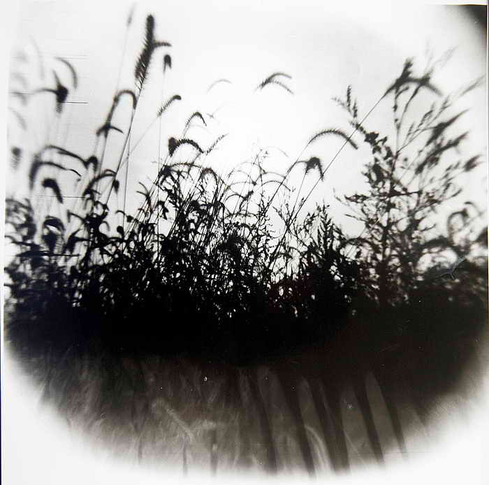

# ＜天玑＞启蒙神话破译（七）：十字架之路（下）

**“我希望我们的子孙比我们更幸福，希望人类的黄金时代永远延续，而恐怖的旧时代，我要它不再回来，永远不要。 可是它从来没有发誓它不再回归，也没有后来人将之视作仇寇，为它设下阻拦。我怎么真的向自己确信，人类曾经的失败不会再被复制？ The reapers are coming.”——摘自洪荒行者游记。**  

# 十字架之路（下）

## 文/李旸（北京交通大学）

 

暴风雨持续了整整一夜，隆隆雷声竟不能与轰轰炮响争鸣。而我却已打点好行装，在喧嚣中安眠。

这个世界已然醒来，揭开沾满灰尘的棉被，热火朝天地干起来。虚伪的安定一去不复返，被炮火烤热的鲜血海洋，开始搅动拦阻它们数千年的堤岸。在这风雨中，大半个世界一齐摇摆着，既期盼着一个新世界的诞生，又恐惧于它陌生的面孔。

这里还不是我的家，新人类恐怕还要再争斗上一百多年，才能到达我所知的那段彼岸。既已知道结局，又有许多前人留下过无数游记，再待在这里，意义并不大。也许我该走了。

一道闪电穿过我的头脑，狠狠地炸响。不，才没有到此为止呢，我不能就这么离开！我带着行装，面朝着闪电的源头冲去。 

大英图书馆的一张桌前，我见到了我想见的人：藏在厚厚一叠书后的大胡子马克思。

“我现在很忙，东方人。如果你想参观什么脚印的话，抱歉，我既不是这里唯一的来客，我的脚印和别人的也没什么两样。”

“我不是来问这样的问题的。”我解释了我的来意，诉说了自己在一路旅程上的所闻所见。

“又一个来自将来的旅人吗？”大胡子摊摊手，“我是留下了著述的人。我的主张，相信大多数都可以经由书本被生于我身后的人熟知。既然不是寻求原教旨的党徒，又何须大费周章来这里找我？对于你所讲述的事情，我恐怕并不比你知道得多。”

“如果要说为什么的话，那便是因为我看到了残酷的历史，而你对它的这一面毫不避讳。站在百余年考古成果的肩膀上看，你对旧时代的解说并不如人意。你所发掘的许多规律在你和随后的许多时代都适用，但是恐怕并不算是通则……”

“……打断一下，每个人的所言所述，都有对有错。我不过是我所在的时代的一个人，只能够运用到我所能及的材料与判断力，不值得将我的对错拔高，定功或者论罪。”

“我了解。我只是想说，不像韦伯或者许多活在我们那个时代的学者，你从不回避历史残暴的那一面。而在旧时代，阶级间的矛盾斗争是远比当代更为明显的存在，回避它毫不可取。”

“或许那便是你要的答案了。我好像已经在书上写过类似的话，火药打穿了骑士，炸开了城堡。人类今日的局面，是摆在人类生产力发展的大道上的。”

“恐怕不是这样。首先，就史实而言，火药诞生之地本在这个文明领域之外，若没有蒙古帝国的大扩张与收缩，造火药的技术哪能那么快传到西方来？其次，你从历史中抽象出的生产力这个概念过于抽象，同时它还站立在一个预设结论上，那便是技术发展与人类社会进步的同步性。也许我该着重强调一个历史事实：屈从于奴隶主阶层的统治利益，尽管一直处于青铜器量产时代，可是许许多多的奴隶却被逼着继续使用石器作为劳动工具，而他们这样的依附性人身关系是被毫不留情地强加于身的，这样的生产力与生产关系是被决定着的，而不该反过来说，它们决定着什么样的社会形态。”

“我想你至少不能否认是阶级斗争在起作用。每一次，人类都还是通过阶级斗争，才得以摧毁旧时代，走向新天地。”

“是的。只有睁眼瞎才不肯承认阶级斗争在旧时代如此明确地存在。但是阶级斗争既然是斗争，那它便也是双向的。回溯历史，比起反抗者不绝的斗志，生命力更为旺盛的反倒恰恰是奴隶主们。他们几乎每次都获得胜利，假如失败也是败在外敌而非奴隶手中。

“或许你对阶级斗争的话可以倒过来说——由于奴隶主们在阶级斗争中一直保持优势地位，人类社会的发展竟几千年如一日，未得寸进。由下而上的阶级斗争确实有可能推动社会进步，但是请看看记录——人类社会竟在那样野蛮的时代停滞了如此多年。进步了吗？说是渐进都勉强。”

“那你想怎么看待那样的时代？”

“正如人类后来意识到整个人类世界就是由各种多元化的社会构成，不能仅仅用其中的一种社会作为唯一标准，人类也同样认识到人类社会的发展，无法用单一一杆进步与否的标尺来标定。人类通过征服他人来追求自身利益的时代远比人类通过努力工作于物资流通中取得较高份额的时代要长，尸骨堆砌的城市远比吊车吊起的城市要多要久。古代的恐怖社会照样有它的顽强生命力与自洽逻辑，不会有不请自来的天谴让其消亡。作为一个现代人，路过罗马的时候，最让我惊叹的既不是罗马人的穷奢极欲，也不是异族于此的悲苦难耐，而是罗马本身的‘合理合法’。”

“‘合理’？‘合法’？”

“不只是罗马了，这世间哪群征服者不将他们的征服与收割看做他们无可置疑的逻辑一环？刚到罗马时，我觉得那些罗马人精神不正常，而反过来——他们也对我这么看。而事情的真相并非两者之一，而在于我们是两种不同的人类。又或许该说，同样是人类，但是行为模式可以截然不同，被完全不同的逻辑所支配。我与他们间的差异，远比我与活动在20世纪中前期的纳粹党之间的要大得多。但他们却可以自洽于他们的那套体系中，或许比我们还感到自然。他们视奴隶为工具：生产的工具、生活的工具、教育的工具、享乐的工具。奴隶主对奴隶没有仇恨，正如工业时代的人们不会跟机器过不去。他们只是无情地驱使工具，冷酷而淡然，没有不安。他们视奴隶为资本：他们被捕获、被输送、被投入市场、被购买、被圈养、被消耗。因为符合一系列后世所作的定义，后世的学者竟可以将巅峰时期的罗马视作近于资本主义的存在。当我们放下人人生而平等的新人类共识，我们会发现，过去的文明其实对我们毫不遮掩自己的面目，因为他把我们所唾弃的视为恐怖异端的理念当作理所当然，坦率得让我们发指。”

“对于十九世纪所关注的问题来讲，你所说的这些太超前了。”

“没有超前，我们原本还在一个起跑线上。这是因为，启蒙是一个谎言，是新人类的一场造神运动，它不但欺骗了你，也欺骗了我。你我的前辈，曾于旧人类中选拔神明，去为新传统奠基。借用中国已有的一个说法，此举与孔子、王安石和康有为所为没有什么差异，都可以算是‘托古改制’——为了建立新秩序而借助旧神明的权威，哪怕旧权威的本意与此相差甚远。”

“那，又何谓旧权威的本意？”

“人类文明从来没有走在一条唤作进步的单行道上，它可以走向的道路有许多条。其中有一个方向是我们新人类的路，而他们旧人类活在截然相反的方向上。这两条路绝不相交，走了这条就不能够同时走那条。与其说新秩序生于蕴于旧传统中，还不如说它终于努力砸碎了旧秩序的镣铐。雅典的所谓民主是奴隶主主权，要来真的民主，非得把它砸得鸡飞狗跳不可。罗马的所谓法制共和，是他们一个族群的内部分赃。要来真的法制共和，非得把罗马整个掀翻不可。革命不是请客吃饭，来不得彬彬有礼锦绣文章。要打烂一个旧世界，才会冒出来个新世界来给我们涂抹新的篇章。所谓启蒙与进步论，不过是借用旧神的名号，用他们的大名来为我们在新世界的涂抹调色。但是新人类才是真正的执笔者，他们沉眠于他们的乐园，而我们在建造我们的天堂。说真的，其实他们根本就不配给我们提鞋。”

“也许是这样。也许。”马克思捏了捏自己的大胡子，“我是一个不拘于传统的人，直言我所想所见。也许你的这些想法更应该去找伏尔泰卢梭他们谈谈，而非来这儿找我，不是吗？”

“正是因为历史它的残酷，你没有像别人一样，用故作温柔来曲解它，用迷信进步来回避它。所以我才觉得如果这个时代有人值得一问的话，那个人大概该是你。有没有造神，有没有神话什么的，其实都不是那么要紧了。对人类来说，追求现世的幸福，比起追忆不堪回首的过去应该更为重要才对。”

“那你更该把我晾在这儿才是。在这个大变革的时代，恐怕有很多人比你更需要我。”

“如果你能回答我余下的问题，我并不介意马上收拾行李回家。”

“请讲。”

“为什么马克思先生你没有重蹈此前上千年反抗组织者的覆辙，在书桌前善终，却没有飞速地死在屠刀下？为什么不再有城堡网络环绕着每一片村落，作‘铁壁合围’态？为什么人们成群结队地持着步枪，而非‘晨星’之类的简易农具改装武器，可以在铁骑的集团冲锋里播撒死亡与恐惧？为什么你们敢于自信于自己的力量，大声喊出‘无产阶级联合起来’的口号，而你们的敌人必须通过分化瓦解而非攻城拔寨血流千里的方式抗拒你们的联合？

“为什么经历了千百年的失败，多数人的自由意志终于可以高高飘扬？难道唯一的理由只如欧美的说教电影所述，因为这自由意志它一直存在着？又是因为什么，我们终于逃脱了那无尽而恐怖的征服者周期律？新的人类又从何处开始迈步，砸翻了那万恶的旧世界？我不再想听启蒙神话版，我想听听真正的答案。这很重要，因为这个崭新的时代是我们新人类最宝贵的财富之一，它值得我们珍视。可如果我们不知一样事物从何获得，我们怎么知道自己会如何将其失去？如若我们不知自己从何而来，怎知自己往何而去？”

“……那你有自己版本的答案吗？”

“也许有。”

“而我却对此毫无头绪。它们在一个全新的未被探索的领域里，未被我们前人所及，唯有靠你们后人来解答。你已经对人类过去的面貌讲过许多了，我想反过来问你，莫非你真的担心人类真的有可能一步踏错，回到过去那种境地？”

“不只是担心那么简单。现代人还活在启蒙神话的迷梦中，被自己造出来的神明所迷惑，不知自己所处的真正位置。如果再伴以更多盲目的脚步，迈过红线倒退回深渊也未必没可能。”

“那又该怎么办？”

“命运给人类留下的数千年的暗无天日不值得去回首，更不值得去膜拜。让神们走吧，我们抛下那旧神，也不要创造新神。上帝创末世，人说要有光。这世间从来就没有天赋的人权，只有人赋的人权。世界变得亮敞了起来，不是因为天变了，而是人在变。这光没有从天上来，来自你和我。人说要有光，那光来自你我。而那旧神们只不过像月亮般，将光芒借了去。这世间没有一条唤作进步的高速传送带，自动地将人类往天堂推送。马克思先生，你与你的许多同志为我们所做的贡献，我们将永远铭记。路是靠人类自己的脚掌走出来的，这世间没有神，却幸而有你。”

“谢谢你这么评价我。今后的路看来我帮不上什么，唯有保重。”

我向他做了一个揖，消逝在白光之中。 

（本专栏完） 

文编：麦静；责编：黄理罡

 
