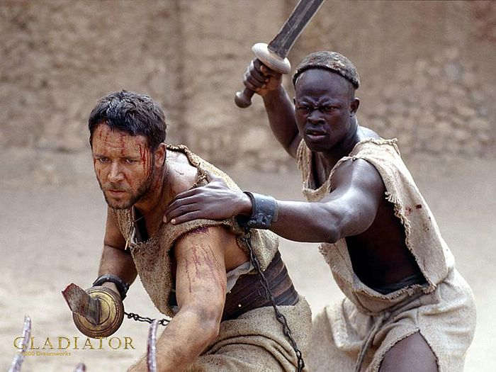
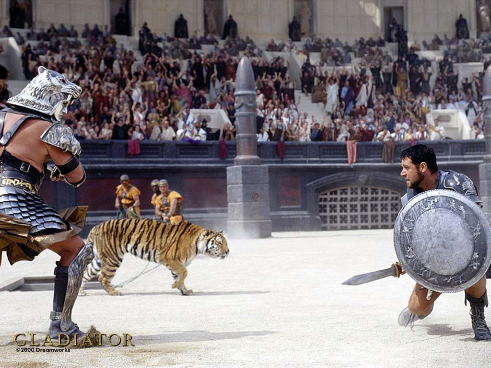

# ＜天玑＞启蒙神话破译（三）：寻找法治之罗马浩劫（二）

**“用物质上的富足来代表文明程度的想法是与GDP主义如出一辙的谬误。不难看到，大多数显赫的古文明都是强盗文明。正是因为通过各种手段榨取他者，让他者入不敷出，他们才有机会在物资生产那样贫乏的非工业时代独树一帜。”——摘自洪荒行者游记。 ** 

# 寻找法治之罗马浩劫（二）

## 文/李旸（北京交通大学）

 罗马斗兽场，罗马城。 两排衣衫褴褛的角斗士站在这按时按量消灭人类的宏伟建筑物里，望向最高的看台，听候他们命运之主人的安排。 “角斗士们，今天为了迎接一位来自东方的特别客人，几位大人物特意恩准你们参加一场特别的游戏。为了让你们尽兴，我想先表达一下我们罗马人的诚意。从这一刻起，你们自由了。” 人人都无动于衷。 “呃呵……”主持人尴尬地笑了两声，“你们都是行家，懂得这行的规矩。各位明天的自由得靠各位今天的生命来换，所以呢，可以给大家赏一点儿装备。” 一把锈迹斑斑的短剑，一张破破烂烂的盾牌，和一对长得过分的希腊长矛被丢进了场中。本来沉寂的角斗士队伍，顿时骚乱起来。为了争抢这几件粗陋的武器，角斗士们使出了浑身解数，不一会儿便有几人倒在场上，肠穿肚烂，很快失去了生气。 

“好！”被鲜血刺激了的观众们兴奋起来，将他们手中的食物往场中抛去。有人跳起来大喊道：“斯达巴克斯，杀了他们，把他们统统都杀掉，你行的！” “斯达巴克斯！斯达巴克斯！”越来越多的人大喊道。 “够了！”场中一位大汉对身边的角斗士吼道，“你们难道不知道等会咱们要面对的是什么吗？我已经感觉到嗜血的虎狮在等着畅饮我们的鲜血了！不要跟我抢这把剑和这面盾了，你们都给我住手！” 角斗士们面面相觑，不一会儿竟停止了彼此间的争斗。他们当中两人拾起那两根长矛，与余下的赤手空拳者站在一起，一齐朝着入口排开阵势。 “你们这样违反了游戏规则！”主持人吼道，“只有最强者才该活下来，这是规则！” “我们就是违反规则了，”那位叫作斯巴达克斯的壮士回答，“你们的法律给我们下的定义是享乐用的消耗品，但我们自己知道自己是人，原本平平凡凡自由自在的外邦人，只是被你们掳掠而来，强加以角斗士的定义。” “我说过你们已经自由了，不要给脸不要脸，自寻死路。你们要是认认真真按着游戏规则来，兴许会有几个人活着下来。可是你对罗马一再出言不逊，等待你们的将是被碾成齑粉。与罗马对抗，从来都是没有好下场的。开笼，放兽！” 一只老虎，一只狮子，从闸门里放出来。作为吞噬过无数角斗士的猛兽，他们并未急于冲上前去撕咬一番，却也排开阵势，缓缓迈步走向这群角斗士，不时发出低沉的吼声。场中众人得见此景，莫有不心惊胆战者。 “贵国也有这等享乐么？”主持人突然向我发问。如果我没有看错的话，还带着一丝得意。 回过味来的我冷冷地回答：“我国先哲孔子有云：‘苛政猛于虎’。贵国政治，竟以驱虎狮于人为乐，实乃这句话最贴切的写照。” “因为我们属于文明，而他们来自野蛮。那些野蛮人并未开化，与其使之在愚昧中度日，不如让他们为我们的文明发点余热。” “我不想听这种解释。在我们国家，奴隶身份是一种对平常人的惩罚，惩处触怒了当权者的人或是罪犯。我只想问他们犯过什么罪行，或者做过什么事情，值得让他们被如此对待。” “没有，他们只是被罗马选中的。” “以文明的名义？Civilization？”我讥笑道。 “你们那个时代的来客很多都像你这样，只问对错，不问好处。你不觉得你们对事物的看法很片面么？” “每个时代的人都各自有其眼中的利益。但是随着文明的演进，对于获取利益的手段的限制却越来越多。我们所受的教育，禁止我们为了利益而奴役他人。不只是未来人类如此，与你们同时代的中国也接近于这个程度了。请你告诉我，你所说的文明是什么？那些所谓不开化的人，很多都与你们无仇无怨，可你们却存心找碴，世世代代蹂躏他们。请你告诉我，相较而言，是不是你们更加野蛮，而他们更为文明才对呢？” “文明需要力量才能够抵御野蛮，不被它侵蚀。我们只是更强大而已，而强者理应如此。如果他们具有更强大的力量，难免也会以这种方式对待我们。” 

我回头看向场中那些正在为生存而死斗的壮汉们，他们正前仆后继地与猛兽搏击着。那只老虎已经在一些赤手空拳的角斗士引诱下被长枪钉穿了，可那只狮子并未中相同的计谋，还扑倒了好几位角斗士。假如有一天他们的民族强大了，那么驱人搏兽会不会也成为他们的取乐方式呢？我可以假设那样的未来，却无法以此忖度别人。 我不禁想起了上次见过的雅典德先生，以及他美丽的庄园。他虽然没有设立这么残暴的娱乐场，却也当得起这般的残暴。毫不留情地奴役、驱使异族人民才是他们相同的本质，使唤这些人去种地或是去与野兽搏击不过是手段与力量上的差异罢了。从这个意义上来说，罗马并不是始作俑者，就算它倒下了，也还会有后继者接替它的位置。它只是这个时代的强中之强、最后的赢家。 突然间，我明白了Civilization的含义，那绝对不是文明。至少，它在这样一个时代的含义，绝对不是我们现代所通用的意思。那些居住在City中以Citizen自称的人们，在这个技术落后的时代却能够远离直接的农业生产，在闲暇与淫乱中享受生活，他们物质富饶，精神饱满，便使用了Civilization一词，以此将他们与那些缺衣少食，缺乏自由，没有多少精神生活的民族相区分。然而借用陈胜吴广的话说，文明显赫之族宁有种乎？ 古巴比伦是文明，古埃及是文明，古希腊是文明，迦太基是文明，古罗马是文明，将来跨着战马提着长枪的骑士们，也会被称作文明。现代的人类发掘出古代的遗物来，总是惊叹于这件古物，感慨于那座古城，将这些器物标识为文明的象征，进而借其与其他民族攀比祖上的阔气，却很少去想象那样的时代，人们到底过得怎么样，发生过怎样触目惊心的坏事，有没有一些残暴的体制存留过。简而言之，这都可以唤作“文明拜物教”。 这就是文明么？我看着脚下壮丽而血腥的斗兽场。如果古时没有水泥的发明，我想这栋建筑会耗费更多异乡人的生命来建设，更不必说它本身的建造目的是何等暴虐了。故土的国防工程长城尚且有被孟姜女哭倒的传说，这座按时按量消灭人类的宏伟建筑物，又该由谁来哭倒？理应更多。可这辉煌壮丽的罗马城，容得下一位孟姜女吗？ “你们的家庭呢？”我很想向角斗士们提这么个问题。不过且不说他们正在与狮子搏斗，就算问了，也得不到新奇的答案。国破之人，多半家亡。他们的孟姜女，要么是在窑子里，要么在做苦力，而最幸运的那些，已在土中。 我又看向台上欢笑地观看着虎狮残杀人类的罗马人。他们刚刚已经坦率地承认了，自己之所以耗费人命与粮草，奔赴异域他国，就是为了亡他人之家，欺男霸女，就是为了过上今天的好日子。而过上这般吃穿不愁、享乐不断的好日子的人，不就是所谓的“古代文明人”么？他们文明吗？ 

“是的，文明需要力量才能抵御野蛮，但是你们还没有资格去了解什么叫做文明。你们也只是一群野蛮人罢了，不过是抢夺了许多衣裳，拼出五彩斑斓的华服给自己穿上，看起来不像是野蛮人的样子罢了。这无非是沐猴而冠。抱歉，将当初用于楚霸王身上的成语安在你们头上，真是抬举你们了。” 我飞身跃入斗兽场中，用我免疫伤害的双臂夹住了狮子的前肢。还能动弹的角斗士们见机迅速冲上来，将他们的武器插入这头猛兽的胸膛。它抽搐着，张开血盆大口，向我喷出恶臭的气息，发出惊天动地的嚎叫。我冷静地将它有着美丽金发的头颅扭过一百八十度。从今往后，它的容颜，再也无法迷惑我。 “我所处的位置，该是你们这边。” （未完待续） 

### 

### 

（文编：麦静 责编：黄理罡）

### 
