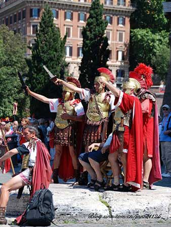

# ＜天玑＞启蒙神话破译（二）：寻找法治之罗马浩劫（一）

**“罗马人为了赢取一个属于他们的世界，不惜抛头颅洒热血。而在他们的世界的背面，却是无数被他们贪婪与野心生产出来的奴隶。由此看来，自由并不一定是被人类所共享的。Your liberty might be my slavery.”——摘自洪荒行者游记。**

# 

# 寻找法治之罗马浩劫（一）

## 文/李旸（北京交通大学）

  上次寻找德先生，功败垂成。想来想去，我觉得自己恐怕还是来得太早了些。  这个时空恐怕还找不着尚未出场的民主德先生，而东西混血儿赛先生此时还在牙牙学语，我只好去往之后的时空，并星夜兼程，往西北行去，去寻找传说中另一样本国急缺的宝贝——外号唤作劳先生的“法治”。 

### 

 意大利，罗马城。  一改一路上的凋敝景象，我眼前出现了一座华丽的城市。气势磅礴的石质建筑群填充了我的视线尽头，与我在外面所见的那个饥饿而物资匮乏的世界完全不同。这里的人们气色丰润自然，神情安然自若，恍然间，我惊觉自己已来到另一个人间。  “东方的来客，欢迎来到罗马。有句话叫做，条条大道通罗马，不过像你这样有着东方肤色的，在这里还实在是罕见啊，”一个看起来能言善辩的商人凑近我身旁，悄声对我说，“言归正传，东方先生，你有丝绸或者瓷器吗？那些来自你们家乡的亮亮闪闪的小玩意儿。”

  “没有。”我摊了摊手，“除了这身皮肤，我没有什么东西还属于遥远的东方。”  “你若不为财帛而来，此行又有何意呢？”  “我想来寻找‘法治’，据说他又叫做劳先生。我听闻他居住在贵国，又见贵国繁盛异常，遂起拜访之心。我国之法非国法，皆王法、大夫法，刑不上王室与大夫。此法面前，人人不等，遂有李刚之子等宵小肆意妄为，为害邻里。愿来问得‘法治’之真谛，为我国求安定太平。”  “罗马竟会有你这样的来客……”商人闻言愕然。“我不曾听说有一位劳先生，不过我国以法治立国，这倒是很清楚，”他眼珠一转，生出个主意，“我在元老院颇有些关系。年轻人，我为你引见一下几位长老，你也多讲述些东方见闻，好替我讨讨他们的欢心。”  “成交。”  在雄伟的斗兽场里，我见到了几位据称在罗马身居要职的长老。他们身穿蚕丝织制的长袍，身上穿戴着各种我认识或者不认识的珠宝，坐在高高的贵宾台上，居高临下地俯视着场中。穿过站立在他们身边的一圈护卫，商人领着我走上他们的看台，并在他们耳边窃窃私语了一番。  “噢，听说你是中国人？”一位长老首先发问。  “是的，我的确来自那个文明古国。”  “你们的历史要比我们悠久嘛，”这位长老拨了拨身上的长袍，“早在我们罗马还是个破败的小城时，你们织制的艺术品已经是地中海沿岸有市无价的宝贝了。你们的各种宝物，换走了我们罗马的无数银钱，又怎会不富饶兴旺？莫不是兵器不如人，以致被掠夺欺辱？”  “我国所用之铁剑，利贯寰宇，可制三尺有余而不曲不脆。我国铁骑持之，可以一敌三有余，破夷蛮于其巢。我国所用之强弩，无坚不摧，可射三百步，于近处可透重甲。我国壮士持之，敌阵未近便已死伤狼藉。此两者，罗马可及否？”  “闻所未闻。”各位长老皆瞠目结舌。  “刃利而国富，此强国之势也，”另一位长老接过话头，“我们罗马人所一直追寻的，也不过如此。枉法小事，又何足道？”

### 

 “我国国富，可国人不患贫而患不均。我国不仅财不均，公义亦不均，贵国过去在王政时期所曾陷入的困境，我国至今没有彻底走出来。这就是为什么我仰慕贵国之法治，为什么要来到这里。”  “我国之法治，确为古时之所无。我国律法均刻于铜表之上，对罗马公民一视同仁，不可任意解释篡改。自它诞生以来，罗马国势更加蒸蒸日上，仅数百年便立于强国之林，现在更是称霸天下，未有敌手。”说罢，他摸出一张羊皮纸，上面写了十数条法令，接着说：“既然贵国亦如我国当年多有不公，便依此按律施行即可。”  “让我看看。”我从耳上摘下时空管理局给我配发的万国翻译机，将它的探头对准这羊皮纸，让它一句句读出这些条文。听着听着，我的眉头却越皱越深。  “贵国律法听起来稀松平常，并无新意。而且我以为，一张纸一页字并没有太大效用，”我抬起这张羊皮纸，“别说一张纸十几条法令，我国学者都不知引进了几个法系多少厚厚的法典了，照样不顶事。”  “法治法治，有法还要有治。王政立王法，以王法治。破王法还得破王政，不过此乃前人事迹，我了解不多。总之，我国国政照此运作后，并无大恙。”  “就算依你这么说，我也不觉得这套律法适合我的国家。我国并无公民之说，也没有如此多的奴隶需要治理。我国人民虽然大多不如贵国公民富足，却也自食其力，勤劳谋生，并不依靠驱使低贱之人致富。”  几位长老窃窃私语，继而哈哈大笑起来：“你们谁听说过这样的国家吗？哈哈，哈哈，哈哈哈……”  “这有什么好笑的？”一直在讨论严肃的问题，我很困惑这些罗马人在笑什么，“我刚刚讲了个冷笑话吗？”  “哪有这么傻的国与民？有了利刃，就该挥向邻里。以武立威，以威取利，有智有能者，驱使万国为一族利，此乃数千年来的普世价值。贵国之富庶源出勤劳，却不知武勇不仅致富，更可求欢。”  话音刚落，有人一挥手，便有几名肤色各异的美丽舞姬跳上看台，衣着暴露的她们扭动着身躯，浪荡的舞姿吸引了周围大量雄性动物的注意力。  “这等舞姿，贵国也有否？”高台下一个声音喊道。  “这不稀奇，我听闻我国达官贵人家中也有这等舞姿。”  “真是笑话，哪国达官贵人家中没有这些？可是在我们罗马，殷实人家也可有这等消遣。贵国的乡野村夫能比吗？”  “不能，异域舞姬，可遇不可求，总有价也无市，也少有人可以养得起。”  “不对，异域舞姬，可遇更可求，只需兵进异域，屠城灭国，想抢多少就抢多少。之后再在当地课以重税，让他们代代卖妻鬻女以相抵。自此之后，异域舞姬将无穷无竭，又怎会再现有价无市之窘迫？”  “兵者，国之凶器也，用之不可不慎。战场上情势千变万化，贵国怎知自己一定会是交锋中的胜者？再者，凡是用兵，都不可避免要消耗资财粮草。兴兵为不义，又值得否？” 

  “哈哈哈哈哈……”诸位长老齐声狂笑，“你连这都不懂得？我们就是为了异域的资财粮草而去的，比之将会得到的收益，消耗一点儿又算什么？纵是败了，罗马城里还有无数的婴孩将会成为英勇的战士，更是有无数的异国叛徒钻破了头想加入我们的行列。”  “战争都是要死人的！你们就不怕死么？”  这一次，四面八方都传来了不绝的嘲笑声，整个罗马城里的人们都异口同声地回答我：“没有前辈们的艰苦奋斗流血牺牲，哪有我们子孙后代今日的幸福生活？！”  斗兽场里的人们说：“没有他们，我们哪能聚起人力，修起这么宏伟的斗兽场？哪能捉来这么多奴隶充作角斗士，让他们为我们每日的欢乐而争斗？”  大街上的人们说：“没有他们，我们哪能每天吃上免费领取的面包？哪能天天趁着闲暇，到欢乐的浴室里聚会乱性？”  兵营里的人们说：“没有他们，我们哪能在异域弥漫的仇恨里扎下营盘？哪能在异国滥施淫威，财富滚滚？”  元老院里的人们说：“没有他们，我们哪能在此指点江山，对世界版图指手画脚？哪能有机会凭着我们的一举一动，夺取各国的财富与土地？”  冥冥之中传来一个声音：“我国的法治，便是以法律来调解公民间的矛盾，其植根于罗马公民们的共同利益，鼓励并保护他们在一致对外时取得收益。有了它，我们的勇武与纪律因此更加凝聚，我们的追求更加一致。有这么美好的一个世界值得我们去征服与夺取，又何须贪赃枉法，彼此争斗呢？”   抛下一脸愕然的我，一位长老站起身来，拍了拍掌：“就让这位来自东方的傻瓜开开眼界吧。快把野兽撤下来，让他看看角斗士们的绝技。”  “野兽加角斗士不是更有趣么？”那边回答道。  “你看着办，怎么有趣怎么来吧。”   （未完待续）   

（文编：麦静责编：黄理罡）

