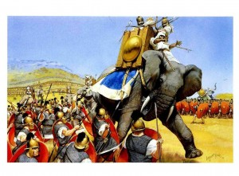
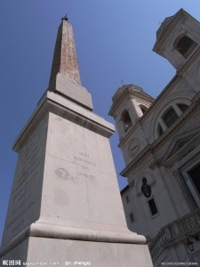

# ＜天玑＞启蒙神话破译（六）：十字架之路（上）

**“罗马它们才是历史的洪流。而我们以及我们将要迈向的文明却不是。自古往今，我步步走来，步步心惊，这是一条被屠杀被钉死的反抗者流淌的血路。征服者周期律，这是人类文明史中深埋的一支主旋律。”——摘自洪荒行者游记。 **

### 

### 

# 十字架之路（上）

### 

## 文/李旸（北京交通大学）

### 

### 

历史在重奏，变奏，主旋律却没有改变。Slavery, slavery never changed. 我漂浮在云端，越过无数时空的界限，用远望之目，无穷无尽地填补着自己未曾于字间所见的事实。可我心虽在云端，却无数次堕入地底。 我是来看文明的，可我看到的却是Man Hunt。自青铜器时代始，人类不同族群间的武力不均衡，给强者的野心泼洒上了借以熊熊燃烧的燃料。这心火与燃料交融，便烧出了文明。 曾经的穴居人建起了高楼，曾经的聚落装点成城市，曾经粗糙的亚麻皮换作了针脚繁密的丝绸，更有奢靡者建起了万吨石料垒砌的墓碑、高悬地面仍然茂盛的花园以及观看人斗人的游乐场。历史是胜利者书写的，他们留下的笔迹傲慢而不加掩饰，至今不朽。而幕后的被征服者们只是将他们的鲜血与汗水灌入墨水瓶，任由他们挥洒。 

 物竞天择，这可以是规律，却不可以是文明。祖先崇拜的光环下，衣冠禽兽们仿佛获取了豁免权，安然行走在我们所认可的文明大道上。我们真的是那些禽兽的同路人吗？倘若我们真的洗心革面了，又怎会再认贼作父？ 我满怀疑窦地，又拖拽了几下进度条，回到刚刚离我而去的那一幕。数千逃亡者，他们在罗马的压迫下度过了许多年，仇恨充斥于心，却抵不过对幸福生活的渴望。他们的自由意志驱使他们去战斗，也驱使着他们满怀对新生活的企望，奔回家乡。他们现在，又在哪里？ 在十字架上，在排满了十字架的罗马大道上，罗马人将他们都捉来，用铁钉将他们的四肢钉在十字型的木架上。虽然相距如此遥远，可我依然能看见他们在哀嚎，看见鲜血不绝地流淌于地。相较那些衣冠鲜明的罗马人，他们衣衫褴褛，大都目不识丁，可他们却更像后来的我们，不是通过奴役他人，而是依靠自我追逐幸福生活的新人类。如同彰显威风展示荣耀一般，罗马将他们如数捉来，以这种姿态钉死在罗马城门外的大道上，作为贯穿它千余年寿命的广告，展示给每一个人看。 看啊，这是征服者的再次胜利。征服者所征服的他族，一定要牢牢控制住，让他们沦为世世代代的盘中餐。被奴役或者去死亡，任你自由选择，任你辱骂诅咒，他的意志依旧坚定有力，他们旧人类，就是能消灭你们新人类，因为他们是超人，他们的征服意志更为强大，可以劈开自由意志的挣扎，让它成为靶子。 “眼见他起高楼，眼见他宴宾客，眼见他楼塌了。”只是，我等了好久好久。往后拖了一千多年，我终于见到了那个嚣张的屠戮者退下舞台。这个运作了千年的体制终于被累积下来的漏洞填满，在萧条中消亡了。然而这条传承自古的十字架之路依然未朽，新鲜的血液依然流淌，常换常新。那些曾经饱受欺压的部族们，又从四面八方涌来，瓜分了罗马和他的田地，成为新的收割者。他们当中掌握了较先进武力的势力，又以骑士的名义走上最高舞台，以保护者的名义给自己戴上名为贵族的新光环。短剑换做长枪，田地界限变迁，收割依然继续，血路未绝。这段被称为Medieval的时代，依旧充斥了mad and evil。几乎没有反抗者活着逃出这个秩序的压制，以新人类的生活方式度日。 

 也就除了那一次：13世纪，瑞士的穷山恶水间，一群农民举起他们新制的巨大长矛揭竿而起，神圣罗马帝国代代传承的铁骑在他们面前，第一次感到束手无策。正当我为新时代的斯巴达克斯到来感到振奋时，却见他们被贵族们花钱雇佣，成为了骑士队的补充乃至后继者，成为收割者利刃的新锋芒，砍向其它的秩序反抗者。他们竟然欣然从命，领了几个世纪的血钱。当今罗马教皇身边高大威猛的瑞士武士，正是这些昔日庄稼汉的后人。 人收割庄稼，征服者收割人。有的刀刃锈蚀了，被换掉，可庄稼依旧被收割。有时候，征服者经营不善，被另一股势力扑灭。可来者没有理由不为他们自己的征服事业而来，他们总会使起自己所擅的利器，建起属于自己版本与风格的乐园。即便未能持久，可又总有虎视眈眈的后继者来争抢田地，为博得如此地位而争先恐后。从来没有解放者，去有力地将收割者赶走，创造出新人类的生活。这世界有着太多的诱惑，足以说服潜在的解放者也去参与收割。 这是一个周期律，或许是我们对欧亚大陆上的人类身上所能找到的最为庞大的周期律，征服者周期律。相较我们所处的人类黄金时代，那些时代只不过是同样一个人间里建起的地狱。 是的，我们是这些人的后人，大家的祖先要么这么吃过人，要么这么被人吃过。如若理念尖锐冲突的人群当真如某些宣传所述，应当互不容忍，那么我们的那一些祖先与我们照面时，或许该被当作我们的敌人，因为倘若他们有趁手的利刃，他们会来吃我们。 又或许可以说，人类的历史很长很长，可真正属于文明的时代却很短很短。比起旧人类曾经涉足的万古江河，新人类的脚印不过星星点点，然而这星星点点的光芒，远远盖过那万古江河的昏暗。We are enlighted people,shining in a way which has never existed. 我们从不认为我们的时代是天堂，新的时代还是有很多罪恶，而我们总认为我们的时代还可以更美好。可我们已然忘却过往时代的险恶，忘记了那些血腥的磕磕绊绊。 我们当真是受到某些传统启蒙的光芒照亮，才由旧人类转变而来么？我们当是真从雅典学来民主，从罗马学来法制，在骑士们的私家法庭里学会了权力与义务？而又当真是敬人不敬神的思潮席卷了西方，才让西方在近五百年里该换了面貌？ 你肯定忘了，或者没有将一些事实放在心上。斯巴达克斯的时代，还没有圣经新约里的事件和人物，更别提天主教会还没有从一个为贫苦人代言的慈善组织堕落为罗马与骑士贵族的走狗——它那时根本还没影儿。可他的同道人们所经受的痛苦，与中世纪奋起抵抗的农民所遭受的压迫相比，形式相似，只深不浅。人类的受压迫史根本不是新生儿，一场教会时代的思想变革，实在太过年轻，又哪里足够将今天与昨日截然隔开？ 思虑间，时间过去了许久许久。忽然间，我听见一种从未听过的隆隆声响彻云霄。低头看去，我看见克伦威尔的骑兵队在炮声里英勇冲锋，又看见巴士底狱上空硝烟滚滚，枪炮声响彻不绝。新人类踏破了旧时代，沾着火药和血冲了过来，他和纯洁与无辜无缘，他当不起他所赢得的狂热欢呼。新的人类依旧是人类，我们书单上所常常出现的十九世纪厚皮书，依旧在讲述新时代的罪恶。民主选举还没有或者尚未完全到来，族群间的冲突与压迫开始以另一些形式重新登场，报刊检查，劳资矛盾……新的问题，伴着新的目标，走进了人们的视野里。 越来越多的人开始嘟囔着嘴，开始他们充满抱怨的新生活。我不了解他们对过去是怎么看的，但是我的想法是很明白的——我不想回去，一点儿也不想再看到罗马他们，一点儿也不。 （未完待续） 

### 

### 

（文编：麦静 责编：黄理罡）

### 

### 
