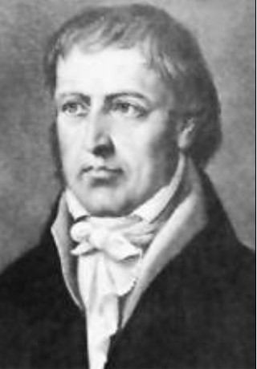
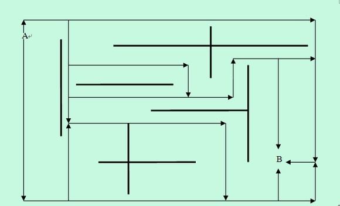

# ＜天玑＞哲学十二钗（一）处女座黑格尔

**处女座的优点是追求完美，缺点是过度追求完美，黑格尔同学一方面追求精神境界的完美，他创建了一个伟大的绝对精神体系，并宣布德国哲学在自己这里到达顶点，无人能超越。另一方面，他追求俗世生活的完美，他的理论为资产阶级革命开辟道路，可他自己又当普鲁士封建政府统治下柏林大学的校长，享受着荣华富贵。** 

# 处女座黑格尔

## 文 / 张明明 (清华大学)

 

黄昏，黑格尔登上高高的山岗，意气风发，心中丘壑万千，他双手指向苍天，用浓浓的施瓦本方言高呼到：啊，我那密纳发的猫头鹰呀，黄昏才能起飞！

风凌乱了他为数不多的头发。

倘若你要问我最喜欢哪个哲学家，我定会咬紧嘴唇，双目囧囧有神熠熠发光答案掷地有声：黑格尔，还是黑格尔。倘若你追问为什么，我会告诉你：因为黑格尔和姑娘我一样是处女座！我们这个悲催的星座，在世间已遭到千夫所指万夫埋汰，能出黑格尔这样一个哲学界大家，对于我这样削尖了脑袋拼了老命要跻身于哲学大家行列的女青年来说，这无疑是黑暗中的灯塔。 

此时此刻，我多么想紧抱黑哥大腿，深情演绎走调版《you raise up》：啊，黑格尔，You raise me up, so I can stand on mountains；You raise me up, to walk on stormy seas；I am strong, when I am on your shoulders；You raise me up: To more than I can be.

我周围有太多这样的文科女，她们研究社会科学已感没戏，于是纷纷投身于伪科学星座学说，在这个领域她们个个身怀绝技，散发出生命的活力和对科研的极度热情。在她们的教唆下，我对星座伪科学也开始逐渐放松批判态度。用她们的行话，处女座是三大土象星座之一，守护星是水星，土象星座的最大特点就是脚踏实地，一丝不苟。和其他一辈子呲牙咧嘴抱怨没钱呀没妹纸呀的卢瑟哲学家相比，黑格尔同志不但结婚，还娶了一位小他20岁的娇妻玛丽，并一辈子对玛丽呵护体贴，在一群放浪形骸的哲学家中，黑格尔无疑是居家好男人，他家庭幸福，事业美满，有三个儿子。不过这三个儿子中，有一个是婚前和情人所生的私生子。

处女座的优点是追求完美，缺点是过度追求完美，黑格尔同学一方面追求精神境界的完美，他创建了一个伟大的绝对精神体系，并宣布德国哲学在自己这里到达顶点，无人能超越。另一方面，他追求俗世生活的完美，他的理论为资产阶级革命开辟道路，可他自己又当普鲁士封建政府统治下柏林大学的校长，享受着荣华富贵。没出息的黑格尔曾对人炫耀道：“我的尘世的目的已达到，一官半职，一个美娇娘，人生至此，夫复何求？”过分追求完美必然导致纠结，黑格尔在俗世生活中很纠结，在形而上的学术研究中也很纠结，这纠结反映在黑格尔的哲学里就是其哲学体系和方法论的矛盾冲突。按照德国古典哲学的传统，每个哲学大牛都爱自创一套绝对真理来完成体系，并演绎论证其完美，黑格尔也未能免俗。然而黑格尔的方法论却是革命的辩证法，它直接告诉世人：一切事物都是暂时的，都具有运动的绝对性，一切现实都会丧失必然性和合理性。于是乎，貌似完美静止的体系和讲究生命不息运动不止的辩证法产生了冲突。狡黠市侩如黑格尔者很会和稀泥：“凡是现实的都是合乎理性的，凡是合乎理性的都是现实的。”专制的普鲁士政府为此沾沾自喜，咱儿是现实又合乎理性的，殊不知黑格尔言外之意：凡是现存的，都是要走向灭亡的！

黑格尔的哲学体系包括三部分：逻辑学，自然哲学和精神哲学。逻辑学由存在论、本质论和概念论三部分构成。自然哲学和精神哲学都属于逻辑学的展开，因此又叫：应用逻辑学。自然哲学研究自然，精神哲学研究人和社会。自然和人都是逻辑学“外化”而成的哲学，自然哲学包括了物理学、生物学和化学。精神哲学分为主观精神、客观精神和绝对精神：主观精神分为人类学、精神现象学和心理学；客观精神包含法哲学和历史哲学；而绝对精神是一个纯粹精神领域，它主观又客观，它是艺术哲学、宗教哲学和哲学史。黑格尔认为自己的哲学是绝对精神的结束，他把握了绝对真理，他是世间万物的终结者，是上帝的自我意识。至此，体系开始沦为模式。

在黑格尔看来，逻辑是存在的基础，精神是万物，因此思维的规律和实在的规律不可分割。然而建立在矛盾律基础上的传统逻辑只适合日常生活和科学，却并不适合哲学思考。哲学要达到更高的真理，需要包纳不断变动的全部实在，于是黑格尔提出了新的方法论：概念辩证法。这种辩证法类似于植物从种子到果实再到种子这样一个发展过程。即命题+反命题=合题。虽然赫拉克利特也曾这样提过，但是黑格尔明确指出合题不是对命题和反命题的简单克服，而是对它们的扬弃。在康德看来曾是真理守护神的“矛盾”，在黑格尔那里开始居于事物的中心，辩证法通过把矛盾本身看作是实在的矛盾本质的表现而克服了自相矛盾的挫折。

龟毛自以为是的处女座黑格尔看不起东方社会的哲学，认为中国和印度的哲学不过是枯燥的理智。他尤其看不起孔子，认为《论语》不过是孔子给弟子们普及一些常识道德，孔子是一位讲究实际的世间智者，他没什么思辨哲学，有的不过是一些老练，善良的道德教训罢了。他还大放厥词：中国人的语言——汉语，根本不适合哲学思辨。这一批评彻底惹毛了一位清华男同学，偏巧这位清华男青年也伶牙俐齿舌灿莲花，他撰文驳斥：“黑格尔尝鄙薄吾国语文，以为不宜思辨；又自夸德语能冥契道妙，举‘奥付赫变’为例，以相反两意融会于一字，拉丁文中亦无义蕴深富尔许者。其不知汉语，不必责也；无知而掉以轻心，发为高论，又老师巨子之常态惯技，无足怪也；然而遂使东西海之名理同者如南北海之马牛风，则不得不为承学之士惜之。”这位清华男生就是钱钟书。其实黑格尔这次的批评相当草率且很不负责任，“奥付赫变”一词德文是“aufheben”其在德语中的意思是对旧事物的批判和继承，并把它发展到新的阶段。这一极具思辨意味词语的中文翻译是“扬弃”，想想农民碾麦子扬场的动作，你就会心一笑，这词译得不仅信达雅且形神兼备，并且相当思辨。有舍才有得，先扬才能弃，其实中文里这样讲究思辨的词汇很是丰富，黑格尔这厮估计没通过汉语四六级。 

处女座的挑剔龟毛人神共愤，在柏林大学任职期间，黑格尔和教授同仁们经常发生口角，几乎要君子动口又动手，黑格尔骂一位逻辑学同事上课“绝对浅薄，愚钝，平庸，没有任何关联的凡人讲台之草，只能在消化时刻显出一颗平头”。可惜，道高一尺魔高一丈，不是不报时候未到，黑格尔后来遭遇了极具骂街天赋的叔本华，从此甘拜下风。叔本华骂黑格尔“平庸，令人厌恶，一无所知的江湖骗子，傲慢，疯癫，爱胡说八道。”叔本华的骂人词汇相当富饶且从不重复，从学术攻击直接发展到人身攻击：“黑格尔是个可怜的精神怪物，长着一副啤酒店老板的模样”。叔本华估计和啤酒店老板也吵过架。

黑格尔名言：“哲学就是哲学史！”哲学流派不同，观点自是迥异。这就是为嘛儿在自然哲学大师罗素的《西方哲学史》里，黑格尔根本不是男猪脚，罗素在《西方哲学史》曾批评黑格尔：“如果承认黑格尔的国家学说，那么凡是可能想象到的一切国内暴政和一切对外侵略都有了借口。”如果让黑格尔的死对头骂街大仙唯意志论大师叔本华写哲学史，那黑格尔的哲学估计就是一坨shit；在美国人梯利的《西方哲学史》里面，黑格尔也不过跑跑龙套，上镜率极低；当然，你若翻翻中国人编的哲学史，由于马克思同学的原因，黑格尔的哲学会占大量篇幅。

黑格尔和许多大师的命运一样：在世时，权倾一时，名声如日中天，然一旦挂掉，毁谤诋毁立马冒出水面。当黑格尔大红大紫时，有一个大胡子青年正在仔细研读黑格尔的著作，他冷静理性，试图找出其理论破绽并撰文批判其学说的神秘主义方面。当黑格尔死后被昔日那群追随者当做一条“死狗”无情谩骂攻击时，那个大胡子青年却很厚道地站了出来，在公开场合不止一次声明：老子是黑格尔的学生！

这个青年的出现改变了世界的格局，改变了东方社会——中国的历史走向，更改变了中国一位普通女青年的人生选择。

那个普通女青年正是我，那个二逼男青年的名字叫做：卡尔·亨利希·马克思 。

作者预告：<哲学十二钗>下期 《混世魔王马克思》。 

（采编：徐海星 ；责编：黄理罡）

 
