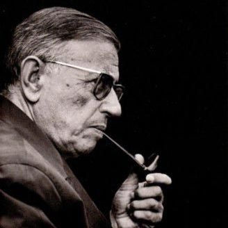
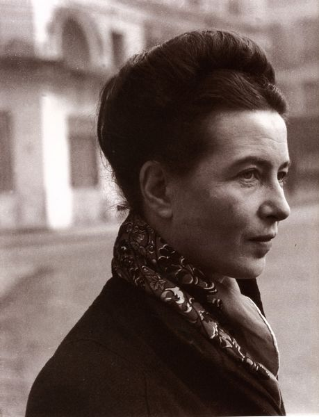

# ＜天玑＞哲学十二钗（七）雌雄大侠：波伏娃与萨特

**平心而论，没有波伏娃，萨特仍然可以成为萨特，仍然可以在存在主义的江湖里，和加缪平分秋色，星光熠熠！可波伏娃没有萨特，成不了波伏娃。一个女人若要和整个世界对抗，若要和整个约定俗成的价值体系对抗，谈何容易！但是波伏娃心无畏葸，当对手敌人上前挑衅，她手握女权主义的宝剑上阵迎敌，一招一式她挥得气定神闲，行云流水，因为她知道：她背后，萨特在！**  

# 雌雄大侠：波伏娃与萨特

## 文/张明明（清华大学）

 

一切要从很久以前的那堂《政治学原理》说起。

那时，我还上大一。《政治学原理》课前有presentation，会加分。赤裸裸的诱惑下，我有天就大步流星走上讲台字正腔圆如ccav新闻联播主持人般，做了一场题为《我不是女权主义者》的关于波伏娃《第二性》的读书报告。报告结束我颠颠儿走下讲台心里还直乐呵：效果不错，效果不错！后来，据可靠消息来源，我班对我心怀叵测蠢蠢欲动本欲下手的几位gg，从此后一个个噤若寒蝉悬崖勒马猛踩刹车。他们私下里评价：这妹纸外表清新森林系，内心金刚又暴力。血淋淋的事实使我不得不承认：我！悲！剧！了！

各位以后当了爹妈，女儿青春期建议教材：《还珠格格》、《一起去看流星雨》。吐血强推！

波伏娃和萨特这对雌雄大侠，我先认识的萨特。和认识大神斯宾诺莎一样，我看了《诺贝尔文学奖全集》，文集里收录了萨特的《墙》和另外一位存在主义大师加缪的《局外人》。1964年，瑞典学院决议颁发萨特诺贝尔文学奖，可大侠萨特大手硬邦邦一挥：“我拒绝一切来自官方的荣誉！”拒了世人梦寐以求的诺贝尔！其实，做人如萨特般精明，当然知道拒绝领奖当然比领取此奖更能惹起世人的关注，更有轰动效应。不过，萨特视一大笔诺贝尔奖金为粪土的精神还是值得大家学习滴。

萨特从小在单亲家庭长大，他很小时爹爹就去世了。在哲学家文学家圈子里有一个经大量统计学数据证明的伪真理：想当大师，你爹是不是李刚不重要，但你爹必须挂得早。只有这样你才能避免父权的管制，不会形成“父亲——上帝”的观念，思想会享受更高的自由空间。比如咱们的卢梭同学、大仲马同学、尼采同学等都经历过幼年失怙。

人不猥琐枉少年，萨特少年时就是个地地道道的猥琐锉男：个子很矮不说，还是个斜眼儿。他锉就锉，还挺色，从小就喜欢追逐姑娘，可惜自身条件太差，姑娘们都懒得搭理他。追不到妹纸的萨特内流满面，仰天长啸：“哥以后要成为司汤达和斯宾诺莎！”多少年后，他果真做到了一半文学家一半哲学家：他左手蘸文学之饱墨，右手提哲学之妙笔，由锉男萨特成功转型为战后“存在主义”江湖里义薄云天的大侠萨特，成为大侠的萨特虽然还是矮个子斜眼但却再也不用发愁妹纸，只见他：

骑马倚斜桥，满楼红袖招。

1929年，在巴黎高等师范学习时，萨特认识了小自己2岁的西蒙娜·德·波伏娃。与世间所有正当龄的小情侣一样，他二位也是：干柴烈火一拍即合山盟海誓私定终身；可与世间所有正当龄的小情侣又不一样，他俩的山盟海誓惊世骇俗：“我们之间永不说谎永远挚爱对方，但我们永不结婚永不干涉对方同其他人的其它爱情！”从此后，没领证的萨特和波伏娃开始了非法同居，他俩非法同居了50年，契约爱情了一辈子。

萨特的存在主义哲学到底是个啥，还要从18世纪的哲学讲起，那时候哲学为了和神学作斗争，为了否定神性承认人性，所有的理念都强调“本质先于存在”，人的本质先于人的存在。这种“本质”在柏拉图那里叫“理念”；在亚里士多德那里叫“理性”；在托马斯·阿奎那那里叫“上帝知识”，在笛卡尔那里叫“观念”；在黑格尔那里叫“绝对精神”。到了萨特这里，他开始和传统的哲学决裂：他主张“存在先于本质”，人的存在先于人的本质！

在萨特看来，客体世界荒谬荒诞，人生由此痛苦孤独。但是作为主体的人却应追求自由，不断选择，我们在自由选择时又应该承当责任，自由和责任紧密联系在一起。萨特将“存在”分为两类：一类是“自在的存在”，就是“物”的存在，它无意识无目的无理由，它就是它，它孤立而偶然，因此萨特讲：现象即本质。另一类是“自为的存在”，这种存在是有意识的存在，是人的存在。自为的存在具有超越性，强调行动的永恒可变性，它要改变自在存在的永恒性。个体的人没有不变的本质，他自身的现实境遇和自由选择创造了他的本质。一言以蔽之，萨特的客体世界是“自在存在”，主体世界是“自为存在”，人边追求自由边承担责任，在行动中自己创造自己的本质。

在萨特看来“他人就是地狱”，这句来自剧作《禁闭》里的名言曾一度让萨特置身于口水战的中心。萨特这句话不是让大家去仇恨他人。他只是在研究“自在存在”“自为存在”的同时，探讨另外一个存在即“为他的存在”，研究“人”就绕不过“他人”。在萨特看来，如果现实中你和他人关系恶化，那他人就是你的地狱；如果你太依赖他人对你的判断，那他人就是你的地狱；如果你不能正确认识自己，那自己个也是自己的地狱。面对这些精神地狱，人要以自由为武器，改变行为，打破依赖，我们不能作茧自缚，我们要砸碎地狱，凤凰涅槃！

20世纪是萨特的世纪，第二次世界大战结束后，世界满目苍痍，道德理想幻灭，人们苦闷消极。萨特的存在主义一方面指出现实的荒诞，但另一方面又给芸芸众生指出一条出路：自我选择。萨特的存在主义将哲学介入生活，哲学和人民群众可以来个亲密接触，哲学的亲和度也被发挥到极致。存在主义为不合理的现实找到了合理的支撑点，于是，风靡一时。今天，存在主义的浪潮已经渐行渐远，然而，是浪潮它就会惊涛拍岸，它离开的力量有多大，它涌回的力量就有多强。当下的我们正生活在是一个饶舌和平庸的时代，我们也许会将“郁闷”“悲催”“纠结”等词汇轻易挂在嘴边，但我们却永远也感受不到存在主义那种激烈和极端的焦虑感，那种关于痛苦和绝望的真诚情感。存在主义以极端的方式告知世人：每个个体都必须承担他无法放弃的自由！正如加缪在《西西弗的神话》里所表现出来的那样：西西弗几十年如一日滚着石头上山，石头到山顶再滚下来，无论再虚无再荒诞再徒劳，西西弗还是哼着小曲不问明天。西西弗无疑是幸福的，他选择了自己命运，他又高于自己的命运！

存在主义被萨特和加缪诠释得炉火纯青，其实早在他们之前，早在19世纪末，尼采、克尔凯郭尔、陀思妥耶夫斯基三位大师就已经在著作中完整表现出存在主义的主题：绝望，虚无与荒诞。陀思妥耶夫斯基在《群魔》中借基里洛夫的理性自杀观表达了自由的逻辑起点必然导致自杀的结论：“谁如果仅仅为了战胜恐惧而自杀，谁就证实了人的完全的，绝对的自由，谁就立刻成为上帝”。

从十九世纪末到“二战”结束这近百年的时间，西方文明整体遭遇了黑暗时代。老子曾云：“大道废，有仁义。智慧出，有大伪”，两次世界大战使人类陷入集体性苦难，文明内部也出现悖谬与慌乱，思想被迫对历史的悖谬做出回应。于是，存在主义应运而生，它残酷却又伟大，正如萨特所说：“我抵制的恰恰就是绝望，我知道我将在希望中死去，而我必须为这种希望创造一个基础。”不错，面对人生那虚无和荒诞的无限深渊，就让个体的自由选择接受考验！历史的残酷造就了思想的极端！

讲完萨特，我们讲讲波伏娃。其实，世界上有一个民族和咱们中华民族的相似度很高，它就是法兰西民族。这个民族和我们一样讲究口腹之欲，散漫无组织喜欢窝里斗，且爱俗世生活爱得死去活来，世界上只有法式大餐可以和中华美食相媲美，当然法国人也和我们中国人一样很自恋喜欢自我崇拜。这种自恋表现在文人身上就是——自传体。法国盛产自传体，自传体回忆录基本可以信手拈来。比方说，卢梭的《忏悔录》，司汤达的《自我崇拜回忆录》，普鲁斯特的《追忆似水年华》等等。到了女侠波伏娃这里，她将自传体回忆录演绎得淋漓尽致，她一共写了七部！波伏娃的所有作品中，我个人感觉除了她获龚古尔文学奖的小说《名士风流》，和被誉为“女权主义圣经”的《第二性》不错外，其它作品有如鸡肋：思想上于萨特她略输文采，文字上于咱们的法国情人杜拉斯她又稍逊风骚。

波伏娃在思想上紧跟萨特的“存在先于本质”，在《第二性》一书中她提出世上本不存在永恒不变的女人本性：“女人不是先天的，而是后天形成的”。《第二性》方一付梓，就立刻被罗马教廷列为禁书，这世道什么都是越禁越畅销，一时间《第二性》搞得洛阳纸贵。波伏娃的《第二性》一书共分为二卷：第一卷“事实与神话”，她从经济学，生物学，历史学，经济学等角度研究女性问题，向大家详细演示了妇女今天所处地位的演变史；第二卷“当代妇女的生活”，波伏娃分析了女人是怎么成为弱者成为第二性的，并告诉大家：女人不是月亮！女人应该走向独立和解放！

《第二性》用今天人的眼光看，估计也谈不上是一剂猛药，可放在当时的男权社会，它的出现就是重磅炸弹，强烈的夸奖和恶意接踵而至。有人骂她“性冷淡”“慕男狂”“阴茎崇拜者”，因为在书中大量讨论了关于女人流产堕胎问题，她又被怀疑为“堕胎狂”，更有哥们儿大半夜敲波伏娃家大门：“大姐呀，俺媳妇不小心怀孕了，无痛人流医院求推荐呀！”波伏娃差点得精神抑郁症！

波伏娃总会让我想起咱们国家一位也被众人骂得狗血淋头的大妈：李银河。话说咱们银河系大妈因为研究同性恋问题，一直饱受非议，嘴巴恶毒点的直接攻击她：“是不是王小波死太早，大妈你难耐闺房寂寞，才研究这些床弟之事？”（编者注：“床弟”不是“床笫”之误，乃作者有意为之。）虽然，银河系关于同性恋研究的很多结论我不甚赞同，但她作为一名社科工作者，学术研究的态度与方法却是不容质疑。为此，我要很厚道地站出来替银河系大妈和波伏娃等女前辈说句话：你娃儿不要乱讲话，你晓得苏东坡和佛印的故事不，不要粗鄙如东坡满脑子都是坨牛屎，看世界都是牛屎！

荏苒冬春谢，寒暑忽流易。我们一辈子所向披靡的存在主义江湖大侠萨特最后也败给了杀猪刀——岁月，他开始尿裤子，大小便失禁，神志不清。最后的日子里，波伏娃不离不弃，悉心照料他。弥留之际，萨特紧握波伏娃的手：“哦，我亲爱的海狸，我爱你！”波伏娃上前，轻轻吻他。不错，他曾经养美人，她曾经蓄面首，可他爱她，她也爱他。烈焰红唇，高跟黑丝，性感有余，可深刻不够，波伏娃是唯一一个可以和萨特茶余饭后平等谈论存在主义的女人。兄弟如手足，女人如衣服，波伏娃于萨特，是过冬的衣服。萨特和波伏娃之间的契约爱情是精神高度契合之爱，这种爱不用每天说，也不用每天做！

古来圣贤皆寂寞，还好，萨特有波伏娃！

平心而论，没有波伏娃，萨特仍然可以成为萨特，仍然可以在存在主义的江湖里，和加缪平分秋色，星光熠熠！可波伏娃没有萨特，成不了波伏娃。一个女人若要和整个世界对抗，若要和整个约定俗成的价值体系对抗，谈何容易！但是波伏娃心无畏葸，当对手敌人上前挑衅，她手握女权主义的宝剑上阵迎敌，一招一式她挥得气定神闲，行云流水，因为她知道：她背后，萨特在！

古来女侠多寂寥，还好，波伏娃有萨特！

作为晚辈，我敬称波伏娃和萨特一声“雌雄大侠”，他俩曾经手挽手，肩并肩，在战后思想萎靡没落的文学界，哲学界杀出了一条存在主义的血路，成为很多人的思想领袖。可作为晚辈，我还要不敬地称呼他俩一声“雌雄大盗”，不错，是“采花大盗”！我没准备为他俩的滥情私生活护短遮丑！萨特小时候因为个子小长得丑被男生欺负被女同学嘲笑，所以成名后的大侠萨特也难以摆脱童年阴影，他总是喜欢周围靓男美女环绕。萨大侠爱哲学更爱美人，一辈子女友更换频繁，他潜规则女学生，他和养女不伦恋，他泡完姐姐换妹妹。而波伏娃是双性恋，她和萨特，萨特的女友们玩3p，她把自己的女友献给萨特，她为萨特拉皮条，她连萨特小女友的小男友也不放过！面对一群文学女青年哲学男青年粉丝团，萨特和波伏娃相对一笑，笑容暧昧复杂又邪恶，他俩没事干办个“女权主义超女”“存在主义快男”大赛，海选海选，前十名直接填充后宫。对此，我很客观地评价他俩为：

一对流氓！

是大师就了不起啊！是大师就可以随便耍流氓啊！一夫一妻制（monogamy）虽说在学理上有问题，但是在找到更合理的制度代替它之前，你俩就不能打着追求绝对自由，反抗传统的旗帜随便滥情。要是大家都向你们一样，那艾滋病绝对泛滥，人类迟早完蛋！

对于女权主义，我也颇有微词，尽管作为一名女生，我要向每一位女权主义前辈们鞠躬，感激她们为争取我们的应得权利做出的牺牲和努力。但我又不得不承认，女权主义运动越走越偏，很难成大气候！如今，男人们一听女权主义，一脸睥睨：一群生理周期紊乱内分泌失调不男不女的女人们又上街骂男人骂社会去了！世人误解女权主义，不怨世人，女权主义自己难辞其咎！女权运动队伍里如今鱼龙混杂，缺乏统一的指导思想，看问题深度又不够，把女人沦为第二性归结为男人和社会，故而，运动一不了心就流于形式，成了控诉男人诅咒社会的吐槽大会。其实女人沦为第二性，宗教，教育，环境等方面起了很大的作用，但它们不是问题的本质！问题的本质在于：私有制和生产方式！恩格斯在《家庭，私有制国家起源》里说得很清楚：“一夫一妻制是不以自然条件为基础，而以经济条件为基础，即以私有制对原始的自然长成的公有制的胜利为基础的第一个家庭形式”，当私有制出现，女人开始变成丈夫私有财产的那一刻，女人就开始沦为第二性！这就是为嘛儿在原始母系氏族公社，生产方式以女人为主导，你想成为第二性都缺乏社会基础！

其实，在私有制还没被消灭掉的今天，怎样做女人和怎样写paper一样，有难度系数但同样有技巧存在。我觉得女人没必要没事干就非得和男人们一较高低，一分胜负。较劲儿叫板儿，只能证明我们内心不自信，已然觉得自己个是弱势群体了；也没必要一副大义凌然：泰坦尼克号都要沉了，男生们给你让救生艇的座位，你还学究气地讲男女平等，讲女权主义。殊不知，在自然界，遇到危险敌情，雄兽都会第一时间保护雌兽和幼兽，道理很简单：保证物种延续性是第一！

女生们千万不要穿盔带甲，武装到牙齿。殊不知，人家木兰卸甲归田第一件事都是“当窗理云鬓，对镜贴花黄”。女人们来到这个世界不是为这个世界助长雄风，而是增添一丝温情的！我们内心要强大，可以强大到圣女贞德，甚至女鬼贞子，但外表一定要微笑，蒙娜丽莎的微笑！所以，姑娘们，就让咱们的糙老爷儿们去征服世界吧，你我征服他们就够啦。

萨特和波伏娃好炮友一辈子没结婚，当时的小青年们视他们为精神偶像，纷纷东施效颦着，一时间法国结婚率骤降，离婚率猛增。几十年后的今天，中国，也因为资本的强势出场，吹响爱情婚姻家庭的资本主义化的号角，婚姻关系悄悄异化着：有了裸婚、闪婚、隐婚，还有一部用2B铅笔写的《婚姻法》，夫妻婚姻是个啥儿，我还是槛外人，不敢乱发表意见。

但咱们的哲学男恩格斯在本质上定义了夫妻：“一夫一妻的起源绝不是个人性爱的结果，它同个人性爱绝对没有共同之处……它的产生是由于大量财富集中于一人之手，并且是男子之手，而且这种财富必须传给这一男子的子女。”

唐朝文艺诗人李冶在情感上定义了夫妻：“至近至远东西，至深至浅清溪。至高至明日月，至亲至疏夫妻。”

至亲至疏夫妻，说得再对不过，可到底还是太凉薄。我的想法是：人嘛，要么就活个难得糊涂，什么都太明白就没意思了；要么，就学习哲学，彻底认识这个不完美的世界，然后，

依然爱它！

 作者预告：下期，单打独斗的哲学家写了几个，并肩作战的写了一双，下期决定写一个团伙作案的，《像狗一样生活：犬儒学派》。  

（采编：徐海星，责编：黄理罡）

 
