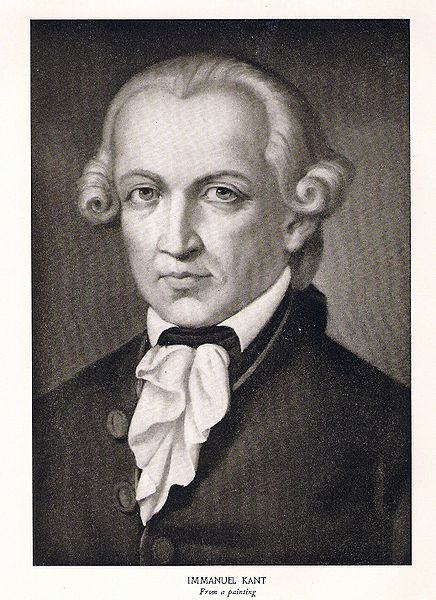

# ＜天玑＞哲学十二钗（三）：老宅男康德

**康德一生宅在柯尼斯堡，未婚，一辈子老处男。对此，后世看不懂《三大批判》却又痴迷康德的猥琐孩子们，不得不发挥娱记精神，深度挖掘康德私生活。研究面从康德的男仆浪泊到康德资助过的男学生，最后得出结论：康德是个同性恋！**  

# 老宅男康德

## 文/张明明(清华大学)

 

所有通向哲学之路的人都要经过一座桥，这座桥的名字叫做伊曼纽尔·康德。

18世纪，德国，柯尼斯堡。

如果当地居民，谁家的表走得不准了，那么需要做的只是蹲点到康德家门口调时间，因为每天下午四点康德会准时出门散步，其准确度相当于今天新闻联播前的xx表为您报时。这一规则行为直到卢梭《爱弥儿》的出版，作为卢梭超级粉丝的康德，对《爱弥儿》爱不释手，以至于忘记散步。那天下午四点，教堂的钟敲响一如往常，可康德还未现身，柯尼斯堡陷入一片恐慌，大家一致以为:K!教堂的钟竟然坏掉了！

康德，男，生于1724年，死于1804年，一辈子宅在柯尼斯堡，他出生的那年在遥远的东方社会——中国，雍正二年，四爷党们正在政坛上呲牙咧嘴，禁止基督教在华传播，闭关锁国外表貌似彪悍内心却早已惶恐；他死的那年，曾经璀璨耀眼的德国古典哲学迎来了它的终结者——费尔巴哈同学诞生。

用我们的话：康德小时候是个穷苦放牛郎。爹爹是工匠，家境极其贫苦，家中兄弟姐妹又多，十三岁康德经历丧母；四年后，丧父。如若放在中国，康德同学的案例可以为“希望工程”拍广告了。可优等生康德穷且益坚不坠青云之志，毅然决然辍学回家，靠当家庭教师补贴家用。从此，康德在家教之路上走了11年，更将学生家长——女东家凯萨琳伯爵夫人家教成自己的绯闻女友。

1755年，昔日同学都已然成为名流新贵，金融小开，弟妹们这时也长大成人，优等生康德以32岁高龄重新杀回柯尼斯堡大学。厚积必然薄发，康德先是以拉丁文论文《论火》顺利通过硕士答辩，三个月后又乘胜追击以《形而上学认识的第一原理之新解释》完成留校答辩，成为柯尼斯堡大学一名讲师。

康德从此完成了人生第一次，也是最后一次跳槽：从家教跳为教书匠！此后，四十一年未变。

1770年．康德完成了职称评审，正式成为柯尼斯堡大学的一名教授。人家别的教授一年核心发论文n篇，大作出版n部，普鲁士国家级项目经手n个，可愣头青康德再次犯楞，从评上教授到1781年，十一年间不曾发表一字。对此，作曲家门德尔松的爷爷哲学家摩西·门德尔松老大爷恼羞成怒：康德这厮让整个教兽界蒙羞！面对所有的讥讽和嘲笑，loser康德内心及极其winner：“你们不懂，哲学是无法教授的，哲学是思想者的事业！随便你们怎么说，反正哥自强不息，哥厚德载物。”

1781年，淡泊明志十一年后，康德再次厚积薄发，数月间完成巨作《纯粹理性批判》，然后轰动整个哲学界。这本书彻底改变了的西方哲学的发展方向，是西方哲学革命的开端，奠定了批判哲学体系的认识论、方法论。翻开西方哲学史你就知道，在康德之前，关于人类的认识问题，理性主义和经验主义吵吵闹闹，喋喋不休。理性主义代表人物有“我思故我在”的笛卡尔、斯宾诺莎、莱布尼茨等，在他们看来感觉和经验并非知识的来源，只有理性才能认清事物的本质，理性本身不会产生错误。笛卡尔提出天赋观念和理性演绎法，认为上帝存在的观念、数学原理、逻辑规则和道德原则都是为人们所普遍承认的天赋观念，只要从这些天赋观念出发，经过严格逻辑推演，人类就能够获得知识，获得真理。康德将此称为：“独断论”。经验主义代表人物有培根、洛克、贝克莱、休谟等，在他们看来：一切观念都是从经验认识中抽象概括出来的，经验是知识的唯一来源。人们所知道的一切除了逻辑和数学，都以感觉材料为依据。理性不依赖感觉和经验就不能给人们以现实的知识。康德将此称为“怀疑论”，因为，他怀疑一切知识的根基。将这一哲学争论可以深入浅出地总结为：笛卡尔-牛顿体系在解释宇宙结构和运动方面已经表明人类的理智可以获得关于世界的可靠知识，而洛克、贝克莱、休谟等经验主义者则认为，人类在感觉基础上形成的经验根本不可能把握这个世界的真实存在。

吵架中，康德神作《纯粹理性批判》出场，他调和了理性主义和经验主义的矛盾。“纯粹理性”指的是指独立于一切经验的理性；而“批判”原意是“书评”，就是分析，即通过纯粹思辨对理性进行考察。在康德看来，纯粹理性批判不只是驳斥独断论与怀疑论的不足，它更多的是提供了一个全新的主客体关系，人类只能认识到自然实在表现出来，被人类心灵捕捉到的那部分现象，而不能认识到真实存在本身及其规律性；知识不再由对象所决定，而是对象由我们的认识能力所决定。这就要求人们的理性要从常识性的见解中解放思想，客观认识的必然性普遍性并非源自客体，而是源自认知主体。一些先天条件在逻辑上先于经验又决定经验，这就是“先验”。至此，康德完成了认识论上的“哥白尼革命”。

紧接着，1788年《实践理性批判》出版，此书主要讨论了伦理学问题，阐明了人的伦理行为的动力和规范，从伦理道德和信仰的角度说明设定上帝存在，灵魂不灭和意志自由的意思。在这里，友情推荐大家可以看哈佛公开课《JUSTICE》，Michael J. Sandel将边沁的功利主义道德和康德的绝对主义道德分析得很到位，而且案例超级丰富。

1790年《判断力批判》出版，旨在解决前两个批判中阐明的必然和自由之间的对立，认为判断力在美学和自然界的有机性说明中的作用正是把必然和自由结合起来达到最后的和谐。这三本书就是后人嘴里的“三大批判”，它们此刻就悄悄地排在我书柜的第一格静静地注视着正在噼里啪啦码字的我，但无情如我者永远装作看不见它们。抱歉，你们实在太晦涩了，我不想失眠！

康德是德国古典哲学体系的开端，这一体系途径费希特，谢林，在黑格尔那里达到登峰造极。这一体系规模极其庞大，内容丰富充盈，包罗万象，借用奥委会罗格同志评价北京奥运会一词那就是：“无与伦比”！叔本华作为康德的忠实拥趸者也曾有云：“想当哲学家，首先须得做康德门徒，不知康德者，只能算个蒙童。”

康德一生宅在柯尼斯堡，未婚，一辈子老处男。对此，后世看不懂《三大批判》却又痴迷康德的猥琐孩子们，不得不发挥娱记精神，深度挖掘康德私生活。研究面从康德的男仆浪泊到康德资助过的男学生，最后得出结论：康德是个同性恋！

呵呵，他们不知，康德一生未婚，除了家庭负担过重之外，是因为康德是欧洲中世纪体液理论的严格恪守者，说白了就是：人类体液就是生命力，体液只能在体内循环流动，如有消耗，人就会衰老死亡。所以，剧烈运动？NO! 会汗液流失！法式热吻？NO!会唾液流失！XXOO?哼，想都别想！康德一生活了80岁。

康德是个全才，除了哲学，他还通晓逻辑学，数学，物理，力学，地理，生物，神学，自然法，是“星云假说”的提出者。后世有多少人质疑这个身材矮小、只有157cm、先天不足、胸腔狭窄、体质羸弱、一辈子离群索居本应孤陋寡闻的乡巴佬究竟体内有何等力量能完成惊世傲人的三大批判，并成为一代哲学巨擘。周杰伦有首歌《阳光宅男》，我想形容康德最为恰当：康德宅的是外在，内心绝对笃定，强大到万里无云，阳光普照！

面对所有疑问，康德其实最想说：“不要迷恋哥，哥不是传说，哥只是不寂寞！”

作者预告：下期《美女、才女、痴情女汉娜•阿伦特》 。

 

（采编：徐海星 ；责编：黄理罡）

 
