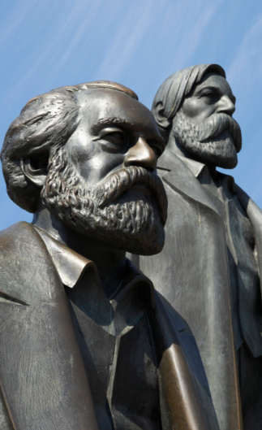
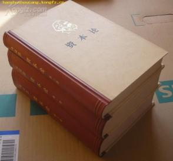
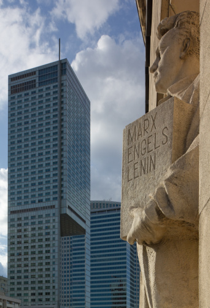

# ＜天玑＞哲学十二钗（二）：混世魔王马克思

**“共产主义对我们来说不是 应当 确立的状况， 不是现实 应当 与之相适应的理想。我们所称为共产主义的是那种消灭现存状况的现实的运动。 这个运动的条件是由现有的前提产生的。”简单地说，共产主义不是一个业已设定好的完美社会，然后大家一齐朝之迈进，如果真是那样，共产主义就是宗教就是信仰就是煽动，其影响也无异于太平天国的“大同社会”。真正共产主义是一种现实的运动，它以消灭私有制为己任。**  

# 混世魔王马克思

## 文 / 张明明 (清华大学)

 

马克思如若活在当下，那一定是个超级有钱人。且不说版税拿到手软，就他随便状告几个出版社的破烂马哲教科书考验政治辅导书歪曲篡改侵犯版权或者状告几个无耻御用文人原著没读几本就敢出版《马克思与HX社会》、《马克思与三个代表戴三块表》之类的大作侵犯名誉，估计精神损失费他老人家就能赚得钵满盆盈。可意淫终归是意淫，在现实生活中，马克思基本是穷死的，孩子生7个夭折4个，病了没钱看医生，死了没钱买棺材，一辈子穷酸落魄。这就是马克思与好基友恩格斯通信，聊世界历史聊工人运动，谈星星月亮谈人生理想，最后必然要笔锋一转：啊，亲爱的恩格斯，我最近预购xx，请速寄xx英镑 。

多少次，有人问我：“你真是学马克思的？你真的喜欢你的专业？”我反问：“咋滴，不像？”我知道，在他们先验地看来，学马克思的女生要不就是戴着厚厚眼镜，穿着古板不苟言笑，拿着教科书照本宣科的马列老太，要不就是一副没啥理论深度偏又信誓旦旦，爱共产主义爱人类解放被洗脑的无知少女。可惜，姑娘我两者都不是。在这里我一并儿回答大家的提问：我是学马克思主义的，我热爱我的专业，且爱得深沉！

于所有形形色色理论中，我选择了他，并虔诚地皈依于他的门下，于沽名钓誉无关，于意识形态无关；不为升官发财。只因为，他的理论，让我充！满！力！量！一种喷薄欲出的力量！他的理论于近视的我恰似一副上等近视眼镜，戴上它就突然看懂了历史，看清了社会，看到了你脸上那细小的雀斑。此时此刻，他是我的英雄，我愿意单膝跪地亲吻他的手背：啊，请让我追随你，做你的门徒吧！

好，抒情到此结束，让我来告诉你一个真正的马克思。如果各位正在图书馆猛刷着GPA，又或是整天介泡妹翘课打dota，那么没关系，这样也不会影响你以后成为像马克思一样的伟人。马克思在波恩大学念书时也曾 有 过一段放浪形骸 ， 年少轻狂的幸福时光：他酗酒私携武器搞决斗，他债台高筑还曾被关禁闭。喝酒决斗之余，马克思的大部分时间就用来搞诗歌创作。如果按此情形发展下去，世界会多一个三流浪漫主义不靠谱诗人。还好，马克思他爹发现了问题的严重性，并及时建议马克思转学：从波恩大学转到了学风扎实的柏林大学。这一举动相当于散漫文科生从PKU转学到THU，浪漫诗人开始决定退出诗坛，潜心研究哲学。

1835年，大卫·施特劳斯发表《耶稣传》，黑格尔学派分裂为两派：老年黑格尔派顽固维护黑格尔的绝对精神体系替宗教和普鲁士专制制度辩护，青年黑格尔派则企图从黑格尔的辩证法中得出无神论和革命的结论。那时，马克思加入青年黑格尔派并很迅速成为“博士俱乐部”的主要成员。很快，马克思意识到了黑格尔的不足：如果历史的发展就是上帝逐渐实现自我意识，是绝对精神的复归过程的话，那么所有实在无非是绝对精神的外化。可这也太神秘主义了，马克思同学认为哲学的出发点应该是具体的现实本身，哲学家不能从上帝的实在来解释现实。他提出：“在真理的彼岸消失之后，历史的任务就是确立此岸的真理”。

1841年费尔巴哈发表《基督教的本质》，此书主要讲清一个事实：上帝不过是人的内在本质的向外投射，说白了上帝就是人。费尔巴哈唯物主义体系的出现对马克思影响很大，从马克思1842年《黑格尔法哲学》中能深深感到其受费尔巴哈方法的影响。从此，马克思开始将辩证法与唯物主义相结合，试图创建一个新的历史观。1845年马克思发表《关于费尔巴哈的提纲》，恩格斯称之为“包含着新世界观的天才萌芽的第一个文件”。

在我看来，马克思的伟大之处就在于，当所有的哲学家都在营营役役地建造自己的理论体系大厦时，马克思蹦出来告诉大家，从理论到理论，从体系出发解释现实这都是徒劳的是木有用滴啦 ，“哲学家们只是用不同的方式解释世界，而问题在于 改变世界” 。

1846年马克思发表《德意志意识形态》，1847年《哲学的贫困》，1848年《共产党宣言》，1849年《雇佣劳动与资本》，1850年《法兰西内战》，1852年《路易波拿巴的雾月十八日》…… 普通哲学家马克思开始雄赳赳气昂昂朝着二逼哲学家的方向大步迈进。

1867年《资本论》发表，至此，马克思完成华丽丽的转身。

关于马克思主义，后人误解颇多，怨声载道，可这不怨马克思。倘若把你的思想断章取义，教条地印成教科书，列为高校“两课”，你也会遭人厌，讨人嫌。这世间，多少行动打着“马克思主义”的旗号，却干着欺世盗名误国伤民的勾当。我不得不吐槽：到目前为止，MEGA2（《马克思恩格斯全集》历史考证版）的编委会里没有一个中国学者，全是日本学者和欧洲学者。还有，到目前为止，THU的图书馆没有一本MEGA2，我每次想看都还要骑车去隔壁图书馆借。

马克思被误解惯了，他和东邪黄药师一样没有解释。后者因为一身魏晋范儿，懒得向周遭小民解释；前者则因为死得早了，没来得及解释。关于“共产主义”，后世将它解读为桃花源乌托邦，老师们会在课堂上告诉你当生产力发展到一定阶段，人的觉悟也提高到一定层次，共产主义就会实现。到那时，别墅一套住一套养猪，面包吃一个扔一个。同学们无比兴奋，继而追问：“老师，共产主义还有红绿灯么？共产主义还有社会矛盾么？共产主义可以共产妹纸不？”

关于什么是真正的“共产主义”， 且听我慢慢道来。“共产主义对我们来说不是 应当 确立的状况，不是现实 应当 与之相适应的理想。我们所称为共产主义的是那种消灭现存状况的现实的运动。这个运动的条件是由现有的前提产生的。”简单地说，共产主义不是一个业已设定好的完美社会，然后大家一齐朝之迈进，如果真是那样，共产主义就是宗教就是信仰就是煽动，其影响也无异于太平天国的“大同社会”。真正共产主义是一种现实的运动，它以消灭私有制为己任。关于私有制，卢梭在《论人类不平等的起源》一书中已经阐述地相当清楚。马克思也告诉大家私有制造成了人的异化，资本横行，工人赤贫。而共产主义就是消灭私有制，实现私有财产即人的自我异化的积极扬弃。它是一种运动，是一个过程，不是一个应当的目标！

真正掌握了马克思主义，它会帮你分析社会，认清现实。当满大街小白领节衣缩食为买一个拼出来是“驴”的LV包时，马克思告诉你，这就是“异化”是“alienation”，事物变成了外在的异己力量。人类创造了包本为装东西， 但 最终却沦为成“包”的奴隶；当你从THU毕业走向工作，却发现加班到11点是常态5点下班是变态时，马克思告诉你，你创造的叫做剩余价值，它是你劳动创造出来却被资本家无偿占有的那部分价值；无论你加班费多高，年薪几十万刀，银行账户1后面n个零，你也永远是无产阶级。因为当你没有因为通过占有生产资料而无偿占有别人的劳动成果时，你永远都是无产阶级。当你辛苦加班出差，飞来飞去堪比空中小飞人，却发现如果不啃老还是马上买不起房，而翻手为云覆手雨的房地产商可以一夜进账过亿时，马克思告诉你，什么是资本，商业资本金融资本，它的利润又怎样得来。

每个人从马克思那里解读出不同的东西，有人看到革命，有人看到阶级分析，有人看到唯物史观。于我，它告诉你什么是“人”，不是众哲学家笔下抽象的人，而是“现实的人”。任何人类历史的第一个前提都是有生命的个人的存在，而共产主义就是消灭人的异化，一个以各个人自由发展为一切人自由发展的条件的联合体。它是人向自身的复归！

2001年英国广播公司BBC，千年伟人评选，在国际互联网上经过反复评选，最后的结果是：马克思排在第一位。如果马克思要发表获奖感言那一定是：感谢BBC；感谢我的老婆燕妮，感谢我的好基友恩格斯。马克思能成为马克思，燕妮和恩格斯功不可没。燕妮没有逼着马克思买房买车，实现男人的3个180，从而让他有精力并安贫乐道地做学问；恩格斯一辈子支持马克思，从精神到金钱。虽然，马克思给燕妮的情书和诗流传千古奠定其好男人形象。实践证明，好男人也有失误：马克思后来和家中女佣偷情，并生下一子。燕妮大怒，后来还是哥们恩格斯够仗义，主动揽下此事说：“哦，亲爱的燕妮，我想你误会了，那个孩子是我的！”结交恩格斯这个朋友马克思真是赚大发了。中国古代讲究“管鲍之交”，马克思就是管仲，恩格斯无疑是鲍叔牙。

马克思一辈子没国籍：世界公民；马克思一辈子没正经工作：自由撰稿人且发表不了。可这却不影响他成为一个伟人，一个在书斋里改变世界的人。

《创世纪》说：上帝说要有光，于是人间就有了光；

启蒙学者说：人类要用理性的光烛澄照愚痴混沌的天性，呈现出文明理智的教养和境界；

《希腊神话》说：普罗米修斯不畏宙斯的暴戾，盗天火照亮尘世；

马克思说：老子就是普罗米修斯！

 

作者预告：<哲学十二钗>下期《老宅男康德》 。

   

（采编：徐海星 ；责编：黄理罡）

 
