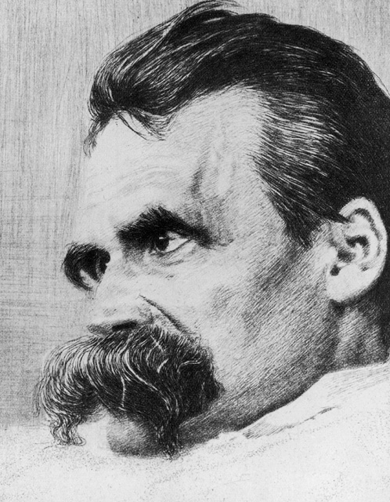
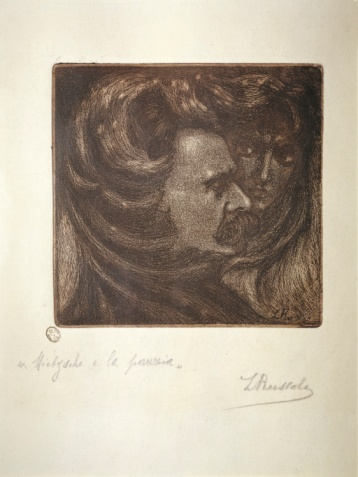

# ＜天玑＞哲学十二钗（五）： 一半天才，一半疯子：尼采

**尼采杀死上帝其实要为了抬出他的“超人哲学”，追求超人来代替对上帝的膜拜。超人不是人们理解的对拿破仑对凯撒搞英雄崇拜，超人是一种不断超越自我的人生观即：“人的伟大之处在于他是一座桥梁而不是一个终点。”尼采的超人是古希腊悲剧中的英雄，披荆斩棘，是虽千万人吾往矣的死士精神！**

# 一半天才，一半疯子：尼采

## 文/张明明(清华大学)

所有通向哲学之路的人都要经过一座桥，这座桥的名字叫做伊曼纽尔·康德，这座桥通向了古典哲学。所有通向哲学之路的还要翻过一座山，这座山的名字叫做弗里德里希·威廉·尼采。

翻过这座山，你就会邂逅现代主义或者后现代主义哲学。

让我们先将镜头切换到1889年，1月3日，意大利都灵，街头。一名车夫此刻正愤怒地挥舞着皮鞭，鞭笞着一匹老马。尼采突然闯入画面，他双臂紧紧拥抱着老马，泪如雨出。一番歇斯底里之后，他倒了下去。随后尼采被送往医院，被医生诊断为瘫痪性麻痹，精神分裂。这位叫嚣着：“上帝死了！”的哲学家自己先疯了。

上个世纪80年代，因为某个学生运动的失败，热血小青年们逐渐放弃对马克思主义的信仰，而尼采、弗洛伊德等逐渐成为新宠。那个年代的小青年们装十三之必备武器：大喇叭裤，蛤蟆镜，尼采的书。他们逢人便显摆：早！大爷您读过尼采的书么？哎呦喂，真是忒爽了，尼采说见女人要带上鞭子呢！

如果你没读过尼采的《查拉图斯特拉如是说》，那你也一定听过书中的一句名言：“是去找女人么？别忘了带上你的鞭子”。此话一出，各国家各民族各地区的妇联组织女生协会女权主义者勃然大怒：“丫丫地呸！就凭你还抡鞭子，你丫撑死一M，装什么S！”尼采为自己的大嘴巴付出了惨烈的代价。一直以来，人们认为这没事干边诅咒上帝边鄙视女性的尼采是个自负的家伙。殊不知，这世上和“自负”如影随形时刻准备着与子偕手的就是“自卑”。我们要是弗洛伊德似地分析下尼采生平，你就会发现尼采这娃儿小时候爹死得太早，一直混迹在由祖母、母亲和妹妹组成的女生宿舍，对于女人，他敏感，自卑又羞涩，年轻时的他也曾热情追逐过几位姑娘，可惜全部未遂。之后，尼采的著作中诋毁女性的句子就层出不穷。对此，花花公子罗素在他的《西方哲学史》中一语道破真谛：“十个女人有九个会让尼采丢掉鞭子。他是明知如此，所以才要避开女人呀！”

和混世魔王马克思一样，尼采生命中也有两个重要的人：叔本华和瓦格纳，可人家马克思与燕妮，恩格斯恩爱了一辈子。而尼采却与叔本华、瓦格纳从开始的恩爱走向了后来的恩断义绝。1865年，青年尼采在旧书店淘了一本书：叔本华的《作为意志和表象的世界》。唯意志论大师叔本华在此书中告诉大家世界分为了两类：表象和意志。表象只不过是世界的表面，而世界最内在最本质的核心是意志。意志是世界的物自体，而生命、可见的世界、现象只不过是意志的镜子。正是意志构成了包括人在内的世界万事万物的基础和本质，对人而言，人的行为受生存意志所支配，有意志就有欲望，有欲望就会有失望，痛苦由此产生。叔本华悲观地总结：“痛苦对生命来说是本质的，所有生命就是痛苦，每一部生命史就是痛苦史。”忧郁气质尼采遇见悲观主义叔本华，完全是绿豆看蛤蟆——对上眼了。从此，尼采开始站在叔本华的肩膀上开启自己的哲学之路。

1868年，24岁的尼采与54岁的音乐大师瓦格纳人生若只如初见。瓦格纳当时已是德国音乐界乃至思想界的大师，他用音乐来诠释叔本华的哲学，赋予音乐思想性和哲学意味。瓦格纳综合浪漫主义幻想、宗教思想、民族观念，并用特殊的和声与配乐表现手法独创一种新的音乐形式“乐剧”。此君当时在巴伐利亚开个音乐会其轰动效果就好比今儿个王菲在工体，周杰伦在小巨蛋开演唱会——一票难求！粉丝尼采遇见偶像瓦格纳，内心狂喜，他写信道：“我发现了一个人，他感动着我，他是天才。”瓦格纳也相当欣赏这个有思想的小朋友。可惜，多年后，尼采反对基督教，而瓦格纳却越来越对宗教仪式感兴趣，思想逐渐被基督教所占据。歌剧《尼伯龙根的指环》之后，尼采表现出强烈失望。两个人的关系因为小三——上帝的插足不得不宣告结束。正可谓靡不有初，鲜克有终！

在和瓦格纳相处的蜜月期，尼采出版了第一本哲学著作《悲剧的诞生》。这本书我客观地讲思想性不见得能排第一，但美学价值却独一无二。尼采在书中表达了这样一种观念：希腊艺术是在日神阿波罗（Apollo）和酒神狄奥尼索斯(Dionysus)这两种精神的相互激荡中产生。日神阿波罗代表着光明和理性，希腊人崇拜日神于是有了阿波罗艺术（史诗、雕刻、绘画）；而酒神狄奥尼索斯狂醉之后将内心深处隐藏着的强烈生命力爆发出来，激起希腊人奔放又波涛汹涌的生命欲望，于是他们引吭高歌载歌载舞，形成狄奥尼索斯艺术（音乐、舞蹈）。而古希腊艺术智慧的最大成就——希腊悲剧就是在日神和酒神这两种精神的相互作用相互冲击下产生。希腊悲剧最初采用人头羊头神合唱的形式。在这一过程中，人们踏着音乐的节拍，手足舞蹈。狄奥尼索斯的狂欢诱发阿波罗的幻想，希腊人爆发出生命欲望创作冲动。而这正是希腊悲剧精神的精华！尼采在书中还猛烈抨击苏格拉底，认为苏格拉底只是“在象牙塔上建造概念”，他没有悲剧精神，不了解希腊诗歌，只不过对荷马史诗中那浅薄的理论有所掌握。苏格拉底之后，希腊那种大刀阔斧开天辟地的创作精神消失了，哲学衰落，艺术暗淡，只剩下庸俗浅薄的喜剧供人享乐。

1882年，尼采展开人生第四次也是最后一次追求姑娘：他对俄国姑娘莎乐美情不自禁，很快坠入情网！莎乐美是欧洲文化史上的名媛，她才貌双全，和尼采、里克尔、弗洛伊德关系都非同一般，她的追求者都能有一个加强连。正可谓自古英雄难过女人关，尼采跌跌撞撞拜倒在莎美人的裙子下，可文学女青年莎乐美只爱慕尼采的才华，却不爱慕他本人。尼采一封封求爱信换来莎乐美一次次写拒信。在爱情里，尼采卑微如乞丐和流浪儿，最后一次被拒后，尼采心灰意冷，看破红尘，成为背包客开始行走天涯！还好，尼采没变成徐霞客时时更新微博：“哥在华山之巅，哥在南海之滨！”时刻准备着为祖国地理事业奉献光和热。背包客尼采吸天地之灵气，沐日月之光华，进入了他一生创作的巅峰《查拉图斯特拉如是说》。

如果你热爱哲学，可又嫌弃它深刻晦涩三天翻不了两页，那么我建议你一定要先看《查拉图斯特拉如是说》，这本书会彻底颠覆你对哲学的偏见。这本书与其说是哲学书不如说是哲学诗，它没有令人窒息的教条，呆板停滞的体系。阅读它，你会感到泉水跃动成洪流奔驰着，时而热情跳跃，时而变幻无穷。书中尼采借祆教教主查拉图斯特拉来宣说自己的思想，其中最著名的便是“上帝死了”“强力意志”和“永恒轮回”。全书除序言外，由四部分组成。第一部分第一篇尼采提出了“精神三变”：“由精神变为骆驼，由骆驼变为狮子，最后由狮子变为婴儿”。骆驼的吃苦耐劳隐忍负重代表着精神对理想的敬畏；凶狠的狮子代表了信仰的破灭，虚无和自由精神的时代；而婴儿代表着对虚无的战胜，对生命以及人类天真纯洁的肯定，一个崭新的时代的到来。关于“上帝死了”尼采编了两个故事：上帝因怜悯而窒息身亡，上帝因嫉妒而笑死。基督教自文艺复兴以来濒临解体，尼采认为上帝只是个假设，对于宗教所倡导的拯救和赎罪纯粹是人类精力的白白耗费。上帝死后人类应进行“一切价值重估”。尼采杀死上帝其实要为了抬出他的“超人哲学”，追求超人来代替对上帝的膜拜。超人不是人们理解的对拿破仑对凯撒搞英雄崇拜，超人是一种不断超越自我的人生观即：“人的伟大之处在于他是一座桥梁而不是一个终点。”尼采的超人是古希腊悲剧中的英雄，披荆斩棘，是虽千万人吾往矣的死士精神！

其实，当资本主义社会遭遇文明危机，马克思和尼采分别指出了两条普救众生之道。马克思告诉大家，你之所以被异化是因为私有制是因为分工，只有消灭资本主义制度本身才能实现自由人的联合体才能实现人的真正意义地解放；而尼采会告诉你：“上帝死了”我们要“重估一切价值”。他诉诸人的心灵和意志，试图用“精神革命”来解决普遍的危机。我可以举个简单例子帮助大家消化二者的区别：假如你最近正在失恋33天又假如你正被期末paper逼得想自杀，自杀前你碰巧翻了一本马克思的书，马克思语重心长地告诉你：“人的本质不是单个人的抽象物，就其现实性来说，是全部社会关系的总和。”你瞬时顿悟你想自杀的原因：你的社会关系被扭曲被遮蔽了！于是你放下屠刀，立刻变为无产阶级美少年美少女战士！当然，如果你自杀前悲催地翻了一本叔本华的书，那抱歉，此刻你已经自杀成功了，这就是受叔本华悲观主义哲学的影响，王国维老舍等在遇到挫折时不约而同选择跳湖。最后，如果你自杀前翻了一本尼采的书，尼采会告诉你：“人生就是一出华丽丽的埃斯库罗斯的悲剧，而强力意志就是生命力！要战斗，要权力！超人是大地之意义！”你于是醍醐灌顶放弃自杀，红内裤外穿准备装奥特曼。

马克思会呐喊：“全世界无产者联合起来！”而尼采会咆哮：“全世界小强们联合起来!”

马克思•韦伯曾说过：“判断当代的一个学者是否诚实，只要看他对待马克思和尼采的态度就够了。”我是马克思的追随者，可我也爱尼采，爱这个戴着眼镜，形容槁枯，一辈子被眼疾，胃病，神经衰弱折磨得死去活来却仍能提出超人哲学的瘦弱男子。1900年，发疯后11年的尼采永远闭上了眼睛，而他的思想却被有野心的反犹主义妹妹伊丽莎白大肆兜售给纳粹，希特勒后将《尼采全集》作为生日礼物送给墨索里尼，尼采的强力意志超人理论被纳粹片面吸收并用于战争。尼采的哲学深深影响了一群人：哲学家雅斯贝尔斯、海德格尔、萨特、加缪、德里达；文学家托马斯·曼、黑塞、茨威格、萧伯纳；中国的有梁启超、鲁迅、 陈独秀……名单可以我可以继续列下去，可尼采之后再无尼采！

今天，当骑着瘦弱老马混江湖的骑士堂吉诃德被嘲笑为奇葩二傻子，当那些伟大的精神和意志却如同小美人鱼般被名叫实用主义的老巫婆消解为泡沫，你就不会再追着问我为嘛儿这个时代鲜有大家，不遇大师了。

这是一个最好的时代。

可偏巧，它又最坏！

 作者预告：下期《磨镜片的斯宾诺莎》。鉴于阿伦特之后，大家对波伏娃的强烈呼唤。我只好说：英雄们，提前出场吧！稍后奉上哲学十二钗之《雌雄大侠：萨特与波伏娃》。  

（采编：徐海星 ；责编：黄理罡）

 
