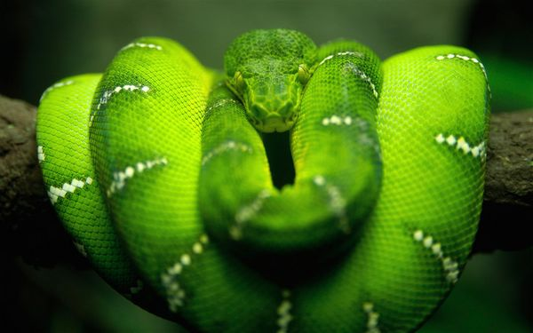

# ＜天玑＞哲学十二钗（八）：丐帮哲学家：犬儒学派

**犬儒学派的思想很容易概括：“三反运动”——反社会反世俗反现实。政治上，他们藐视一切权威，提倡“世界公民”；宗教上，他们怀疑神灵批判宗教；他们鄙视金钱，摒弃世俗快乐；他们超凡脱俗，安贫乐道；他们四处乞讨食不果腹居无定所一无所有；他们却又热爱生活关注人生不逃避不苟且；虽然他们消极、幼稚又极端但他们自信、独立且强大。** 

# 丐帮哲学家：犬儒学派

## 文/张明明（清华大学）

 

你问我犬儒是个嘛儿意思，且听我讲个小故事。

几年前你在THU水木BBS上贴一照片，尽管那时你刚唱完一二·九归来，身上大红色演唱袍子肥得能塞进二只老母鸡，脸上挂着一副腮红堪比猴屁股，唇彩犹如吃完猪蹄没擦嘴的劣质妆容。尽管如此，照片下的评论却如此春风化雨暖透你心：“这mm真可爱”；“这师妹不错”；“这师妹真面善”；而如今，你再在水木BBS贴一照片，你会发现评论永远比照片更有看头：“胸大活儿好，求包养求介绍”；“哈哈哈哈哈哈”笑得你毛骨悚然不知所以；更有“复仇贴，鉴定完毕”搞得你哭笑不得。总而言之：

数年前，水木民风尚好；而如今，水木犬儒当道！

犬儒主义（cynicism）在今天被简单地概括为：玩世不恭+愤世嫉俗。如果各位经常在各大BBS潜水冒泡且发表言论有以上倾向，那么今儿个就让我带领大家去瞻仰围观下各位的祖师爷吧。

公元前5世纪末，曾经灿烂一时的古希腊城邦制度由盛而衰，它的衰败我们可以从雅典在伯罗奔尼撒战争中的一败涂地、苏格拉底被所谓“民主”的毒芹汁赐死、柏拉图失望至极愤而出走西西里等事件中窥视得一清二楚。当曾经强大的城邦已然明日黄花，当曾经自信的公民沦为臣民，当战争引发社会混乱道德滑坡人心不古，一群哲人开始对现实产生怀疑，他们用极端的方式表达着自我。

他们是那个时代的行为艺术家，他们的名字叫犬儒。

“犬儒”一词，翻译得不禁让人拍手称赞。“犬”的意思就是狗了，“儒”就是儒生，知识分子的意思。“犬儒”就是“像狗一样的知识分子”。 只见这群知识分子举止乖张放浪形骸不知羞耻，却又我行我素敌我分明敢咬敢斗。他们是希腊版丐帮：赤足而行，乞讨为生；他们又是时尚潮人：将米兰时装周流行元素一网打尽：鸡窝头渔网服透视装；他们还是行为艺术先驱：住在木桶随地排泄当众XXOO。他们的口号：亲，一切附庸高雅装阳春白雪的哲学家都是纸老虎，打倒纸老虎！他们的目标：咱家就是要做下里巴人哲学家中的下里巴！

犬儒学派的开山鼻祖是苏格拉底的学生，柏拉图的同窗兼宿敌安提斯泰尼。安提斯泰尼的学生第欧根尼将犬儒学派发扬光大且红极一时。第欧根尼出身还是不错滴，他爹是银行家。本来这一职业买房子买车养老婆孩子根本不成问题，可第欧根尼他爹每天看钱摸钱数钱以致走火入魔心生歹念，他开始制造伪币并还拉宝贝儿子一起下水。后来东窗事发，父子二人均遭流放。雅典人为此嘲笑讥讽第欧根尼：“哼，人家锡诺普的公民判处流放你”，可第欧根尼却过早掌握了辩证法的朴素萌芽：“咋滴，我不是也判处他们留在原地了么！”

安提斯泰尼和柏拉图向来不对付，于是第欧根尼经常替老师出气：柏拉图在课上给学生讲“人就是有两只脚，不长羽毛的动物”。学生恍然大悟，这一概念遂颇受欢迎。可没过两天，就见第欧根尼手提一只拔了毛的鸡气势汹汹去柏拉图班上砸馆子踢场：“看，这就是柏拉图所说的人”，搞得柏拉图脸色讪讪下不来台。柏拉图请客，第欧根尼去蹭饭，看见人家柏拉图家有名贵地毯，心生不忿，于是双脚在地毯上可着劲儿地踩，嘴里还碎碎念：“踩呀踩，踩掉柏拉图的虚荣！”柏拉图吃一堑长一智，这次基本做到兵来将挡水来土掩，他不动声色地回击：“哦，亲爱的第欧根尼，你不想显示虚荣，可你的虚荣却显示出了你！”

第欧根尼最有名的还是和国王亚历山大的对话，话说亚历山大有次来科林斯，名流群儒排队觐见，第欧根尼当然不在队伍里了。人吧，都喜欢犯贱，国王也不例外。于是，亚历山大某天专门抽空去拜访第欧根尼。国王见到第欧根尼时，咱们的大哲学家正在晒太阳，捉跳蚤。政治家一向礼数周全，亚历山大上前自我介绍：“Hi，我是国家主席亚历山大，请问我能为你做点什么？”第欧根尼不抬眼皮，把跳蚤咬得嘎嘣响：“嗯，哥们，麻烦你走开点，别挡住我的太阳光。”亚历山大顿时觉得自己相形见绌，惊第欧根尼为天人，逢人边说：“假如我不是亚历山大，我就要做第欧根尼！”

犬儒学派趣闻轶事很多，他们直接通过自身的行为方式向世人展现着自己的哲学思想。犬儒学派流传下来的第一手作品寥寥无几，他们的思想只是在其他哲学家的著作里间接或直接地被提起，正是这些著作成为研究犬儒学派宝贵的第二手资料。比方说黑格尔的《哲学史演讲录》就开设专门篇目描述犬儒学派。其实，比起近现代哲学，我个人更喜欢早期的古希腊古典哲学：毕达哥拉斯学派、犬儒学派、斯多葛学派、伊壁鸠鲁学派，他们的名字叫起来都很有爱，他们在我眼中都是一群坦胸露乳披着麻袋手持鱼叉的哲学怪人。他们，代表了哲学的童年。

犬儒学派的思想很容易概括：“三反运动”——反社会反世俗反现实。政治上，他们藐视一切权威，提倡“世界公民”；宗教上，他们怀疑神灵批判宗教；他们鄙视金钱，摒弃世俗快乐；他们超凡脱俗，安贫乐道；他们四处乞讨食不果腹居无定所一无所有；他们却又热爱生活关注人生不逃避不苟且；虽然他们消极、幼稚又极端但他们自信、独立且强大。他们的思想深深影响了：无政府主义，后现代主义，尤其是二战后的那些反社会思潮，嬉皮士运动，垮掉的一代。

在《美女、才女、痴情女汉娜·阿伦特》一章曾提到汉娜的老师雅斯贝尔斯。雅斯贝尔斯在《历史的起源与目标》中提出了一著名命题“轴心时代”：公元前800年到200年，北纬30°上下，出现了人类文明的轴心时代。在这一时代，人们开始意识到整体的存在与自我的极限，开始意识到世界的恐怖与个体的无能为力。这一时代英雄辈出：在中国有孔子、老子；在印度有释迦摩尼；在以色列有犹太先知；在希腊有苏格拉底、柏拉图、亚里士多德。广义上讲，古希腊的犬儒学派和中国的庄子学派属于同一历史时期，且相似度很高。二者都处在礼崩乐坏的社会动荡期，一个是城邦制的衰落，一个是周王朝的式微；二者都是对天人关系人人关系的反思追问且本质思想比较接近。

今天，总有人问我，中国现在是个啥子主义：马克思主义？新自由主义？拜金主义？消费主义？我开玩乐似地回答：今天的中国流行犬儒主义。今天的犬儒和古代的犬儒在学理上已有很大不同，它没学到人家独立自信的精神却只会对人家不羁的行为依葫芦画瓢，今天的犬儒将真正的犬儒主义推向了反面，它是古代犬儒的异种变形。不错，犬儒是种病，我们大家一同上演着朱德庸的漫画《人人都有病》！满大街政治标语大家大家权当看广告；满政治课本思想教条大家权当是考试法宝；马恩列斯毛只不过用来写入党申请思想汇报；大家都心照不宣说一套做一套，谁要较劲儿谁就是假大空装崇高；大会永远是“成功的圆满的大会”；领导永远是“尊敬的敬爱的领导”； 心里再厌恶，嘴上永远淘宝客服般：亲~；连地沟油上都有模有样印着：“消费者信得过产品，百年老字号”。君不见，今天的中国社会，它解构崇高；它信任匮乏；它虚假成风；它玩世不恭；今天的中国社会，它犬儒当道！

人们讨厌谈论意识形态；大家不再信奉意识形态的真实性；大家不再严肃对待任何官方命题。“八荣八耻”、“三个代表”被私底下戏谑为“八要脸八不要脸”、“戴三块表”，大家都喜欢解构官方，挖苦嘲笑。可这不怨大家，不管“xx发展观”之类出发点再好，可如果它北至白令海峡南至马达加斯加岛，都一样适用，你就会发现它说和没说效果其实一样大小。

斯宾格勒在《西方的没落》里讲到文化都有周期，西方文化已经无可救药地走入物质消费文化的末路。梁漱溟在《东西方文化及其哲学》也提出西方文化解决不了人与人之间人与物之间的障碍关系，中国文化将是未来世界文化的主流。可我放眼一望，电视里全是相亲选秀，满大街虚假广告，全社会弥漫着犬儒主义，虚无主义。这样的文化怎么能铁肩担道义呢！？一个没有价值观输出的国家又如何崛起呢？看《大国崛起》我曾经又好气又好笑，导演有知识没文化，那崛起的大国有几个是靠诚实经营合法劳动了？全是侵略打杀一片血腥。更有学者教授们又戴着老花镜撰文提出“中国模式”，讴歌四海太平。对此，我很无语：“大爷，您听过“苏联模式”，“拉美模式”么？叫“模式”的从来下场都不好！”

王安忆曾说过，尽管王朔的文字嬉笑怒骂拒绝崇高，可透过文字，王朔骨子里是个好孩子。不错，也许，大家会在网络上相互攻击彼此是“五毛”“美分”；也许你会犬儒般自我解嘲自己个是矮穷锉是“屌丝”，可我知道，无论80后多嬉皮90后多早熟，无论你怎么在网络上玩世不恭嬉皮笑脸撒泼卖萌，无论你再怎么披着犬儒的外衣睥睨一切，你骨子里都是好孩子。因为，无论你采取了什么样的方式针砭时政，我知道，你心里深处总是希望，有一天，她会更好。

然而，因为犬儒，我们却不作为很久了。

哲学十二钗下期预告：《居家好男人：弗洛伊德》 

（采编：徐海星；责编：黄理罡）

 
