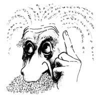

# ＜天玑＞哲学十二钗（六）：磨镜片的斯宾诺莎

**斯宾诺莎的哲学体系正是这两种文明交织的综合：它一方面注重自然，强调知识和人类的理性认识；一方面又强调神与人的关系，呼吁人“对神的理智的爱”。斯宾诺莎一辈子的哲学关注点都围绕着神、人、人的自由和幸福问题。他研究何为人类真正的幸福和自由；自由和幸福的基础是什么；他试图寻求人类通向真正自由和幸福的道路，并找到自由和幸福的保障。**  

# 磨镜片的斯宾诺莎

##  文/张明明（清华大学）

 

11岁，我上初一。那时班上的女孩们流行左手琼瑶右手亦舒，边抹鼻涕边擦泪儿。我为了显示自己做人很有格调，就左手《诺贝尔文学奖全集上》，右手《诺贝尔文学奖全集下》。可惜的是，第一篇就因为意识流太多而看不懂。过！直接翻到最后一篇，美国作家辛格的《市场街的斯宾诺莎》，还好，这回看懂了：居住在市场街嘈杂环境中的菲谢尔森博士潜心研究斯宾诺莎的《伦理学》，他克制住七情六欲，只为追求更高层次的精神之乐。然而随着年龄的增大，他肉体衰老，病痛缠身，好在这时又黑又瘦的老姑娘多比闯入他的生活，悉心照顾陪伴他，使他第一次感觉俗世生活原也这般美好。洞房之夜，两位大龄老青年初试云雨，菲谢尔森博士激动不已，他喃喃而语“啊，神圣的斯宾诺莎，宽恕我吧，我变成一个傻瓜啦！”辛格通过此文讽刺了斯宾诺莎的禁欲主义，并试图深层次探讨精神与肉体与生俱来的依存和矛盾：精神追求永恒的纯粹之美而肉体追求短暂的感官之乐。

于是，11岁，在我思维抽象地把握哲学家斯宾诺莎之前我先感性具体地认识了老处男斯宾诺莎。

不错，哲学家大多是怪咖，斯宾诺莎是哲学家中的哲学家，怪咖中的战斗机！此君就是一升级版康德：康德再宅，每天下午四点都要按时散步，完成光合作用。可斯宾诺莎能屯几大筐土豆宅三个月不出门，前一次出门街上的姑娘们还穿秋裤，下一次出门花花姑娘们都纷纷露大腿了；人家康德清高，可惜也会在早期论文《自然通史和天体论》的扉页殷勤地写下：“献给弗里德里希王子！”斯宾诺莎不一样，土豆都快买不起了，法国国王路易十四许诺只要他在著作上写下：“献给法王路易十四”就送他一大包金子，可斯宾诺莎毅然拒了法王的金子选择了喝西北风；康德一辈子宅在柯底斯堡学习，学什么？学哲学！可斯宾诺莎一辈子宅在屋里玩耍，玩什么？玩哲学玩镜片！康德是学霸，而斯宾诺莎是神！

斯宾诺莎出生在17世纪的尼德兰，关于尼德兰，我们在高中历史课本里都晓得，这个在荷兰语中本是“低地”的地方，爆发了人类历史上第一场资产阶级革命。尼德兰此时商业发达，政治相对自由，这为日后斯宾诺莎进步思想的产生提供了一个温和的环境。斯宾诺莎一家是犹太人，犹太这个民族自古命运多舛，在历史上他们像老鼠一样被赶来赶去，永远都是寒酸的寄居者：公元前586年巴比伦国王尼布甲尼率军征服犹太王国，失去家园故土的犹太人沦为“巴比伦之囚”，开始圣经时代最著名的一次流亡。到了公元70年庞贝指挥的罗马帝国一骑铁骑踏平耶路撒冷，顺便将人家的圣殿都付之一炬，可怜的犹太人不得不再次流亡。斯宾诺莎的祖辈是为了避免西班牙人的宗教迫害而逃亡到荷兰的，到了斯宾诺莎他爹老斯宾诺莎这里，他们一家已经在荷兰犹太人圈子里很有钱有名望了。

斯宾诺莎这娃儿在学生时代就表现出天赋异禀的高级智商，当地犹太拉比们也觉得斯宾诺莎这个后生孺子可教，将他看成希望夸他为“希伯来之光”。对此，斯宾诺莎他爹老斯宾诺莎感到十分欣慰：以后让娃儿考个商学院读个MBA，子承父业扩大下家族产业；或者考个神学院当个拉比，也能光个宗耀个祖。可惜，事与愿违，本能按既定路线轻松成为高帅富的斯宾诺莎硬是选择了成为屌丝，并在屌丝的路上一溜儿走到了黑。

年轻的斯宾诺莎一到晚上就偷偷在寝室点着蜡烛看禁书：被宗教裁判所用火烧死的布鲁诺的书，笛卡尔的书。人越有知识越反动，果不其然，斯宾诺莎对犹太教越来越怀疑，并且到处宣扬以下言论：灵魂不可能不灭，灵魂就是呼吸，呼吸停止灵魂就消失；世界上没有天使，天使是幻影；上帝不是主宰而是有广延的存在。斯宾诺莎的言论被犹太教视为“异端邪说”，犹太教立刻组织人马研究招数对付他。第一招“威胁恐吓”：你要是再乱说话就把你关进监狱！斯宾诺莎一听心花怒放：关就关，反正在哪都是宅着，而且还管饭，赶紧关！第二招“重金收买”：大哥，你怀疑就怀疑，但别四处乱说，只要你肯吃消言药我们就给你封口费。斯宾诺莎对此很不屑：就我这消费能力，你给我钱我还不会花。第三招“驱逐出教”:我们要开除你的犹太教籍，禁止任何人和你发生来往！斯宾诺莎一脸平静：Whatever! 第四招“杀人灭口”：犹太教派出杀手刺杀斯宾诺莎，可惜杀手武器使用不够熟练，加之斯宾诺莎长期挨饿节食，身形敏捷躲闪够快，刀子只是微微擦伤了脖子。

你若研究过欧洲宗教史，就会发现它简直就是一部cult movie， B级片，血腥暴力镜头不断。比方说有个叫塞尔维特的西班牙医生一不小心地发现了人体血液循环，并指出生命的精气在于物质，精气来源于左心房。于是他严重挑衅了上帝的至高无上性，当时的加尔文教便立即对他痛下追杀令。可怜的塞尔维特逃窜了半天甚至上演了西班牙版《越狱》，可惜到了还是落入魔爪，被宗教裁判所火刑伺候，还是文火！最后，这位可怜的医生向我们真正意义上展示了什么叫：外焦里嫩，挫骨扬灰！相对于加尔文教的暴戾恣睢，犹太教内部稍微温和点。他们对斯宾诺莎的除教仪式邪恶又幼稚：大号奏响，哭声悲恸，蜡烛火炬一盏盏被扑灭，犹太拉比上前致辞：“遵照天使和圣徒们的审判，我们咒逐、孤立、憎恨、咒骂巴鲁赫·德·宾诺莎……白天他被诅咒、夜里他被诅咒、出门时他被诅咒、回来时他被诅咒、躺下他被诅咒、起身他也被诅咒……任何人不得和他说话交往，不得与他同在二米之类。”可怜的斯宾诺莎，从此和犹太教一刀两断。

后世曾有人将斯宾诺莎的思想总结为“无神论”，其实斯宾诺莎的思想是“泛神论”，神是“实体”是自然，所谓的“实体”就是在自身内部并且只有通过自身而被认识的东西，实体独立无限以自己为原因。斯宾诺莎的“神”构成了世界的本质，他的“神”不是宗教意义上人格化的具有无限能力的全能的神。斯宾诺莎的神是一个本体概念，他的神无意志无情感，是一种纯粹的实体。

被驱逐出教后，斯宾诺莎搬出阿姆斯特丹，找了个郊区住下，开始以磨镜片为生。他打磨的镜片主要用于望远镜和显微镜。大神就是大神，思维抽象的哲学玩得来，细致精准的镜片也上手快。通过磨镜片，斯宾诺莎还结识了大科学家惠更斯。中国古代的隐士们追求 “梅妻鹤子”的高雅生活，对于斯宾诺莎，哲学和科学就是大老婆和小老婆，他坐享齐人之福。

斯宾诺莎生前只出版了两本书，其中一本是匿名出版的《神学政治论》，他用形而上学原理来解释宗教和政治问题，批判了神学家们对《圣经》的歪曲和蓄意改造。斯宾诺莎对《圣经》的重新考察不在于反对《圣经》本身，他的目的在于破除人们对《圣经》的盲目崇拜，鼓励人们去追求自己的自由：言论自由信仰自由。

斯宾诺莎的代表作《伦理学》是死后出版的，这本书对后世影响颇大：因为这是一本用欧几里得几何定理写成的哲学书。在那个年代为了追求哲学的准确无误，哲学家喜欢用数学的方式来阐述自身。这本用公理、定义、定理和证明写成的哲学著作让人读来疲惫至极，可又感叹杂乱无章的世界可以在斯宾诺莎的笔下归结为统一和秩序。《伦理学》由五部分组成：一论神；二论心灵的性质和起源；三论情感的起源和性质；四论人的奴役或情感的力量；五论理智的力量或人的自由。第一部分构成斯宾诺莎哲学体系的本体论（即研究存在being问题），第二部分构成体系是认识论（即研究认识的来源、本性、可靠性问题），三四五部分构成体系的伦理学。在斯宾诺莎看来，人要实现自由和幸福就必须了解自然，在自然中获得知识。他第一次将自由和知识联系在一起并指出自由是对必然的认识，斯宾诺莎的哲学体系是一个以认识神，认识自然为开始，以爱神，爱自然而达到人的最高幸福为目的的从本体论到伦理学的严密的形而上学体系。

如果说中国文化的源头是儒家精神和道家精神，那么西方文化的源头就是“两希精神”：希腊精神和希伯来精神。希腊精神注重理性“逻各斯”，理想的人都是理性的人，希腊精神滋生了西方世界的艺术与科学；而希伯来文明注重超然性和献身性，强调信仰和拯救，他们理想的人都是信仰的人，希伯来文明缔造了西方的宗教和道德伦理。斯宾诺莎的哲学体系正是这两种文明交织的综合：它一方面注重自然，强调知识和人类的理性认识；一方面又强调神与人的关系，呼吁人“对神的理智的爱”。斯宾诺莎一辈子的哲学关注点都围绕着神、人、人的自由和幸福问题。他研究何为人类真正的幸福和自由；自由和幸福的基础是什么；他试图寻求人类通向真正自由和幸福的道路，并找到自由和幸福的保障。今天，你可以批评斯宾诺莎的形而上学有缺憾，神学也含含糊糊，但你不得不佩服这个苦行僧著作中显示出来那无限信任人类至善的道德境界，那公正廉洁的精神，那没有任何利己之心的灵魂。

斯宾诺莎是哲学家中唯一一个学术和做人完全一致的人：姊姊为争财产将他告上法庭，他赢了官司还是将财产送给姊姊；世人为他的泛神论谩骂误解他，犹太教驱逐迫害他，可他永远以“爱”去回报世人以德服人；他吃着寒酸的食物穿着简朴的衣服生活最大的奢侈也不过是能抽袋烟，行乐享受于他是浮云，对真理知识的追求才是真正的快乐。他用自己的哲学实践证明着自己的哲学理想，他是一个真正的哲学家！埋汰惯其他哲学家的罗素在《西方哲学史》里对斯宾诺莎的评价十分恭敬：“斯宾诺莎是伟大哲学家中人格最高尚性情最可亲的。按才智讲，有些人超越了他，但在道德方面，他是至高无上的。”可惜的是，我们这位道德楷模因为磨镜片时肺部吸入大量粉尘，很不幸地得了职业病——肺结核，最后医治无效英年早逝，享年45岁。

斯宾诺莎的一生很好概括：

他比烟花还寂寞，他比耶稣还纯洁！

上期预告时，我说要写斯宾诺莎，有人问我为嘛儿要写这个神色槁枯的卢瑟。斯宾诺莎的思想艰深又晦涩在中国没太大影响力，他本人没有把妹搅基也没有那么多爱恨情仇值得你我狡黠地眨巴双眼去八卦，可是我还是要写他。其实，我笔下的每一位哲学家都代表了哲学家中的一类人，他们有的如黑格尔学术做人双肩挑，入世出世两不误；有的如汉娜·阿伦特哲学上强势如御姐爱情中单纯似萝莉；斯宾诺莎代表了这样一类理想主义者：他们淡泊一切名利，只为实现人类的终极幸福。

不错，有人关心36D、房价、下顿吃啥，就有人眉头紧锁地思考着人类的至善和幸福。他们放弃了通向俗世享乐生活的捷径，选择了一条荆棘之路，这条路他们走得跌跌撞撞，摔得鼻青脸肿，可他们仍旧不知疲倦依然向远方跋涉。他们就是那只欲想撼动大树的蚍蜉，就是那只挥舞着瘦长大臂准备挡车的螳螂。大树大车的名字叫：“历史”！蚍蜉螳螂的名字叫：“人类的思想”! 于历史的无边荒崖，凶猛的恐龙也沦为化石被放置在博物馆供人类观赏。可无论历史再无情，此刻他们的那些思想都硬如磐石，韧如蒲苇。因为他们，人类不死！

在他们面前，我们永远是孩童，数一数他们留下的足迹，走在他们曾经披荆斩棘开辟的康庄大道上，我们观赏着沿途风景秀丽的人类文明。他们倾说着，有人倾听着，我在倾慕着……

这条荆棘路，是一条

光辉荆棘路！

 作者预告：下期《雌雄大侠：波伏娃与萨特》。  

（采编：徐海星，责编：黄理罡）

 
