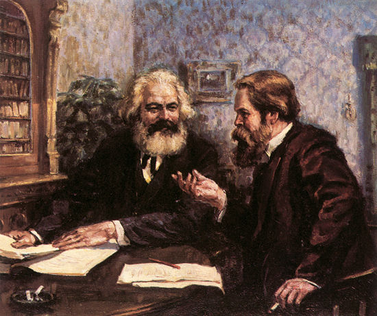

# ＜天玑＞哲学十二钗（十一）恩格斯：好基友 一辈子

**恩格斯在《路德维希·费尔巴哈和德国古典哲学的终结》里就已经批评过费尔巴哈的抽象人本主义，这世上没有“普世的爱”，没有所谓的“普世价值”。基督教倒是抽象地讲“爱”，可它喷再多香水也永远遮不住十字军东征与宗教法庭的血腥味儿，西方政府每天“自由”、“平等”挂在嘴边，可人家撬你国门时，永远目中无人，颐指气使。**  

# 恩格斯：好基友 一辈子

## 文/张明明（清华大学）

 

如果说马克思是张扬洒脱文科男，那恩格斯就是严谨收敛理工男。

马克思行文：文思如泉涌，肆意汪洋，洋洋洒洒，诗词典故信手拈来，损人不带脏字，批你没有商量。

恩格斯行文：干净严谨，逻辑清晰，一是一二是二，丁是丁卯是卯，一板一眼，无可挑剔。

马克思的文章犹如热气沸腾重庆火锅，丰盛可口，辛辣扑鼻；

恩格斯的文章则是温吞精致阳春面，简约舒服，沁人心脾。

张爱玲曾说过，《红楼梦》看到八十回后，一个个人物都语言无味，面目可憎起来。马恩两人的才情虽不及曹雪芹高鹗差距之大，但二者文章读多了，还是能够依着味道嗅出差距。所以，当有一天，我读恩格斯的《反杜林论》第二编第十章《批判史》时，突然心生诧异：“咦，恩格斯这厮嗑药了，怎么写得这么high？”回到序言一看，原来这章是老马忍不住手痒，提笔捉刀了。

俗话说得好：每一个成功男人背后都有一个女人；

到了马克思这里：每一个成功男人背后都有一个女人，和另外一个会挣钱的男人。

燕妮虽说非常支持马克思，但到底是贵族小姐出身，不会持家。马克思又没有正经工作，一家人日子过得捉襟见肘，入不敷出。恩格斯为了不让马克思为这些生活琐碎所羁绊，无奈之下，不惜身沾铜臭，重新当起了资本家，挣钱养活马克思一家。于是乎，在马恩两人卿卿我我的鸿雁传信中，马克思经常严重感激恩格斯的牺牲，恩格斯又严重表示自己的惭愧，不能赚更多的钱使马克思没有后顾之忧。马克思和恩格斯合写了不少文章，可恩格斯总把自己放在一个很低的位置，自谦为：“第二小提琴手”，从来不抢马克思任何风头。中国古代描写君子之交有：管鲍之交，杵臼之交，金兰之契，谊切苔岑，马克思无疑是管仲，而恩格斯是鲍叔牙。

若是德国也有个太史公，《马恩列传》想必会这么写：

马克思者，德意志人也。少常与恩格斯游，恩格斯仰其才。马克思常贫困，恩终济之，不以为言。

马克思曰：“吾一生贫困，恩未嫌厌，知我无心名利也。恩敏而好学强闻博知，然，为吾而贾，吾心戚戚然。吾尝与恩撰文著作，恩甘名位吾后，淡然以二琴手自居，吾心常愧也。生我者父母，知我者恩格斯也。”

恩格斯因为要赚钱养活马克思，时间精力受到限制，在著作数量上稍逊马克思，但他文章质量绝对不差。其实，只要你看看恩格斯的书，你就会发现恩格斯那些一百多年前在著作中猛烈批判的，今天，却依旧在中国社会肆无忌惮地上演着。

读了恩格斯的《家庭、私有制和国家起源》，你知道了一夫一妻制实际上是私有制的产物：“一夫一妻制是不以自然条件为基础，而以经济条件为基础。”“它决不是个人性爱的结果，是权衡利害的婚姻。”于是，你发现，在资本强势的中国社会，家庭早已吹响资本主义化号角。婚姻关系如此复杂，有了闪婚、隐婚、裸婚，因为资本，谈个恋爱都如此麻烦，于是有了那么多剩女剩男。爱情正悄悄异化着：本来两位小年轻心生爱慕，相互拥个抱的简单事，现在也要“非诚勿扰”。恩格斯说过，工人阶级的爱情才是真正的爱情。不错，当爱情不需要房子车子票子所打扮时，她的真谛才释放出来。

读了恩格斯的《家庭、私有制和国家起源》，你知道了国家其实是阶级统治的工具。于是，你需要做个反思：什么是爱国主义？试想如果日本鬼子当年侵华成功，建立一个国家，叫你爱国，你爱么？你会斩钉截铁地否定。那如果可爱的新疆“羊肉串、羊肉串”大叔们，哪天暴乱成功，建立一个国家，叫你爱国，你爱么？你可能会心生犹豫：“这个，这个五十六个民族五十六枝花，五十六族兄弟姐妹是一家，应该可以爱吧。”说到底，你关于“国家”的概念不清晰，把爱国主义和民族主义混淆了。国家永远是阶级统治的工具，这就是为什么，那群聚集在广场的热血小青年，可能有的初衷也不过是烧烧包，更新下状态发个微博，有的不过跟跟风扎堆斗个地主，结果一不小心被那位春天里，在中国的南海边画了一个圈的老爷爷下命令开动的坦克压成三明治肉饼了。我这样说也许会被某些人质疑不爱国，我爱国，我爱这片厚土爱的深沉，爱国主义需要弘扬，但永远要记住爱国主义是爱祖国爱人民，爱国主义不是爱政府爱政权。爱国主义不是筐，不是什么能都装！

读了恩格斯的《反杜林论》，你知道了，道德永远是阶级的历史的社会的，永远不要抽象地谈论道德。当富士康的员工连续做着抛物体运动演示地球引力，世人大批特批富士康老板没有人性，富士康员工居住饮食条件猪狗不如时，你想过没有，这些老板可能都是讲“五讲四美”牢记在心的好公民，可当涉及到阶级涉及到利益，他们永远是资本的代言人，降低员工的居住饮食成本，他们才能获得更多的剩余价值。

因为《反杜林论》，“小悦悦事件”，你义愤填膺，但你永远不要再苍白无力地说：“哎，世风日下人心不古”。九斤老太几十年前就絮叨着：“一代不如一代”。可如今，社会依旧纠结地向前发展着，将道德和世风人心联系到一起，你的解释永远软弱。你需要知道，道德不是抽象，道德是谁的道德？恩格斯在《路德维希·费尔巴哈和德国古典哲学的终结》里就已经批评过费尔巴哈的抽象人本主义，这世上没有“普世的爱”，没有所谓的“普世价值”。基督教倒是抽象地讲“爱”，可它喷再多香水也永远遮不住十字军东征与宗教法庭的血腥味儿，西方政府每天“自由”、“平等”挂在嘴边，可人家撬你国门时，永远目中无人，颐指气使。

总有人问我：“要是马克思和恩格斯错了怎么办？”这个问题也曾经迷惑过我，要是马恩真错了，那人类历史将面临灾难。但后来一想，这个问题其实很幼稚，因为这个问题又回到了[《老宅男康德》](/?p=17633)篇里，关于理性主义和经验主义争吵一辈子没解决的难题：“认识能反映客观现实么？”即如何证明马恩对错？如果我们还是从理论出发推理演绎一番，那照样跳不出理性主义和经验主义的窠臼。理论能否反映现实，还是马克思说的“人的思维是否具有客观的真理性，这并不是一个理论的问题，而是一个实践的问题。关于离开实践的思维是否具有现实性的争论，是一个纯粹经院哲学的问题。”马克思主义曾经指导社会主义运动成功过，但又都失败过，他的成功失败说明了社会主义之路的确道阻且长，溯游从之，目标依旧宛在水中央。

也总有人问我：“为嘛儿搞社会主义？人类历史奴隶社会代替原始社会，封建社会代替奴隶社会，资本主义代替封建主义都是随着社会条件的成熟，自发更替的。社会主义代替资本主义亦会如此，我们干嘛要人为地费这么大的力？”关于这个问题，其实马恩二人在合著的《德意志意识形态》里有过论述；“共产主义和所有过去的运动不同的地方在于：它推翻一切旧的生产关系和交往关系的基础，并且第一次自觉地把一切自发形成的前提看作是前人的创造，消除这些前提的自发性，使它们受联合起来的个人的支配。”说到底，在人们没有认清社会发展规律之前，社会形态更替可以自发，但当人们把握了这些规律，我们就要利用这个规律，变自发为自觉！

恩格斯的一生是潜伏的一生，他其实就是《潜伏》里的余则成，一辈子潜伏得很成功。恩格斯虽说出生在资本家家庭，后为接济马克思又干起了资本家的营生，但他却早已背叛自己的阶级，他此生最大的愿望就是：搞垮资本家！恩格斯的那些生意伙伴打死都想不到，这位头脑灵活，生意成功的大胡子，竟然是赫赫有名的全世界工人阶级领袖！

恩格斯对资本主义虚伪法律规定的夫妻制度十分厌恶，曾表示此生不婚。后来，恩格斯遇见爱尔兰女工人玛丽，恩格斯很喜欢这个出身凄苦的姑娘，并全力支持爱尔兰的民族解放事业，但到底二人没结婚。再后来，玛丽病逝，玛丽的妹妹莉希与恩格斯相爱，可惜莉希红颜薄命，临死时她想要个名分，恩格斯侠骨柔情不忍拒绝，答应了莉希，可怜的莉希在举行完婚礼数小时后，微笑着撒手人寰了。

恩格斯对马克思这个朋友相当仗义。马克思要是感激恩格斯，一定会说：“惟将终夜长开眼，报答平生未展眉”。恩格斯在马克思活着时，从金钱到精神全方位支持马克思，甚至当燕妮因为马克思的私生子和马克思一哭二闹三上吊时，恩格斯都不惜自毁名声说那个可怜的娃儿是自己滴。在马克思去世后，恩格斯又停止自己手头上的一切工作，去编排马克思的《资本论》二、三卷。

今天，当曾经歃血为盟两肋插刀的朋友之情被解构成：朋友是用来被插两肋时，马恩二人的友情，再次告诉你，世界上还有个词叫“兄弟”！

列宁说，马恩两人的友谊超过人类历史上关于友谊的一切传说！

1895年8月5日，恩格斯溘然长逝。他用自己的一生完美演示了什么是：“不自见故明，不自是故彰，不自伐故有功，不自矜故长。夫唯不争，故天下莫能与之争！”

他去世很久很久以后，在中国，有位张氏女弟子，叹其德才，填一阙《江城子》，以示倾慕：

高山流水诉流觞。

基友情，万年长。

资本出场，

挽手著文章。

纵使后世人多谤，

胸坦荡，真理扬。

一生襟抱藏他后。

无艾伤，为卿狂。

沧海巫山，

除却又何妨？

满腹疏狂话沧桑，

一瓢酒，泪千行。

向我的专业致敬！向求是学会致敬！是你们，让我接了地气。

未来预告：《哲学十二钗》副册将会接力登场。

 

（采编：徐海星，责编：黄理罡）

 
