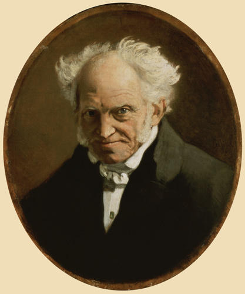

# ＜天玑＞哲学十二钗（十）：毒舌男叔本华

**叔本华的唯意志论其实就是三种理论的混合物：柏拉图的理念论、康德的“物自体”理论与印度佛教的智慧。1848年欧洲革命失败后，人们的价值观幻灭了，理性主义灰飞烟灭，绝望和忧郁的唯意志论闪亮登场，哲学开始在理性背后发现本能，发现欲望，一种崭新的哲学精神终于登上了历史舞台。**  

# 毒舌男叔本华

## 文/张明明（清华大学）

 

大文豪歌德过腻了万花丛中过，叶子总沾身的日子后，终于心定了下来：他老人家娶了一位名叫乌斯庇尔斯的姑娘。这位姑娘年轻貌美，可惜出身却非常贫贱，那时的德国上流社会虚荣成风，极其讲究门第出身。于是乎，歌德和乌斯庇尔斯就惨遭封杀。就在歌德一筹莫展之际，有一位玲珑八面长袖善舞的上流社会交际花向他打开了大门，这位交际花正是当时风头正旺的宫廷顾问兼言情畅销书作家：约翰娜·叔本华。

感谢约翰娜·叔本华，因为她生了一个儿子叫亚瑟·叔本华；

感谢约翰娜·叔本华，她的自私冷酷虚荣，使得他的儿子成为一辈子持续不断地厌恶憎恨女人的唯意志论大师、悲观主义者——亚瑟·叔本华。

当歌德参加完约翰娜家的各种party沙龙，并与小叔本华交流之后，曾对约翰娜叔本华夸道：“您的儿子日后会有惊人成就的！”这句溢美之辞要是被别的母亲听到，定会涕泗横流：“华华呀，为娘高兴呀，你好好学习，妈咪这就给你去买脑白金补补脑。”可惜，约翰娜这位强势精明又自私的极品母亲，听完之后反而怒从心头起：哼，一山不容二虎，何况还是公和母！于是在一次争吵中她残忍地将儿子推下楼梯，屁股摔成三瓣的叔本华眸中含水，牙咬双唇：“死老太婆，你给我等着，终有一天你会因为我才留名青史！”

叔本华说对了。很久之后，世人早已记不得还有位叫约翰娜的言情小说家，却会在提到叔本华时，顺便提下叔本华他妈约翰娜。

毒舌男叔本华是个富二代，他生在钟鸣鼎食之家，诗礼簪缨之族，他的家族和曹雪芹家一样富甲一方，全盛时都曾接驾招待过国王。然而，叔本华却没有像宝玉一样成为纨绔公子哥，常年混迹于粉脂堆。出人意料的是，金堂玉马公子哥叔本华却成为了厌恶女人、尖酸刻薄的悲观主义哲学家。

其实，这一切的一切还要从他爹和他妈那不幸的婚姻谈起。

老少配向来隐患多，叔本华他爹比他妈大20岁，他爹是精明商人冷酷寡言，他妈是文艺女作家爱幻想爱浪漫，二人婚后性格极度不合，约翰娜不爱丈夫，也不爱儿子，她热爱觥筹交错的交际花生活。此外，叔本华家族有精神病史，他奶奶疯了，他的二个叔叔也是疯子，叔本华他爹后来也因为饱受抑郁症自闭症的折磨，自杀了。叔本华将父亲的自杀归咎于母亲成天浪在外面不体贴照顾父亲，母子间，嫌隙遂生。从此后，缺乏家庭温暖的叔本华在悲观主义哲学里走上了一条不归路。

叔本华为后世所津津乐道，绕不过三件事：一，《作为意志和表象的世界》；二，诋毁女人；三，骂黑格尔是坨屎。叔本华将对母亲的厌恶之情很不理智地上升到对天下所有女人的厌恶，他说“只有男人的智慧被性冲动所蒙蔽时，才会称那些矮身材、窄肩膀、大屁股和小短腿的性别为美丽。”在一次和女邻居的争吵中，他粗暴地将对方推倒，导致邻居致伤致残，法院判他给女邻居支付一辈子的生活费，于是就有了那句著名的“老妇死，重负释。”

叔本华非常讨厌黑格尔，正所谓人生何处不相逢，一旦相逢就抽风。叔本华到柏林大学当老师时，黑格尔正在柏林大学如日中天，他的哲学课不仅座位上坐满了人，过道上还站满了人。为了和黑格尔分庭抗礼，顺便证明下自己，叔本华很自负地将自己的课程排在和黑格尔同一时间段。于是乎，这样的场景就出现了：上课时隔壁黑格尔班上门庭若市门都快被挤坏了，这边叔本华班上冷冷清清两三个学生。上课铃一打，还有一个学生一脸通红站起来说：“老师，不好意思呀，我走错教室了。”叔本华彻彻底底沦为了黑格尔的手下败将。从此后，叔本华骂黑格尔就骂上了瘾：“江湖骗子，精神怪物，屁眼哲学……”

叔本华养了一条狗，他这一辈子和人处不来，和狗感情倒挺好，他给狗起了个名字叫“世界精神”。后世很多不懂哲学偏又喜欢仰视哲学家的人们呼天抢地捶胸顿足：“差距呀差距，我家狗叫旺财，大师家狗叫世界精神，大师不愧是大师呀。”对此，我很无语。“世界精神”是黑格尔的专有术语，在黑格尔那里世界历史就是世界精神的发展过程。试想下，当现实中黑格尔手下败将的叔本华看到黑格尔的“世界精神”向自己摇尾乞怜，虚荣心终于能在YY中得到一番满足。

叔本华30岁就写出了《作为意志和表象的世界》，写完后，他出门旅了个游，内心焦灼不安地等待着大家的赞美或是批评。可悲剧的是，竟然没人搭理他，他的书完全卖不出动，最后都贡献给村头厕所当厕纸了。其实，我知道有很多人喜欢叔本华的悲剧哲学观，倒不是因为他们个个命运多舛感同身受；主要是他们太闲了，日子太平淡，于是就有了大把时间和精力可以去抱怨生活，少年不识愁滋味，为赋新词强说愁呗。除此之外，大家喜欢叔本华，是因为《作为意志和表象的世界》这本哲学书，难得大家都能看懂。这本哲学书里没有康德学究式地概念，黑格尔的晦涩文笔，斯宾诺莎的高深几何学方法，它风格清晰明了，偶尔还有个小幽默，全文都紧凑地围绕着一个主题，那就是：“世界的本质是意志，人生就是斗争，就是一部悲剧的苦难史！”

我建议喜欢哲学的孩纸们，千万别错过《作为意志和表象的世界》，看完此书，你会内力大增。比方说，情人节到了，你妹纸撅起樱桃小嘴向你抱怨：“隔壁实验室的MM，情人节收到GG送的200欧的包，你送我200欧的电阻，你一点不爱我。”这时，你就要气定神闲地回答：“来，妹纸，听哥给你讲讲什么是表象，什么是意志吧。”《作为意志和表象的世界》中的“Vorstellung”被翻译为“表象representation”，这个词在德语里其实还有“剧本”和“歌剧表演”的意思，英文的翻译不是那么精准。叔本华认为印度教的概念“摩耶（maya）之幕”即“幻想之幕”才最符合他的原意，而“意志”与“梵天”最为匹配。《作为意志和表象的世界》开篇第一句就是：“世界是我的表象”。在叔本华看来，整个世界首先是作为人类的印象而存在，对人而言，直接存在的不是这些事物本身，而是人们对事物的印象。花非花，雾非雾，人们从来没有真正了解花与雾。然而，在所有的表象之后，还有另外一种东西，这个东西老宅男康德称之为“物自体”，“现象”能为人所感知，而“物自体”不依赖人的意识而独立存在。叔本华进一步指出，这种“物自体”就是“意志”，“所有生物都依赖它而出生，依赖它而生活，伴随它直到死亡，直到他们加快步伐”。这世间的万事万物都是意志的客体化，好比牙齿、食道和肠子是客体化的饥饿，生殖器官是客体化的性欲，意志总要把自己表现为可见的世界。

叔本华进一步指出世界就是意志，所以它充满着痛苦和狰狞。意志即是欲望，欲望总是沟壑难填。一个欲望倒下去，十个欲望站了起来。娶了红玫瑰，白玫瑰成了床前明月光，红玫瑰沦为墙头一抹蚊子血；娶了白玫瑰，红玫瑰成了心头一颗朱砂痣，白玫瑰沦为一粒饭渣子。鱼与熊掌不可兼得，范冰冰与李冰冰不能同娶，欲望永远不能满足，意志永远是饥渴的意志。对于人生，痛苦才就是基本刺激，而快乐无非是痛苦的暂时中断，如果你此刻没有被痛苦所包围，那很快无聊就会侵入。好比我们一开学就痛苦，一放假就无聊，“人生犹如钟摆，摇摆在痛苦和无聊之间。”

如果你的痛苦比别人多，不是因为你感情丰富没事干，悲天悯人；是因为你比别人聪明。“最低等的生命能感受到很小程度的痛苦……一个人越是有智慧，他的痛苦就越多。”人家草履虫不怎么痛苦，是因为人家的感官系统还有待进化，而聪明人总是见多识广举一反三触类旁通，他们记忆力强，对感受的痛苦比一般人多。所以，天才其实最痛苦！

人生说到底，就是斗争！自然界弱肉强食，每个物种都在为物质、空间和时间而战，螳螂捕蝉，自有黄雀在后；而人世间，也充满着倾轧冲突，于是就有了那么多的战场、牢房和刑场。既然人生就是意志，意志就是斗争，意志就是痛苦，那如何消解痛苦，摆脱意志呢？叔本华提出了两条道路：一是通过艺术审美来暂时遗忘痛苦；二是通过理论和行动彻底摆脱痛苦。在意志和表象之间有一个中介：理念，而认识理念世界的方式就是艺术。通过艺术审美，人类会暂时忘掉个体的物质利益，把心灵上升到对真理的无意志高度，艺术通过瞬间表现永恒和普遍来减轻人生的痛苦，在艺术的诸多表现形式中，音乐首推第一。音乐直接复制意志，它是意志的直接写照：“音乐绝不是表现着现象，而只是表现一切现象的内在本质，只表现着意志本身。”叔本华的音乐观到后来深深影响了瓦格纳和尼采。

艺术对痛苦的消除，犹如一颗止痛片，药效有限；要彻底消除痛苦，还得通过理论和行动。在理论上，意志就是欲望，欲望引起苦难。只有扼杀欲望，提倡禁欲主义，才能否定意志。禁欲就要做到不近女色千金散尽，印度教中苦行僧就是对生命意志的彻底否定；在行动上，我们要学会同情和博爱，既然世间万物都统一于意志，那万物之间就应该消除界限，正所谓落地皆兄弟，何必骨肉亲？我们要同情所有生命中的苦难，把一切生命的痛苦看做是自己的痛苦。

叔本华的唯意志论其实就是三种理论的混合物：柏拉图的理念论、康德的“物自体”理论与印度佛教的智慧。西方哲学从苏格拉底开始，就提倡理性，黑格尔将理性主义推向了极致。在讲究理性主义的西方哲学界，叔本华的唯意志论甫一出场，根本得不到任何重视。然而，1848年欧洲革命失败后，人们的价值观幻灭了，理性主义灰飞烟灭，绝望和忧郁的唯意志论闪亮登场，哲学开始在理性背后发现本能，发现欲望，一种崭新的哲学精神终于登上了历史舞台。

让叔本华这么晚出场，其实我有私心。试想，他老人家要是上学期末出场，那时的你我正为期末考试折磨的死去活来。倘若你感觉一学期碌碌无为必定要挂科，又感慨世之多艰要过年了还是没钱没妹纸，你此时要是心理脆弱点，信了叔本华的忽悠，没事干跳跳楼、投投湖、耍耍刀子，多少人得跟着你心惊胆战啊。受叔本华悲观哲学影响，自杀的人太多了。如果各位真的认定人生就是悲剧，那不妨像我一样学马克思吧，马克思会告诉你，悲剧的根源不在于意志不在于欲望，问题的本质要回归到经济历史阶级层面上：不是妹纸太物质，不是高帅富太霸道，是爱情抵不住资本的诱惑，早已异化了。

当然，你也会说：“滚丫的马克思，老子挂的科就是马哲，一提到马克思就想吐。”如果真是这样，我啥也不多说了，含泪推荐你转投尼采门下吧。尼采一定会摇头晃脑地说：

哼，悲剧又何妨？

哥就是小强。

想要消灭哥，

门都不要想！

妹纸不听话，

鞭子抽得响！（尼采名句“是去找女人么？别忘了带上你的鞭子”）

尽管尼采和叔本华都认为人生就是悲剧，但二者的解决问题的方法却不一样，叔本华付诸于消灭意志，尼采付诸于强力意志，与天斗与地斗其乐无穷！于是，老舍那么个老实厚道人，因为叔本华的消灭意志，一不小心连肉身都消灭了，他投湖了；周家老大鲁迅，无论面相还是文风都深深弥漫着悲观倾向，可人家因为读了尼采，不再为难自己个，转而为难他人了：骂梁实秋、骂胡适、骂林语堂，我骂你，你更红了，我也紫了。

如果尼采也满足不了你，你依旧对叔本华情深意重，依旧讨厌这个悲剧的人生依旧想自杀，那我友情建议你把架在脖子上的明晃晃的刀，往下挪一点吧，对，再往下。OK，there，就是there，好了，你可以尽情挥刀了。记住，人家叔本华的意志里，除了生存意志还有生殖意志呢。从此后，你身残志坚，但你拥有了独一无二的机会：身体力行地去钻研另外一部探讨人的意志和行为关系的哲学旷世巨作《葵花宝典》。

叔本华一辈子活得很辛苦，除了嘴巴毒舌不招人待见外，他还是严重自恋症和被迫害妄想症患者。叔本华讨厌所有人，但惟独爱自己，只要自己做不成的事，那都是别人的错，黑格尔费希特比我红，那是因为他们是骗子；我的书卖不出去，那是因为别人看不懂。叔本华永远刚愎自用骄傲自负，有着一个接一个的理由为自己开脱。被迫害妄想症患者叔本华还觉得世界上所有人都有可能谋杀自己，他时时处处提防着他人：睡觉时枕头边必定有一把匕首或者手枪；理发时坚决不让理发师的剃刀靠近自己的喉咙；值钱东西全部藏好，这个藏书里，那个藏到墨水瓶里，所以叔本华死后不仅为后人留下无情无尽的哲学精神宝藏，还留下了一封用拉丁文写的财产藏宝图。

皇天不负有心人，叔本华的惜命如金终于起到了效果，1831年，柏林鼠疫肆虐，叔本华的死对头黑格尔不幸染上鼠疫，不治身亡。叔本华因为跑得快逃过此劫。大难不死，必有后福。叔本华在黑格尔死后不久，渐渐开始走红起来，多年的媳妇终于熬成了婆！

通过学习黑格尔和叔本华的斗争史，我们可以轻松的得出一个结论：想当大师，一定要满足以下两个条件：

充分条件：有一定的学问；

必要条件：活得长；等知道你底细的人全部挂了，你就掌握话语权成大师了。

1860年9月21日，毒舌男叔本华在吃完早饭后，安静并永远地闭上了嘴巴。他这一辈子在某种意义上很幸福：继承了大笔遗产可以心无旁骛地搞哲学，虽说垂垂老矣才声名鹊起，但到底还是获得了“大师”的称号，生时就被世人敬仰。然而，叔本华这一辈子在某种意义上又很不幸福：没老婆没孩子没家庭没朋友有妈等于没妈，舅舅不疼姥姥不爱，人缘极差。

尽管叔本华的一生落落寡合神经敏感乖戾暴躁爱吵爱跳，不招人待见，可他在我心里，其实就是一个小孩，一个没有长大的小孩，一辈子缺的都是：

爱。

《哲学十二钗》正册完结篇预告：《恩格斯：好基友 一辈子》

 

（采编：徐海星，责编：黄理罡）

 
