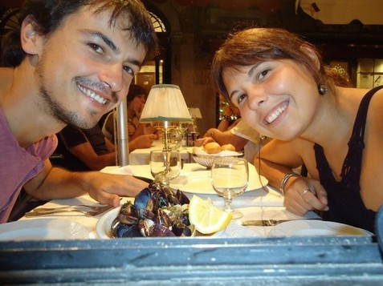
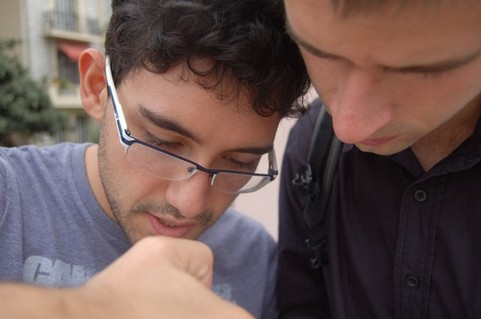
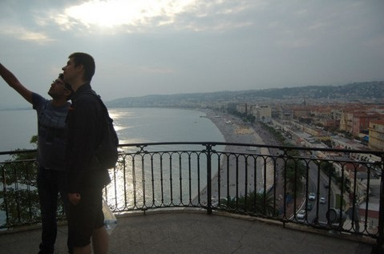

# ＜天玑＞小丫行迹（一）之 追“忆里斯本”

**意大利和南法接壤的地中海沿岸地区，景色可以用惊艳来形容，一面是大海，一面是山崖，火车在山与海之间穿行，山上有起起落落的房子，和大片叶子的亚热带植被，海水蓝的透彻，坐在火车上，眼前俯拾即是的是良辰美景，而我独享的，是这无法与人诉说的万种风情。云在青天水在流，想念在我心里不可抑制地滋生起来，并且势不可挡。**  

# 小丫行迹（一）之追“忆”里斯本

## 文/ 仇小丫（慕尼黑大学）

 

有人说，人与人之间，不过因为爱而变得与众不同。爱，使爱你的人，将你于千万人之中区别开来，并且凌驾于他们之上。爱同时也赋城市以灵魂，一个城市，如果有那么些个爱着的人，那么这个城市之于你，便因了这份爱，因了这些不一样的向往和追求，而成为了区别于千万花朵之中最独特的一支玫瑰，它成了你心里一块带着灵魂的地方。爱说到底是种归宿，如果我可以找到一个很久不挪窝的地方，我想，它应该是里斯本。

和两位葡萄牙朋友分别了一个月后，我一个人游荡在意大利，从南到北，从东到西。意大利和南法接壤的地中海沿岸地区，景色可以用惊艳来形容，一面是大海，一面是山崖，火车在山与海之间穿行，山上有起起落落的房子，和大片叶子的亚热带植被，海水蓝的透彻，坐在火车上，眼前俯拾即是的是良辰美景，而我独享的，是这无法与人诉说的万种风情。云在青天水在流，想念在我心里不可抑制得滋生起来，并且势不可挡。

遇见玛利亚和马塞洛的时候，我并不知道，他们将是我今后漫长人生中不可或缺的人物，原本以为，那些你生命里很重要的角色，出场的时候甚至是要有个仪式，起码是我们有准备的，直到他们不经意地闯进我们的生活，我们才突然明白，越是那些不会离开的人，越是随意地进入你的生活，随意到连他们自己都不清楚是怎么回事。

那天晚上，我疲惫地坐在布拉格的火车站里想接下来的行程，本应该去奥地利，因为有个在路上认识的德国朋友原计划第二天在维也纳过生日，我们在布鲁塞尔相遇，在一间青旅睡觉，分别的时候说如果可以，希望28号的时候一起在维也纳过生日，是件很美好的事儿，可是我手机没费又没电，想来去了也找不到他，不知道该怎么办，起身去看列车时刻表，电子板上都是捷克文，我一边皱着眉一边小声叨咕what a fuck……一个男生突然走过来问我，你也去Krakow(克拉科夫）嘛？还没等我说是，他就说哎呀我们也去那里啊可是根本看不懂这是什么嘛！

葡萄牙人果然都是天然疯，我看了看他，又看了看他身边同样皱着眉絮絮叨叨的女孩，三个回合看下来，我瞬间在内心里偷偷改了主意，“是啊，我去Krakow啊，我们一起吧！”

我开心地去收拾背包，他们去楼下咨询火车信息，然后会合。在那之前，我已经在德国和东欧待的太久，憋闷的不行，突然遇到火一样热情的葡萄牙人，欢喜的不得了。我相信人与人之间是有感染力的，如果你每天跟一个苦大仇深的人在一起，你也会变得多愁善感起来，相反，一个天然疯肯定会治愈一个天然呆。才跟他们接触不到几分钟，我们就同时被彼此身上如此吻合的气场吸引，即不需要有多了解就瞬间喜欢上对方并且带着一种相见恨晚一样的投机感。

寂寞的人有一个共同的特点，他们平常看起来跟其他人没有任何两样，一样上班上学，一样说话聊天，但是他们一旦被人触碰到内心深处那些在他们看来是“别人不想触碰或者触碰不到的深层次的东西”，小宇宙就立刻爆炸得一发不可收拾。很明显，我属于深层次寂寞的人，就是，明明寂寞的抓耳挠腮凿墙抠地，还愣是装得人模狗样，清高的不得了。心理学和行为学中都有指出，那些有抑郁倾向（或者很寂寞的人）潜意识里都非常渴望与人的肢体接触，外人（尤其是他们心里不抵触不排斥的人）对其有意无意的肢体触碰，会让他们因为感觉到被信任，被关爱而开心兴奋起来。葡萄牙人在说话的时候习惯真诚的直视对方的眼睛，喜欢用拥抱、亲吻来表达自己的感情，他们喜欢并且擅于运用肢体语言。我想这也是为什么，我喜欢和他们在一起的原因之一吧。

我们在车厢里放声聊天，像几年没见面的旧友，整个车厢里充斥着我们的说笑声，聊到都困了，我倒在一边椅子上睡着了，半夜醒来，发现玛利亚在另一边椅子上睡着，而马塞洛正躺在我们俩中间的地上，睁开眼看着地上这个熟睡的大男孩，我突然心疼起来，原来，不管是多么大大咧咧的姑娘，女人天生带着的母性情怀总是会时不时地发作，迷迷糊糊之间我把他叫醒，把我的睡袋递给他，他很开心地拿过去接着睡（在后来的接触中，马塞洛不止一次提到这个事情，也因此使他断定我是一个疯疯癫癫但是心地善良的姑娘），而我再一次睁开眼睛，是被玛利亚的叫声吵醒，女人的第六感，让她在一个中年男人试图进来偷东西的时候突然醒来，大叫，最后得以守住背包。我们随即起来，说了会儿好吓人啊要小心之类的的话，又接着睡去了，直到第二天醒来，我们已经在波兰境内，像三个孩子一样大叫起来，“哇，这里是波兰啊……”

波兰的第一天，我们去了纳粹集中营（详情请见后文关于波兰纳粹集中营专集），一起感叹，沉痛，时而皱着眉，时而彼此对望。他们更像我的哥哥姐姐，一直照顾和保护着我，聊天，像老朋友，一起坐着喝杯咖啡，坦诚地聊那些温暖过彼此心灵的东西，有道不尽的感情。

在短暂的接触当中，我发现玛利亚是一个很有原则的姑娘，她经常有一些很奇怪的坚持，比如，上厕所绝不给钱。我问她为什么，她说，我不能理解，为什么上厕所也要收费？这是人的生理所需，人们利用这种最简单的生理需求赚钱，这是极不道德的！这是纳粹！我一边想笑一边又不忍心破坏她身上散发出的那种带着强烈正义感的普世光芒，“那……每次去WC的时候，你难道都是站在门口对着那个收费的女人说，你们这样是非常不道德的你们知不知道，你们竟然利用人类的生理需求赚钱啊你们blahblah……吗？”她说，“哦，也不是，我就说我要上厕所，但是我没钱。”“那你要是遇上个贱人，她就不让你去怎么办？”我好奇地问。“那我就尿在门口给她看！”我被惊得说不出话来，但心里早已被她有趣的正义感给融化和折服了。“那……有些WC是无人售票的那种，这咋办啊？”我不屈不挠地接着问。“那……那我就憋着呗！”说完我俩同时哈哈大笑，再也忍不住了。而他男友马塞洛，则在我们身边大声喊“是！！你还穿着睡衣跟我去海滩呢！！”然后转过头来，一本正经地小声对我说，她很特别，我爱她。

原本不过是这世界上再普通不过的陌生人，只因在擦身而过时多了句问候，便聊了开，然后发现如此投缘，又走在了一起，我想这应该是《小王子》里“驯服”的过程吧，我们于彼此原本仅是大千世界里互不需要的路人甲，现在彼此驯服，便成了区别于其他人之外的对于彼此的唯一。

（注：非常喜感的一对儿）

坐在意大利去法国的火车里，想着他们，又想起那些遥远地方的家人和好友，心里莫名的孤独和难过起来。

世界没有变，变的是我们自己，旅行让我们心里充满了爱和感恩。此刻，美丽不再是遗世独立，不再是骄傲和倔强，是与家人和朋友一起，分享哪怕一点点快乐，一点点悲伤，一点点脆弱，和一点点，共同看到的世界。

我闭上眼睛，自嘲起来，哎，人生自古有情痴，此恨无关风与月……

突然被近在咫尺的脚步声惊醒，原来是我对面那位不知道什么时候消失又不知道什么时候出现的男生回来了，我用英文跟他说抱歉，因为我把腿放在了他的座位上，他一脸茫然地看着我。

“又是一个不说英文的，算了……”我想。

“哦，你说英文啊，那我们说英文吧。”茫然了一会儿，他竟然接着问我。

“那你还说什么语？”我好奇地问。

“我说英文，意大利语，德语，法语，哦，我是俄罗斯人，在都灵读phd。”他这样说着，就像在叙述着自己喜欢吃包子、馒头、花卷，哦还有麻花一样。

“……”

“有些人呢，自称自己说好几国语言，但是很多都是连皮毛都说不好呢。”我一边无耻地安慰着自己，一边对这位自称说5国语言的男孩子各种试探。男人的智商和才华，就如春药一般，它会让眼前一个非常普通的男孩子瞬间变得性感而充满魅力。没有它，日子一样过，但是有了它，就像蛋糕上面涂了层奶油，你犹豫它的腻，又舍不得它的香。

这趟旅程，各种转车和等车时间加起来差不多四个小时，四个小时足矣攻破人心里的第二道防线，从陌生人变成熟人了。他把看风景的位置让给我，坐在我旁边用德语给我讲法意两国的历史和文化，哈，真是一个言之有物又滴水不漏的男生。我一边开心地欣赏窗外的山水，一边随声附和。

“你知道刚才我为什么闭着眼睛不看风景么，因为当你一个人的时候，越是这样美丽的东西，越不能碰，它只会平添你的孤独，人类有和爱人分享的本能，而我此刻只能想念着远方的亲人。”

虽然本人平生在陌生男人面前说过无数次不着调的话，但是这一次，却是所有不着调当中最着调的一次，以至于我自己说着说着眼泪都快出来了，我把脸转过去，心里想着我怎么可能流这么粗制滥造这么下三滥的眼泪呢，这么琼瑶的片段根本不符合我倔强刚烈的本性呀，为了我长久以来塑造出来的倔强刚烈，我决定把眼泪收回去，在资本主义世界里做一朵坚强勇敢朝气蓬勃积极向上的社会主义无产阶级奇葩。

“你去哪里？”他突然打断了我的心思。

“哦，尼斯。”

“去尼斯做什么？”

“转车去巴塞罗那。”

“去巴塞罗那做什么？”

“横穿西班牙直奔里斯本。”

“额……所以你是去里斯本咯？”

“哦！是的是的！一个月前我在布拉格相遇了一对男女，现在我想去找他们，告诉他们我很想他们！”一想到我的两个朋友，我的情绪突然激动起来，开始眉飞色舞地给他讲一些路上发生的故事，“虽然他们并不知道我要来……”，因为我也不确定是否能找的到他们，一想到这，声音突然暗了下来……

或许每一个不安分的博士在他的phd期间都会不期而遇一位神经症的少女，但并不是每一个神经质的少女都会在她发神经期间遇到一位闷骚的博士吧我想。人们总是容易被新鲜的事物吸引，这强大的好奇心，也许源自人类最原始的对一切未知事物的探索欲吧，她是新鲜的，带着未知的性感，勾引着你去探索。

火车还有十分钟要到达尼斯中心火车站时，他突然说，“要不这样，你不要在这里下车，我们在下一站下车，我把东西给我朋友送去，然后咱们再一起坐车回到尼斯来，顺便在尼斯逛一逛，然后你再坐车去西班牙，你看怎么样？”他慢条斯理一句一字地说着，通常这种语气都会给人一种“这话听起来非常在理”的错觉。

在接下来的三秒钟时间里，我想了很多，比如说为了弥补我的交友史上俄罗斯版图的空白，为了促进中俄两国之间的关系友好发展和民间文化交流，为了进一步贯彻落实党中央的精神纲领和三个代表的指导方针等深刻觉悟……我要跟他去，视死如归义无反顾地去！当然啦，我只不过是想用三秒钟的时间来想一想怎样才可以掩饰自己不被人看穿的小兴奋感，我这样一个恋爱受打击，离家千万里，又独自流浪的小姑娘，遇见这样一个有才有趣有貌有品的男博士，不干柴烈火岂不是逆天了么？！

“哎，也好……”内心一番狂轰滥炸之后我若有所思地吐出了几个字。中华民族古典女子的传统美德此刻已经被我发挥的突破天际了，内心如滔滔江水般汹涌，面部如一潭死水般寂静想来也不过如此了。

大约半小时后，我们到了尼斯旁边一个小城，一起去找他的另一位意大利博士基友。我很开心，因为我最喜欢和意大利男生在一起玩了，你跟他们在一起，什么都不需要做，唯一需要的，就是你是女人。他们生来就对女人有一种特殊而执着的爱。

到了他家，看到我，那个男孩子不出意料地愣了一下，因为事先不知道有女生要来，况且又是莫名其妙多出来的中国女生。我身边的男博士本身也有点云里雾里地一边抓着脑袋一边不知道怎么解释好，“哦，火车上认识的朋友，待会一起去尼斯”我笑着跟他说，“另外我叫Choco，专业流浪，很高兴认识你。”这样我们就算彼此认识了，虽然他有点摸不着头脑，但是因为他是意大利男人，所以我知道没必要跟他解释的太清楚，只要甩甩头发跟他笑一笑就好了，他才不管那些。我去洗手间洗出油的头发，换了个裙子，涂了涂睫毛膏，虽然也看不出什么效果，不过心理上自信很多，反正今天也不往下走了，那么我就在南法浪漫的海天之间安安心心地做个漂亮的中国女生好了。

他们俩基友在房间里研究他们实验方面的事情，哎，phd都敢读的人，还有什么事情做不出来。我在房间里像个间谍似地四处拍照，顺便邀请意大利男生安东尼跟我们一起去尼斯。出来玩嘛，点到即止。要真是一对儿孤男寡女地在一起待一天，还指不定擦出什么火花呢，拉上他可爱的意大利基友，有趣又安心，一举两得。

我很naive地以为，安东尼会像所有意大利男生那样很爽快很开心地答应，没想到他居然无动于衷沉默了三秒，然后说“我想想……”

神马？！居然在老娘这么盛情雀跃的邀请下纹丝不动还故作深沉？！我没说话，横穿客厅直达卧室大踏步冲到他面前，死盯着他，内心的活动是“有没有搞错？！你知不知道你现在在做什么啊少年！”然后我礼貌地朝他笑了笑，“好，那你好好想想吧。”接着转身对我身边的男人说：“你看看现在几点了，咱们火车什么时候，没什么事的话咱们应该抓紧吧，时间很赶……”“好，我去！”我话还没说完，就被安东尼打断了。“这才乖嘛~这才是意大利男生嘛~臭小子竟然跟我耍花招……或者也许真的是读书读傻掉了……”我这样想着，一边跟他说“我真的很开心你能加入我们，收拾东西我们现在就走吧！”

我们三个说说笑笑坐了二十分钟火车到达尼斯，阳光明媚，天气晴朗。

此时已是九月下旬，南法最好的时光，没有七八月份的拥挤和燥热。一个月前我第一次到尼斯时，阳光直射的我像个曝露在光天化日下见不得人的小老鼠，而现在，风也有情，水也有情。最多情的海一定不会绽放在盛夏，就像，最美的花一定是美在半开之时，最好的酒一定是喝到微醉之处。刚经历了一个夏天的炙热，初秋的南法，带着许多慵懒的温柔，街上的行人，连走路都从容了很多。我们仨，以很奇怪的方式凑到一起，走在尼斯的街头巷尾，爬山看海，吃饭聊天，不似旧友，更像是一辆公车里三个来自不同地方有着不同目的地的乘客，一起说笑，一同欣赏途中风景，这是乘客之间能做而且也只能做的事，大家都是行走在这美丽世界里的孤儿，在一起，就搭伙打发时光，分离，也没有多余的留恋和惋惜。

彼时已近黄昏，想到这里，我便匆匆跟他们告了别，没有拥抱和握手，只留下了彼此fb的联系方式，我搭上一辆电车，就再也没回头，没有看我走之后他们的表情，没有问后来他们又一起做了些什么。车窗外的街道和行人，在夕阳里格外的好看，世界也变得温柔。这样多好，这座城市，我不知道以后什么时候会再来，但是和两个遇上的人，在这里走过，吃过，笑过，山上和海边，都是那些欢声笑语的痕迹，一个原本毫不相干的地方，却因为这样的不期而遇，在以后的回忆里，莫名的温暖起来。匆匆告别，只因为，连我自己都理解不了我身上那些不被人理解的相思。我知道，自己只是个行者，对山水红尘没有过多权力的贪恋，太眷恋感情的我解救自己的唯一方法就是不去触碰了吧。我一心奔着西南方向过去，像奔着某种宿命，我与那里也没有任何承诺，我不过知道，那里有人盼着我。无论在哪里，一旦知道某处有真正盼着自己的人，心里就莫名的安全起来，这个盼头，足够让我有力气去踏遍万水千山了。

（未完待续）

 

（采编：应鹏华；责编：麦静）

 
