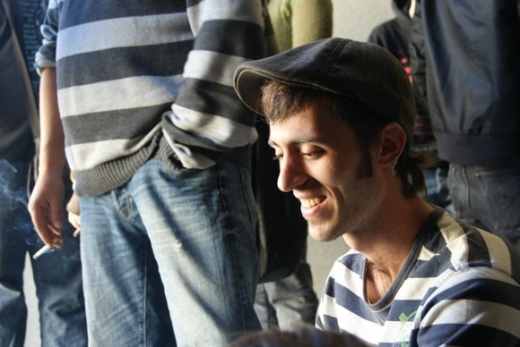
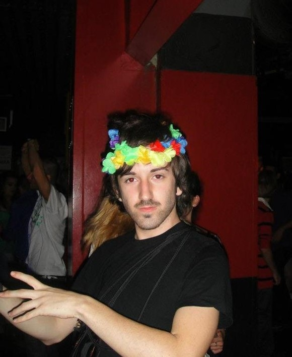
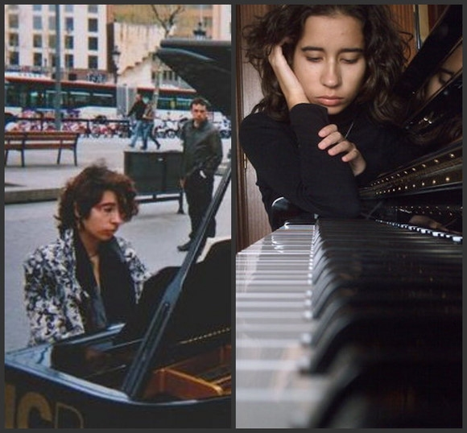
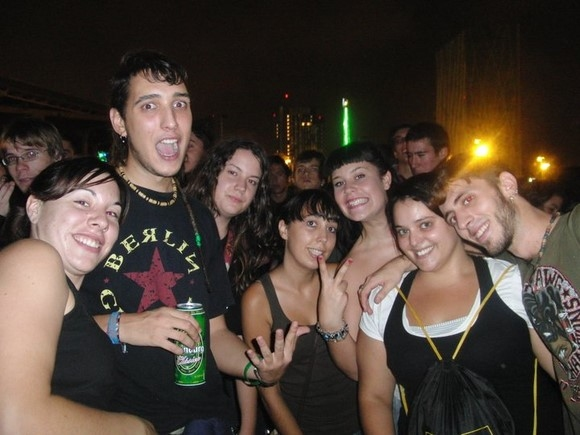
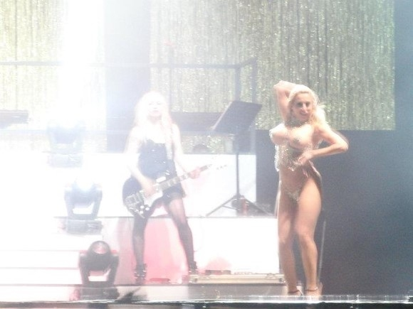

# ＜天玑＞小丫行迹（三）之午夜巴塞罗那

**那些街头巷尾历历在目的仿佛一闭上眼睛就在昨天的人和故事，它从来就没有过去，你从来就没有忘记。睁开眼睛，你才清醒而无奈地承认，那些青春里风一样的从你身边一晃而过的东西，竟成为你漫长生命里再也追不到，找不回，忘不掉的回忆。就像树脂邂逅了昆虫，年少时从没想过去珍惜和在乎的东西，竟像琥珀一样，铸进了你的心里，瞬间成就了永恒，于喧闹处掩藏，于恰当处提醒，阻止你变成一个冷漠无情，麻木不仁的大人。** 

# **午夜巴塞罗那**

## 文/仇小丫（慕尼黑大学）

 

很多人对我说，你这样太不靠谱，你一个亚洲姑娘自己走欧洲也就算了，你还瞎走，你没有计划也行，你还不找旅馆！

在生活里，在旅行中，我听到最多的一句话其实是：“生活，可不是你想的那么简单！！旅行，可不是你想的那么容易！！”言辞之恳切，态度之不屑，连我自己都相信自己是弱智了，并在一片教育和教训声中深刻为自己有这样简单的头脑和天真的世界观感到羞愧不已和自叹不如！

但是，生活是什么模样呢？是面目狰狞的？还是温柔可爱的？是冷酷无情的？还是似糖如蜜的？

9岁，我离开家，开始了漫长的一边想念父母一边各种寄宿于人的生活。16岁，我妈带着我，带着一些脸盆被褥和简易家具，送我到了自己租的宿舍里，开始了集体的住宿生活。

20岁，我爸送我到长春火车站，我带着行李从长春到北京，从北京到慕尼黑。开始了异国生活，到写这篇文字时，没有再见到父母。

我的生活和经历，铸造了我的兴趣和性格。

生活是什么样？

生活，在你看待生活的双眼里，在你面对生活的心态里。

我的性格，简单到偏执，甚至幼稚。我遇上的人，善与不善，都不曾有丝毫的害我之心。我一直认为，你自己没有害人的想法，别人也没有害你的必要。你是什么样的人，就会卷入什么样的战争中。听听你身边的人每天跟你抱怨最多的是什么，他多半也是那样的人。

生活，已经把我磨练成了野生动物，听听你说话的声音，看着你看我的眼神，触摸一下你身上散发的气息，我便拿捏的到与你交往的分寸。我说这是个好人，为什么，说不清，只是我身上的每一个器官都告诉我，他不会伤害你。

从法国一路到巴塞罗那，像往常一样，没有旅馆，没有接下去的火车。我不知道该怎么办，就好像随便把自己往命运里那么一放。

不远处有6个青年男女，也似乎是我周围20米距离内唯一出现的人。

请问，你们知不知道，今天还有没有去往马德里的火车？ 

今天没有了哎...你自己吗？现在找旅馆也找不到了哎，你怎么办啊？

不知道......还有一步我就可以到达里斯本了，我去那里找我的朋友......

哎？！你来参加我们的Party吧！！

Party？！什么Party？！

今天晚上有演唱会，露天的大Party！！你来吧！我们都去呢！

真的呀？！……那......Party之后呢？

回家呀！当然是回家咯！

你看，你们有家回，我又没有家......

哎呀！想那么多干嘛？！先去Party玩再说嘛！

几个人一边说着一边拉着我就走，“你还有更好的选择嘛！不然你就自己在火车站里睡好啦！”

“好吧......”

我就这样被一群奇怪的年轻人给拖走了，一对儿gay，一个女性化和文艺气息很浓的写字的男生，一个是胡子和体毛都很重的中性化的女生，只有一个看起来正常的男人，却回家了，剩下一个是背着大包的奇怪的我，完全不知道要去哪里。

他们是巴塞罗那大学不同专业的学生，小时候一起在一个镇子里长大，英语非常棒。除了那个写字的文艺男青年外，其他人多少都穿着各种唇环，鼻环，耳环。喝酒，嗑药。但却出奇的善良和友好，我甚至能看得到那些奇异外表下的一颗颗年轻而柔软的心。

小受很喜欢撒娇，电梯上要回身抱着男朋友，公车里要趴在男友的肩膀上。他一米七几，男友一米九几，小受时不时地抬起脚来亲男友一下，笑容像花儿一样，开在我面前，开在所有人眼里。我被这样纯真而美好的爱情感动得外焦里嫩，135度角仰望天空，兴致勃勃地给他们讲故事。

“我在瑞士遇到一个男人，没说几句话呢，就送我一块600多法郎的瑞士手表，你说瑞士人怎么这么有钱啊！啊？！”

“天哪！真的吗！！怎么可以这样啊！！”大家异口同声。

“哎，我也嫁个有钱的男人，有大房子，和好车子......”我对面的小受喃喃地说道，说着觉得不对劲，“哎呀，我不会的啦，我有男朋友的”，一边搂住身边的男友，一边哄着说，“我是爱你的，我不会离开你的啦！”

男朋友脸上的表情有些不自在，低下头，像大多数满足不了女朋友物质欲望的年轻男孩儿一样，那样的一转瞬的脸上，带着一点点男人的责任和歉意，一点点对女朋友的失望，一点点对无良社会的愤怒，一点点对自己的不满意。

“我唱歌很好听的，我一直梦想着做一个歌手，或者吉他手。”小受挎着我的胳膊说。

“我想当一个作家，我每天都很认真地写博客。”文艺青年。

“我从小就学钢琴，想做一个钢琴家。”文艺女青年。

“我们太穷了，我们什么都没有。要很努力地打工，才支付得起房租和交通费用。”小受男友（左二）。

喊过，唱过，跳过，喝完酒的party过后，我们几个前前后后走在凌晨三点的巴塞罗那的街头，说着自己的梦想，说着社会的现实。有烟花开放后的冷清和落寞，情绪是不高的。

他们，是行走在这座城市里最普通的大学生，他们的父母不贫穷，也不富裕。他们时而逃课，成绩不是那么好，却也不是很糟糕。他们想找有钱人，却在混沌的人潮中执着地寻找或守护着自己的爱情。他们有梦想，他们带着梦想在这个社会中变得越来越现实。他们在人前自然疯癫，在人后独自失落。他们在成长过程中逐渐长出了一层坚硬的外壳，然而内心，却包裹着不

为人知的柔软和脆弱。他们在坚持自我本真和被社会“驯化”之间苦苦挣扎，他们是这个时代里的年轻人。

（口味略重......）

午夜的巴塞罗那，有梦，有爱，有笑，有哭，有伤心和沮丧，有愤怒和疯狂。有一群年轻人，走在路上。

我被女孩子带回家睡觉，早上醒来，留了一小封信，便匆匆离开了。三个小时的火车后，我到了马德里。

距离里斯本终于只有一站了。

西班牙是个很有趣并且值得混一混的地方。然我急着赶往里斯本，那时我只知道和西班牙的缘分未尽，果然，在写这篇文字的一个月半月后，我就会再回到巴塞罗那，开始为期几个月的新生活。

我在马德里没有找到要找的人，也不想找了，也不想走了。

找到一个高处的天台，我看着眼睛下面夕阳里的马德里，哭了起来。

很多时候，我们会突然很想念一个人。TA有可能是你爱过恨过骂过走过很久也忘不掉的情人，但更有可能是跟你吃过同一碗麻辣烫穿过同一条裙子，一起喝过酒，一块儿骂过人的姐妹或哥们儿。

在一起时，朋友是习惯而并非牵挂。天各一方，相距甚远时，你会扪心自问，为什么这个跟你没有任何血缘关系，你对TA已经熟悉到厌倦的人，竟然隔着这么远而依然牵动着你的神经。

你开始回忆着每一件你和TA一起经历的平凡的不能再平凡的小事，那些你们一起走过的街，一起吃过的店，一起看中的某件衣服，一起哭过笑过的某部电影......

于是，食堂不再是食堂，书店不再是书店。那些街头巷尾历历在目的仿佛一闭上眼睛就在昨天的人和故事，它从来就没有过去，你从来就没有忘记。睁开眼睛，你才清醒而无奈地承认，那些青春里风一样的从你身边一晃而过的东西，竟成为你漫长生命里再也追不到，找不回，忘不掉的回忆。就像树脂邂逅了昆虫，年少时从没想过去珍惜和在乎的东西，竟像琥珀一样，铸进了你的心里，瞬间成就了永恒，于喧闹处掩藏，于恰当处提醒，阻止你变成一个冷漠无情，麻木不仁的大人。

天台上，黄昏里。远处是吵闹着的滑板少年，我安静地坐着。

而你，你在哪里？

你的身边，有人牵着你的手吗？

（未完待续）

 

（采编：应鹏华；责编：麦静）

 
