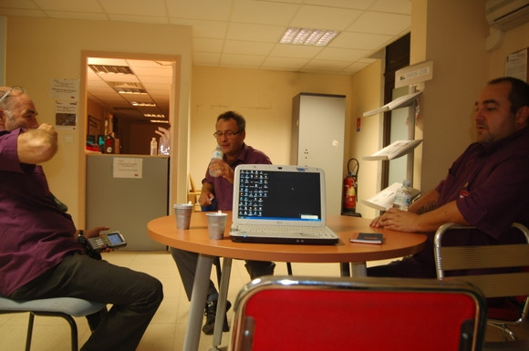

# ＜天玑＞小丫行迹（二）之经历法铁

**离车站还很远的地方，我就看到男人独自在门口等我，四处张望。在黑夜里，在风中，在周围建筑物的衬托下，独立而渺小。那背影，恍惚间竟像一个等待中的父亲。** 

# 小丫行迹（二）之经历法铁

## 文/仇小丫（慕尼黑大学）

 

“小姐，你在这里做什么，你要去哪里？ ”

“蒙彼利埃”，被这个声音叫醒的时候，我发现自己正坐在椅子上睡着，距离已被告知没有去蒙彼利埃的火车几个小时了，而我的行李还被锁在尼斯车站的行李储存间里，身上除了一点钱之外一无所有。

“有没有宾馆住？”，这位看上去五十几岁的法铁工作人员继续问我。

“没有，而且我的东西还都被锁在那里”，我说着便指向锁了门的行李间，一副破罐子破摔的态度。

“......好吧，您跟我来”，一阵无语过后，男人这样说道。我觉得有点莫名奇妙，但还是带着一股强烈的好奇心跟着去了，想来我也是多次出入过不同国家警局的人，对这个没有任何畏惧。

想着便被带到了铁路工作人员晚上值班的办公室，一个会议室一样大小的工作间，桌上几台电脑里播放着当前车站各个角落的监控录像，我四处张望，想着如果此时对面的男子对我实施不合理行为，这屋子里有没有摄像头，我有什么东西可以防身，其他屋子还有没有人，有人的话是会袒护他还是会帮助我，我现在能不能出的去？

他拉给我一把椅子，笑容慈祥温暖，“坐下吧，这个椅子舒服。你饿不饿？要不要吃点饼干？”我的思绪被他打乱了，如果不想做坏事的话为什么要像照顾客人一样照顾我呢？

我道谢，随手拿起一块饼干，跟他聊起来。聊天嘛，东北姑娘天生会聊天，东北人天生都是说相声的。屋子里很暗，只有几台电脑和窗户外面以及另一个房间里透过来的光，仅有一个老男人和一个年轻姑娘。我还是跟您聊人生聊理想吧，把气场给端正。我一边这样想着一边拿出了圈圈叉叉的地图和写着旅行笔记的本子。

聊天进行的愉快而顺利，因为工作，他时不时要出去一趟，临走告诉我，哪里是卫生间，哪里可以洗澡，还给我翻出了一堆时尚杂志，打开了我面前桌子上的台灯，而他略带黝黑又苍老的手，在灯光下，与手里拿着的杂志几乎格格不入。朴实地笑了，你们年轻女孩子都看这个吧。说完就走了。

彻底放了心，去厕所，发现自己竟不合时宜地来了月经。我开始坐立不安，他再一次回来。虽然很不好意思，但我还是不得不问他办公室里有没有备用的女性用品，因为我知道西欧的很多公共厕所里是有备用的卫生巾的。他显得有点着急，笨拙地从身后的柜子里翻出一些质量很好的厕纸，拿来一大堆给我，问我这个行不行。我笑着，还是出去买吧。

他送我到车站后门口，给我指了便利店的方向，“小心一点，快点回来，回来就从这个门回来，正门已经锁上啦，进不来啦！你一回来，走到这，我就在摄像头里看的到你，我就出来给你开门！”

尼斯夜里的街，有昏暗的灯，和初秋里微凉的风。

所有商店都已关门，偶有三三两两的黑人，在店门口的台阶上坐着或者站着，喝着啤酒，大声聊天。盯着我走来，盯着我路过，盯着我离开。不远处24小时便利店，门竟是不开的，要透过窗户喊人，透过窗户递钱，不能走进去挑，只在门口说你要买的东西，没有发票。我双手接过一包救世主一样的卫生巾，兴高采烈地沿原路回车站，像走在小学一年级时星期五放学回家的路上。

离车站还很远的地方，我就看到男人独自在门口等我，四处张望。在黑夜里，在风中，在周围建筑物的衬托下，独立而渺小。那背影，恍惚间竟像一个等待中的父亲。

如今写起，或许男人早已不记得我，而我也记不清他的模样，但这个黑夜里独自等待的背影，却画一样的镌刻在我心里，温暖过剩下的黑夜。夜不再黑，因为夜里的人，眼睛里是有光的，风不再冷，因为风里的人，心头是温热的。

我蹦蹦哒哒地跑过去，我回来啦，谢谢您，在这里等着我。 

第二次同样的状况发生在很久之后的蒙彼利埃。

法铁的经历使我变得有恃无恐和从容不迫起来。晚上十一点左右，因为火车晚点而误了去里昂的火车，经仔细翻查确定没有去往那个方向的火车之后，我开始坐在椅子上安心地吃零食。

车站是一个充满了离别和等待的地方，人们在车站里或翘首期盼或者焦急等待，而像我这样既不看时间也不看电子板只是闭着眼睛吃东西的人，要么是神经病，要么可能是神经病。

在距蒙彼利埃发出最后一趟火车的前15分钟时，我身边的法国大叔终于忍不住了。

“你去哪呀？”

“里昂呀！”

“没有去里昂的车了呀！！”大叔有点替我着急。

“是呀，错过了呀！”

“那你怎么办呀！！”大叔有点抑制不住激动。 

“不知道呀”

“......你在这里等着啊不要到处乱走啊！”大叔边说着边跑去找工作人员，用法语跟另一个大叔噼里啪啦地说着我的情况，转身用英语跟我说，“你跟他去就行啦，去里昂要明早哪，我得走了啊！旅途愉快啊！”。

大叔说着便去赶他的火车了，我一边道谢，一边平静地收拾自己的零食和背包跟着工作人员大叔走进了办公室。因为我完全知道接下来会发生什么，所以一句话都没有问。

大叔带我到办公室，灯火通明的，还有一些人，大叔一边喊他们一边介绍我的名字，我带着“同志们好！同志们辛苦了！”的气势，挨个打招呼和自我介绍。他们都出来跟我聊天，像对待一个外太空来的生物，办公室里热闹起来。我把手机相机都充了电，打开电脑开始安静地写字。 

过了很久，进来一个黑人女人，也是车站的工作人员，走过来在我对面坐下，问我在这里做什么，我跟她说明了情况。她说，你真幸运，可不是所有人都可以到这里来的。或许因为你是个女孩子。说完就走了。

或许吧。

我在日记里写下：“原来所有的偏见都源于不理解。9月28日。晴。”

（未完待续）

 

（采编：应鹏华；责编：麦静）

 
