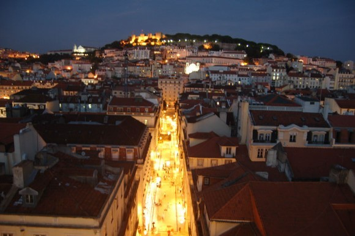
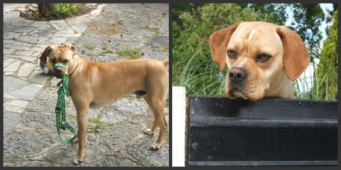
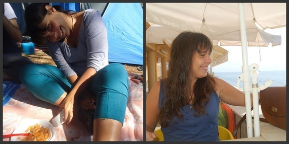
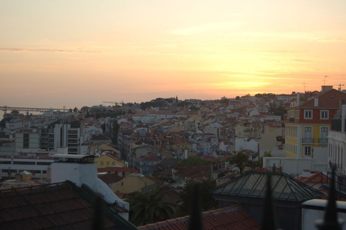
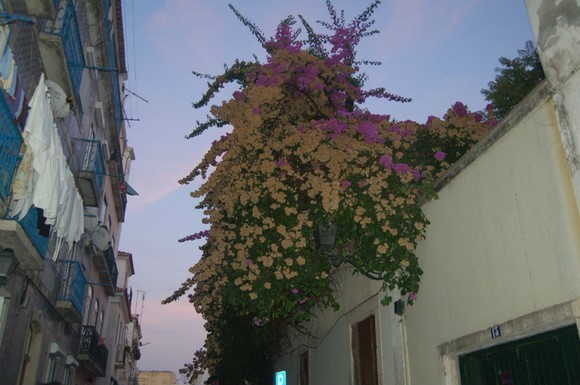
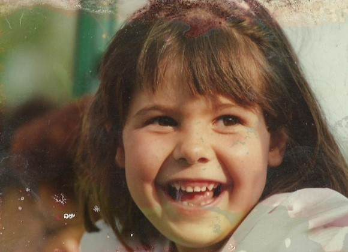
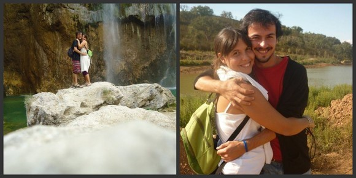

# ＜天玑＞小丫行迹（五）之里斯本完结篇

**火车慢慢启动，看着车窗外马塞洛愈见模糊的挥着手的身影，我自言自语，感谢你们，让我有勇气伸出双手去拥抱黑暗里的风。爱，并且被爱，于这荒唐的世界，我已不能奢望更多。**  

# 里斯本完结篇

## 文/仇小丫（慕尼黑大学）

 

有时候，旅行就像品一杯红酒。酒和人的感情，不单在于觥筹交错间，唇齿与酒彼此相遇缠绕的快感。酒使人燃烧，留恋；人对酒回味，不舍。上好的红酒，是让你在与她相遇了很久之后，抿抿嘴，还有味道从心里散发出来，还能想起当时喝酒的心情，或者那些陪在你身边的人。

晚上八点半，跟马塞洛约好在地铁口见面，等他来接。

我开心地在地铁口蹦蹦哒哒，像个等待回家中的小孩。也许，流浪人对家的执着是不被人理解的吧。走了半个欧洲，倔强地睡了几多次火车站，也从来不抬头看那些回家的故事。这次有人来接我，这次我在回家。在那些迎来送往的拥抱和亲吻面前，我终于也有了底气彻底的开心和哭泣。

然后他出现，在远处大喊着我的名字“Choco！！！！OH MY GOD！！！ ”，我看到他，听到他喊我的名字，再也抑制不住自己的感情，好像许久以来身上逐渐形成的某种东西瞬间垮塌，哭着跑过去拥抱他，我一边哭着一边含糊不清地说我好想你和玛利亚，走了这么久的路就是为了来告诉你们这个，终于见到人了，哪怕现在就要回去，我也甘心了。

他抱得我快喘不过气来，随即介绍给他朋友，这是Choco，一个超级幸运可爱的女疯子！

我因过于激动，整个人亢奋到安静不下来。他一边抚着我的背一边说，我今天一天过得都不好，最近工作特别忙，我没办法提早下班，我担心你今天过的不好，我一直在想，哎呀，Choco 自己在这边啊，Choco 自己在这边啊……现在好了，我终于见到你了！走吧我们回家吧！！

回家吧。没有更恰当的表达，没有更合适的词语，没有必要多说什么，于我，这三个字，足矣洗净一路所有的委屈。

我跟着他回家，吵吵闹闹手舞足蹈地给他讲这一天发生的事，遇上的人。讲这一路发生的事，遇上的人。

到家， 他去厨房洗菜做饭，我拿着相机给他拍照聊天。我不知道为什么，在他面前，我永远像个疯孩子，说话用喊的，走路用跳的，每一秒都是开心的。他一边炒菜一边聊天一边给我找各种吃的，总是说，哎呀这个你肯定没吃过，哎呀这个是葡萄牙特产你一定要尝……我就这样看着忙忙叨叨的他，心生欢喜，那些细小的温存，几乎可以战胜一切，心里的各种褶皱，也这样逐渐被熨平了。

看着马塞洛特意为我做的米饭和菜，不能不为之动容。你说，这人间的酒色财气，七情六欲，是不是比不得这简易方桌上的二两米饭，一碟小菜？你锦衣绣袄，狐服貂裘，挥金买笑，一掷巨万，但你如何买的来寻常人家一抹温情红袖添香？

饭毕，马塞洛载我去接玛利亚下班，玛利亚找了个在个幼儿园照顾小孩的兼职，每天要从下午工作到半夜，第二天上午去学校上课，循环往复，异常辛苦。接到玛利亚后我们仨一起去拜访玛利亚的母亲，因为他们两个一直跟家人提到我，这次我来，她妈妈说要见个面。

玛利亚的母亲是个不让须眉的很有个性的女人，18岁就单枪匹马自己搭车走了南欧，不到20岁就生下了小玛利亚，说话做事痛快爽朗，雷厉风行。玛利亚4岁时，父母离婚，想来那时玛利亚的母亲也就二十三四岁的年纪。独自带着玛利亚跟着玛利亚的外婆，撑着家，一直到现在。

我跟她妈妈一见面就互相喜欢，我喜欢她妈妈整个人身上散发出那种坚强又开朗的气魄和气场，而她妈妈对我呢？她妈妈说“呀，这个21岁的小姑娘就自己走欧洲呀！哈，让我想起我年轻的时候了呢！”

很遗憾的是因为时间太仓促，我们不得不尽早离开。其实，主要原因是玛利亚的狗狗，这只狗狗见到我第一眼就hold不住自己拼了命的扑到我身上来！前面两只爪子抱着我的胳膊，后面两脚站立，一边喘息一边对我做一些成人世界里很不雅观的动作。也不知道是我身上的什么气质激起了他这种欲望……三个人都控制不住他，我几乎百米冲刺一样逃到门外。站在大门外跟玛利亚妈妈扯着嗓子聊天，然后告别。后来被告知说，这只狗狗的一生中，一共遇到过三个他想要交往的人类，其中一个居然还是男人，我虽有幸成为这男女混搭的三分之一，但是高荣誉面前，我一定要保持严谨低调的作风，绝不会因此而胡思乱想妄自菲薄。

那，就是这只浑身喜感霸气四射的狗狗，对于感情他丝毫不畏惧，年龄性别国籍种族诸如此类的爱情界限在他眼里都是浮云！人类在他眼里都太naïve，sometimes too simple！哎，本不想提这段，想到这是本人生平第一次被异性狂追到如此欲罢不能的激烈程度，提笔记下，望大家hold住！

话说，我们三个因为这只浑身喜感的狗一路开车狂笑到家（马塞洛家）时，已经凌晨一点多了，说不累是不可能的，一个是上了大半天课又工作到半夜的姑娘，一个是一直工作到晚上八点的苦逼博士，一个是长途跋涉疲惫不堪的我。

胡乱瘫坐在地上，聊天，没命的聊，像醉酒之后一个模样，谁也舍不得睡觉。

与人相处的过程中，有些人会让我们感到疲倦，而有些人则会给我们力量。有些人，你握着他的手，都会感觉到他拒人千里。有些人，隔着千里，你也感受的到他对你的惦念。

夜里三点，我开心的睡不着，独自在客厅上网，听见他们俩在卧室里吵吵闹闹计划着怎么带我玩，心里欢喜。在笔记上写下“离开家乡多时，告别祖国一年，流浪欧洲两个月，第一次，第一次有人接我回家。”

次日，玛利亚翘了上午的课，带我去海滩喝咖啡。马塞洛一大早就跑到学校里赶工作，下午工作完到玛利亚这里来接我，带我去吃点心，看夕阳。呵，这是他们最终计划的结果。

夕阳正美，撒在天台上一张张年轻的脸上，撒在每一个正在发生的故事当中，撒在爱情上，洒在命运里，洒向这片见证了战争与繁华的大地，和大地上顽强斗争的人们。

海风带着夕阳吹拂在我脸上，撩着我一袭大红的裙子，还有被风吹得早已凌乱不堪的头发。马塞洛蹲在远处吸烟，我趴在栏杆上发呆。周围地上坐满了年轻的人，那些被爱着的，和弃了的人们，握着酒瓶，抽着烟，有孤独着的，有拥抱着接吻的，有三五人一起聊着天的，还有就那么兀自坐着的，一股浓烈的青春的味道。黑皮肤的，白皮肤的，黄皮肤的；黑头发的，金头发的，棕头发的。这夕阳，是属于所有人的。

夕阳，总是让人在面对它片刻而磅礴的美丽中安静下来，在还来不及唏嘘感叹的深情里转瞬即逝。你看着它来临，看着它消逝，摸不到，也够不着，或许第二天随意的一个美丽日出，就可以冲淡前一天你对夕阳的眷恋。而那些，多少个日日夜夜过后也忘不掉的，太阳多少次升起或落下也冲不淡的，是那个夕阳或者日出里，始终陪在你身边，把你当成太阳的人吧。

看着周围的年轻人，他们各自都有各自的愿望和遗憾吧。我转过身，对M说，我们走吧，就再也没敢回头。

和M走在夕阳消逝后里斯本傍晚的街头，聊当初的相遇，聊彼此的感情，生活，学业，工作，梦想，走累了就找块干净的地方靠着墙挨着坐下。真的很难来定义这种感情，我和他，彼此爱着，惦记着，但是对彼此没有丝毫的肉欲和占有，像是兄妹，却也没有任何血缘的维持。我这二十多年来所学习到得全部知识和对于生活的全部体会，都无法用来解释这种感情。

玛利亚和马塞洛是将近5年的爱人，他们早已将对方溶进自己骨血里，成为彼此不能失去的亲人，5年来的每一处喜悦和痛苦，都一起分享和分担，一起上大学，一起毕业，一起旅行，一起背包，一起结交新朋友，对待爱情和生活，都坦然真诚，让人心生敬佩。

人群里，玛利亚是千万女孩中最普通的一个。长相平凡，成绩一般，身材甚至要比其他的欧洲女孩子稍胖一些，要是她不说话就这样从你面前经过，你几乎看不到她。就是这样的一个姑娘，偏偏让很多接触她的陌生人短时间内就爱上她，她不是一块了无生趣死气沉沉的木头，不是人生的旁边者，经历了很多事，很多事也经历了她。她浑身的每一个细胞都如此有感染力，她不仅让人感觉舒服，而且好像身上总有什么东西让人不但没法忽略反而不得不去尊重和正视她，进而被她吸引主动去挖掘和探索她，最后彻底爱上她。

“她如此特别，她从不需要过多的东西来装饰自己，她总是会让人明白她的价值，让你不自觉就去尊重她并且爱她，她很自信，活的真诚，她非常有趣，我爱她，非常爱她。”坐在地上，马塞洛一边想着玛利亚，一边这样说着，嘴角带着笑，像个刚恋爱的小男孩。

四岁时，玛利亚的父母离婚，“我不明白，为什么好好的一个家，一下子就没了，爸爸走了，我那时候非常愤怒，非常生气，每天都不开心”，她曾这样对我说，“有一次我实在憋不住了，就冲出家门，一路狂奔到我奶奶家，开了门站在门口歇斯底里地大喊“fuck!fuck!fuck!!!bitch!bitch!bitch!!!”哎呀，那时候我才4岁呀，话还没说全呢，我自己也不知道这词是什么意思，反正就喊出来觉得很解气！

“然……然后呢？”我惊讶的瞪着眼睛看着她问。

“我骂完了转身就跑了，我奶奶愣住了，回来之后我就好了，据我妈说从那起我再也没闹过，好像一下子就接受了之前不接受的东西，每天都很乖，谁知道我那时候怎么想的。”她说着，就开始大笑。我也跟着笑。

“你还爱你爸吗？”

“哦我非常爱他，非常非常爱他，我很想他，别看我妈长的丑哦，我爸可帅了！！他非常帅，这是真的，大家都公认他长得帅，我很崇拜他，就像崇拜着我的大英雄一样。他后来找了个女朋友，又生了两个儿子，儿子也很可爱。我在他面前都很乖，有时候还会有点不自然，我总是希望着他也会很爱我……我很开心的是他很喜欢马塞洛，我们偶尔会在一起聚餐……”。

我坐在马塞洛身边，一边回忆着玛利亚，一边给他讲玛利亚给我讲的这些故事。

“是呀，你说她多可爱！你想啊，那么小的小玛利亚，跑到奶奶家去骂人，我想想就忍不住笑哎。”马塞洛这样说着。

上图小玛利亚

聊到情处M打电话给玛利亚，要把这种喜悦与她一起分享。玛利亚的声音从电话那边传来，隔着十几厘米，就听到她在电话那端喊着：Choco！感谢上帝，让我们遇到你！

马塞洛听见了，也在我旁边轻声说，是啊，感谢上帝，让我找到你。

我的情绪变得有些复杂，开心，感激，夹杂着对即将到来的离别的失落。这样一对心里装满了爱又积极坦诚的去面对生活的可人儿，怎么就让我遇到了，我既有幸遇到，怎能不爱。他们终于让我看到，爱情里，重要的不是你有多么好，而是你的好是否被你爱的人懂得并且珍惜。无所谓你多平凡，所谓的是，在你爱的人心里，你是否是TA无可取代的那一个。

“感谢上帝，让我们还拥有那么多年的时间去爱对方”。我对他们说。也感谢你们，让我看到并理解了爱。我在心里对自己说。

拥抱，亲吻，告别，马塞洛送我上火车。

细细算来，在里斯本一共不过三十几小时，却一丝一毫不曾浪费，这些个在一起的每一个分分秒秒，都是跋山涉水之后很用心才挤出来才争取到的。却也奇怪，有些人，相识多年，一刻不曾走进你的世界，有些人，相处几个小时，却每一寸灵魂都粘在你的心里。

生活中不能没有别离，就像五味中不能缺少苦辣。只有疼痛才会增加存在感。肚子痛了才知道心疼自己的胃，头疼了才知道自己只有一颗脑袋，失去TA才知道原来自己爱过。

怎样来解释一种感情？

生活中也有那样一些人，你们甚至不曾相见，TA的苦乐却牵动着你的神经，TA的一些语句却铭记在你的心里，那些遥远的细致的不被人理解的温存，冥冥之中竟拧成一股力量，于黑暗处陪伴，孤单时紧随。夜深人静时你面对自己，才知道，原来人是如此擅于孤独的动物，那些内心里最深处的疼痛，竟不足与外人诉说，而你也并不需要外人的帮助或鼓励，你要的，求而不得的，只是能有一个人，对你痛楚的切身理解和体谅。

原来，并不是所有的感情都需要被定义和理解。我扪心自问，你还要什么，在这世上，你知道有那么一些地方，在那些地方里有那么一些人，可供想念，你想念他们的时候，你知道他们也在想你，而这想念里，没有爱情的占有，没有欲望的自私，只是单纯到，我快乐的时候希望你也跟我一起快乐，我难过的时候我知道你也不会离开。

火车慢慢启动，看着车窗外马塞洛愈见模糊的挥着手的身影，我自言自语，感谢你们，让我有勇气伸出双手去拥抱黑暗里的风。

爱，并且被爱，于这荒唐的世界，我已不能奢望更多。

 

（采编：应鹏华；责编：麦静）

 
