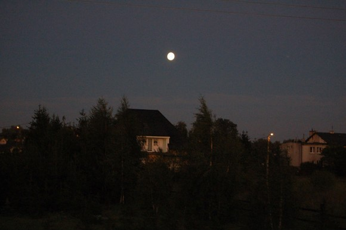
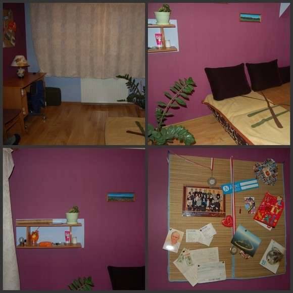
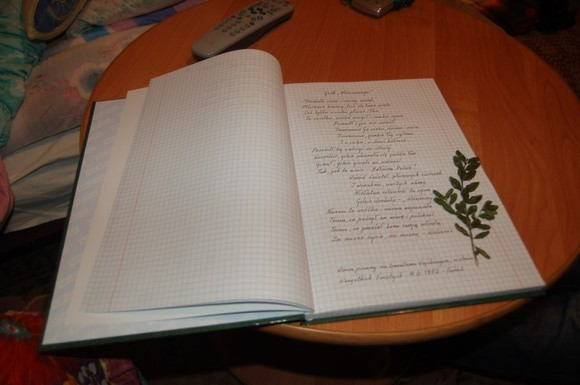
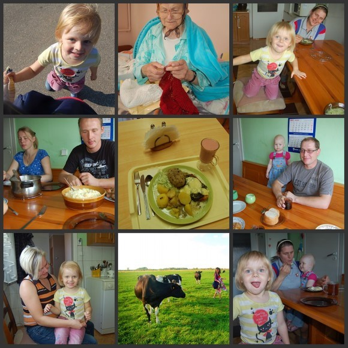
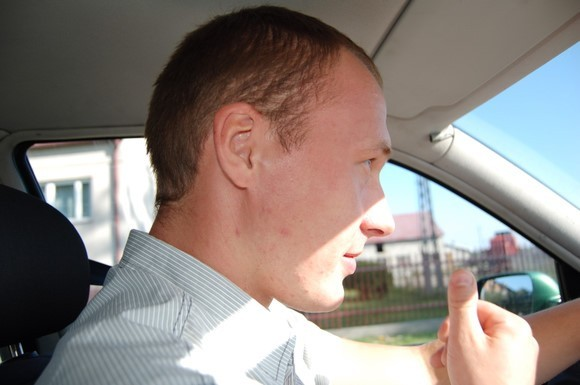
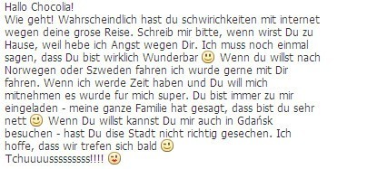

# ＜天玑＞小丫行迹（六）之遇见你，遇见秋日的玫瑰

**我拒绝了他的邀请。我想，我已经收获了最好的爱与情。人别后，山遥水遥；休言万事转头空，未转头时是梦。**  

# 遇见你，遇见秋日的玫瑰

# ——于北国波兰

## 文/仇小丫（慕尼黑大学）

 

格但斯克到克拉科夫的火车上，我坐在一间包厢里，披着睡袋，脸朝里蜷缩着睡着。像一只流浪的猫。

这是一部长达十几小时的夜车。

Z开门进来的时候，我听到了一丝很厚重的声音，没睁开眼睛，想来必是个男人。对面长椅上原本还有一位波兰的姑娘。虽然当时真的已经困到起不来，但

是觉得这样肆无忌惮地躺在男人面前有些不妥，就撑着坐起来靠在窗户上。

窗户外面是中秋节北半球明亮安静的月亮，月亮之上明朗的天空，和月亮之下起伏的房子。

Z在我对面，跟波兰姑娘坐在一起。我勉强挤出一个疲惫的笑脸，夹杂着一种“被打扰到睡觉了的”厌世的表情，算是跟他打了声招呼，就趴在窗户上看窗外的风景，想着克拉科夫那里带着我家乡味道的特产面包。转头看对面的男人，二十四五的年纪，一米八零的身高，肩宽腿长，肌肉均匀，金色短发，蓝色眼睛。安分里透着一点窘迫，成熟中夹带一丝年轻。时而抬起头看看周围，然后目光不经意的落在我身上，再转到其他地方，手里抱着一本德语字典，没什么目的的翻着。我看到那本德语字典便好奇地问他，“你在学德语？”，对于我的主动交谈，他似乎有点惊讶，惊讶中又含一点点兴奋，兴奋中又有点疑惑听不太懂的样子，然后一字一句用英语说，“抱歉啊我英语很不好，不过我说德语的”。呵，我笑了一下，一边看向窗外一边不经意地用德语问他为什么说德语呢？他很惊讶，“你德语这么好呀”？！“在德国上学嘛，肯定要会的呀”，就这样，我们开始用德语你一句我一句地聊天。

“那些东西……是你的？” 他指着行李架上我的背包，防潮垫和睡袋。从开始进来，他就一直注意这些。

“是啊，在流浪，呵呵”。

“一个人？！”他瞪着眼睛不可思议的问我。

“是啊”，我笑。

“天哪……你好酷哎！喂一定有很多有意思的故事吧！”。他说着，瞳孔在扩大。

“是啊，进过警局，被路人收到家里，搭过很恶心的卡车， 睡过车站，还睡过马路边嘞，故事到很多，但是可不是每一件都那么有趣哦……”，我疲惫地絮叨着。

“我也很喜欢旅行，以前上学的时候，都要拼命打工赚钱，然后放假出去旅行，不过还没自己一个人去过，都是和朋友，我真的超喜欢你这种一个人旅行的人！！家里人都说我是疯子，你看，我这不是遇到疯子了嘛！！”他说着便开心地笑起来，抑制不住自己激动的心情，昏暗的灯光下眼睛里似乎放得出光来。见他这么感兴趣，我也好似遇到同类一般！原来是疯子呀，那还有什么顾忌和客气的！

我给他看地图，讲故事，讲欧洲各种国家的不同。他一直笑着，听的津津有味，看我的眼神里，都是干干净净的。也是，当时我那副德性，男人对我有二心也难。这样想着，我竟更加坦诚起来，越聊越投机，走这一路我发现，但凡非常喜欢旅行的人，思想都相对开放，对人也都谦和友好，自来熟，随遇而安而且不拘小节，跟谁都能迅速混成一片。

“你去哪里呢？”

“克拉科夫。”

“哇，那是我们波兰最美的城市！”他开始激动的介绍这座令波兰人骄傲的城市。

“是啊，是很美，不过我只想去买一些面包，明天还要北上的，我正打算离开波兰往北欧走”。

“所以你就是为了折回来买一些面包？天哪，真是有趣的人！”

“有趣什么呀，有病还差不多”。

他想了想，“不如这样，我很想邀请你来我家，你可以好好的休息一下，然后明天再启程去克拉科夫，怎么样？”

听到这话我觉得很好笑，“怎么可能，我怎么可能去你家嘛，我这样挺好的，谢谢你了”，防人之心不可无，跟一个只有一面之交的陌生男子回家呢除非我疯了不是！想着想着这气到无端来了，语气也一下子冷淡许多，只把头转向窗外也不看他。

“这把我当成什么人呀，干嘛邀请我回家，我那么像那种刚认识不久就会跟男人回家的女生么？把我的坦诚当成放荡这样的男人最可恶了！”越想越生气，就不理他，心里还暗自祈祷快点到他的站他好下去吧，我可不要再看到他了！

他似乎感觉到气氛不对，就赶紧解释说我不强迫你只是觉得你看上去真的很累眼睛都要睁不开的样子，想让你好好休息一下，因为我也是个喜欢旅行的人，如果你觉得不安全，我完全理解你的。

我一直看着他的眼睛，观察他的眼神和举止，怎么看都是一个刚直不阿的的可信之人，既不多做解释，也没有半点心虚。暗自想也许人家真是出于好意，是我多想了而已，这样一来，我到对自己的小人之心感到羞愧，惭愧的情绪促使我又跟他聊起来，交谈中得知，原来他并非独居，而是跟一个大家庭住在一起。大家庭，这使我觉得安全和温馨很多。聊到家人，我突然觉得，正好如果有这个机会能去感受一下一个地道传统的波兰家庭也不失为一个好的选择，也算没白在波兰走一遭，于是改变了主意，决定跟他回家，他很开心， 立刻给他妈妈打电话汇报，解释了很久，然后转头问我饿不饿要不要他妈妈准备些吃的，我赶紧摇头阻止，接着就听不懂他说什么，心里有点忐忑。

如此，我再一次临时改变了行程，做出了人生中第一次和陌生男人回家的冒险决定。一个小时后，Z背着我的背包，带着我在一大堆差异的眼神中一起下了火车。

Z的家在波兰北部一个非常小的镇子，出了火车站，外面只有一些微弱的路灯，寂静，无人。此时差不多夜里11点。路上只我们俩，曲曲折折的走着，去找他的车，开车回家也要有近半小时的路程。说不怕是不可能的，这么漆黑又安静的夜里，一个我完全不熟悉的连名字都不知道的波兰小城，一个刚刚认识不到两个小时的波兰男人，一个即将发生的或好或坏的故事，一个或遗憾或完满的结局。接下来要发生什么，我一点底气都没有。想到这我居然开始像个任性的泄了气的皮球一样，走在他旁边，也不说话，一副好死不死听天由命的德行。

中秋的波兰夜晚，风有些冷。我不停地用中文叨咕着：相信自己的直觉，相信他是个好人，跟着自己的心走，老天爷也会保护我。他笑，“你自己在那叨咕什么哪？！你知道嘛，我们波兰有一句谚语，一旦一个人说了什么别人听不懂的话，我们就对他说‘嘿，不要跟我讲中文！’，你们中文真的很难哎，好像一座一座小房子，真是太不可思议了！”。

我听了忍不住笑，好吧，至少到这里，他还是个好人。我长吸了一口气，像在打仗一样。

终于找到他的车，街上空无一人，一路开到市郊，窗外是月亮，大片的草地和森林。黑压压绿油油明晃晃的一寸一寸震撼着我不安的心。他打开音乐，在旁边不停给我讲波兰的历史和现状，经济和政治。我一边好奇的看着窗外，听着音乐、和边上男人说德语时浓重的波兰口音，想着这四野无人的荒郊野岭也如此君子，我便可以放心，也跟着唱起歌来。一路到家，表过不提。

到了家，Z父母开着灯在等，一个妹妹穿着睡衣睡眼惺忪地出来迎接我，原来因为我的突然到访，妹妹要把她的房间让给我，自己去和另一个妹妹睡。Z父母也是极朴实本分的人，看着就无端亲切，她妈妈看到我先愣了几秒，然后好像突然反应过什么来一样，赶紧过来拥抱我。和大家分别拥抱问好后，寒暄了几句，就各自去睡了，只留下我和Z在客厅聊天。至此，我已经彻底放心，并且由衷的感谢，也变得更坦诚。

当晚，小聊了一会儿就各自洗澡睡去了，我住楼上，他住楼下。Z一直嘱咐我，“一定要好好睡，明天睡到自然醒就好了，不用管别人，就怕家里的两个小孩子明天会把你吵醒，这样我会很过意不去”。我嘴上只说没事，跟他道晚安，就上楼去了，心里其实开心的很，中秋节虽然没有在家里过，却阴差阳错机缘巧合的到了另一个家庭，上有老下有小，这么温馨的样子，还有一个这么体贴又有分寸的男人，怎么会闲吵呢，开心还来不及。

（晚上睡的妹妹的房间）

辗转反侧迷迷糊糊睡了一夜，第二天早上果然先被小孩子的吵闹声叫醒。

窗外天空很美，极好的天气。

虽然很困，但是听见楼下早已经开始忙碌的声音，我也不好意思再睡，就起来了。心里想着还是先去收拾一番吧，昨天晚上过来的时候头发也是油的，眼睛似乎都是浮肿的，这样也不好见人。正收拾着，Z上楼来叫我：“我妈说看见你起来了，怕你自己不好意思，把我叫醒让我过来翻译之类的，问你需要什么，你怎么起来这么早啊，比我都早，我以为你要睡到下午呢！”

“哦，我听见声音了，就起来了，再说过会儿不是还要赶火车嘛~”

“是不是孩子疯闹吵醒你了？”

“没有没有，是我自己到这个时间就醒了~”

看我收拾完了，Z就在外面朝我摆手，“下来嘛”，我有点不好意思的吐了吐舌头，很尴尬的朝他笑笑，他心领神会一样的“没事啦，快点下来吃饭”。

“哦对了，今天去克拉科夫的火车有两次，一次是昨天晚上那个时间，另一趟车是几小时后，我们赶不上了。你就在这接着住吧，今天你也没休息好，这么匆忙赶火车，岂不是更累，再好好睡一晚，明天有精神再去克拉科夫，正好明天我要去那边办事，好吗？”

“啊？哦”。我一想，与其让Z今天晚上大半夜特意送我，还不如明天上午他去办事的时候顺便给我捎带过去，就同意了。

下楼，跟一家人打招呼，有昨天见过面的Z父母和妹妹，昨天未见面的哥哥嫂子，和他们的孩子，好些人，都吃完饭了，桌上只有Z和我的早饭。家里人看上去都很朴实好客，两个小孩子见了我很是激动，一点不陌生，小的偏要我抱，大的偏要做我旁边，对我这个长得不一样的人充满好奇，一会儿摸摸我头发，一会儿摸摸我的脸，开心的不得了。虽然他们说话我听不太懂，但是有Z一直翻译，形影不离我左右，所以我也没有因为陌生的人陌生的国家陌生的早餐和咖啡而感到一丝紧张和忧虑，反而家里热热闹闹的气氛使我也像在家一样的温馨和安全。

Z妈妈是个传统地道的家庭主妇，说话嗓门很大，性格开朗直率，笑着对我说：“你知道嘛！昨天晚上儿子突然打电话来说家里要来一个外国人，火车上遇到的！我也没什么准备呀，想给你们做点什么吃的，儿子说太晚了不用了，你一来，给我和他爸吓了一大跳！！我们只知道是外国但没想到居然是黑头发的亚洲人啊！你是第一个进我们小镇子的中国人呢！”他妈妈一边说一边大笑起来，我和Z在也在旁边跟着笑。正说着，Z和我同岁的妹妹M过来说，奶奶在那边的屋子里听到声音了，想要我过去看看。还没等Z和我说完怎么回事，我就立刻起身说带我去看看吧。忘记先拜长辈，本身就是不敬。Z的奶奶年过八旬，卧病在床，家人轮番照顾，Z觉得可能带我去见奶奶不太方便，边走边跟我解释说，我们家就是那种非常典型传统的波兰家庭，老人孩子都在一起，儿子要娶媳妇进家门，也有很多年轻人跟父母分开住。“跟我们国家是一样的”，我说。

Z的奶奶是二战那个年代经历过来的人，二战时期纳粹德国入侵波兰，在波兰建立纳粹集中营，对波兰的城市进行统治，Z奶奶那时为德国一个家庭做家政工作。奶奶说那个家庭对她还不错，至少还有饭吃，也不会虐待她，只是当时大家都要被迫学习德语。也是因为这个原因，奶奶到现在还记得一些德语单词。年轻时候的奶奶是女红织针，写诗作画样样拿得出手，如今的奶奶，因为年龄的增加而愈渐力不从心，体力不支。只是从奶奶的神情，说话的方式和语气，看得出来这是个极要强的女人。见我来，奶奶让孙女把自己以前写诗的笔记本，以前做过的针织都拿出来给我看，好欣慰好得意的样子，竟像个需要被肯定的小孩子，可爱的很。

我过去，奶奶拉着我的手，左看看又看看，很好奇样子，问问这个问问那个，一会儿说我长得像波兰人，一会儿又说我也应该学一点波兰话，Z在旁边一边翻译一边红着脸笑，我看奶奶那副认真的表情，也忍不住笑，就像哄小孩子一样，对奶奶说了几句刚刚学的简单的波兰单词，奶奶听完就一边摸着我的脸，一边拍着我的手，要送我这个送我那个，很开心的样子。后来听Z说我在德国上学，奶奶的表情突然变得凝重，叹了口气，好像在心里酝酿了许久的情绪要喷泄而出又不得不强制压抑着自己的感情一般，良久说出一句话，“孩子啊，你为什么要选择去德国上学啊……”

这句话我一直记得清楚，不是问句，而是一声长久的叹息，带着对战争中逝去同胞的悲悯，对国耻家仇的满腔怨恨，对往事的感慨和回忆，又或许记起自己年轻的时候，和年轻时候爱过错过的人了吧。。。如若你不亲临奶奶面前，便很难想象奶奶当时的表情和语气，那种强大的气场和情绪突如其来莅临在我面前，竟然触动的我说不出一句话，心里一沉，不知如何是好。Z见状，赶紧跟奶奶说了句什么，就带我出去了。

出来，Z怕我因为这句话心里不舒服，一直跟我道歉，让我别放在心上，“波兰刚从战争中恢复过来，满目疮痍，人们忘记不了这段历史，波兰的今天仍有很多人恨德国，当然，历史就是历史，今天的波兰，和波兰的人民，还是要往前走才行，不能总是活在过去的痛苦当中”。他说着，也兀自叹起气来。

我怎么会介意呢，要是我爷爷如今还在世，面对日本，怕是也会有一样的反应吧，战争对人心里上的伤害，是无法想象的。而这位波兰奶奶，不过是那些从战争中存活下来并且长期生活在战争的阴影和怨恨当中的妻子，母亲和女儿罢了。

（奶奶年轻时写的诗，据孙子孙女们说这些诗大抵是关于当时的战争，和战争中那些遗憾的心痛的爱情。）

接下来的一天，Z和他一个与我同岁的妹妹一起，带我去了当地很多特色的地方，农场，教堂，小镇，庄园，能走能看能玩的都经历个遍，一边走一边给我讲解。Z妈妈做了波兰的特色菜肴，妹妹做了一些特色糕点，如待上客。我想也应该做点什么回报给这一家，就偷偷跟Z商量，咱们去帮你哥哥干活吧！咱们去帮你爸买东西吧！家里有什么事要帮忙的也算我一个吧……Z每次听了只是大笑，说你就安心好好地当你的客人吧，少惦记这个那个的了，也不理会。最后，我执意要做中餐给大家，一家人想想，还没吃过中国人做的真正的中餐嘞，也不错嘛。Z爸爸立刻准备开车去超市买东西，我赶紧拦住他，不想因为我这样任性就又要劳烦别人，就说做家常菜，鸡蛋西红柿洋葱简简单单就好。

厨房里，我在灶台边开心的煮饭，好像终于找到了一件能为他们做的事情一样。一边脑海里还在恍惚，啊，两天前的这时候我还要去克拉科夫嘞，怎么如今跑到这个陌生又可爱的家庭里做起饭来了？！世界真是奇妙，这种事，哪里能想的出来……

一回身，Z已经在后面自顾自的洗菜切菜，我一想这既是我要做的，就没必要麻烦他，跟他说放下吧我切就好了，争执许久，还是拗不过他，罢了，既然这样，索性我就像个小师傅一样，指点他这个要切多大块，那个要怎么切，切好了给我放在哪里，最后我倒是落得轻轻松松，饭下到锅里，无事可做。看着眼前低头切菜的男人，不远处和面的妹妹，坐在他们旁边对我微笑的妈妈，和房间里跑来跑去抱着我的腿转圈圈淘气的小孩子，油然而生一股强烈的幸福感，这就是家吧，平淡却温暖，即使拌嘴，也是那么幸福。我在心里默默感激，感激老天爷竟一直照顾着我，中秋之时不想我形单影只离家万里；感谢天上突然降临的男人，像捡一只流浪猫一样捡我回家。

Z和我几乎形影不离，也难怪我们俩气场如此吻合，不愠不火，不紧不躁。谈旅行，谈生活，他的国家，我的国家，历史，文化，爱好，偏执。不夸夸其谈，不巧于词色。从早上吃饭说到晚上各自去睡觉，非但不尴尬寂寞，反而亲切难得。与一个可心的人相处，连一杯凉白开，都变得生动有趣；与不可心的人，给你满汉全席，也如坐针毡。“你是谁，就会遇见谁”，在旅途中，这话再准确不过了。

晚上十一点多，我和Z在他房间里上网。他看我FB上的主页头像，指着两年前一张粉色外套卷曲头发的照片说，这张最美。我刚要谢他，谁知接下来他居然说，“但是如果我遇见这样的你，可能不会和你说话，继而就不会认识你。”

“哦？”这句话激起我强烈的好奇心，“为什么呢？这样不好吗”？

“是很漂亮，但是这种美只是很表面的美，好像一个玩具，只能也只想从远处看看，而不是现在这样的你，一个可以与之交流的人。你看，如果你是照片里这样的形象出现在我面前，带好看的围巾，穿潮流的衣服，我可能不会认为你是这样一个会让人很享受跟你聊天并且吸引人愿意和你待在一起的人。”

我着实被这个观点吸引，若有所思地看着他，没有说话。

“现在的你给人的感觉是……舒服，对，就是这个词，舒服。”

“哈~”

男人喜欢你，可能是你的表象取悦了他的眼；男人信服你，一定是你的魅力征服了他的心。珍惜别人对你的信任，因为你已走近他的心，而人心，是你一旦闯进去就很难出来，一旦出来就再也进不去的地方。

我面前的这个男人，对上敬重长辈，对下以身作则，对国家一腔热血，对同胞深情大义。他跟你说话时会低着头红着脸，看你的眼神却出奇的干净坦诚。比少年多一分稳定成熟，较大叔更为热忱纯真，近一分则腻，偏一分则疏。爱过也被爱过，伤过也被伤过，再难轻易动情，却会加倍珍惜。他自然地在你身后洗菜切菜，他一边低头认真的给你做三明治，一边说公司的事情可以过几天，今天带你去参观教堂，也不问你加多少黄油几片肉，温柔中带着气魄，细腻里又夹着大大咧咧。第一次遇见这样的男人，因为一个疯狂的念头把你带回家，却只给你爱护和尊重，没有任何要求，也不求任何回馈。他让你觉得，你是一个特别的人。

在波兰家庭的三天两夜，和Z白天吃喝玩乐，晚上聊天聊到体力不支然后各自去睡，干净舒服的一塌糊涂。女人的心就是这样，不管她喜欢撒泼生气还是耍小性儿，她的心永远都像小孩子，“无论她看起来想要什么，她要的不过是很多很多爱和很多很多安全感”。男人一旦连她最丑最凶的样子也包容了，女人反而会变得感恩和乖巧起来。对付那些烈性女子，只得像太极一样，以柔克刚方为上策，她那颗心一旦被你融化了，便恨不得什么都给你。

一个男人如若能接受你最衰的模样，那么他也值得拥有你美丽的时刻。第三天的临行前，我化了妆，戴上了耳饰，换了裙子，披散着头发。旨在告诉他，感谢你让我重新相信自己，感谢你让我继续热爱多彩的生活，我愿意将自己美好的一面与你分享，而你也值得。

Z为我做了三明治，切成一小块一小块，小心地用锡纸把每块包好，再装进精致的牛皮纸袋里，配上一些水果。

“怕你在火车里会饿”，他笑着说。

“饿也吃不下这么多呀！”

“怕你一个人觉得寂寞啦！”

“……好吧”。

跟全家人拥抱，告别，感谢，Z和妹妹送我上火车。

“你真的很棒，真的，你现在在做的事情，我觉得真的很棒！加油！”，Z站在车窗外对我这样喊着。 “谢谢你，谢谢遇见你们，再见~”

空旷的车厢，午后慵懒又温柔的阳光里，我栽在宽大的座位上，一口一口吃着Z的三明治，脸上不自觉的笑了起来，天地间好像瞬间开满了玫瑰，这无疑是我吃到过最好吃的三明治。

半个月后，我收到Z在FB上的留言。

“最近如何？或许你会因为漫长的旅行在网络方面有些麻烦。到家的话希望你会发消息给我，因为我一直担心你。我必须再说一次，你真的非常棒。如果你想去挪威或者芬兰，我希望可以跟你一起去。如果你愿意带我去，而我也有时间的话，那简直太棒了！我这里会永远欢迎你，我所有的家人都认为你非常可爱，如果你喜欢，也可以到格但斯克来找我，这个城市你还没怎么仔细走。我希望我们可以很快见面。再见。” 

我拒绝了他的邀请。

我想，我已经收获了最好的爱与情。人别后，山遥水遥；休言万事转头空，未转头时是梦。

和Z的相遇，使我相信，世上大抵真有缘分这回事。

中秋节的上午，我在波兰北部海边小城格但斯克，一心只往北欧走，一股任谁也拦不住的偏要去的架势。波兰并不是一个快乐的国家，或者说波兰的气场完全使我感到压抑。寻寻觅觅想渡船去北国，小城里寻了许久，找了间餐馆休息吃饭，电话突然响起，我心里一惊，不知道什么人会这时候突然打来。陌生号码，接起来竟是几年未见的好友万宇哲，从俄罗斯打来。哲是跟我一起长大的家乡人，又同在国外漂泊，虽几年不见，感情却也是不减的，听到了熟悉几年的声音，跟我说中秋快乐，让我吃点好的，照顾好自己，再看着自己面前的食物，突然热泪盈眶。聊了半日，放开眼看过去，到处是无爱不欢的人。我怔怔的坐着，突然想到在克拉科夫吃过的一种特产面包，尽是我家乡的味道，于是便奋不顾身地坐上了回克拉科夫的火车，彼时的我，任性到极致，似乎已经脱离了一切，去哪里，只需脑海里一个一闪而过的念头，心里也不停地骂自己真是疯了，怎么可以为了几个面包就从波兰的北面跑到南面去？

格但斯克到克拉科夫的火车上，我坐在一间包厢里，披着睡袋，脸朝里蜷缩着睡着。像一只流浪的猫。

（本连载完） 

（采编：应鹏华；责编：麦静）

 
