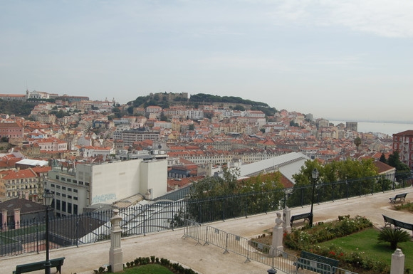
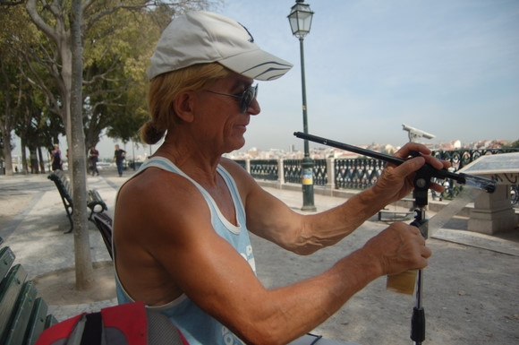
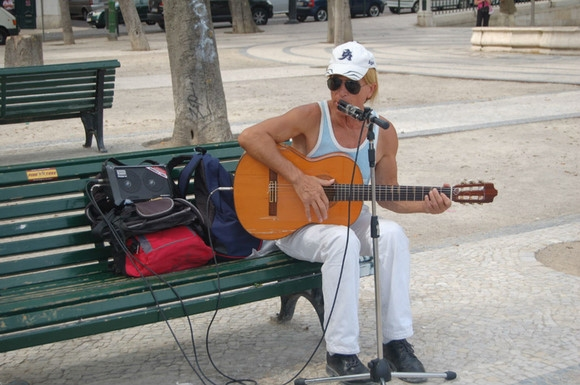
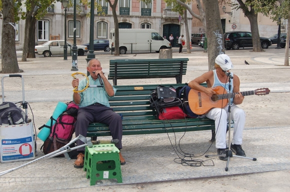
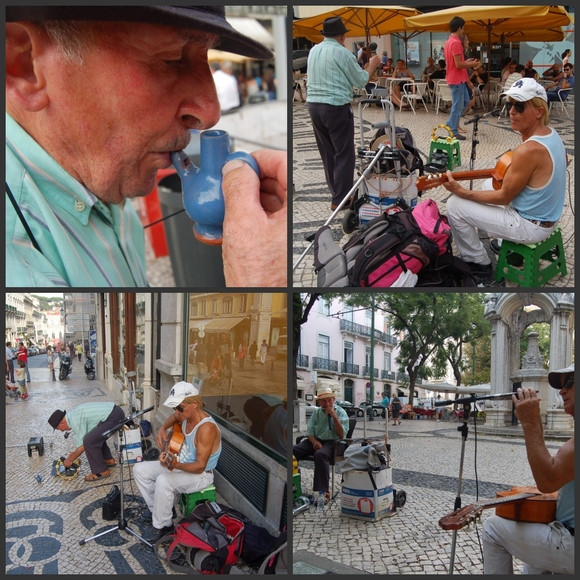

# ＜天玑＞小丫行迹（四）之里斯本的流浪艺人

**大口大口地呼吸着里斯本带着咸味的空气。脑海里出现那句话，海水的味道是咸味，佛教的教义是解脱。看着阳光下闪烁着的大海，大海边的每一条街道，和每一栋建筑，这是我夜以继日想要到达的地方啊，不管结局怎样，我终于走在这里，走在我亲爱的姑娘和少年成长的家乡里。** 

# 里斯本的流浪艺人

## 文/仇小丫（慕尼黑大学）

 

从夜车上下来，迎面赶上着急升起的太阳。

亲爱的朋友，我想我翻过了几座山，也越过了几条河，还路过了不一样的海。从意大利，到葡萄牙，不敢停留半步，也无意停留，只想尽快来到你面前，告诉你我真的想念你。

如今我来了，而对这一切，你却并不知道。

“嘿，我来了。我在里斯本。我的电话是某某某看见了，给我打电话。如果晚上9点之前你们都没有看到我的留言，那么，我就立刻回德国去。”我在他们Facebook上留言。

信息发完后我忐忑的在街上走，对于他们是否能看到我的留言，一点信心也没有。我安慰自己，既然已经做了能做的，剩下的，就听命的安排吧。

大口大口的呼吸着里斯本带着咸味的空气。脑海里出现那句话，海水的味道是咸味，佛教的教义是解脱。看着阳光下闪烁着的大海，大海边的每一条街道，和每一栋建筑，这是我夜以继日想要到达的地方啊，不管结局怎样，我终于走在这里，走在我亲爱的姑娘和少年成长的家乡里。 

爬上一座堡，放眼望去，正是这幅图片。里斯本，我终于来了。

一个男人走过来，搭讪，以求合体为目的的搭讪。年纪不轻，但肌肉线条明朗，声音洪亮。

我本着想安静不被打扰而不说话也实在无事可做的心态有一搭无一搭的问话与回答。 

一位职业流浪的职业歌手，诗人，词人，行者，画家，说10种语言，吉普赛人。情人分别来自世界不同的国家，18岁到45岁不等。

这样的男人，你终究是能感受到他的与众不同的。

走过很多的路，看过很多的风景，睡过很多不同的女人之后，女人面前，他早已学会了游刃有余和来去自如。他会让你知道，他喜欢并且尊重你，但不是非你不可。他不紧不慢，不慌不忙地在你面前展示着自己。他把节奏掌握在不因过于激烈而把你吓跑和不因过于冷酷而使你放弃之间。他催眠你的感官神经，使你深信，他不是最好的，但就是最适合你的那个。

女人最大的敌人不是岁月，是爱情。少有女人逃得了情蛊。爱情让女人受伤，成长，从血泪模糊的道路上爬起来，咬着嘴唇重新审视自己。几乎每个女人都有看着一个渐行渐远的背影来独自舔舐伤口并试图让其愈合的过程。带着一块不疼不痒却有一块印记的痕前行，逐渐成为女人。

也有那些天生冷静的伶俐人儿，凌驾于爱情之上，权衡于婚姻之中，着实免去了许多女人伤。只是那些从不曾受伤把自己保护的周全妥当的姑娘啊，当岁月也老去，在午夜梦回里，在青春的回忆中，在自己一根一根的白发上，会不会有那么一丝丝的后悔与遗憾。

当年啊……当年我竟不曾深爱过…… 

“睡过多少个女人？”

“不记得了。”

“有没有最爱的？”

“也不记得了。”“你呢？”

“处女。”

“什么？！”他一脸不可思议的表情看着我，没有丝毫顾忌地从上到下打量着我的身体，脱口而出一些恭维的话“不可能啊，怎么可能，这么年轻漂亮的姑娘怎么可能是处女呢？！”

我本能的对这种眼神极为反感。

“把第一次给我吧！我这么喜欢你！女性的第一次非常重要，需要一个明白而温柔的男人。”

“哈哈！”我狂笑了两声，没有看他，“跟你？！除非我疯了！”

“喂，你不会有处女情结吧？！”

“我从来没有碰过处女呀！我活了一辈子都没碰过处女呀！”

“处与非处有什么区别？”

“男人喜欢探索呀！你看，和一个处女做爱，那么她关于性的一切体验都来自于你，她的身体，就像一个未知的值得人探索的领域。”

“哼，那算什么能耐，一个处女，一无所知，是个带把儿的就能驾驭的住，有本事应该去挑战熟女呀，探索出别人探索不出来的东西才行。”

“你说，怎样才能维持一段感情？”我问。

“感情啊……依我的经验看，一共需要三点，即双方同时拥有对彼此的责任，双方在生活和性方面的默契以及对于拥有对方的渴望。三个如果都有，那么就会拥有长久而美好的感情。三者缺任何一个，感情就会出问题。”男人接着将这几点分别拆开娓娓道来。

" 那么，在性生活方面，怎样才算是一个好男人呢？”

“一个好男人，懂得尊重、理解并甘愿把自己奉献给女性。做爱的时候，男人要有对女人的奉献精神和责任感，不能自己做完了倒头就睡，男女的G点是不同的，通常男人的高潮来的都比女人早，很多时候男人高潮之后，女人还没有来，但是这时候男人累了倒头就去睡觉了，这样长期下去，矛盾就出来了。有的男人以为自己**很大就可以满足女人高潮，这是完全错误的。男人一定要有耐心去寻找女人的G点，可以自己去试探，当然也可以两个人进行沟通，情侣之间对于性的交流非常重要。我的**就不是很大，但是每一次我都能做到给女人高潮，并且以她的高潮结束为结束。这是对女性起码的尊重。我会把女人的身体从上到下亲个遍，倾听她的呼吸，她的呼吸平稳均匀，我就一带而过，当她的呼吸发生了明显的变化，深长，伴随着叫声，那么这个地方我就多停留一会儿。我是画画的，我画很多女人的身体，对于女人的身体，要带着一颗虔诚的心去探索。

有一次一个英国女人对我说，“我丈夫**很大，每次都能顶到我的**（我不知道那个单词怎么翻译），我感觉一点都不舒服，而你给了我完全不一样的感觉！这样，我给你钱，你每周都来*我一次好不好！”男人一边得意的跟我讲述着他的性史，一边从包里翻出了一张他的裸体照片。照片已经有点泛黄，照片中的男人，年轻帅气，笑起来桀骜不驯，双手插腰站在草丛里，**几乎与地面平行，呈紫红色。看这个角度，拍照的人应该是趴（躺）在地上。

“这是……在哪里？”

“20多年前，在南美洲，野地里，刚做完，女人说给我拍张照，就拍了。”他拿过照片，看着照片上年轻的自己，想起那段情事，微笑起来。

正说着，男人的朋友就来了，是跟他一起卖艺的搭档。我一回头，一个年过八旬头发花白的老爷爷拄着拐杖走来，场面瞬间被hold住了。 

他们开始工作，我站在他们对面不远处，看风景，听歌，鼓掌。

鸽子们听到音乐声竟纷纷飞了过来，散落在旁边的树上和地上。原来音乐是真的没有界限的。

鸽子走了，留下一堆鸽子屎。

我站累了，就走过去，“我加入你们吧，跟你们一起唱！”

我坐在他们中间，一起和声。过一会儿，老爷爷要吃饭了，就停下，从包里拿出蔬菜、面包和香肠，到后面的椅子上去做三明治吃了。

“你唱首完整的歌吧，我试着给你伴奏。”

我挑了《你的眼神》，清唱给他，他听了两段旋律，就几乎可以用吉他来给我伴奏了。轻声排练了几次，就开始卖了。不管唱的如何，这都是一个有趣的组合，很多人围过来，给我们拍照，录影，离开。

之后，我们吃饭、聊天。之后，又辗转了几个不同的地方。我们用卖艺的钱来买冰激凌吃。流浪艺人的一天就这么过来了。 

跟着辗转了几个地方，在他们没有结束一天的工作之前，就跟他们告别了。男人给我留了一系列联系方式，希望第二天可以约我见面。我本来也想第二天去买他的专辑，但是第二天有其他事，缘分尽了。

关于老爷爷，我几乎一无所知。为什么这把年纪还拄着拐杖出来唱歌，我不知道，也没有问。我只看到，他不嫌累，唱着歌，饿了就自己做个三明治，然后再用一天赚下来的钱买个冰激凌，喝杯咖啡，吃个小点心，剩下的钱就揣兜里，拄着拐杖慢慢走回家去。

我呢，我早已收到短信：“亲爱的，我太高兴你到葡萄牙来了！！！！我现在太忙了，到晚上8点才会有时间，好好享受里斯本的夏天，这里是你的家，不用担心，下班之后我去接你！”

我一边走着，一边想着老爷爷拄着拐杖的背影……

生命真好，感谢陌生人。

（未完待续） 

（采编：应鹏华；责编：麦静） 

