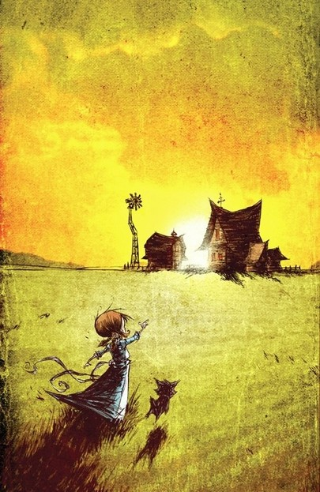

# ＜天玑＞小说集《奥兹的巫师》（七）：桃乐丝

**她金黄色的头发就像被太阳染过，散发出闪亮的色彩。很快，两个人拉着一头狮子的剪影和小姑娘长发飘飘的剪影汇合到一起。远处树林呼呼响着，盖住了他们说笑的声音，也自然没人知道关于桃乐丝是否会留下，他们是否要去森林探访老朋友，将来如何生活的种种讨论。**  

# 桃乐丝

## 文/宁（天津科大）

桃乐丝再次回到奥兹大陆已经是一个月后的事了。大路上最负盛名和认为自己最负盛名的巫师们为这片大陆的命名争了个头破血流，连魔术和黑魔法都用上了，打得十分难看。

稻草人挑了一堆上好稻草，铁皮人灌了自己一大桶黑油，狮子则在河里洗了一天的澡。好像知道她回来，他们这天清晨不约而同地来到森林入口的小木屋，倾诉着对桃乐丝的无尽思念。谈话是谁都不听对方的，因此感觉好像舞台后准备演讲的演员。

不过最后做出决定，陪她老下去，陪她照看孩子，然后陪她从这个世界消失。这样不断地说着，从上午到下午，转而太阳西斜。口干舌燥中，他们三个突然同时停住。 

“她来了。”

“她正在向这边走。”

“狮子要去接她，狮子跑得快！”

“她自己会过来的。”

黄昏的阳光依然十分灿烂，永远温暖的奥兹大陆分不出秋天还是春天。贴地而过的风似乎有了形迹，梳理着碧绿的青草，也把小姑娘的帽子忽地吹上了天，粉色的长沿帽盘旋飞舞，不断翻转。而她金黄色的头发就像被太阳染过，散发出闪亮的色彩。很快，两个人拉着一头狮子的剪影和小姑娘长发飘飘的剪影汇合到一起。远处树林呼呼响着，盖住了他们说笑的声音，也自然没人知道关于桃乐丝是否会留下，他们是否要去森林探访老朋友，将来如何生活的种种讨论。

不过可以知道，她的生命不会再起什么波澜了。

你如果想问的话，我可以告诉你：如果你站在十岁的她的位置瞻望未来，你会说她前途无量，你会说她前途未卜。要是你站在她的终点去看这个生命的轨迹，那不管从哪个角度你都会看见一条笔直的直线，一条命定之途。

（本专栏完）

 

（采编：黄理罡；责编：黄理罡）

 
