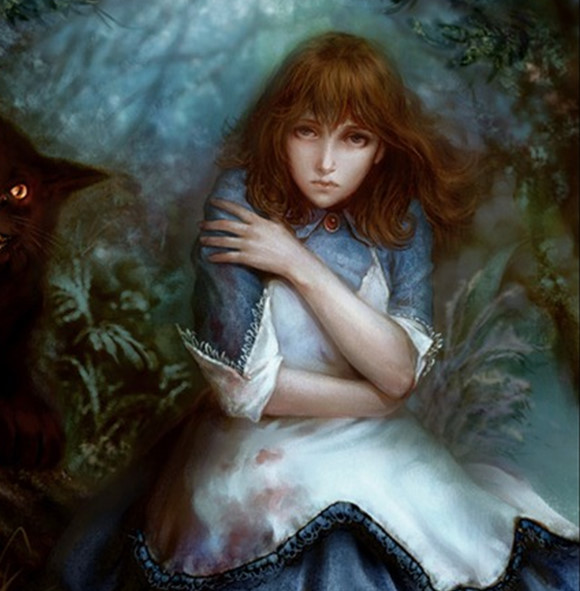
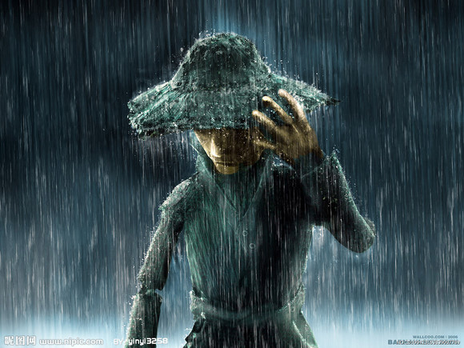
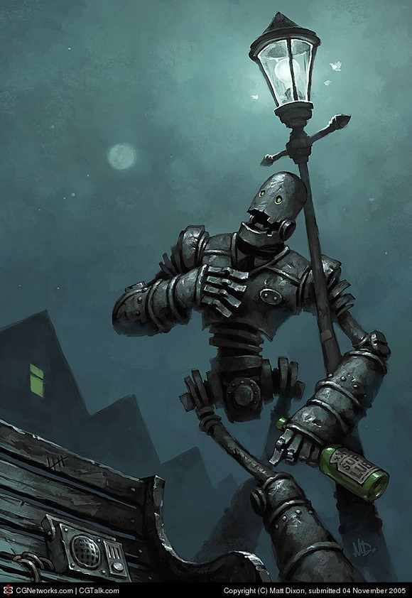

# ＜天玑＞小说集《奥兹的巫师》（三）：稻草人日记

**“活在永恒，便不知永恒为何物。但现在我知道了，永恒就是采摘新鲜的稻草就是上足滋润的黑油。永恒结束于她笑容的逝去、她眼泪的干涸、她秀发的掉落。结束于一个小小的愿望：她在死前戴上我清晨冒着露水摘回来的花。几百年后依然会回忆昨天晨光照在她脸上的颜色。”**  

# 稻草人日记

## 宁（天津科大）

这是一个漆黑的夜。

大门吱嘎一声如同很古的人被腰斩时候发出的凄厉惨叫，又像声音撕破了夜空。临近小镇阴暗的天上划过一道流星。

在屋里的那个小女孩更是快要被撕碎了，不止耳膜，还有心脏。

她转过身，只看见门缝间最后一丝月光摇摇欲坠，月亮女神即将遁入无尽混沌中。小女孩猛一回头，感觉到微弱的呼吸喷在她脸上。

紧紧贴过来的，是另外一张脸，看不出表情，浓黑的眉毛纠缠在一起，下面却没有眼珠，只是两个巨大的空洞！冰冷，深邃，什么都看不见，却盯着她的眼睛看。

当那蒙着破布的嘴再一次将呼吸喷在她脸上时，小女孩温热的尿从内裤渗出来，迅速不可阻挡喷涌而出，顺着大腿根一直流到小腿，又流到靴子里。

那张脸贴到了她的裆部，追逐着轻盈的尿的香气，顺着短裙往下嗅着碰到了小女孩白嫩的脚腕，靴子上的红宝石闪了一下，像踢皮球似的把丑陋的脸弹了回去。

一双干枯如柴的手挡住自己的眼睛，大喊：你是谁！是谁！声音撕心裂肺，比刚才的关门声更大，充满了失败的恐慌。

“桃乐丝。”

说完小女孩蹲下去抱着裙子开始哭泣，宛若十岁时候的你我。

#### 情书

她双手抓紧巨斧，娇小身躯用力转动抡出一个长长的弧。而他则低头，看短裙被风吹动，似乎还能闻到一阵处女的幽香。当的一声，利斧劈进了胸口偏左的位置。如释重负。剩下的就是享受女孩带来的气息。他低头嗅了几下，每一下都体验着前生从未有过的美妙。他边拔斧子边说，“我没心，不怕疼，不知道恐惧，也没有情感。但我在第一眼爱上了你，从那以后知道了什么是孤独。”

“可你把他杀了！”小女孩哭喊着，蹲下去收集散落的稻草。“你杀了我第一个朋友！”她忽然在草堆中发现了一张碧绿的纸。她打开看，泪水悄无声息地流淌成了小河。

“我没有头脑，不怕疼，也没有世界上的情感。但我第一眼爱上了你，从那以后知道了什么是孤独。”铁皮人变了一个温柔的声调，盯着小女孩水汪汪的眼睛。他丝毫不理会里面的惊讶，转过身去，对着天空的蓝紫色的晚霞，缓缓背诵着：“我爱你，从第一次对视开始。你碧绿的眼眸就像翡翠城最珍贵的宝珠，即使从未经历过四季，也知道它们有春风的柔转夏花的灿烂秋水的涟漪冬日的温暖。我翻阅厚如城墙的书本，只为寻找封存泪珠的法术，永远寄存在自己的心里。”说完叹了一口气。

小女孩红着眼问，“你看过这封信？”

铁皮人反问：“不知道这是情书？”

小女孩说：“情书，是爱人写给爱人的。”

“他爱你跟我爱你有什么区别？不过就是陌生人的一见钟情。于你，这一文不值。于我们，这便是生命。假设我的爱情和他的异样纯洁高尚，一样都诞生于你碧绿的眸子天真的笑容让人心碎的眼泪，那么，我代替他又怎么不行？这是信，是知事者写给不知事的孩子的信，我俩一起写的，他藏在脑子里，我把我的藏在心脏。”说着他把胸口的铁皮撕开，最深处的小匣子里，拿出另外一张绿色的纸。

“活在永恒，便不知永恒为何物。但现在我知道了，永恒就是采摘新鲜的稻草就是上足滋润的黑油。永恒结束于她笑容的逝去、她眼泪的干涸、她秀发的掉落。结束于一个小小的愿望：她在死前戴上我清晨冒着露水摘回来的花。几百年后依然会回忆昨天晨光照在她脸上的颜色。”

在大颗大颗的星星挂上了黑天鹅绒夜空时，他令小女孩破涕为笑。铁皮人拖过瑟瑟发抖的狮子，说这就是凶手；又拔下某根稻草，说好在没脑子的人还有一颗心，胡乱绑点什么在这个心上，他就会活过来。她的笑声让所有人都醉了。 

（采编责编：黄理罡）

 
