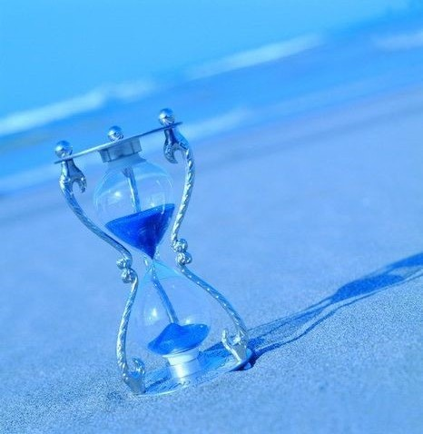

# ＜天玑＞小说集《奥兹的巫师》（二）：时沙之漏

**他怎么也想不起她的容貌。那是每一个三十年的全部，却怎么都想不起来。一阵恐惧充斥了心灵，又突然退去。睁大眼睛看时沙之漏里面每一粒沙自由下落。对，应该就是叫时沙之漏的。那一粒沙在漫长的距离飘动，落到底后又弹起来，像乒乓球一样弹了好几十下才安静下来，过了很久又被下一粒沙推开。**

#  时沙之漏

## 宁（天津科大）

那晚做爱之后的半年，男人一个电话都没打来。女孩期盼着，直到见他用敞篷车带了三个花枝招展的贱货招摇过市。她默默摘下他送的红宝石耳钉，小心收起来。

这是什么行为？我的亲妹妹，你难道还在等我？男人一个人睡的时候，轻轻抚摸腰部细小的疤痕。你送了我一个肾，我就送给你一个正常的人生。他总是一个人睡，也总是辗转反侧。对她的思念有时候无法抑制，不，已经不是思念了。对亲妹妹居然会有这种——兽欲？他回忆她的肉体，回忆那柔软的嘴唇，回忆她入口即化的乳头，还有灼热的、香气四溢的阴部。于是他一次次微笑着睡着。

不幸的是某一天，三个好朋友离奇地死去。他给她们打电话，却都被人挂断。审判的那天男人也在。女孩没说什么，或者说她喃喃絮语没有道明任何理由。似乎只有一个遗嘱，死后把剩下那颗肾留给男人，凑成一对。而男人也什么都听不见。他耳鸣得很严重。耳鸣甚至影响了他的思维。接下来他什么都不知道，除了女人那幽幽的嗓音，如炎热的盛夏灌下满满一杯冰的冒凉气的、清澈的山泉水。耳朵里尖锐的嗡嗡声使他在法官进行死刑宣判时达到了高潮。他昏过去的瞬间温暖的精液流出来，浸湿男人的裤子。

醒来的时候男人发现自己躺在时沙之漏旁边，手里紧握着两枚红宝石。这是什么？时沙之漏？“应该是叫这个。”男人自言自语。巨大的沙漏里，红色的沙子缓缓流淌，上面很快要空了。盯着沙流，男人隐约记起了一丁点儿东西。那是一个长达三十年的回忆。模糊透顶，也荒唐透顶，居然是自己花天酒地的花花公子生活。不过这个回忆掩埋着另一个更为久远的。也是三十年，而且也是这三十年。男人盯着沙子感觉他可以继续挖掘下去。他不断地一层又一层地挖掘着被掩埋的回忆。

两个，四个，一开始男人还感到恐慌，害怕自己会深陷其中。十个，二十个，越往前越感到历历在目。在第三十个，他能记起每天撕掉日历的那一次挥手。回忆第四十个的时候，他能记起父亲大手上机械表的每一次震动。在第五十个，他能分辨出每一只蟋蟀的鸣叫，以及风在空气中将青草的香气吹散。

但有个地方有古怪。他怎么也想不起她的容貌。那是每一个三十年的全部，却怎么都想不起来。一阵恐惧充斥了心灵，又突然退去。睁大眼睛看时沙之漏里面每一粒沙自由下落。对，应该就是叫时沙之漏的。那一粒沙在漫长的距离飘动，落到底后又弹起来，像乒乓球一样弹了好几十下才安静下来，过了很久又被下一粒沙推开。

“总得有我救她的一次。我要去救她。”男人在最后一粒沙滑下的瞬间伸出手，用力翻转了沙漏。无尽的虚空之门在面前打开，吹来了只有地狱或者宇宙中才有的凉气。

“裤子还没干。”那一瞬间居然只想到这一句。他猛地跳了进去。 

（采编责编：黄理罡）
