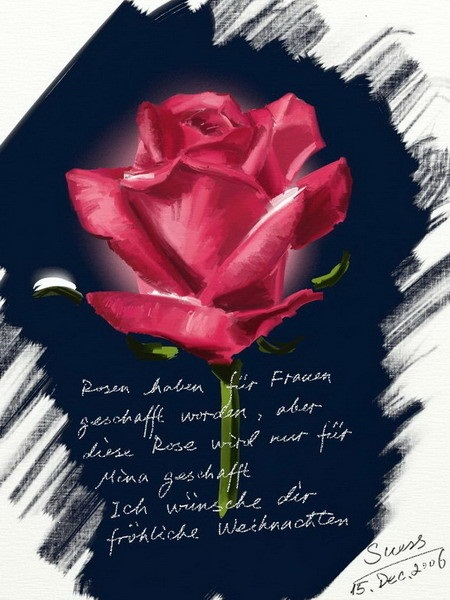

# ＜天玑＞小说集《奥兹的巫师》（六）：奥兹的巫师

**“爱你的人永远在你身边爱护你保护你，你却一次次把她推开，最后推她进入消亡。** **“她说，她不出来了。如果你爱的是回忆里的女人，她就亲自去杀掉她们，包括她自己。”**  

# 奥兹的巫师

## 文 / 宁（天津科大）

一个什么东西飞来打在他的背上。回头一看，帷幕已经被拉开，小女孩气呼呼地看着他。于是注意力又转回桌子上。猛然间他又回过头，看着地上滚动着的小小沙漏。他知道自己露出了一个很奇怪的表情，但控制不住。那个和自己桌子上的一模一样，只是沙子不是绿色而是粉色。他心里已经明白女巫死了，女孩流着泪，美丽而精巧的脸上写满悲伤。

还有些别的东西。他明白，那漂亮的脸蛋上还有愤怒、恐惧之类的情感。他感觉无话可说：

“了不起啊！接下来和我一起寻找这个沙漏的秘密，或许可以帮你回家。”

说完之后就后悔了因为小女孩的眼神已经变成了温柔的怜悯。她摇着头，似乎想告诉他一个更大的秘密，不过又咬嘴唇忍住了。这令他十分好奇。

“她死了吗？跟你说什么了？”

桃乐丝低声说：

“对我来说已经没有秘密了。我们进去了。

“在沙漏里有你梦里的爱人，跟今生一直爱着你的那女巫是一个人。

“如果你真的认为有之前的回忆，那也一定是跟她一起。

“你如果前世亏欠了她三十年，那你今生又亏欠了她三十年，将来或许还会继续下去。

“爱你的人永远在你身边爱护你保护你，你却一次次把她推开，最后推她进入消亡。

“她说，她不出来了。如果你爱的是回忆里的女人，她就亲自去杀掉她们，包括她自己。”

说完她轻轻碰了三下脚跟。

奥兹似懂非懂地听她说完，又看着她的小小的身形融进虚无。他盯着靴子上的红宝石直到消失，隐约记起那年与大魔导师的战斗。他竭尽全力要施展不知所谓的黑魔法时候，女巫却把法术指向了她自己。当时她靴子上似乎也有这两块红宝石。翡翠城怎么会有红宝石呢？

“不知道，”十五岁的男孩说道，“从我有记忆的时候身上就有了。你不觉得很漂亮吗？不过，如果这宝石的光泽能有你眼睛光芒的万分之一，那它就会成为稀世珍宝，翡翠城也不再叫翡翠城，而是叫红宝石城。”

奥兹迷茫地看着女孩消失的地方，耳中开始鸣响，声调越来越高。最后甚至高过了他的意识。他受不住，双手撑地跪了下去。他抓住了沙漏想仔细观看，眼睛已经模糊。他还想回头看一下桌子上自己的那个沙漏，要是没猜错，已经消失了。不过最终还是没能转回头去。“这是时沙之漏吧。”想完这句，沙漏捏碎了，鲜血将粉色的沙子染成红色。

 

（采编/责编：黄理罡）

 
